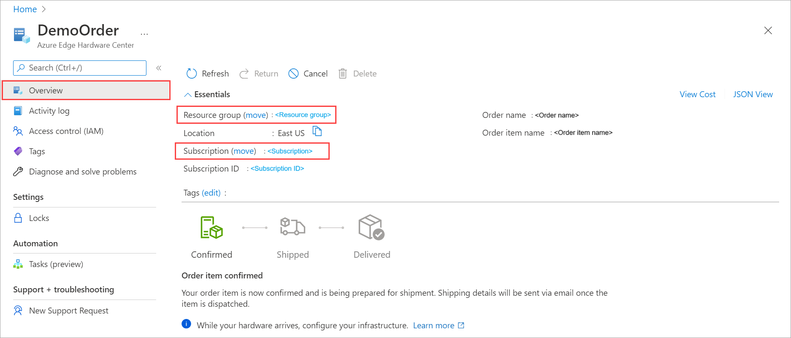
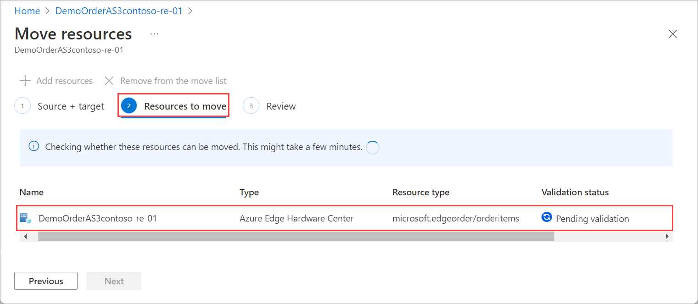
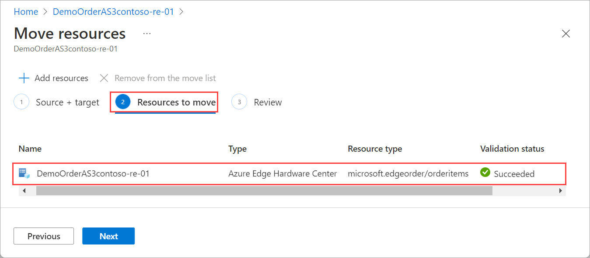
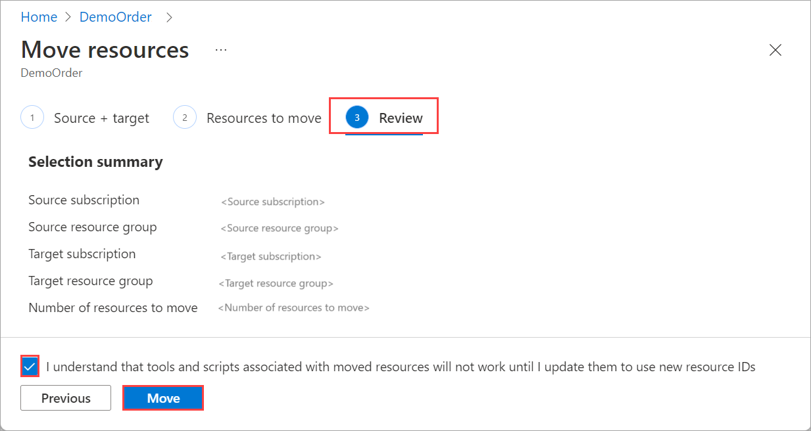
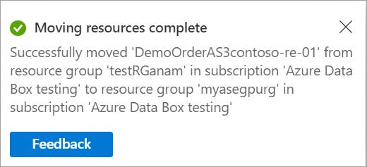
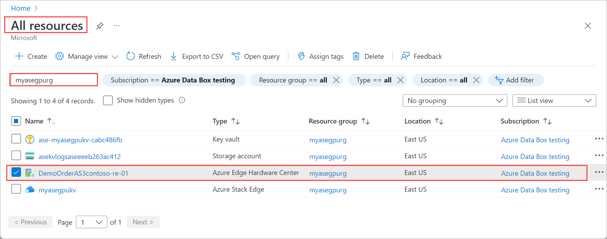

# Move Azure Edge Hardware Center resource across Azure subscriptions and resource groups via the Azure portal

This article explains how to move an Azure Edge Hardware Center resource across Azure subscriptions, or to another resource group in the same subscription using the Azure portal. 

Both the source group and the target group are locked during the move operation. Write and delete operations are blocked on the resource groups until the move completes. This lock means you can't add, update, or delete resources in the resource groups. It doesn't mean the resources are frozen. <!--For example, if you move a SQL Server and its database to a new resource group, an application that uses the database experiences no downtime. It can still read and write to the database.--> The lock can last for a maximum of four hours, but most moves complete in much less time.

Moving a resource only moves it to a new resource group or subscription. It doesn't change the location of the resource.

<!--## Supported regions

All the Azure public regions where you can create an Azure Edge Hardware Center order resource. For more information, see [Region availability for Edge Hardware Center](azure-edge-hardware-center-overview.md#region-availability). -->

## Prerequisites

Before you begin:

- If moving your resource to a different subscription:

    - Make sure that both the source and destinations subscriptions are active.
    - Make sure that both the source and resource subscriptions exist within the same Azure Active Directory tenant.
    - The destination subscription must be registered to the `Microsoft.EdgeOrder` resource provider. If not, you receive an error stating that the subscription is not registered for a resource type. You might see this error when moving a resource to a new subscription, but that subscription has never been used with that resource type.
- If moving your resource to a different resource group, make sure that the account moving the resources must have at least the following permissions:

    - *Microsoft.Resources/subscriptions/resourceGroups/moveResources/action* on the source resource group.
    - *Microsoft.Resources/subscriptions/resourceGroups/write* on the destination resource group.

## Move resource group or subscription

1. In the Azure portal, go to the Azure Edge Hardware Center resource that you want to move. The Azure Edge Hardware Center resource in this example is created for an Azure Stack Edge order. 

    - To move to another subscription, select the option available for **Resource group (Move)**.
    - To move to another resource group within the same subscription, select the option available for **Subscription ID (Move)**. <!--is activated against a device and storage accounts are created. It is however not required to activate the device and you can move an unregistered resource as well.-->

     

1. On the **Source + target** tab, specify the destination Resource group in the same subscription. The source resource group is automatically set. If you are moving to a new subscription, also specify the subscription. Select **Next**. 

     

1. On the **Resources to move** tab, Edge Hardware Center service will determine if the resource move is allowed. As the validation begins, the validation status is shown as **Pending validation**. Wait for the validation to complete. 

     

    After the validation is complete and if the service determines that the resource move is allowed, validation status updates to **Succeeded**.

     

    Select **Next**.

1. On the **Review** tab, verify the **Selection summary** and select the checkbox to acknowledge that tools and scripts will need to be updated when moving to another resource group. To start moving the resources, select **Move**.

     

1. Check the notification in the Azure portal to verify that the resource move has completed. 

     

## Verify migration

Follow these steps to verify that the resource was successfully moved to the specified subscription or resource group.

- If you moved across subscriptions, go to the target subscription to see the moved resource. Go to **All resources** and filter against the target subscription to which you moved your resource. 

     

    <!--The shares, storage accounts associated with the resource should also be present with the moved resource.-->
    
- If you moved to another resource group in the same subscription, go to the target resource group to see the moved resource. Go to **All resources** and filter against the target resource group to which you moved your resource. 

     

    <!--The shares, storage accounts associated with the resource should also be present with the moved resource.-->

## Clean up

After the Azure Edge Hardware Center resource has moved, you can clean up the source resources that aren't needed. 

If you moved to another resource group, you can delete the source resource group. To do so:
1. On the Azure portal dashboard, select the source resource group.
1. At the top of the pane, select **Delete**.

## Next steps

In this article, you moved an Azure Edge Hardware Center resource from one subscription or resource group to another by using the Azure portal and then cleaned up the source resources that aren't needed. To learn more about moving resources in Azure, see:

- [Move resources to a new resource group or subscription](../azure-resource-manager/management/move-resource-group-and-subscription.md)
