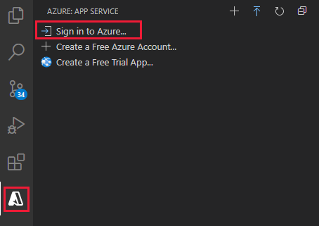
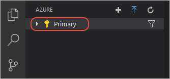

## Sign in to Azure

If you already use the Azure service extensions, you should already be logged in and can skip this step. 

Once you've installed an extension in Visual Studio Code, you need to sign into your Azure account. 

1. In Visual Studio Code, select the **Azure** explorer icon, then select **Sign in to Azure**, and follow the prompts.

    

2. After signing in, verify that the email address of your Azure account appears in the Status Bar and your subscription(s) appears in the **Azure** explorer:
    
    
