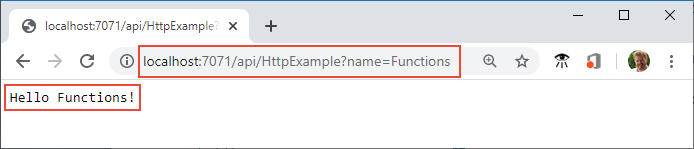

# Quickstart: Create a TypeScript function in Azure from the command line

[!INCLUDE [functions-language-selector-quickstart-cli](../../includes/functions-language-selector-quickstart-cli.md)]

In this article, you use command-line tools to create a TypeScript function that responds to HTTP requests. After testing the code locally, you deploy it to the serverless environment of Azure Functions.

Completing this quickstart incurs a small cost of a few USD cents or less in your Azure account.

There is also a [Visual Studio Code-based version](create-first-function-vs-code-typescript.md) of this article.

## Configure your local environment

Before you begin, you must have the following:

+ An Azure account with an active subscription. [Create an account for free](https://azure.microsoft.com/free/?ref=microsoft.com&utm_source=microsoft.com&utm_medium=docs&utm_campaign=visualstudio).

+ The [Azure Functions Core Tools](functions-run-local.md#v2) version 3.x.

+ One of the following tools for creating Azure resources:

    + [Azure CLI](/cli/azure/install-azure-cli) version 2.4 or later.

    + [Azure PowerShell](/powershell/azure/install-az-ps) version 5.0 or later.

+ [Node.js](https://nodejs.org/), Active LTS and Maintenance LTS versions (8.11.1 and 10.14.1 recommended).

### Prerequisite check

Verify your prerequisites, which depend on whether you are using Azure CLI or Azure PowerShell for creating Azure resources:

# [Azure CLI](#tab/azure-cli)

+ In a terminal or command window, run `func --version` to check that the Azure Functions Core Tools are version 3.x.

+ Run `az --version` to check that the Azure CLI version is 2.4 or later.

+ Run `az login` to sign in to Azure and verify an active subscription.

# [Azure PowerShell](#tab/azure-powershell)

+ In a terminal or command window, run `func --version` to check that the Azure Functions Core Tools are version 3.x.

+ Run `(Get-Module -ListAvailable Az).Version` and verify version 5.0 or later. 

+ Run `Connect-AzAccount` to sign in to Azure and verify an active subscription.

---

## Create a local function project

In Azure Functions, a function project is a container for one or more individual functions that each responds to a specific trigger. All functions in a project share the same local and hosting configurations. In this section, you create a function project that contains a single function.

1. Run the `func init` command, as follows, to create a functions project in a folder named *LocalFunctionProj* with the specified runtime:  

    ```console
    func init LocalFunctionProj --typescript
    ```

1. Navigate into the project folder:

    ```console
    cd LocalFunctionProj
    ```
    
    This folder contains various files for the project, including configurations files named [local.settings.json](functions-run-local.md#local-settings-file) and [host.json](functions-host-json.md). Because *local.settings.json* can contain secrets downloaded from Azure, the file is excluded from source control by default in the *.gitignore* file.

1. Add a function to your project by using the following command, where the `--name` argument is the unique name of your function (HttpExample) and the `--template` argument specifies the function's trigger (HTTP).

    ```console
    func new --name HttpExample --template "HTTP trigger" --authlevel "anonymous"
    ``` 
    
    `func new` creates a subfolder matching the function name that contains a code file appropriate to the project's chosen language and a configuration file named *function.json*.

### (Optional) Examine the file contents

If desired, you can skip to [Run the function locally](#run-the-function-locally) and examine the file contents later.

#### index.ts

*index.ts* exports a function that's triggered according to the configuration in *function.json*.

:::code language="typescript" source="~/functions-quickstart-templates/Functions.Templates/Templates/HttpTrigger-TypeScript/index.ts":::

For an HTTP trigger, the function receives request data in the variable `req` of type **HttpRequest** as defined in *function.json*. The return object, defined as `$return` in *function.json*, is the response. 

#### function.json

*function.json* is a configuration file that defines the input and output `bindings` for the function, including the trigger type. 

:::code language="json" source="~/functions-quickstart-templates/Functions.Templates/Templates/HttpTrigger-JavaScript/function.json":::

Each binding requires a direction, a type, and a unique name. The HTTP trigger has an input binding of type [`httpTrigger`](functions-bindings-http-webhook-trigger.md) and output binding of type [`http`](functions-bindings-http-webhook-output.md).

## Run the function locally

1. Run your function by starting the local Azure Functions runtime host from the *LocalFunctionProj* folder:

    ```console
    npm install
    npm start
    ```
    
    Toward the end of the output, the following lines should appear:
    
    <pre>
    ...
    
    Now listening on: http://0.0.0.0:7071
    Application started. Press Ctrl+C to shut down.
    
    Http Functions:
    
            HttpExample: [GET,POST] http://localhost:7071/api/HttpExample
    ...
    
    </pre>
    
    >[!NOTE]  
    > If HttpExample doesn't appear as shown below, you likely started the host from outside the root folder of the project. In that case, use **Ctrl**+**C** to stop the host, navigate to the project's root folder, and run the previous command again.

1. Copy the URL of your `HttpExample` function from this output to a browser and append the query string `?name=<your-name>`, making the full URL like `http://localhost:7071/api/HttpExample?name=Functions`. The browser should display a message like `Hello Functions`:

    
    
    The terminal in which you started your project also shows log output as you make requests.

1. When you're ready, use **Ctrl**+**C** and choose `y` to stop the functions host.

[!INCLUDE [functions-create-azure-resources-cli](../../includes/functions-create-azure-resources-cli.md)]

4. Create the function app in Azure:

    # [Azure CLI](#tab/azure-cli)
        
    ```azurecli
    az functionapp create --resource-group AzureFunctionsQuickstart-rg --consumption-plan-location westeurope --runtime node --runtime-version 12 --functions-version 3 --name <APP_NAME> --storage-account <STORAGE_NAME>
    ```
    
    The [az functionapp create](/cli/azure/functionapp#az_functionapp_create) command creates the function app in Azure. If you're using Node.js 10, also change `--runtime-version` to `10`.
    
    # [Azure PowerShell](#tab/azure-powershell)
    
    ```azurepowershell
    New-AzFunctionApp -Name <APP_NAME> -ResourceGroupName AzureFunctionsQuickstart-rg -StorageAccount <STORAGE_NAME> -Runtime node -RuntimeVersion 12 -FunctionsVersion 3 -Location 'West Europe'
    ```
    
    The [New-AzFunctionApp](/powershell/module/az.functions/new-azfunctionapp) cmdlet creates the function app in Azure. If you're using Node.js 10, change `-RuntimeVersion` to `10`.

    ---
        
    In the previous example, replace `<STORAGE_NAME>` with the name of the account you used in the previous step, and replace `<APP_NAME>` with a globally unique name appropriate to you. The `<APP_NAME>` is also the default DNS domain for the function app. 
    
    This command creates a function app running in your specified language runtime under the [Azure Functions Consumption Plan](consumption-plan.md), which is free for the amount of usage you incur here. The command also provisions an associated Azure Application Insights instance in the same resource group, with which you can monitor your function app and view logs. For more information, see [Monitor Azure Functions](functions-monitoring.md). The instance incurs no costs until you activate it.

## Deploy the function project to Azure

Before you use Core Tools to deploy your project to Azure, you create a production-ready build of JavaScript files from the TypeScript source files.

1. Use the following command to prepare your TypeScript project for deployment:

    ```console
    npm run build:production 
    ```

1. With the necessary resources in place, you're now ready to deploy your local functions project to the function app in Azure by using the [func azure functionapp publish](functions-run-local.md#project-file-deployment) command. In the following example, replace `<APP_NAME>` with the name of your app.

    ```console
    func azure functionapp publish <APP_NAME>
    ```
    
    If you see the error, "Can't find app with name ...", wait a few seconds and try again, as Azure may not have fully initialized the app after the previous `az functionapp create` command.
    
    The publish command shows results similar to the following output (truncated for simplicity):
    
    <pre>
    ...
    
    Getting site publishing info...
    Creating archive for current directory...
    Performing remote build for functions project.
    
    ...
    
    Deployment successful.
    Remote build succeeded!
    Syncing triggers...
    Functions in msdocs-azurefunctions-qs:
        HttpExample - [httpTrigger]
            Invoke url: https://msdocs-azurefunctions-qs.azurewebsites.net/api/httpexample?code=KYHrydo4GFe9y0000000qRgRJ8NdLFKpkakGJQfC3izYVidzzDN4gQ==
    </pre>

[!INCLUDE [functions-run-remote-azure-cli](../../includes/functions-run-remote-azure-cli.md)]

[!INCLUDE [functions-streaming-logs-cli-qs](../../includes/functions-streaming-logs-cli-qs.md)]

[!INCLUDE [functions-cleanup-resources-cli](../../includes/functions-cleanup-resources-cli.md)]

## Next steps

> [!div class="nextstepaction"]
> [Connect to an Azure Storage queue](functions-add-output-binding-storage-queue-cli.md?pivots=programming-language-typescript)
