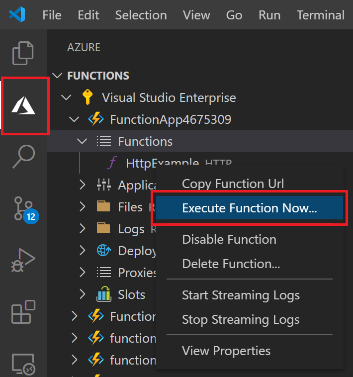

# Quickstart: Create a JavaScript function in Azure using Visual Studio Code

> [!div class="op_single_selector" title1="Select your function language: "]
> - [JavaScript](create-first-function-vs-code-node.md)
> - [C#](create-first-function-vs-code-csharp.md)
> - [Java](create-first-function-vs-code-java.md)
> - [PowerShell](create-first-function-vs-code-powershell.md)
> - [Python](create-first-function-vs-code-python.md)
> - [TypeScript](create-first-function-vs-code-typescript.md)
> - [Other (Go/Rust)](create-first-function-vs-code-other.md)

Use Visual Studio Code to create a JavaScript function that responds to HTTP requests. Test the code locally, then deploy it to the serverless environment of Azure Functions.

Completing this quickstart incurs a small cost of a few USD cents or less in your <abbr title="The Azure account is a global unique entity that gets you access to Azure services and your Azure subscriptions.">Azure account</abbr>.

## 1. Prepare your environment

Before you get started, make sure you have the following requirements in place:

+ An Azure account with an <abbr title="An Azure subscription is a logical container used to provision resources in Azure. It holds the details of all your resources like virtual machines (VMs), databases, and more.">active subscription</abbr>. [Create an account for free](https://azure.microsoft.com/free/?ref=microsoft.com&utm_source=microsoft.com&utm_medium=docs&utm_campaign=visualstudio).

+ [Node.js 10.14.1+](https://nodejs.org/)

+ [Visual Studio Code](https://code.visualstudio.com/)

+ [Azure Functions extension](https://marketplace.visualstudio.com/items?itemName=ms-azuretools.vscode-azurefunctions) for Visual Studio Code.

+ [Azure Functions Core tools](functions-run-local.md?tabs=linux%2Ccsharp%2Cbash#install-the-azure-functions-core-tools)

 

## 2. Create your local Functions project

1. Choose the Azure icon in the <abbr title="">Activity bar</abbr>, then in the **Azure: Functions** area, select the **Create new project...** icon.

    

1. **Choose a directory location** for your project workspace then choose **Select**. 

1. Provide the following information at the prompts:

    + **Select a language for your function project**: Choose `JavaScript`.

    + **Select a template for your project's first function**: Choose `HTTP trigger`.

    + **Provide a function name**: Type `HttpExample`.

    + **Authorization level**: Choose `Anonymous`, which enables anyone to call your function endpoint.

    + **Select how you would like to open your project**: Choose `Add to workspace`.

 

<strong>Can't create a function project?</strong>

The most common issues to resolve when creating a local Functions project are:
* You do not have the Azure Functions extension installed. 

 

## 3. Run the function locally

1. Press <kbd>F5</kbd> to start the function app project. 

1. In the **Terminal**, see the URL endpoint of your function running locally.

    

1. Copy the following URL and paste in a web browser then press Enter.

    `http://localhost:7071/api/HttpExample?name=Functions`

1. View returned response.

    

1. View information in **Terminal** panel about the request.

    

1. Press <kbd>Ctrl + C</kbd> to stop Core Tools and disconnect the debugger.

 

<strong>Can't run the function locally?</strong>

The most common issues to resolve when running a local Functions project are:
* You do not have the Core Tools installed. 
*  If you have trouble running on Windows, make sure that the default terminal shell for Visual Studio Code isn't set to WSL Bash. 

 

## 4. Sign in to Azure

To publish your app, sign in to Azure. If you're already signed in, go to the next section.

1. Choose the Azure icon in the Activity bar, then in the **Azure: Functions** area, choose **Sign in to Azure...**.

    

1. When prompted in the browser, **choose your Azure account** and **sign in** using your Azure account credentials.

1. After you've successfully signed in, close the new browser window and go back to Visual Studio Code. 

 

## 5. Publish the project to Azure

Your first deployment of your code includes creating a Function resource in your Azure subscription. 

1. Choose the Azure icon in the Activity bar, then in the **Azure: Functions** area, choose the **Deploy to function app...** button.

    

1. Provide the following information at the prompts:

    + **Select folder**: Choose the folder that contains your function app. 

    + **Select subscription**: Choose the subscription to use. You won't see this if you only have one subscription.

    + **Select Function App in Azure**: Choose `+ Create new Function App`.

    + **Enter a globally unique name for the function app**: Type a name that is unique across Azure in a URL path. The name you type is validated to ensure global uniqueness.

    + **Select a runtime**: Choose the version of Node.js you've been running on locally. You can use the `node --version` command to check your version.

    + **Select a location for new resources**:  For better performance, choose a [region](https://azure.microsoft.com/regions/) near you. 

1. A notification is displayed after your function app is created and the deployment package is applied. Select **View Output** to see the creation and deployment results. 
    
    

 

<strong>Can't publish the function?</strong>

This section created the Azure resources and deployed your local code to the Function app. If that didn't succeed:

* Review the Output for error information. The bell icon in the lower right corner is another way to view the output. 
* Did you publish to an existing function app? That action overwrites the content of that app in Azure.

 

<strong>What resources were created?</strong>

When completed, the following Azure resources are created in your subscription, using names based on your function app name: 
* **Resource group**: A resource group is a logical container for related resources in the same region.
* **Azure Storage account**: A Storage resource maintains state and other information about your project.
* **Consumption plan**: A consumption plan defines the underlying host for your serverless function app.
* **Function app**: A function app provides the environment for executing your function code and group functions as a logical unit.
* **Application Insights**: Application Insights tracks usage of your serverless function.

 

## 6. Run the function in Azure
1. In the **Azure: Functions** side bar, expand the new function app. 
1. Expand **Functions**, then right-click on **HttpExample**, and then choose **Execute Function Now...**.

    

1. **Press Enter** to send default request message to your function. 

1. A notification is raised in Visual Studio Code when you function execution completes.

 

<strong>Couldn't run the cloud-based Function app?</strong>

* Did you remember to add the querystring to the end of the URL?

 

## 7. Clean up resources

Delete the function app and its resources to avoid incurring any further costs.

1. In Visual Studio Code, select the Azure icon in the Activity bar, then select the Functions area in the side bar. 
1. Select the function app, then right-click and select **Delete Function app...**.

 

## Next steps

Expand the function by adding an <abbr title="Binding to a function is a way of declaratively connecting another resource to the function.">output binding</abbr>. This binding writes the string from the HTTP request to a message in an Azure Queue Storage queue. 

> [!div class="nextstepaction"]
> [Connect to an Azure Storage queue](functions-add-output-binding-storage-queue-vs-code.md?pivots=programming-language-javascript)

[Azure Functions Core Tools]: functions-run-local.md
[Azure Functions extension for Visual Studio Code]: https://marketplace.visualstudio.com/items?itemName=ms-azuretools.vscode-azurefunctions
