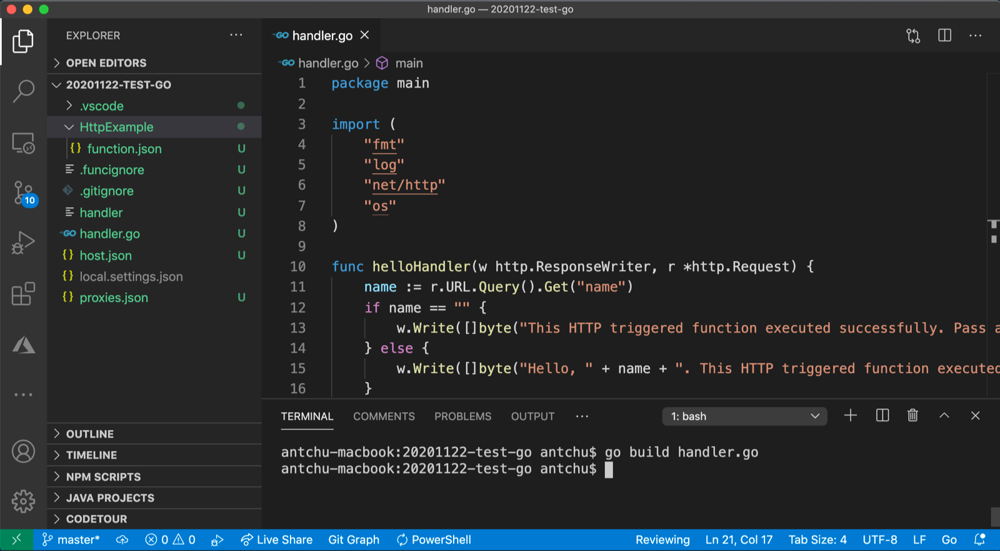
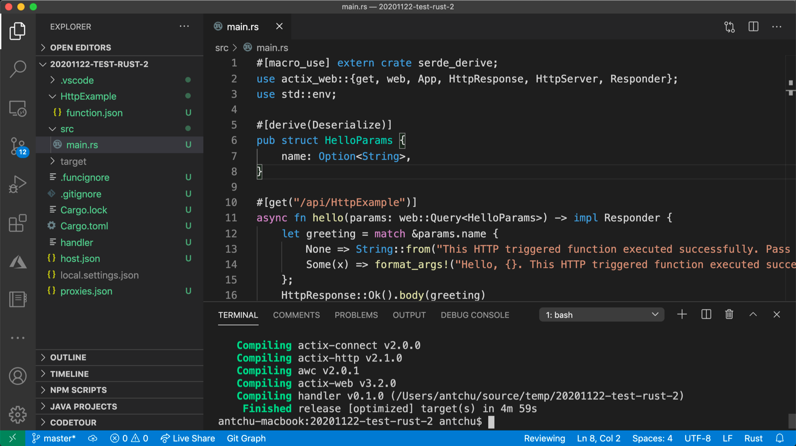
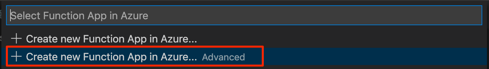

# Quickstart: Create a Go or Rust function in Azure using Visual Studio Code

[!INCLUDE [functions-language-selector-quickstart-vs-code](../../includes/functions-language-selector-quickstart-vs-code.md)]

In this article, you use Visual Studio Code to create a [custom handler](functions-custom-handlers.md) function that responds to HTTP requests. After testing the code locally, you deploy it to the serverless environment of Azure Functions.

Custom handlers can be used to create functions in any language or runtime by running an HTTP server process. This article supports both [Go](create-first-function-vs-code-other.md?tabs=go) and [Rust](create-first-function-vs-code-other.md?tabs=rust).

Completing this quickstart incurs a small cost of a few USD cents or less in your Azure account.

## Configure your environment

Before you get started, make sure you have the following requirements in place:

# [Go](#tab/go)

+ An Azure account with an active subscription. [Create an account for free](https://azure.microsoft.com/free/?ref=microsoft.com&utm_source=microsoft.com&utm_medium=docs&utm_campaign=visualstudio).

+ [Visual Studio Code](https://code.visualstudio.com/) on one of the [supported platforms](https://code.visualstudio.com/docs/supporting/requirements#_platforms).

+ The [Azure Functions extension](https://marketplace.visualstudio.com/items?itemName=ms-azuretools.vscode-azurefunctions) for Visual Studio Code.

+ The [Azure Functions Core Tools](./functions-run-local.md#v2) version 3.x. Use the `func --version` command to check that it is correctly installed.

+ [Go](https://golang.org/doc/install), latest version recommended. Use the `go version` command to check your version.

# [Rust](#tab/rust)

+ An Azure account with an active subscription. [Create an account for free](https://azure.microsoft.com/free/?ref=microsoft.com&utm_source=microsoft.com&utm_medium=docs&utm_campaign=visualstudio).

+ [Visual Studio Code](https://code.visualstudio.com/) on one of the [supported platforms](https://code.visualstudio.com/docs/supporting/requirements#_platforms).

+ The [Azure Functions extension](https://marketplace.visualstudio.com/items?itemName=ms-azuretools.vscode-azurefunctions) for Visual Studio Code.

+ The [Azure Functions Core Tools](./functions-run-local.md#v2) version 3.x. Use the `func --version` command to check that it is correctly installed.

+ Rust toolchain using [rustup](https://www.rust-lang.org/tools/install). Use the `rustc --version` command to check your version.

---

## <a name="create-an-azure-functions-project"></a>Create your local project

In this section, you use Visual Studio Code to create a local Azure Functions custom handlers project. Later in this article, you'll publish your function code to Azure.

1. Choose the Azure icon in the Activity bar, then in the **Azure: Functions** area, select the **Create new project...** icon.

    

1. Choose a directory location for your project workspace and choose **Select**.

    > [!NOTE]
    > These steps were designed to be completed outside of a workspace. In this case, do not select a project folder that is part of a workspace.

1. Provide the following information at the prompts:

    + **Select a language for your function project**: Choose `Custom`.

    + **Select a template for your project's first function**: Choose `HTTP trigger`.

    + **Provide a function name**: Type `HttpExample`.

    + **Authorization level**: Choose `Anonymous`, which enables anyone to call your function endpoint. To learn about authorization level, see [Authorization keys](functions-bindings-http-webhook-trigger.md#authorization-keys).

    + **Select how you would like to open your project**: Choose `Add to workspace`.

1. Using this information, Visual Studio Code generates an Azure Functions project with an HTTP trigger function. You can view the local project files in the Explorer. To learn more about files that are created, see [Generated project files](functions-develop-vs-code.md#generated-project-files). 

## Create and build your function

The *function.json* file in the *HttpExample* folder declares an HTTP trigger function. You complete the function by adding a handler and compiling it into an executable.

# [Go](#tab/go)

1. Press <kbd>Ctrl + N</kbd> (<kbd>Cmd + N</kbd> on macOS) to create a new file. Save it as *handler.go* in the function app root (in the same folder as *host.json*).

1. In *handler.go*, add the following code and save the file. This is your Go custom handler.

    ```go
    package main
    
    import (
        "fmt"
        "log"
        "net/http"
        "os"
    )
    
    func helloHandler(w http.ResponseWriter, r *http.Request) {
        message := "This HTTP triggered function executed successfully. Pass a name in the query string for a personalized response.\n"
        name := r.URL.Query().Get("name")
        if name != "" {
            message = fmt.Sprintf("Hello, %s. This HTTP triggered function executed successfully.\n", name)
        }
        fmt.Fprint(w, message)
    }
    
    func main() {
        listenAddr := ":8080"
        if val, ok := os.LookupEnv("FUNCTIONS_CUSTOMHANDLER_PORT"); ok {
            listenAddr = ":" + val
        }
        http.HandleFunc("/api/HttpExample", helloHandler)
        log.Printf("About to listen on %s. Go to https://127.0.0.1%s/", listenAddr, listenAddr)
        log.Fatal(http.ListenAndServe(listenAddr, nil))
    }
    ```

1. Press <kbd>Ctrl + Shift + `</kbd> or select *New Terminal* from the *Terminal* menu to open a new integrated terminal in VS Code.

1. Compile your custom handler using the following command. An executable file named `handler` (`handler.exe` on Windows) is output in the function app root folder.

    ```bash
    go build handler.go
    ```

    

# [Rust](#tab/rust)

1. Press <kbd>Ctrl + Shift + `</kbd> or select *New Terminal* from the *Terminal* menu to open a new integrated terminal in VS Code.

1. In the function app root (the same folder as *host.json*), initialize a Rust project named `handler`.

    ```bash
    cargo init --name handler
    ```

1. In *Cargo.toml*, add the following dependencies necessary to complete this quickstart. The example uses the [warp](https://docs.rs/warp/) web server framework.

    ```toml
    [dependencies]
    warp = "0.3"
    tokio = { version = "1", features = ["rt", "macros", "rt-multi-thread"] }
    ```

1. In *src/main.rs*, add the following code and save the file. This is your Rust custom handler.

    ```rust
    use std::collections::HashMap;
    use std::env;
    use std::net::Ipv4Addr;
    use warp::{http::Response, Filter};

    #[tokio::main]
    async fn main() {
        let example1 = warp::get()
            .and(warp::path("api"))
            .and(warp::path("HttpExample"))
            .and(warp::query::<HashMap<String, String>>())
            .map(|p: HashMap<String, String>| match p.get("name") {
                Some(name) => Response::builder().body(format!("Hello, {}. This HTTP triggered function executed successfully.", name)),
                None => Response::builder().body(String::from("This HTTP triggered function executed successfully. Pass a name in the query string for a personalized response.")),
            });

        let port_key = "FUNCTIONS_CUSTOMHANDLER_PORT";
        let port: u16 = match env::var(port_key) {
            Ok(val) => val.parse().expect("Custom Handler port is not a number!"),
            Err(_) => 3000,
        };

        warp::serve(example1).run((Ipv4Addr::UNSPECIFIED, port)).await
    }
    ```

1. Compile a binary for your custom handler. An executable file named `handler` (`handler.exe` on Windows) is output in the function app root folder.

    ```bash
    cargo build --release
    cp target/release/handler .
    ```

    

---

## Configure your function app

The function host needs to be configured to run your custom handler binary when it starts.

1. Open *host.json*.

1. In the `customHandler.description` section, set the value of `defaultExecutablePath` to `handler` (on Windows, set it to `handler.exe`).

1. In the `customHandler` section, add a property named `enableForwardingHttpRequest` and set its value to `true`. For functions consisting of only an HTTP trigger, this setting simplifies programming by allow you to work with a typical HTTP request instead of the custom handler [request payload](functions-custom-handlers.md#request-payload).

1. Confirm the `customHandler` section looks like this example. Save the file.

    ```
    "customHandler": {
      "description": {
        "defaultExecutablePath": "handler",
        "workingDirectory": "",
        "arguments": []
      },
      "enableForwardingHttpRequest": true
    }
    ```

The function app is configured to start your custom handler executable.

## Run the function locally

You can run this project on your local development computer before you publish to Azure.

1. In the integrated terminal, start the function app using Azure Functions Core Tools.

    ```bash
    func start
    ```

1. With Core Tools running, navigate to the following URL to execute a GET request, which includes `?name=Functions` query string.

    `http://localhost:7071/api/HttpExample?name=Functions`

1. A response is returned, which looks like the following in a browser:

    

1. Information about the request is shown in **Terminal** panel.

    

1. Press <kbd>Ctrl + C</kbd> to stop Core Tools.

After you've verified that the function runs correctly on your local computer, it's time to use Visual Studio Code to publish the project directly to Azure.

[!INCLUDE [functions-sign-in-vs-code](../../includes/functions-sign-in-vs-code.md)]

## Compile the custom handler for Azure

In this section, you publish your project to Azure in a function app running Linux. In most cases, you must recompile your binary and adjust your configuration to match the target platform before publishing it to Azure.

# [Go](#tab/go)

1. In the integrated terminal, compile the handler to Linux/x64. A binary named `handler` is created in the function app root.

    # [macOS](#tab/macos)

    ```bash
    GOOS=linux GOARCH=amd64 go build handler.go
    ```

    # [Linux](#tab/linux)

    ```bash
    GOOS=linux GOARCH=amd64 go build handler.go
    ```

    # [Windows](#tab/windows)
    ```cmd
    set GOOS=linux
    set GOARCH=amd64
    go build handler.go
    ```

    Change the `defaultExecutablePath` in *host.json* from `handler.exe` to `handler`. This instructs the function app to run the Linux binary.
    
    ---

# [Rust](#tab/rust)

1. Create a file at *.cargo/config*. Add the following contents and save the file.

    ```
    [target.x86_64-unknown-linux-musl]
    linker = "rust-lld"
    ```

1. In the integrated terminal, compile the handler to Linux/x64. A binary named `handler` is created. Copy it to the function app root.

    ```bash
    rustup target add x86_64-unknown-linux-musl
    cargo build --release --target=x86_64-unknown-linux-musl
    cp target/x86_64-unknown-linux-musl/release/handler .
    ```

1. If you are using Windows, change the `defaultExecutablePath` in *host.json* from `handler.exe` to `handler`. This instructs the function app to run the Linux binary.

1. Add the following line to the *.funcignore* file:

    ```
    target
    ```

    This prevents publishing the contents of the *target* folder.

---

## Publish the project to Azure

In this section, you create a function app and related resources in your Azure subscription and then deploy your code. 

> [!IMPORTANT]
> Publishing to an existing function app overwrites the content of that app in Azure. 


1. Choose the Azure icon in the Activity bar, then in the **Azure: Functions** area, choose the **Deploy to function app...** button.

    

1. Provide the following information at the prompts:

    + **Select folder**: Choose a folder from your workspace or browse to one that contains your function app. You won't see this if you already have a valid function app opened.

    + **Select subscription**: Choose the subscription to use. You won't see this if you only have one subscription.

    + **Select Function App in Azure**: Choose `+ Create new Function App (advanced)`. 
    
        > [!IMPORTANT]
        > The `advanced` option lets you choose the specific operating system on which your function app runs in Azure, which in this case is Linux.

        

    + **Enter a globally unique name for the function app**: Type a name that is valid in a URL path. The name you type is validated to make sure that it's unique in Azure Functions.

    + **Select a runtime stack**: Choose `Custom Handler`.

    + **Select an OS**: Choose `Linux`.

    + **Select a hosting plan**: Choose `Consumption`.

    + **Select a resource group**: Choose `+ Create new resource group`. Enter a name for the resource group. This name must be unique within your Azure subscription. You can use the name suggested in the prompt.

    + **Select a storage account**: Choose `+ Create new storage account`. This name must be globally unique within Azure. You can use the name suggested in the prompt.

    + **Select an Application Insights resource**: Choose `+ Create Application Insights resource`. This name must be globally unique within Azure. You can use the name suggested in the prompt.

    + **Select a location for new resources**:  For better performance, choose a [region](https://azure.microsoft.com/regions/) near you.The extension shows the status of individual resources as they are being created in Azure in the notification area.

    :::image type="content" source="../../includes/media/functions-publish-project-vscode/resource-notification.png" alt-text="Notification of Azure resource creation":::

1. When completed, the following Azure resources are created in your subscription:

    [!INCLUDE [functions-vs-code-created-resources](../../includes/functions-vs-code-created-resources.md)]

    A notification is displayed after your function app is created and the deployment package is applied. 

4. Select **View Output** in this notification to view the creation and deployment results, including the Azure resources that you created. If you miss the notification, select the bell icon in the lower right corner to see it again.

    

[!INCLUDE [functions-vs-code-run-remote](../../includes/functions-vs-code-run-remote.md)]

[!INCLUDE [functions-cleanup-resources-vs-code.md](../../includes/functions-cleanup-resources-vs-code.md)]

## Next steps

> [!div class="nextstepaction"]
> [Learn about Azure Functions custom handlers](functions-custom-handlers.md)
