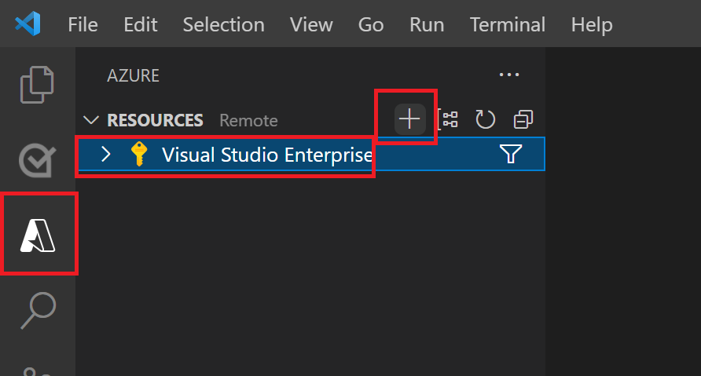
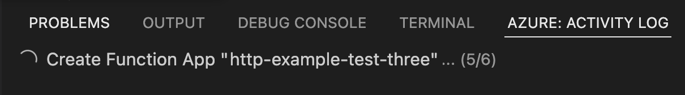

# Quickstart: Create a function in Azure with Python using Visual Studio Code

In this article, you use Visual Studio Code to create a Python function that responds to HTTP requests. After testing the code locally, you deploy it to the serverless environment of Azure Functions.

This article covers both Python programming models supported by Azure Functions. Use the selector at the top to choose your programming model.  

::: zone pivot="python-mode-configuration"
>[!NOTE]
>There is now a v2 programming model for creating Python functions. To create your first function using [the new v2 programming model](create-first-function-vs-code-python.md?pivots=python-mode-decorators), select **v2** at the top of the article.
::: zone-end
::: zone pivot="python-mode-decorators" 
>[!NOTE]
>The v2 programming model provides a decorator based approach to create functions. To learn more about the v2 programming model, see the [Developer Reference Guide](functions-reference-python.md).
::: zone-end

Completing this quickstart incurs a small cost of a few USD cents or less in your Azure account.

There's also a [CLI-based version](create-first-function-cli-python.md) of this article.

## Configure your environment

Before you begin, make sure that you have the following requirements in place:

+ An Azure account with an active subscription. [Create an account for free](https://azure.microsoft.com/free/?ref=microsoft.com&utm_source=microsoft.com&utm_medium=docs&utm_campaign=visualstudio).

+ Python versions that are [supported by Azure Functions](supported-languages.md#languages-by-runtime-version). For more information, see [How to install Python](https://wiki.python.org/moin/BeginnersGuide/Download).

+ [Visual Studio Code](https://code.visualstudio.com/) on one of the [supported platforms](https://code.visualstudio.com/docs/supporting/requirements#_platforms).

+ The [Python extension](https://marketplace.visualstudio.com/items?itemName=ms-python.python) for Visual Studio Code.

::: zone pivot="python-mode-configuration" 
+ The [Azure Functions extension](https://marketplace.visualstudio.com/items?itemName=ms-azuretools.vscode-azurefunctions) for Visual Studio Code, version 1.8.3 or a later version.
::: zone-end
::: zone pivot="python-mode-decorators" 
+ The [Azure Functions extension](https://marketplace.visualstudio.com/items?itemName=ms-azuretools.vscode-azurefunctions) for Visual Studio Code, version 1.8.1 or later.

+ The [Azurite V3 extension](https://marketplace.visualstudio.com/items?itemName=Azurite.azurite) local storage emulator. While you can also use an actual Azure storage account, this article assumes you're using the Azurite emulator.
::: zone-end

[!INCLUDE [functions-x86-emulation-on-arm64-note](../../includes/functions-x86-emulation-on-arm64-note.md)]

[!INCLUDE [functions-install-core-tools-vs-code](../../includes/functions-install-core-tools-vs-code.md)]

## <a name="create-an-azure-functions-project"></a>Create your local project

In this section, you use Visual Studio Code to create a local Azure Functions project in Python. Later in this article, you'll publish your function code to Azure.

1. Choose the Azure icon in the Activity bar. Then in the **Workspace (local)** area, select the **+** button, choose **Create Function** in the dropdown. When prompted, choose **Create new project**.

    :::image type="content" source="./media/functions-create-first-function-vs-code/create-new-project.png" alt-text="Screenshot of create a new project window.":::

2. Choose the directory location for your project workspace and choose **Select**. You should either create a new folder or choose an empty folder for the project workspace. Don't choose a project folder that is already part of a workspace.
::: zone pivot="python-mode-configuration" 
3. Provide the following information at the prompts:

    |Prompt|Selection|
    |--|--|
    |**Select a language**| Choose `Python`.|
    |**Select a Python interpreter to create a virtual environment**| Choose your preferred Python interpreter. If an option isn't shown, type in the full path to your Python binary.|
    |**Select a template for your project's first function**| Choose `HTTP trigger`.|
    |**Provide a function name**| Enter `HttpExample`.|
    |**Authorization level**| Choose `Anonymous`, which lets anyone call your function endpoint. For more information about the authorization level, see [Authorization keys](functions-bindings-http-webhook-trigger.md#authorization-keys).|

4. Visual Studio Code uses the provided information and generates an Azure Functions project with an HTTP trigger. You can view the local project files in the Explorer. For more information about the files that are created, see [Generated project files](functions-develop-vs-code.md?tabs=python#generated-project-files).
::: zone-end
::: zone pivot="python-mode-decorators"  
3. Provide the following information at the prompts:

    |Prompt|Selection|
    |--|--|
    |**Select a language**| Choose `Python (Programming Model V2)`.|
    |**Select a Python interpreter to create a virtual environment**| Choose your preferred Python interpreter. If an option isn't shown, type in the full path to your Python binary.|
    |**Select a template for your project's first function** | Choose `HTTP trigger`. |
    |**Name of the function you want to create**| Enter `HttpExample`.|
    |**Authorization level**| Choose `ANONYMOUS`, which lets anyone call your function endpoint. For more information about the authorization level, see [Authorization keys](functions-bindings-http-webhook-trigger.md#authorization-keys).|

4. Visual Studio Code uses the provided information and generates an Azure Functions project with an HTTP trigger. You can view the local project files in the Explorer. The generated `function_app.py` project file contains your functions.   
 
5. Open the local.settings.json project file and verify that the `AzureWebJobsFeatureFlags` setting has a value of `EnableWorkerIndexing`. This is required for Functions to interpret your project correctly as the Python v2 model. You'll add this same setting to your application settings after you publish your project to Azure. 

6. In the local.settings.json file, update the `AzureWebJobsStorage` setting as in the following example:

    ```json
    "AzureWebJobsStorage": "UseDevelopmentStorage=true",
    ```

    This tells the local Functions host to use the storage emulator for the storage connection currently required by the Python v2 model. When you publish your project to Azure, you'll need to instead use the default storage account. If you're instead using an Azure Storage account, set your storage account connection string here.

## Start the emulator

1. In Visual Studio Code, press <kbd>F1</kbd> to open the command palette. In the command palette, search for and select `Azurite: Start`.

1. Check the bottom bar and verify that Azurite emulation services are running. If so, you can now run your function locally.
::: zone-end

[!INCLUDE [functions-run-function-test-local-vs-code](../../includes/functions-run-function-test-local-vs-code.md)]

After you've verified that the function runs correctly on your local computer, it's time to use Visual Studio Code to publish the project directly to Azure.

[!INCLUDE [functions-sign-in-vs-code](../../includes/functions-sign-in-vs-code.md)]

<!--- Go back to the shared include after preview 
[!INCLUDE [functions-publish-project-vscode](../../includes/functions-publish-project-vscode.md)]
-->
## <a name="publish-the-project-to-azure"></a>Create the function app in Azure

In this section, you create a function app and related resources in your Azure subscription.

1. Choose the Azure icon in the Activity bar. Then in the **Resources** area, select the **+** icon and choose the **Create Function App in Azure** option.

    

1. Provide the following information at the prompts:

    |Prompt|Selection|
    |--|--|
    |**Select subscription**| Choose the subscription to use. You won't see this prompt when you have only one subscription visible under **Resources**. |
    |**Enter a globally unique name for the function app**| Type a name that is valid in a URL path. The name you type is validated to make sure that it's unique in Azure Functions.|
    |**Select a runtime stack**| Choose the language version on which you've been running locally. |
    |**Select a location for new resources**| Choose a region for your function app.|

    ::: zone pivot="python-mode-decorators" 
    ::: zone-end

    The extension shows the status of individual resources as they're being created in Azure in the **Azure: Activity Log** panel.

     

1. When the creation is complete, the following Azure resources are created in your subscription. The resources are named based on your function app name:

    [!INCLUDE [functions-vs-code-created-resources](../../includes/functions-vs-code-created-resources.md)]

    A notification is displayed after your function app is created and the deployment package is applied.

    [!INCLUDE [functions-vs-code-create-tip](../../includes/functions-vs-code-create-tip.md)]

## Deploy the project to Azure

[!INCLUDE [functions-deploy-project-vs-code](../../includes/functions-deploy-project-vs-code.md)]

::: zone pivot="python-mode-decorators"
## Update app settings

To use the Python v2 model in your function app, you need to add a new application setting in Azure named `AzureWebJobsFeatureFlags` with a value of `EnableWorkerIndexing`. This setting is already in your local.settings.json file. 

1. In Visual Studio Code, press <kbd>F1</kbd> to open the command palette. In the command palette, search for and select `Azure Functions: Add New Setting...`.

1. Choose your new function app, type `AzureWebJobsFeatureFlags` for the new app setting name, and press <kbd>Enter</kbd>. 

1. For the value, type `EnableWorkerIndexing` and press <kbd>Enter</kbd>.

The setting added to your new function app, which enables it to run the v2 model in Azure. 
::: zone-end

[!INCLUDE [functions-vs-code-run-remote](../../includes/functions-vs-code-run-remote.md)]

[!INCLUDE [functions-cleanup-resources-vs-code.md](../../includes/functions-cleanup-resources-vs-code.md)]

## Next steps

You have used [Visual Studio Code](functions-develop-vs-code.md?tabs=python) to create a function app with a simple HTTP-triggered function. In the next article, you expand that function by connecting to Azure Storage. To learn more about connecting to other Azure services, see [Add bindings to an existing function in Azure Functions](add-bindings-existing-function.md?tabs=python).

> [!div class="nextstepaction"]
> [Connect to an Azure Storage queue](functions-add-output-binding-storage-queue-vs-code.md?pivots=programming-language-python)
> [Connect to Azure SQL](functions-add-output-binding-azure-sql-vs-code.md?pivots=programming-language-python)

[Having issues? Let us know.](https://aka.ms/python-functions-qs-survey)

[Azure Functions Core Tools]: functions-run-local.md
[Azure Functions extension for Visual Studio Code]: https://marketplace.visualstudio.com/items?itemName=ms-azuretools.vscode-azurefunctions
