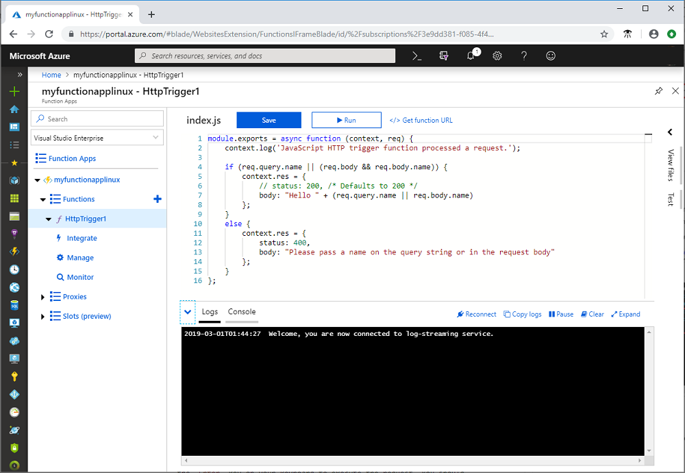
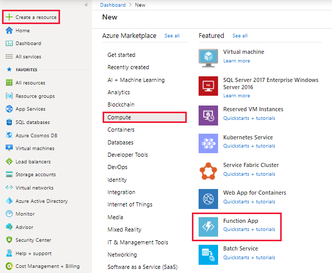
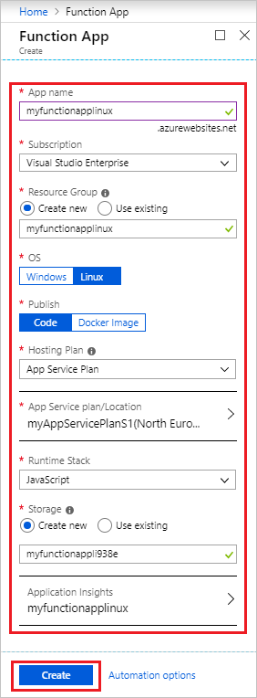
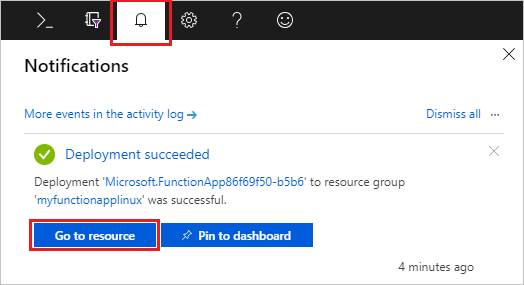
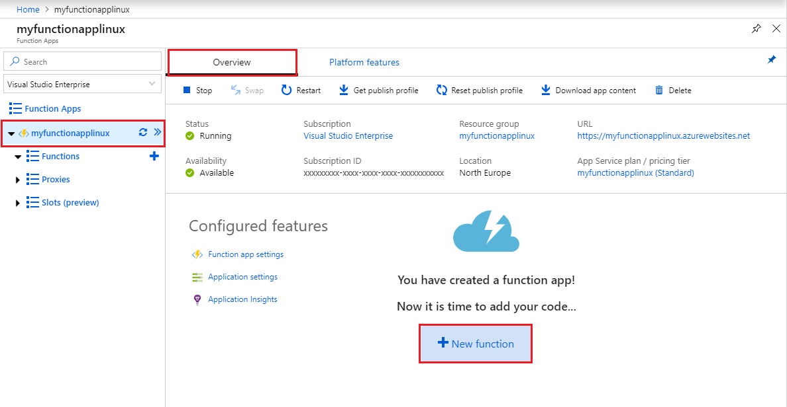
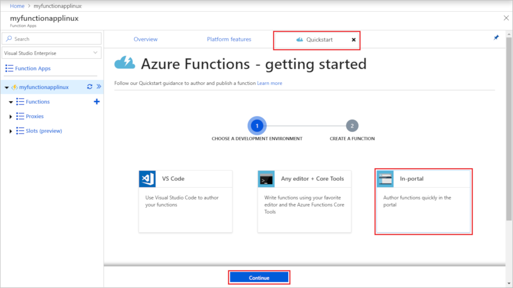
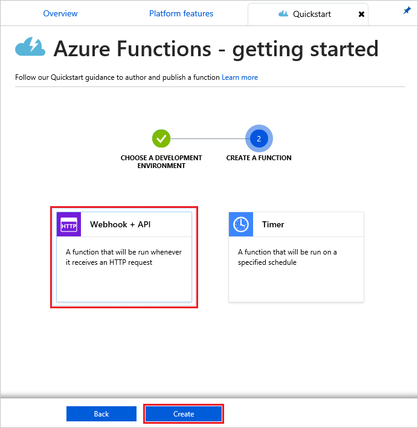
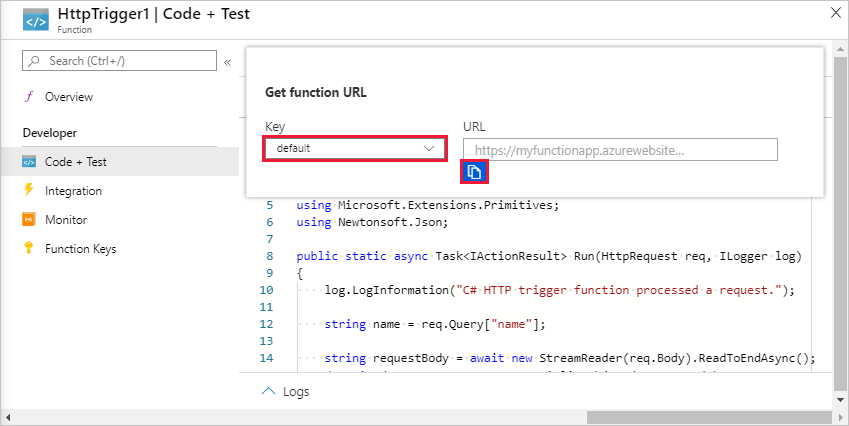
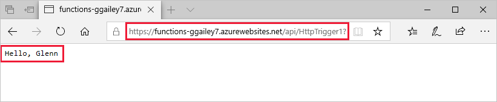

# Create a function app on Linux in an Azure App Service plan

Azure Functions lets you host your functions on Linux in a default Azure App Service container. This article walks you through how to use the [Azure portal](https://portal.azure.com) to create a Linux-hosted function app that runs in an [App Service plan](functions-scale.md#app-service-plan). You can also [bring your own custom container](functions-create-function-linux-custom-image.md).

[!INCLUDE [quickstarts-free-trial-note](../../includes/quickstarts-free-trial-note.md)]

## Sign in to Azure

Sign in to the Azure portal at <https://portal.azure.com> with your Azure account.

## Create a function app

You must have a function app to host the execution of your functions on Linux. The function app provides an environment for execution of your function code. It lets you group functions as a logic unit for easier management, deployment, and sharing of resources. In this article, you create an App Service plan when you create your function app.

1. Select the **Create a resource** button found on the upper left-hand corner of the Azure portal, then select **Compute** > **Function App**.

    

2. Use the function app settings as specified in the table below the image.

    

    | Setting      | Suggested value  | Description                                        |
    | ------------ |  ------- | -------------------------------------------------- |
    | **App name** | Globally unique name | Name that identifies your new function app. Valid characters are `a-z`, `0-9`, and `-`.  | 
    | **Subscription** | Your subscription | The subscription under which this new function app is created. | 
    | **[Resource Group](../azure-resource-manager/resource-group-overview.md)** |  myResourceGroup | Name for the new resource group in which to create your function app. |
    | **OS** | Linux | The function app runs on Linux. |
    | **Publish** | Code | The default Linux container for your **Runtime Stack** is used. All you need to provide is your function app project code. Another option is to publish a custom [Docker image](functions-create-function-linux-custom-image.md). |
    | **[Hosting plan](functions-scale.md)** | App Service plan | Hosting plan that defines how resources are allocated to your function app. When you run in an App Service plan, you can control the [scaling of your function app](functions-scale.md).  |
    | **App Service plan/Location** | Create plan | Choose **Create new** and supply an **App Service plan** name. Choose a **Location** in a [region](https://azure.microsoft.com/regions/) near you or near other services your functions access. Choose your desired **[Pricing tier](https://azure.microsoft.com/pricing/details/app-service/linux/)**.  You can't run both Linux and Windows function apps in the same App Service plan. |
    | **Runtime stack** | Preferred language | Choose a runtime that supports your favorite function programming language. Choose **.NET** for C# and F# functions. [Python support](functions-reference-python.md) is in preview at this time. |
    | **[Storage](../storage/common/storage-quickstart-create-account.md)** |  Globally unique name |  Create a storage account used by your function app. Storage account names must be between 3 and 24 characters in length and may contain numbers and lowercase letters only. You can also use an existing account, which must meets the [storage account requirements](functions-scale.md#storage-account-requirements). |
    | **[Application Insights](functions-monitoring.md)** | Enabled | Application Insights is disabled by default. We recommend enabling Application Insights integration now and choosing a hosting location near your App Service plan location. If you want to do this later, see [Monitor Azure Functions](functions-monitoring.md).  |

3. Select **Create** to provision and deploy the function app.

4. Select the Notification icon in the upper-right corner of the portal and watch for the **Deployment succeeded** message.

    

5. Select **Go to resource** to view your new function app.

Next, you create a function in the new function app. Even after your function app is available, it may take a few minutes to be fully initialized.

## Create an HTTP triggered function

This section shows you how to create a function in your new function app in the portal.

> [!NOTE]
> The portal development experience can be useful for trying out Azure Functions. For most scenarios, consider developing your functions locally and publishing the project to your function app using either [Visual Studio Code](functions-create-first-function-vs-code.md#create-an-azure-functions-project) or the [Azure Functions Core Tools](functions-run-local.md#create-a-local-functions-project).  

1. In your new function app, choose the **Overview** tab, and after it loads completely choose **+ New function**.

    

1. In the **Quickstart** tab, choose **In-portal**, and select **Continue**.

    

1. Choose **WebHook + API** and then select **Create**.

    

A function is created using a language-specific template for an HTTP triggered function.

Now, you can run the new function by sending an HTTP request.

## Test the function

1. In your new function, click **</> Get function URL** at the top right, select **default (Function key)**, and then click **Copy**. 

    

2. Paste the function URL into your browser's address bar. Add the query string value `&name=<yourname>` to the end of this URL and press the `Enter` key on your keyboard to execute the request. You should see the response returned by the function displayed in the browser.  

    The following example shows the response in the browser:

    

    The request URL includes a key that is required, by default, to access your function over HTTP.

3. When your function runs, trace information is written to the logs. To see the trace output from the previous execution, return to your function in the portal and click the arrow at the bottom of the screen to expand the **Logs**.

   

## Clean up resources

[!INCLUDE [Clean-up resources](../../includes/functions-quickstart-cleanup.md)]

## Next steps

You have created a function app with a simple HTTP triggered function.  

[!INCLUDE [Next steps note](../../includes/functions-quickstart-next-steps.md)]

For more information, see [Azure Functions HTTP bindings](functions-bindings-http-webhook.md).
