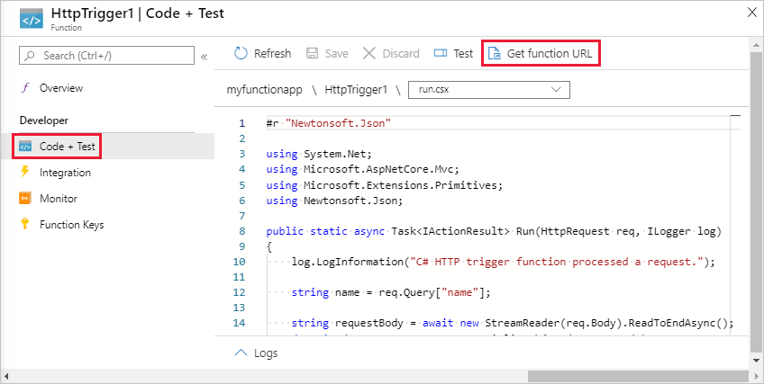

# Create a function app on Linux in an Azure App Service plan

Azure Functions lets you host your functions on Linux in a default Azure App Service container. This article walks you through how to use the [Azure portal](https://portal.azure.com) to create a Linux-hosted function app that runs in an [App Service plan](functions-scale.md#app-service-plan). You can also [bring your own custom container](functions-create-function-linux-custom-image.md).

[!INCLUDE [quickstarts-free-trial-note](../../includes/quickstarts-free-trial-note.md)]

## Sign in to Azure

Sign in to the Azure portal at <https://portal.azure.com> with your Azure account.

## Create a function app

You must have a function app to host the execution of your functions on Linux. The function app provides an environment for execution of your function code. It lets you group functions as a logical unit for easier management, deployment, scaling, and sharing of resources. In this article, you create an App Service plan when you create your function app.

1. From the Azure portal menu or the **Home** page, select **Create a resource**.

1. In the **New** page, select **Compute** > **Function App**.

    :::image type="content" source="./media/create-function-app-linux-app-service-plan/function-app-create-flow.png" alt-text="Create a function app in the Azure portal":::

1. On the **Basics** page, use the function app settings as specified in the following table.

    | Setting      | Suggested value  | Description |
    | ------------ | ---------------- | ----------- |
    | **Subscription** | Your subscription | The subscription under which this new function app is created. |
    | **[Resource Group](../azure-resource-manager/management/overview.md)** |  *myResourceGroup* | Name for the new resource group in which to create your function app. |
    | **Function App name** | Globally unique name | Name that identifies your new function app. Valid characters are `a-z` (case insensitive), `0-9`, and `-`.  |
    |**Publish**| **Code** (default) | Option to publish code files or a Docker container. |
    | **Runtime stack** | Preferred language | Choose a runtime that supports your favorite function programming language. Choose **.NET Core** for C# and F# functions. |
    |**Version**| Version number | Choose the version of your installed runtime.  |
    |**Region**| Preferred region | Choose a [region](https://azure.microsoft.com/regions/) near you or near other services your functions access. |

    :::image type="content" source="./media/create-function-app-linux-app-service-plan/function-app-create-basics-linux.png" alt-text="Basics page":::

1. Select **Next : Hosting**. On the **Hosting** page, enter the following settings.

    | Setting      | Suggested value  | Description |
    | ------------ | ---------------- | ----------- |
    | **[Storage account](../storage/common/storage-account-create.md)** |  Globally unique name |  Create a storage account used by your function app. Storage account names must be between 3 and 24 characters in length and can contain numbers and lowercase letters only. You can also use an existing account, which must meet the [storage account requirements](../azure-functions/functions-scale.md#storage-account-requirements). |
    |**Operating system**| **Linux** | An operating system is pre-selected for you based on your runtime stack selection, but you can change the setting if necessary. |
    | **[Plan](../azure-functions/functions-scale.md)** | **Consumption (Serverless)** | Hosting plan that defines how resources are allocated to your function app. In the default **Consumption** plan, resources are added dynamically as required by your functions. In this [serverless](https://azure.microsoft.com/overview/serverless-computing/) hosting, you pay only for the time your functions run. When you run in an App Service plan, you must manage the [scaling of your function app](../azure-functions/functions-scale.md).  |

    :::image type="content" source="./media/create-function-app-linux-app-service-plan/function-app-create-hosting-linux.png" alt-text="Hosting page":::

1. Select **Next : Monitoring**. On the **Monitoring** page, enter the following settings.

    | Setting      | Suggested value  | Description |
    | ------------ | ---------------- | ----------- |
    | **[Application Insights](../azure-functions/functions-monitoring.md)** | **Yes** (default) | Creates an Application Insights resource of the same *App name* in the nearest supported region. By expanding this setting or selecting **Create new**, you can change the Application Insights name or choose a different region in an [Azure geography](https://azure.microsoft.com/global-infrastructure/geographies/) where you want to store your data. |

   :::image type="content" source="./media/create-function-app-linux-app-service-plan/function-app-create-monitoring-linux.png" alt-text="Monitoring page":::

1. Select **Review + create** to review the app configuration selections.

1. On the **Review + create** page, review your settings, and then select **Create** to provision and deploy the function app.

1. Select the **Notifications** icon in the upper-right corner of the portal and watch for the **Deployment succeeded** message.

1. Select **Go to resource** to view your new function app. You can also select **Pin to dashboard**. Pinning makes it easier to return to this function app resource from your dashboard.

    

    Even after your function app is available, it may take a few minutes to be fully initialized.

Next, you create a function in the new function app.

## Create an HTTP trigger function

This section shows you how to create a function in your new function app in the portal.

> [!NOTE]
> The portal development experience can be useful for trying out Azure Functions. For most scenarios, consider developing your functions locally and publishing the project to your function app using either [Visual Studio Code](functions-create-first-function-vs-code.md#create-an-azure-functions-project) or the [Azure Functions Core Tools](functions-run-local.md#create-a-local-functions-project).  

1. From the left menu of the **Functions** window, select **Functions**, then select **Add** from the top menu. 
 
1. From the **New Function** window, select **Http trigger**.

    

1. In the **New Function** window, accept the default name for **New Function**, or enter a new name. 

1. Choose **Anonymous** from the **Authorization level** drop-down list, and then select **Create Function**.

    Azure creates the HTTP trigger function. Now, you can run the new function by sending an HTTP request.

## Test the function

1. In your new HTTP trigger function, select **Code + Test** from the left menu, then select **Get function URL** from the top menu.

    

1. In the **Get function URL** dialog box, select **default** from the drop-down list, and then select the **Copy to clipboard** icon. 

    

1. Paste the function URL into your browser's address bar. Add the query string value `?name=<your_name>` to the end of this URL and press Enter to run the request. 

    The following example shows the response in the browser:

    

    The request URL includes a key that is required, by default, to access your function over HTTP.

1. When your function runs, trace information is written to the logs. To see the trace output, return to the **Code + Test** page in the portal and expand the **Logs** arrow at the bottom of the page.

   

## Clean up resources

[!INCLUDE [Clean-up resources](../../includes/functions-quickstart-cleanup.md)]

## Next steps

You have created a function app with a simple HTTP trigger function.  

[!INCLUDE [Next steps note](../../includes/functions-quickstart-next-steps.md)]

For more information, see [Azure Functions HTTP bindings](functions-bindings-http-webhook.md).
