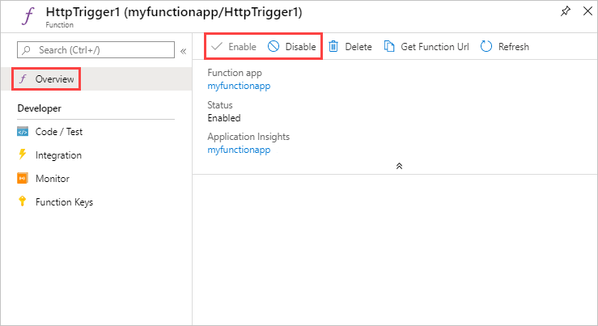

# How to disable functions in Azure Functions

This article explains how to disable a function in Azure Functions. To *disable* a function means to make the runtime ignore the automatic trigger that is defined for the function. The way you do that depends on the runtime version and the programming language:

* Functions 1.x
  * Scripting languages
  * C# class libraries
* Functions 2.x
  * One way for all languages
  * Optional way for C# class libraries

## Functions 1.x - scripting languages

For scripting languages such as C# script and JavaScript, you use the `disabled` property of the *function.json* file to tell the runtime not to trigger a function. This property can be set to `true` or to the name of an app setting:

```json
{
    "bindings": [
        {
            "type": "queueTrigger",
            "direction": "in",
            "name": "myQueueItem",
            "queueName": "myqueue-items",
            "connection":"MyStorageConnectionAppSetting"
        }
    ],
    "disabled": true
}
```
or 

```json
    "bindings": [
        ...
    ],
    "disabled": "IS_DISABLED"
```

In the second example, the function is disabled when there is an app setting that is named IS_DISABLED and is set to `true` or 1.

You can edit the file in the Azure portal or use the **Function State** switch on the function's **Manage** tab. The portal switch works by changing the *function.json* file.



## Functions 1.x - C# class libraries

In a Functions 1.x class library, you use a `Disable` attribute to prevent a function from being triggered. You can use the attribute without a constructor parameter, as shown in the following example:

```csharp
public static class QueueFunctions
{
    [Disable]
    [FunctionName("QueueTrigger")]
    public static void QueueTrigger(
        [QueueTrigger("myqueue-items")] string myQueueItem, 
        TraceWriter log)
    {
        log.Info($"C# function processed: {myQueueItem}");
    }
}
```

The attribute without a constructor parameter requires that you recompile and redeploy the project to change the function's disabled state. A more flexible way to use the attribute is to include a constructor parameter that refers to a Boolean app setting, as shown in the following example:

```csharp
public static class QueueFunctions
{
    [Disable("MY_TIMER_DISABLED")]
    [FunctionName("QueueTrigger")]
    public static void QueueTrigger(
        [QueueTrigger("myqueue-items")] string myQueueItem, 
        TraceWriter log)
    {
        log.Info($"C# function processed: {myQueueItem}");
    }
}
```

This method lets you enable and disable the function by changing the app setting, without recompiling or redeploying. Changing an app setting causes the function app to restart, so the disabled state change is recognized immediately.

> [!IMPORTANT]
> The `Disabled` attribute is the only way to disable a class library function. The generated *function.json* file for a class library function is not meant to be edited directly. If you edit that file, whatever you do to the `disabled` property will have no effect.
>
> The same goes for the **Function state** switch on the **Manage** tab, since it works by changing the *function.json* file.
>
> Also, note that the portal may indicate the function is disabled when it isn't.


## Functions 2.x - all languages

In Functions 2.x you disable a function by using an app setting. For example, to disable a function named `QueueTrigger`, you create an app setting named `AzureWebJobs.QueueTrigger.Disabled`, and set it to `true`. To enable the function, set the app setting to `false`. You can also use the **Function State** switch on the function's **Manage** tab. The switch works by creating and deleting the `AzureWebJobs.<functionname>.Disabled` app setting.


## Functions 2.x - C# class libraries

In a Functions 2.x class library, we recommend that you use the method that works for all languages. But if you prefer, you can [use the Disable attribute as in Functions 1.x](#functions-1x---c-class-libraries).

## Next steps

This article is about disabling automatic triggers. For more information about triggers, see [Triggers and bindings](functions-triggers-bindings.md).
