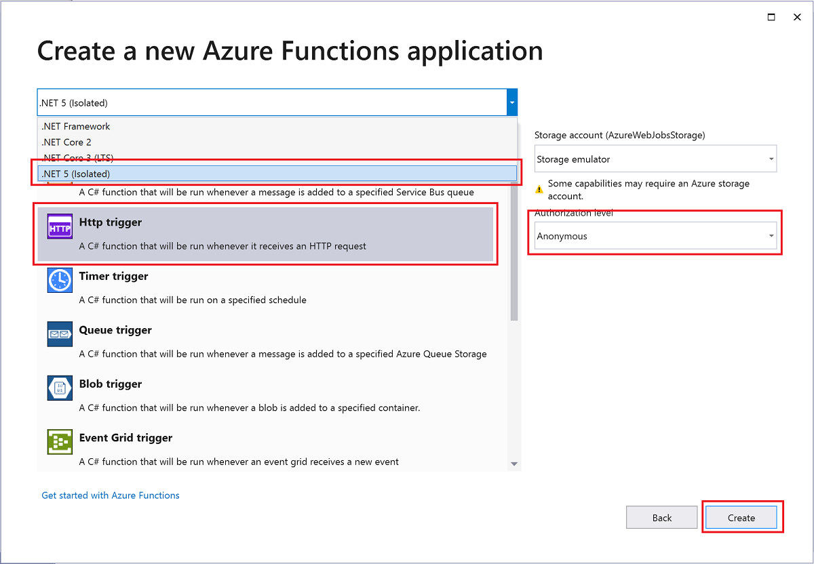

# Develop and publish .NET 5 functions using Azure Functions 

This article shows you how to work with C# functions using .NET 5.0, which run out-of-process from the Azure Functions runtime. You'll learn how to create, debug locally, and publish these .NET isolated process functions to Azure. In Azure, these functions run in an isolated process that supports .NET 5.0. To learn more, see [Guide for running functions on .NET 5.0 in Azure](dotnet-isolated-process-guide.md).

If you don't need to support .NET 5.0 or run your functions out-of-process, you might want to instead [create a C# class library function](functions-create-your-first-function-visual-studio.md).

## Prerequisites

+ An Azure account with an active subscription. [Create an account for free](https://azure.microsoft.com/free/?ref=microsoft.com&utm_source=microsoft.com&utm_medium=docs&utm_campaign=visualstudio).

::: zone pivot="development-environment-vscode,development-environment-cli"  
+ [.NET 5.0 SDK](https://dotnet.microsoft.com/download)

+ [Azure Functions Core Tools](functions-run-local.md#v2) version 3.0.3381, or a later version.

+ [Azure CLI](/cli/azure/install-azure-cli) version 2.20, or a later version.  
::: zone-end  
::: zone pivot="development-environment-vscode"  
+ [Visual Studio Code](https://code.visualstudio.com/) on one of the [supported platforms](https://code.visualstudio.com/docs/supporting/requirements#_platforms).  

+ The [C# extension](https://marketplace.visualstudio.com/items?itemName=ms-dotnettools.csharp) for Visual Studio Code.  

+ The [Azure Functions extension](https://marketplace.visualstudio.com/items?itemName=ms-azuretools.vscode-azurefunctions) for Visual Studio Code, version 1.3.0 or newer.
::: zone-end  
::: zone pivot="development-environment-vs"  
+ [Visual Studio 2019](https://azure.microsoft.com/downloads/) version 16.10 or later. Your install must include either the **Azure development** or the **ASP.NET and web development** workload.  
::: zone-end  

## Create a local function project

In Azure Functions, a function project is a container for one or more individual functions that each responds to a specific trigger. All functions in a project share the same local and hosting configurations. In this section, you create a function project that contains a single function.

::: zone pivot="development-environment-vscode"  
1. Choose the Azure icon in the Activity bar, then in the **Azure: Functions** area, select the **Create new project...** icon.

    

1. Choose a directory location for your project workspace and choose **Select**.

    > [!NOTE]
    > These steps were designed to be completed outside of a workspace. In this case, do not select a project folder that is part of a workspace.

1. Provide the following information at the prompts:

    + **Select a language for your function project**: Choose `C#`.

    + **Select a .NET runtime**: Choose `.NET 5 isolated`.

    + **Select a template for your project's first function**: Choose `HTTP trigger`.

    + **Provide a function name**: Type `HttpExample`.

    + **Provide a namespace**: Type `My.Functions`.

    + **Authorization level**: Choose `Anonymous`, which enables anyone to call your function endpoint. To learn about authorization level, see [Authorization keys](functions-bindings-http-webhook-trigger.md#authorization-keys).

    + **Select how you would like to open your project**: Choose `Add to workspace`.

1. Using this information, Visual Studio Code generates an Azure Functions project with an HTTP trigger. You can view the local project files in the Explorer. To learn more about files that are created, see [Generated project files](functions-develop-vs-code.md#generated-project-files).
::: zone-end  
::: zone pivot="development-environment-cli"  

1. Run the `func init` command, as follows, to create a functions project in a folder named *LocalFunctionProj*:  

    ```console
    func init LocalFunctionProj --worker-runtime dotnetisolated
    ```
    
    Specifying `dotnetisolated` creates a project that runs on .NET 5.0.


1. Navigate into the project folder:

    ```console
    cd LocalFunctionProj
    ```

    This folder contains various files for the project, including the [local.settings.json](functions-run-local.md#local-settings-file) and [host.json](functions-host-json.md) configurations files. Because *local.settings.json* can contain secrets downloaded from Azure, the file is excluded from source control by default in the *.gitignore* file.

1. Add a function to your project by using the following command, where the `--name` argument is the unique name of your function (HttpExample) and the `--template` argument specifies the function's trigger (HTTP).

    ```console
    func new --name HttpExample --template "HTTP trigger" --authlevel "anonymous"
    ``` 

    `func new` creates an HttpExample.cs code file.
::: zone-end  

::: zone pivot="development-environment-vs"

1. From the Visual Studio menu, select **File** > **New** > **Project**.

1. In **Create a new project**, enter *functions* in the search box, choose the **Azure Functions** template, and then select **Next**.

1. In **Configure your new project**, enter a **Project name** for your project, and then select **Create**. The function app name must be valid as a C# namespace, so don't use underscores, hyphens, or any other nonalphanumeric characters.

1. For the **Create a new Azure Functions application** settings, use the values in the following table:

    | Setting      | Value  | Description                      |
    | ------------ |  ------- |----------------------------------------- |
    | **.NET version** | **.NET 5 (Isolated)** | This value creates a function project that runs on .NET 5.0 in an isolated process.   |
    | **Function template** | **HTTP trigger** | This value creates a function triggered by an HTTP request. |
    | **Storage account (AzureWebJobsStorage)**  | **Storage emulator** | Because a function app in Azure requires a storage account, one is assigned or created when you publish your project to Azure. An HTTP trigger doesn't use an Azure Storage account connection string; all other trigger types require a valid Azure Storage account connection string.  |
    | **Authorization level** | **Anonymous** | The created function can be triggered by any client without providing a key. This authorization setting makes it easy to test your new function. For more information about keys and authorization, see [Authorization keys](functions-bindings-http-webhook-trigger.md#authorization-keys) and [HTTP and webhook bindings](functions-bindings-http-webhook.md). |
    
    
    

    Make sure you set the **Authorization level** to **Anonymous**. If you choose the default level of **Function**, you're required to present the [function key](functions-bindings-http-webhook-trigger.md#authorization-keys) in requests to access your function endpoint.

1. Select **Create** to create the function project and HTTP trigger function.

Visual Studio creates a project and class that contains boilerplate code for the HTTP trigger function type. The boilerplate code sends a "Welcome to Azure Functions!" HTTP response. The `HttpTrigger` attribute specifies that the function is triggered by an HTTP request. 

## Rename the function

The `FunctionName` method attribute sets the name of the function, which by default is generated as `Function1`. Since the tooling doesn't let you override the default function name when you create your project, take a minute to create a better name for the function class, file, and metadata.

1. In **File Explorer**, right-click the Function1.cs file and rename it to `HttpExample.cs`.

1. In the code, rename the Function1 class to `HttpExample`.

1. In the `HttpTrigger` method named `Run`, rename the `FunctionName` method attribute to `HttpExample` and the value passed to the `GetLogger` method.

Your function definition should now look like the following code:

:::code language="csharp" source="~/functions-docs-csharp/http-trigger-isolated/HttpExample.cs" range="9-15":::
 
Now that you've renamed the function, you can test it on your local computer.

## Run the function locally

Visual Studio integrates with Azure Functions Core Tools so that you can test your functions locally using the full Azure Functions runtime.  

1. To run your function, press <kbd>F5</kbd> in Visual Studio. You might need to enable a firewall exception so that the tools can handle HTTP requests. Authorization levels are never enforced when you run a function locally.

1. Copy the URL of your function from the Azure Functions runtime output and run the request. A welcome to Functions message is displayed when the function runs successfully and logs are written to the runtime output. 

1. To stop debugging, press <kbd>Shift</kbd>+<kbd>F5</kbd> in Visual Studio.

After you've verified that the function runs correctly on your local computer, it's time to publish the project to Azure.

::: zone-end

::: zone pivot="development-environment-vscode"  

[!INCLUDE [functions-run-function-test-local-vs-code](../../includes/functions-run-function-test-local-vs-code.md)]

::: zone-end  
::: zone pivot="development-environment-cli" 

[!INCLUDE [functions-run-function-test-local-cli](../../includes/functions-run-function-test-local-cli.md)]

## Create supporting Azure resources for your function

Before you can deploy your function code to Azure, you need to create three resources:

- A [resource group](../azure-resource-manager/management/overview.md), which is a logical container for related resources.
- A [Storage account](../storage/common/storage-account-create.md), which is used to maintain state and other information about your functions.
- A function app, which provides the environment for executing your function code. A function app maps to your local function project and lets you group functions as a logical unit for easier management, deployment, and sharing of resources.

Use the following commands to create these items.

1. If you haven't done so already, sign in to Azure:

    ```azurecli
    az login
    ```

    The [az login](/cli/azure/reference-index#az_login) command signs you into your Azure account.

1. Create a resource group named `AzureFunctionsQuickstart-rg` in the `westeurope` region:

    ```azurecli
    az group create --name AzureFunctionsQuickstart-rg --location westeurope
    ```
 
    The [az group create](/cli/azure/group#az_group_create) command creates a resource group. You generally create your resource group and resources in a region near you, using an available region returned from the `az account list-locations` command.

1. Create a general-purpose storage account in your resource group and region:

    ```azurecli
    az storage account create --name <STORAGE_NAME> --location westeurope --resource-group AzureFunctionsQuickstart-rg --sku Standard_LRS
    ```

    The [az storage account create](/cli/azure/storage/account#az_storage_account_create) command creates the storage account. 

    In the previous example, replace `<STORAGE_NAME>` with a name that is appropriate to you and unique in Azure Storage. Names must contain three to 24 characters numbers and lowercase letters only. `Standard_LRS` specifies a general-purpose account, which is [supported by Functions](storage-considerations.md#storage-account-requirements).

1. Create the function app in Azure:
   
    ```azurecli
    az functionapp create --resource-group AzureFunctionsQuickstart-rg --consumption-plan-location westeurope --runtime dotnet-isolated --runtime-version 5.0 --functions-version 3 --name <APP_NAME> --storage-account <STORAGE_NAME>
    ```

    The [az functionapp create](/cli/azure/functionapp#az_functionapp_create) command creates the function app in Azure. 
    
    In the previous example, replace `<STORAGE_NAME>` with the name of the account you used in the previous step, and replace `<APP_NAME>` with a globally unique name appropriate to you. The `<APP_NAME>` is also the default DNS domain for the function app. 
    
    This command creates a function app running .NET 5.0 under the [Azure Functions Consumption Plan](consumption-plan.md). This plan should be free for the amount of usage you incur in this article. The command also provisions an associated Azure Application Insights instance in the same resource group. Use this instance to monitor your function app and view logs. For more information, see [Monitor Azure Functions](functions-monitoring.md). The instance incurs no costs until you activate it.

[!INCLUDE [functions-publish-project-cli](../../includes/functions-publish-project-cli.md)]

::: zone-end

:::zone pivot="development-environment-vs"

## Publish the project to Azure

Before you can publish your project, you must have a function app in your Azure subscription. Visual Studio publishing creates a function app for you the first time you publish your project.

[!INCLUDE [Publish the project to Azure](../../includes/functions-vstools-publish.md)]

## Verify your function in Azure

1. In Cloud Explorer, your new function app should be selected. If not, expand your subscription > **App Services**, and select your new function app.

1. Right-click the function app and choose **Open in Browser**. This opens the root of your function app in your default web browser and displays the page that indicates your function app is running. 

    :::image type="content" source="media/functions-create-your-first-function-visual-studio/function-app-running-azure.png" alt-text="Function app running":::

1. In the address bar in the browser, append the path `/api/HttpExample` to the base URL and run the request.

1. Go to this URL and you see the same response in the browser you had when running locally.

:::zone-end

::: zone pivot="development-environment-vscode"

[!INCLUDE [functions-sign-in-vs-code](../../includes/functions-sign-in-vs-code.md)]

## Publish the project to Azure

In this section, you create a function app and related resources in your Azure subscription and then deploy your code.

> [!IMPORTANT]
> Publishing to an existing function app overwrites the content of that app in Azure.


1. Choose the Azure icon in the Activity bar, then in the **Azure: Functions** area, choose the **Deploy to function app...** button.

    

1. Provide the following information at the prompts:

    - **Select folder**: Choose a folder from your workspace or browse to one that contains your function app. You won't see this prompt when you already have a valid function app opened.

    - **Select subscription**: Choose the subscription to use. You won't see this prompt when you only have one subscription.

    - **Select Function App in Azure**: Choose `- Create new Function App`. (Don't choose the `Advanced` option, which isn't covered in this article.)
      
    - **Enter a globally unique name for the function app**: Type a name that is valid in a URL path. The name you type is validated to make sure that it's unique in Azure Functions.
    
    - **Select a runtime stack**: Choose `.NET 5 (non-LTS)`. 
    
    - **Select a location for new resources**:  For better performance, choose a [region](https://azure.microsoft.com/regions/) near you. 
    
    In the notification area, you see the status of individual resources as they're created in Azure.

    :::image type="content" source="../../includes/media/functions-publish-project-vscode/resource-notification.png" alt-text="Notification of Azure resource creation":::
    
1.  When completed, the following Azure resources are created in your subscription, using names based on your function app name:
    
    [!INCLUDE [functions-vs-code-created-resources](../../includes/functions-vs-code-created-resources.md)]

    A notification is displayed after your function app is created and the deployment package is applied. 

    [!INCLUDE [functions-vs-code-create-tip](../../includes/functions-vs-code-create-tip.md)]

4. Select **View Output** in this notification to view the creation and deployment results, including the Azure resources that you created. If you miss the notification, select the bell icon in the lower right corner to see it again.

    

::: zone-end

::: zone pivot="development-environment-cli"  
[!INCLUDE [functions-run-remote-azure-cli](../../includes/functions-run-remote-azure-cli.md)]  
::: zone-end  

::: zone pivot="development-environment-vscode"  
[!INCLUDE [functions-vs-code-run-remote](../../includes/functions-vs-code-run-remote.md)]  
::: zone-end  

## Clean up resources

You created resources to complete this article. You may be billed for these resources, depending on your [account status](https://azure.microsoft.com/account/) and [service pricing](https://azure.microsoft.com/pricing/). 

::: zone pivot="development-environment-cli"  
Use the following command to delete the resource group and all its contained resources to avoid incurring further costs.

```azurecli
az group delete --name AzureFunctionsQuickstart-rg
```
::: zone-end  

::: zone pivot="development-environment-vscode"  
Use the following steps to delete the function app and its related resources to avoid incurring any further costs.

[!INCLUDE [functions-cleanup-resources-vs-code-inner.md](../../includes/functions-cleanup-resources-vs-code-inner.md)]  
::: zone-end  
::: zone pivot="development-environment-vs"   
[!INCLUDE [functions-vstools-cleanup](../../includes/functions-vstools-cleanup.md)]
::: zone-end

## Next steps

> [!div class="nextstepaction"]
> [Learn more about .NET isolated functions](dotnet-isolated-process-guide.md)

