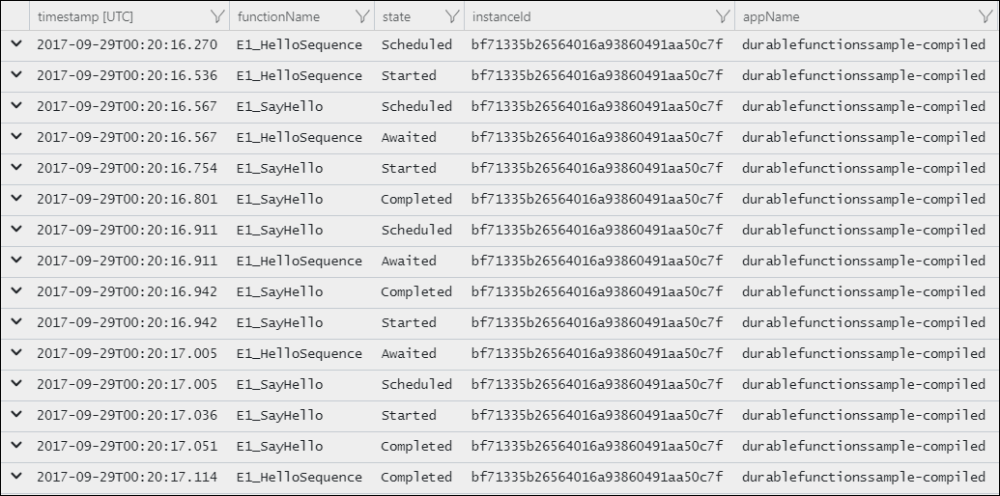
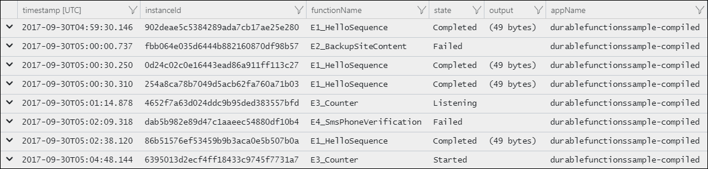

# Diagnostics in Durable Functions (Azure Functions)

There are several options for diagnosing issues with [Durable Functions](durable-functions-overview.md). Some of these options are the same for regular functions and some of them are unique to Durable Functions.

## Application Insights

[Application Insights](../application-insights/app-insights-overview.md) is the recommended way to do diagnostics and monitoring in Azure Functions. The same applies to Durable Functions. For an overview of how to leverage Application Insights in your function app, see [Monitor Azure Functions](functions-monitoring.md).

The Azure Functions Durable Extension also emits *tracking events* which allow you to trace the end-to-end execution of an orchestration. These can be found and queried using the [Application Insights Analytics](../application-insights/app-insights-analytics.md) tool in the Azure portal.

### Tracking data

Each lifecycle event of an orchestration instance causes a tracking event to be written to the **traces** collection in Application Insights. This event contains a **customDimensions** payload with several fields.  Field names are all prepended with `prop__`.

* **hubName**: The name of the task hub in which your orchestrations are running.
* **appName**: The name of the function app. This is useful when you have multiple function apps sharing the same Application Insights instance.
* **slotName**: The [deployment slot](https://blogs.msdn.microsoft.com/appserviceteam/2017/06/13/deployment-slots-preview-for-azure-functions/) in which the current function app is running. This is useful when you leverage deployment slots to version your orchestrations.
* **functionName**: The name of the orchestrator or activity function.
* **functionType**: The type of the function, such as **Orchestrator** or **Activity**.
* **instanceId**: The unique ID of the orchestration instance.
* **state**: The lifecycle execution state of the instance. Valid values include:
    * **Scheduled**: The function was scheduled for execution but hasn't started running yet.
    * **Started**: The function has started running but has not yet awaited or completed.
    * **Awaited**: The orchestrator has scheduled some work and is waiting for it to complete.
    * **Listening**: The orchestrator is listening for an external event notification.
    * **Completed**: The function has completed successfully.
    * **Failed**: The function failed with an error.
* **reason**: Additional data associated with the tracking event. For example, if an instance is waiting for an external event notification, this field indicates the name of the event it is waiting for. If a function has failed, this will contain the error details.
* **isReplay**: Boolean value indicating whether the tracking event is for replayed execution.
* **extensionVersion**: The version of the Durable Task extension. This is especially important data when reporting possible bugs in the extension. Long-running instances may report multiple versions if an update occurs while it is running. 

The verbosity of tracking data emitted to Application Insights can be configured in the `logger` section of the `host.json` file.

```json
{
    "logger": {
        "categoryFilter": {
            "categoryLevels": {
                "Host.Triggers.DurableTask": "Information"
            }
        }
    }
}
```

By default, all tracking events are emitted. The volume of data can be reduced by setting `Host.Triggers.DurableTask` to `"Warning"` or `"Error"` in which case tracking events will only be emitted for exceptional situations.

> [!WARNING]
> By default, Application Insights telemetry is sampled by the Azure Functions runtime to avoid emitting data too frequently. This can cause tracking information to be lost when many lifecycle events occur in a short period of time. The [Azure Functions Monitoring article](functions-monitoring.md#configure-sampling) explains how to configure this behavior.

### Single instance query

The following query shows historical tracking data for a single instance of the [Hello Sequence](durable-functions-sequence.md) function orchestration. It's written using the [Application Insights Query Language (AIQL)](https://docs.loganalytics.io/docs/Language-Reference). It filters out replay execution so that only the *logical* execution path is shown.

```AIQL
let targetInstanceId = "bf71335b26564016a93860491aa50c7f";
let start = datetime(2017-09-29T00:00:00);
traces
| where timestamp > start and timestamp < start + 30m
| where customDimensions.Category == "Host.Triggers.DurableTask"
| extend functionName = customDimensions["prop__functionName"]
| extend instanceId = customDimensions["prop__instanceId"]
| extend state = customDimensions["prop__state"]
| extend isReplay = tobool(tolower(customDimensions["prop__isReplay"]))
| where isReplay == false
| where instanceId == targetInstanceId
| project timestamp, functionName, state, instanceId, appName = cloud_RoleName
```
The result is a list of tracking events that show the execution path of the orchestration, including any activity functions.



> [!NOTE]
> Some of these tracking events may be out of order due to the lack of precision in the `timestamp` column. This is being tracked in GitHub as [issue #71](https://github.com/Azure/azure-functions-durable-extension/issues/71).

### Instance summary query

The following query displays the status of all orchestration instances that were run in a specified time range.

```AIQL
let start = datetime(2017-09-30T04:30:00);
traces
| where timestamp > start and timestamp < start + 1h
| where customDimensions.Category == "Host.Triggers.DurableTask"
| extend functionName = tostring(customDimensions["prop__functionName"])
| extend instanceId = tostring(customDimensions["prop__instanceId"])
| extend state = tostring(customDimensions["prop__state"])
| extend isReplay = tobool(tolower(customDimensions["prop__isReplay"]))
| extend output = tostring(customDimensions["prop__output"])
| where isReplay == false
| summarize arg_max(timestamp, *) by instanceId
| project timestamp, instanceId, functionName, state, output, appName = cloud_RoleName
| order by timestamp asc
```
The result is a list of instance IDs and their current runtime status.



## Logging

It's important to keep the orchestrator replay behavior in mind when writing logs directly from an orchestrator function. For example, consider the following orchestrator function:

```cs
public static async Task Run(
    DurableOrchestrationContext ctx,
    TraceWriter log)
{
    log.Info("Calling F1.");
    await ctx.CallActivityAsync("F1");
    log.Info("Calling F2.");
    await ctx.CallActivityAsync("F2");
    log.Info("Calling F3");
    await ctx.CallActivityAsync("F3");
    log.Info("Done!");
}
```

The resulting log data is going to look something like the following:

```txt
Calling F1.
Calling F1.
Calling F2.
Calling F1.
Calling F2.
Calling F3.
Calling F1.
Calling F2.
Calling F3.
Done!
```

> [!NOTE]
> Remember that while the logs claim to be calling F1, F2, and F3, those functions are only *actually* called the first time they are encountered. Subsequent calls that happen during replay are skipped and the outputs are replayed to the orchestrator logic.

If you want to only log on non-replay execution, you can write a conditional expression to log only if `IsReplaying` is `false`. Consider the example above, but this time with replay checks.

```cs
public static async Task Run(
    DurableOrchestrationContext ctx,
    TraceWriter log)
{
    if (!ctx.IsReplaying) log.Info("Calling F1.");
    await ctx.CallActivityAsync("F1");
    if (!ctx.IsReplaying) log.Info("Calling F2.");
    await ctx.CallActivityAsync("F2");
    if (!ctx.IsReplaying) log.Info("Calling F3");
    await ctx.CallActivityAsync("F3");
    log.Info("Done!");
}
```
With this change, the log output is as follows:

```txt
Calling F1.
Calling F2.
Calling F3.
Done!
```

## Debugging

Azure Functions supports debugging function code directly, and that same support carries forward to Durable Functions, whether running in Azure or locally. However, there are a few behaviors to be aware of when debugging:

* **Replay**: Orchestrator functions regularly replay when new inputs are received. This means a single *logical* execution of an orchestrator function can result in hitting the same breakpoint multiple times, especially if it is set early in the function code.
* **Await**: Whenever an `await` is encountered, it yields control back to the Durable Task Framework dispatcher. If this is the first time a particular `await` has been encountered, the associated task is *never* resumed. Because the task never resumes, stepping *over* the await (F10 in Visual Studio) is not actually possible. Stepping over only works when a task is being replayed.
* **Messaging timeouts**: Durable Functions internally uses queue messages to drive execution of both orchestrator functions and activity functions. In a multi-VM environment, breaking into the debugging for extended periods of time could cause another VM to pick up the message, resulting in duplicate execution. This behavior exists for regular queue-trigger functions as well, but is important to point out in this context since the queues are an implementation detail.

> [!TIP]
> When setting breakpoints, if you want to only break on non-replay execution, you can set a conditional breakpoint that breaks only if `IsReplaying` is `false`.

## Storage

By default, Durable Functions stores state in Azure Storage. This means you can inspect the state of your orchestrations using tools such as [Microsoft Azure Storage Explorer](https://docs.microsoft.com/azure/vs-azure-tools-storage-manage-with-storage-explorer).


This is useful for debugging because you see exactly what state an orchestration may be in. Messages in the queues can also be examined to learn what work is pending (or stuck in some cases).

> [!WARNING]
> While it's convenient to see execution history in table storage, avoid taking any dependency on this table. It may change as the Durable Functions extension evolves.

## Next steps

> [!div class="nextstepaction"]
> [Learn how to use durable timers](durable-functions-timers.md)