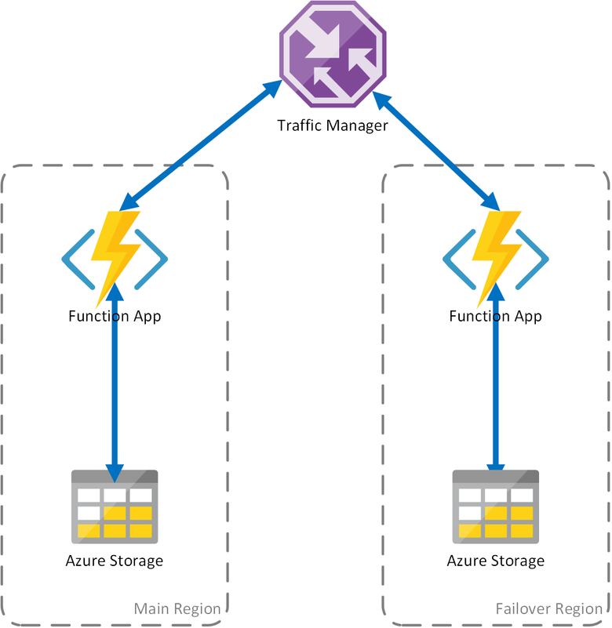

# Disaster Recovery and Geo-Distribution

## Overview

In Azure Durable Functions, all state is persisted in Azure Storage. A [task hub](durable-functions-task-hubs.md) is a logical container for Azure Storage resources that are used for orchestrations. Orchestrator and activity functions can only interact with each other when they belong to the same task hub.
The scenarios described in this article propose deployment options to increase availability and minimize downtime during disaster recovery activities.
It is important to notice that these scenarios are based on an Active-Passive configurations, since they are guided by the usage of Azure Storage.

## Scenario 1 - Load Balanced Compute with Shared Storage

In the event of problems of the compute service in Azure, the Function App could be affected. To minimize the possibility of such downtime, this scenario uses two instances of the Function App deployed to different regions. The underlying storage account and task hub are created in the main region, and it is shared by both instances.
Traffic Manager is configured to detect problems in the main site and automatically redirect traffic to the healthy Function App in the failover region.
Because Function App the failover region shares the same Azure Storage account and Task Hub, the state of the functions is not lost, and word can resume normally. Once the health is restored in the main region, Traffic Manager will start routing requests to that instance of the Function App automatically.

There are several benefits when using this deployment scenario:
- In the case of a failure in the compute layer, work can resume in the failover region without state loss.
- Traffic Manager takes care of the automatic failover to the healthy instance automatically.
- Traffic Manager automatically re-establishes traffic to the main Function App after the outage has been corrected.

However, consider the following when using this scenario.
- If the Function App is deployed using a dedicated AppService plan, there is an increased cost by replicating the compute instance in the failover datacenter.
- This scenario covers outages at the compute layer, but the storage account continues to be the single point of failure for the Function App. If there is a Storage outage, the application suffers a downtime.
- If the FunctionApp is failed over, there will be increased latency since it will access its storage account across regions.
- Accessing the storage service from a different region where it is located incurs in higher cost due to network egress traffic.
- This scenario depends on Traffic Manager. Considering [how Traffic Manager works](../traffic-manager/traffic-manager-overview#how-traffic-manager-works), it may be some time until a client application that consumes a Durable Function needs to re-query the FunctionApp address from Traffic Manager. 

## Scenario 2 - Load Balanced Compute with Regional Storage
### Traffic Manager, Load Balanced Function Apps, One Storage account per region
The previous proposed scenario covers only the case of failure in the compute services. If the storage service fails, it will result in an outage of the FunctionApp.
To ensure continuous operation of the durable functions, this scenario uses a local storage account on each region to which the FunctionApps are deployed.

This approach adds improvements on the previous scenario:
- In the case of failure, failover to the failover regions is still managed by Traffic Manager. However, because the FunctionApp relies on its own storage account, the durable functions continue to work.
- During a failover, there is no additional latency in the failover region, since the FunctionApp and the storage account are co-located.
- Failure of the storage layer will cause failures in the durable functions, which, in turn, will trigger a redirection to the failover region. Again, since the FunctionApp and storage are isolated per region, the durable functions will continue to work.
 
Important considerations for this scenario:
- If the Function App is deployed using a dedicated AppService plan, there is an increased cost by replicating the compute instance in the failover datacenter.
- Current state is not failed over. This implies that executing and checkpointed functions will fail. It is up to the client application to retry/restart the work.

## Scenario 3 - Load Balanced Compute with GRS Shared Storage
This scenario is a modification over the first scenario, implementing a shared storage account, but with the difference that this storage account is created using geo-replication.
Although functionally, this scenario provides the same advantages as Scenario 3
- Same scenarios, but using RA-GRS for storage -> improves recoverability
- Read-access geo-redundant storage (RA-GRS) maximizes availability for your storage account. RA-GRS provides read-only access to the data in the secondary location, in addition to geo-replication across two regions.

See my [About](/Overview/) page for details.   