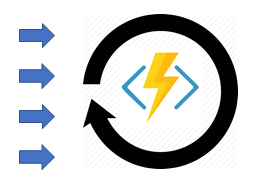
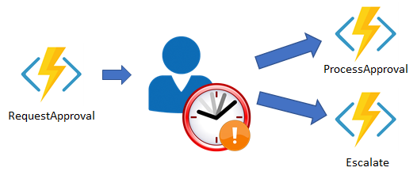

# Durable Functions overview (Azure Functions)

*Durable Functions* is an extension of [Azure Functions](functions-overview.md) and [Azure WebJobs](../app-service/web-sites-create-web-jobs.md) that lets you write stateful functions in a serverless environment. The extension manages state, checkpoints, and restarts for you.

The extension lets you define stateful workflows in a new type of function called an *orchestrator function*. Here are some of the advantages of orchestrator functions:

* They define workflows in code. No JSON schemas or designers are needed.
* They can call other functions synchronously and asynchronously. Output from called functions can be saved to local variables.
* They automatically checkpoint their progress whenever the function awaits. Local state is never lost if the process recycles or the VM reboots.

> [!NOTE]
> Durable Functions is an advanced extension for Azure Functions and is not appropriate for all applications. The rest of this article assumes that you have a strong familiarity with [Azure Functions](functions-overview.md) concepts and the challenges involved in serverless application development.

The primary use case for Durable Functions is simplifying complex, stateful coordination problems in serverless applications. The following sections describe some typical application patterns that can benefit from Durable Functions.

## Pattern #1: Function chaining

*Function chaining* refers to the pattern of executing a sequence of functions in a particular order. Often the output of one function needs to be applied to the input of another function.


Durable Functions allows you to implement this pattern concisely in code.

```cs
public static async Task<object> Run(DurableOrchestrationContext ctx)
{
    try
    {
        var x = await ctx.CallActivityAsync<object>("F1");
        var y = await ctx.CallActivityAsync<object>("F2", x);
        var z = await ctx.CallActivityAsync<object>("F3", y);
        return  await ctx.CallActivityAsync<object>("F4", z);
    }
    catch (Exception)
    {
        // error handling/compensation goes here
    }
}
```

The values "F1", "F2", "F3", and "F4" are the names of other functions in the function app. Control flow is implemented using normal imperative coding constructs. That is, code executes top-down and can involve existing language control flow semantics, like conditionals, and loops.  Error handling logic can be included in try/catch/finally blocks.

The `ctx` parameter ([DurableOrchestrationContext](https://azure.github.io/azure-functions-durable-extension/api/Microsoft.Azure.WebJobs.DurableOrchestrationContext.html)) provides methods for invoking other functions by name, passing parameters, and returning function output. Each time the code calls `await`, the Durable Functions framework *checkpoints* the progress of the current function instance. If the process or VM recycles midway through the execution, the function instance resumes from the previous `await` call. More on this restart behavior later.

## Pattern #2: Fan-out/fan-in

*Fan-out/fan-in* refers to the pattern of executing multiple functions in parallel, and then waiting for all to finish.  Often some aggregation work is done on results returned from the functions.


With normal functions, fanning out can be done by having the function send multiple messages to a queue. However, fanning back in is much more challenging. You'd have to write code to to track when the queue-triggered functions end and store function outputs. The Durable Functions extension handles this pattern with relatively simple code.

```cs
public static async Task Run(DurableOrchestrationContext ctx)
{
    var parallelTasks = new List<Task<int>>();
 
    // get a list of N work items to process in parallel
    object[] workBatch = await ctx.CallActivityAsync<object[]>("F1");
    for (int i = 0; i < workBatch.Length; i++)
    {
        Task<int> task = ctx.CallActivityAsync<int>("F2", workBatch[i]);
        parallelTasks.Add(task);
    }
 
    await Task.WhenAll(parallelTasks);
 
    // aggregate all N outputs and send result to F3
    int sum = parallelTasks.Sum(t => t.Result);
    await ctx.CallActivityAsync("F3", sum);
}
```

The fan-out work is distributed to multiple instances of function `F2`, and the work is tracked by using a dynamic list of tasks. The .NET `Task.WhenAll` API is called to wait for all of the called functions to finish. Then the `F2`function outputs are aggregated from the dynamic task list and passed on to the `F3` function.

The automatic checkpointing that happens at the `await` call on `Task.WhenAll` ensures that any crash or reboot midway through does not require a restart of any already completed tasks.

## Pattern #3: Async HTTP APIs

The third pattern is all about the problem of coordinating the state of long-running operations with external clients. A common way to implement this pattern is by having the long-running action triggered by an HTTP call, and then redirecting the client to a status endpoint that they can poll to learn when the operation completes.


Durable Functions provides built-in APIs that simplify the code you write for interacting with long-running function executions. The [samples](durable-functions-install.md) show a simple REST command that can be used to start new orchestrator function instances. Once an instance is started, the extension exposes webhook HTTP APIs that query the orchestrator function status. The following example shows the REST commands to start an orchestrator and to query its status. For clarity, some details are omitted from the example.

```
> curl -X POST https://myfunc.azurewebsites.net/orchestrators/DoWork -H "Content-Length: 0" -i
HTTP/1.1 202 Accepted
Content-Type: application/json
Location: https://myfunc.azurewebsites.net/admin/extensions/DurableTaskExtension/b79baf67f717453ca9e86c5da21e03ec

{"id":"b79baf67f717453ca9e86c5da21e03ec", ...}

> curl https://myfunc.azurewebsites.net/admin/extensions/DurableTaskExtension/b79baf67f717453ca9e86c5da21e03ec -i
HTTP/1.1 202 Accepted
Content-Type: application/json
Location: https://myfunc.azurewebsites.net/admin/extensions/DurableTaskExtension/b79baf67f717453ca9e86c5da21e03ec

{"runtimeStatus":"Running","lastUpdatedTime":"2017-03-16T21:20:47Z", ...}

> curl https://myfunc.azurewebsites.net/admin/extensions/DurableTaskExtension/b79baf67f717453ca9e86c5da21e03ec -i
HTTP/1.1 200 OK
Content-Length: 175
Content-Type: application/json

{"runtimeStatus":"Completed","lastUpdatedTime":"2017-03-16T21:20:57Z", ...}
```

Because the state is managed by the Durable Functions runtime, you don't have to implement your own status tracking mechanism.

Even though the Durable Functions extension has built-in webhooks for managing long-running orchestrations, you can implement this pattern yourself using your own function triggers (such as HTTP, queue, or Event Hub) and the `orchestrationClient` binding. For example, you could use a queue message to trigger termination.  Or you could use an HTTP trigger protected by an Azure Active Directory authentication policy instead of the built-in webhooks that use a generated key for authentication. 

```cs
// HTTP-triggered function to start a new orchestrator function instance.
public static async Task<HttpResponseMessage> Run(
    HttpRequestMessage req,
    DurableOrchestrationClient starter,
    string functionName,
    TraceWriter log)
{
    // Function name comes from the request URL.
    // Function input comes from the request content.
    dynamic eventData = await req.Content.ReadAsAsync<object>();
    string instanceId = await starter.StartNewAsync(functionName, eventData);
    
    log.Info($"Started orchestration with ID = '{instanceId}'.");
    
    return starter.CreateCheckStatusResponse(req, instanceId);
}
```

The [DurableOrchestrationClient](https://azure.github.io/azure-functions-durable-extension/api/Microsoft.Azure.WebJobs.DurableOrchestrationClient.html) `starter` parameter is a value from the `orchestrationClient` output binding, which is part of the Durable Functions extension. It provides methods for starting, sending events to, terminating, and querying for new or existing orchestrator function instances. In the above example, an HTTP triggered-function takes in a `functionName` value from the incoming URL and passes that value to [StartNewAsync](https://azure.github.io/azure-functions-durable-extension/api/Microsoft.Azure.WebJobs.DurableOrchestrationClient.html#Microsoft_Azure_WebJobs_DurableOrchestrationClient_StartNewAsync_). This binding API then returns a response that contains a `Location` header and additional information about the instance that can later be used to look up the status of the started instance or terminate it.

## Pattern #4: Stateful singletons

Most functions have an explicit start and end and don't directly interact with external event sources. However, orchestrations support a [stateful singleton](durable-functions-singletons.md) pattern that allows them to behave like reliable [actors](https://en.wikipedia.org/wiki/Actor_model) in distributed computing.

The following diagram illustrates a function that runs in an infinite loop while processing events received from external sources.



While Durable Functions is not an implementation of the actor model, orchestrator functions do have many of the same runtime characteristics. For example, they are long-running (possibly endless), stateful, reliable, single-threaded, location-transparent, and globally addressable. This makes orchestrator functions useful for "actor"-like scenarios.

Ordinary functions are stateless and therefore not suited to implement a stateful singleton pattern. However, the Durable Functions extension makes the stateful singleton pattern relatively trivial to implement. The following code is a simple orchestrator function that implements a counter.

```cs
public static async Task Run(DurableOrchestrationContext ctx)
{
    int counterState = ctx.GetInput<int>();

    string operation = await ctx.WaitForExternalEvent<string>("operation");
    if (operation == "incr")
    {
        counterState++;
    }
    else if (operation == "decr")
    {
        counterState--;
    }

    ctx.ContinueAsNew(counterState);
}
```

This code is what you might describe as an "eternal orchestration" &mdash; that is, one that starts and never ends. It executes the following steps:

* Starts with an input value in `counterState`.
* Waits indefinitely for a message called `operation`.
* Performs some logic to update its local state.
* "Restarts" itself by calling `ctx.ContinueAsNew`.
* Awaits again indefinitely for the next operation.

## Pattern #5: Human interaction

Many processes involve some kind of human interaction. The tricky thing about involving humans in an automated process is that people are not always as highly available and responsive as cloud services. Automated processes must allow for this, and they often do so by using timeouts and compensation logic.

One example of a business process that involves human interaction is an approval process. For example, approval from a manager might be required for an expense report that exceeds a certain amount. If the manager does not approve within 72 hours (maybe they went on vacation), an escalation process kicks in to get the approval from someone else (perhaps the manager's manager).



This pattern can be implemented using an orchestrator function. The orchestrator would use a [durable timer](durable-functions-timers.md) to request approval and escalate in case of timeout. It would wait for an [external event](durable-functions-external-events.md), which would be the notification generated by some human interaction.

```cs
public static async Task Run(DurableOrchestrationContext ctx)
{
    await ctx.CallActivityAsync("RequestApproval");
    using (var timeoutCts = new CancellationTokenSource())
    {
        DateTime dueTime = ctx.CurrentUtcDateTime.AddHours(72);
        Task durableTimeout = ctx.CreateTimer(dueTime, timeoutCts.Token);

        Task<bool> approvalEvent = ctx.WaitForExternalEvent<bool>("ApprovalEvent");
        if (approvalEvent == await Task.WhenAny(approvalEvent, durableTimeout))
        {
            timeoutCts.Cancel();
            await ctx.CallActivityAsync("HandleApproval", approvalEvent.Result);
        }
        else
        {
            await ctx.CallActivityAsync("Escalate");
        }
    }
}
```

The durable timer is created by calling `ctx.CreateTimer`. The notification is received by `ctx.WaitForExternalEvent`. And `Task.WhenAny` is called to decide whether to escalate (timeout happens first) or process approval (approval is received before timeout).

## The technology

Behind the scenes, the Durable Functions extension is built on top of the [Durable Task Framework](https://github.com/Azure/durabletask), an open source library on GitHub for building durable task orchestrations. Much like how Azure Functions is the serverless evolution of Azure WebJobs, Durable Functions is the serverless evolution of the Durable Task Framework. The Durable Task Framework is used heavily within Microsoft and outside as well to automate mission-critical processes. It's a natural fit for the serverless Azure Functions environment.

### Event sourcing, checkpointing, and replay

Orchestrator functions reliably maintain their execution state using a cloud design pattern known as [Event Sourcing](https://docs.microsoft.com/azure/architecture/patterns/event-sourcing). Instead of directly storing the *current* state of an orchestration, the durable extension uses an append-only store to record the *full series of actions* taken by the function orchestration. This has many benefits, including improving performance, scalability, and responsiveness compared to "dumping" the full runtime state. Other benefits include providing eventual consistency for transactional data and maintaining full audit trails and history. The audit trails themselves enable reliable compensating actions.

The use of Event Sourcing by this extension is transparent. Under the covers, the `await` operator in an orchestrator function yields control of the orchestrator thread back to the Durable Task Framework dispatcher. The dispatcher then commits any new actions that the orchestrator function scheduled (such as calling one or more child functions or scheduling a durable timer) to storage. This transparent commit action appends to the *execution history* of the orchestration instance. The history is stored in durable storage. The commit action then adds messages to a queue to schedule the actual work. At this point, the orchestrator function can be unloaded from memory. Billing for it stops if you're using the Azure Functions Consumption Plan.  When there is more work to do, the function is restarted and its state is reconstructed.

Once an orchestration function is given more work to do (for example, a response message is received or a durable timer expires), the orchestrator wakes up again and re-executes the entire function from the start in order to rebuild the local state. If during this replay the code tries to call a function (or do any other async work), the Durable Task Framework consults with the *execution history* of the current orchestration. If it finds that the activity function has already executed and yielded some result, it replays that function's result, and the orchestrator code continues running. This continues happening until the function code gets to a point where either it is finished or it has scheduled new async work.

### Orchestrator code constraints

The replay behavior creates constraints on the type of code that can be written in an orchestrator function. For example, orchestrator code must be deterministic, as it will be replayed multiple times and must produce the same result each time. The complete list of constraints can be found in the [Orchestrator code constraints](durable-functions-checkpointing-and-replay.md#orchestrator-code-constraints) section of the **Checkpointing and restart** article.

## Language support

Currently C# is the only supported language for Durable Functions. This includes orchestrator functions and activity functions. In the future, we will add support for all languages that Azure Functions supports. See the Azure Functions [GitHub repository issues list](https://github.com/Azure/azure-functions-durable-extension/issues) to see the latest status of our additional language support work.

## Monitoring and diagnostics

The Durable Functions extension automatically emits structured tracking data to [Application Insights](functions-monitoring.md) when the function app is configured with an Application Insights key. This tracking data can be used to monitor the behavior and progress of your orchestrations.

Here is an example of what the Durable Functions tracking events look like in the Application Insights portal using [Application Insights Analytics](https://docs.microsoft.com/azure/application-insights/app-insights-analytics):


There is a lot of useful structured data packed into the `customDimensions` field in each log entry. Here is an example of one such entry fully expanded.


Because of the replay behavior of the Durable Task Framework dispatcher, you can expect to see redundant log entries for replayed actions. This can be useful to understand the replay behavior of the core engine. The [Diagnostics](durable-functions-diagnostics.md) article shows sample queries that filter out replay logs so you can see just the "real-time" logs.

## Storage and scalability

The Durable Functions extension uses Azure Storage queues, tables, and blobs to persist execution history state and trigger function execution. The default storage account for the function app can be used, or you can configure a separate storage account. You might want a separate account due to storage throughput limits. The orchestrator code you write does not need to (and should not) interact with the entities in these storage accounts. The entities are managed directly by the Durable Task Framework as an implementation detail.

Orchestrator functions schedule activity functions and receive their responses via internal queue messages. When a function app runs in the Azure Functions Consumption plan, these queues are monitored by the [Azure Functions Scale Controller](functions-scale.md#how-the-consumption-plan-works) and new compute instances are added as needed. When scaled out to multiple VMs, an orchestrator function may run on one VM while activity functions it calls run on several different VMs. You can find more details on the scale behavior of Durable Functions in [Performance and scale](durable-functions-perf-and-scale.md).

Table storage is used to store the execution history for orchestrator accounts. Whenever an instance rehydrates on a particular VM, it fetches its execution history from table storage so that it can rebuild its local state. One of the convenient things about having the history available in Table storage is that you can take a look and see the history of your orchestrations using tools such as [Microsoft Azure Storage Explorer](https://docs.microsoft.com/azure/vs-azure-tools-storage-manage-with-storage-explorer).


> [!WARNING]
> While it's easy and convenient to see execution history in table storage, avoid taking any dependency on this table. It may change as the Durable Functions extension evolves.

## Known issues and FAQ

In general, all known issues should be tracked in the [GitHub issues](https://github.com/Azure/azure-functions-durable-extension/issues) list. If you run into a problem and can't find the issue in GitHub, open a new issue and include a detailed description of the problem. Even if you simply want to ask a question, feel free to open a GitHub issue and tag it as a question.

## Next steps

> [!div class="nextstepaction"]
> [Continue reading Durable Functions documentation](durable-functions-bindings.md)

> [!div class="nextstepaction"]
> [Install the Durable Functions extension and samples](durable-functions-install.md)

