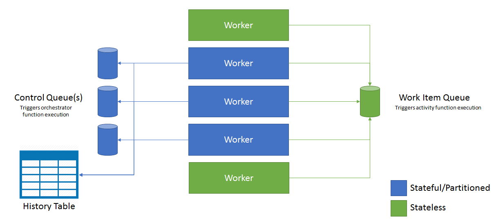

# Performance and scale in Durable Functions (Azure Functions)

To optimize performance and scalability, it's important to understand the unique scaling characteristics of [Durable Functions](durable-functions-overview.md).

To understand the scale behavior, you have to understand some of the details of the underlying Azure Storage provider used by Durable Functions.

## History table

The history table is an Azure Storage table that contains the history events for all orchestration instances. As instances run, new rows are added to this table. The partition key of this table is derived from the instance ID of the orchestration. These values are random in most cases, which ensures optimal distribution of internal partitions in Azure Storage.

## Internal queue triggers

Orchestrator functions and activity functions are both triggered by internal queues in the function app's default storage account. There are two types of queues in Durable Functions: the **control queue** and the **work item queue**.

### The work item queue

There is one work item queue per task hub in Durable Functions. This is a basic queue and behaves similarly to any other `queueTrigger` queue in Azure Functions. This queue is used to trigger stateless *activity functions*. When a Durable Functions application scales out to multiple VMs, these VMs all compete to acquire work from the work-item queue.

### Control queue(s)

The *control queue* is more sophisticated than the simpler work-item queue. It's used to trigger the stateful orchestrator functions. Because the orchestrator function instances are stateful singletons, it's not possible to use a competing consumer model to distribute load across VMs. Instead, orchestrator messages are load-balanced across multiple control queues. More details on this in subsequent sections.

Control queues contain a variety of orchestration lifecycle message types. Examples include [orchestrator control messages](durable-functions-instance-management.md), activity function *response* messages, and timer messages.

## Orchestrator scale-out

Activity functions are stateless and scale out automatically by adding VMs. Orchestrator functions, on the other hand, are *partitioned* across one or more control queues. The number of control queues is fixed and cannot be changed after you start creating load.

When scaling out to multiple function host instances (typically on different VMs), each instance acquires a lock on one of the control queues. This lock ensures that an orchestration instance only runs on a single VM at a time. This means that if a task hub is configured with three control queues, orchestration instances can be load-balanced across as many as three VMs. Additional VMs can be added to increase capacity for activity function execution.  But the additional resources will not be used to run orchestrator functions.

The following diagram illustrates how the Azure Functions host interacts with the storage entities in a scaled out environment.

As you can see, all VMs can compete for messages on the work item queue. However, only three VMs can acquire messages from control queues, and each VM locks a single control queue.

Orchestration instances are distributed across control queue instances by running an internal hash function against the orchestration's instance ID. Instance IDs are auto-generated and random by default that ensures that instances are balanced across all available control queues. The current default number of supported control queue partitions is **4**.

> [!NOTE]
> It's not currently possible to configure the number of partitions in Azure Functions. [Work to support this configuration option is being tracked](https://github.com/Azure/azure-functions-durable-extension/issues/73).

In general, orchestrator functions are intended to be lightweight and should not need a lot of computing power. For this reason, it is not necessary to create a large number of control queue partitions to get great throughput. Rather, most of the heavy work is done in stateless activity functions, which can be scaled out infinitely.

## Auto-scale

As with all Azure Functions running in the Consumption plan, Durable Functions support auto-scale via the [Azure Functions scale-controller](https://docs.microsoft.com/azure/azure-functions/functions-scale#runtime-scaling). The Scale Controller monitors the length of the work-item queue and each of the control queues, adding or removing VM resources accordingly. If the control queue lengths are increasing over time, the scale controller will continue adding instances until it reaches the control queue partition count. If work item queue lengths are increasing over time, the scale controller will continue adding VM resources until it can match the load, regardless of the control queue partition count.

## Thread usage

Orchestrator functions are executed on a single thread. This is required to ensure that orchestrator function execution is deterministic. With this in mind, it's important to never keep the orchestrator function thread unnecessarily busy with tasks such as I/O (which is forbidden for a variety of reasons), blocking, or spinning operations. Any work which may require I/O, blocking, or multiple threads should be moved into activity functions.

Activity functions have all the same behaviors as regular queue-triggered functions. This means they can safely do I/O, execute CPU intensive operations, and use multiple threads. Because activity triggers are stateless, they can freely scale out to an unbounded number of VMs.

## Next steps

> [!div class="nextstepaction"]
> [Install the Durable Functions extension and samples](durable-functions-install.md)
