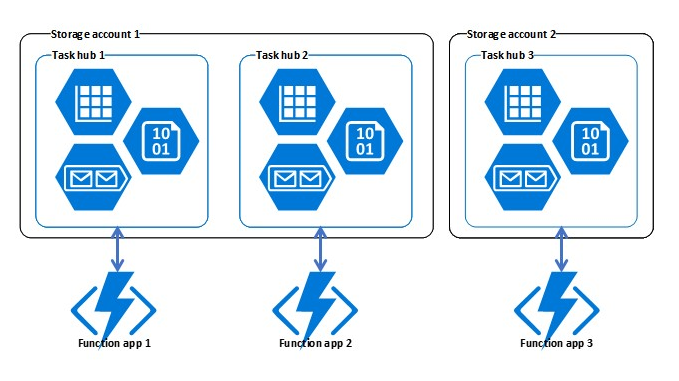

# Task hubs in Durable Functions (Azure Functions)

A *task hub* in [Durable Functions](durable-functions-overview.md) is a logical container for Azure Storage resources that are used for orchestrations. Orchestrator and activity functions can only interact with each other when they belong to the same task hub.

Each function app has a separate task hub. If multiple function apps share a storage account, the storage account contains multiple task hubs. The following diagram illustrates one task hub per function app in shared and dedicated storage accounts.



## Azure Storage resources

A task hub consists of the following storage resources: 

* One or more control queues.
* One work-item queue.
* One history table.
* One instances table.
* One storage container containing one or more lease blobs.

All of these resources are created automatically in the default Azure Storage account when orchestrator or activity functions run or are scheduled to run. The [Performance and Scale](durable-functions-perf-and-scale.md) article explains how these resources are used.

## Task hub names

Task hubs are identified by a name that is declared in the *host.json* file, as shown in the following example:

```json
{
  "durableTask": {
    "HubName": "MyTaskHub"
  }
}
```

Task hub names must start with a letter and consist of only letters and numbers. If not specified, the default name is **DurableFunctionsHub**.

> [!NOTE]
> The name is what differentiates one task hub from another when there are multiple task hubs in a shared storage account. If you have multiple function apps sharing a shared storage account, you have to configure different names for each task hub in the *host.json* files.

## Next steps

> [!div class="nextstepaction"]
> [Learn how to handle versioning](durable-functions-versioning.md)
