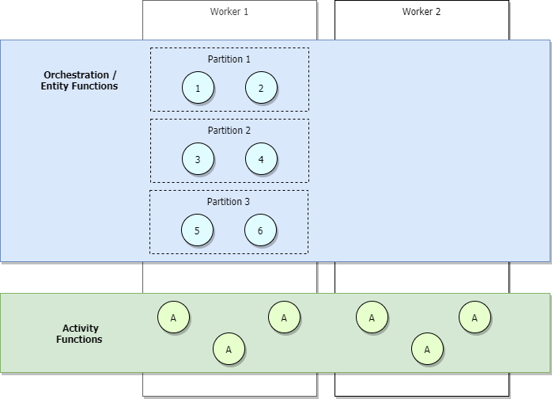
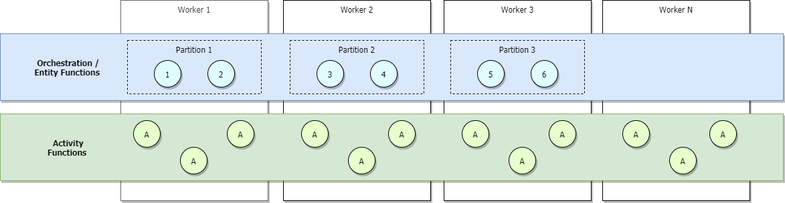
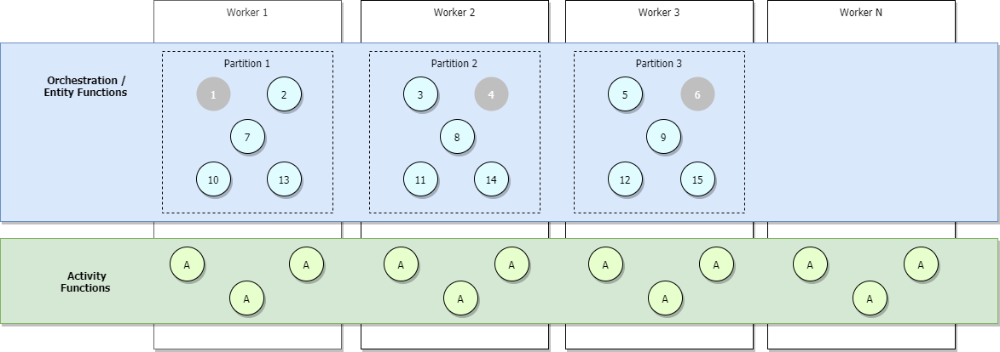

# Azure Storage provider (Azure Functions)

This document describes the characteristics of the Durable Functions Azure Storage provider, with a focus on performance and scalability aspects. The Azure Storage provider is the default provider. It stores instance states and queues in an Azure Storage (classic) account.

> [!NOTE]
> For more information on the supported storage providers for Durable Functions and how they compare, see the [Durable Functions storage providers](durable-functions-storage-providers.md) documentation.

In the Azure Storage provider, all function execution is driven by Azure Storage queues. Orchestration and entity status and history are stored in Azure Tables. Azure Blobs and blob leases are used to distribute orchestration instances and entities across multiple app instances (also known as *workers* or simply *VMs*). This section goes into more detail on the various Azure Storage artifacts and how they impact performance and scalability.

## Storage representation

A [task hub](durable-functions-task-hubs.md) durably persists all instance states and all messages. For a quick overview of how these are used to track the progress of an orchestration, see the [task hub execution example](durable-functions-task-hubs.md#execution-example).

The Azure Storage provider represents the task hub in storage using the following components:

* Between two and three Azure Tables. Two tables are used to represent histories and instance states. If the Table Partition Manager is enabled, then a third table is introduced to store partition information.
* One Azure Queue stores the activity messages.
* One or more Azure Queues store the instance messages. Each of these so-called *control queues* represents a [partition](durable-functions-perf-and-scale.md#partition-count) that is assigned a subset of all instance messages, based on the hash of the instance ID.
* A few extra blob containers used for lease blobs and/or large messages.

For example, a task hub named `xyz` with `PartitionCount = 4` contains the following queues and tables:


Next, we describe these components and the role they play in more detail.

### History table

The **History** table is an Azure Storage table that contains the history events for all orchestration instances within a task hub. The name of this table is in the form *TaskHubName*History. As instances run, new rows are added to this table. The partition key of this table is derived from the instance ID of the orchestration. Instance IDs are random by default, ensuring optimal distribution of internal partitions in Azure Storage. The row key for this table is a sequence number used for ordering the history events.

When an orchestration instance needs to run, the corresponding rows of the History table are loaded into memory using a range query within a single table partition. These *history events* are then replayed into the orchestrator function code to get it back into its previously checkpointed state. The use of execution history to rebuild state in this way is influenced by the [Event Sourcing pattern](/azure/architecture/patterns/event-sourcing).

> [!TIP]
> Orchestration data stored in the History table includes output payloads from activity and sub-orchestrator functions. Payloads from external events are also stored in the History table. Because the full history is loaded into memory every time an orchestrator needs to execute, a large enough history can result in significant memory pressure on a given VM. The length and size of the orchestration history can be reduced by splitting large orchestrations into multiple sub-orchestrations or by reducing the size of outputs returned by the activity and sub-orchestrator functions it calls. Alternatively, you can reduce memory usage by lowering per-VM [concurrency throttles](durable-functions-perf-and-scale.md#concurrency-throttles) to limit how many orchestrations are loaded into memory concurrently.

### Instances table

The **Instances** table contains the statuses of all orchestration and entity instances within a task hub. As instances are created, new rows are added to this table. The partition key of this table is the orchestration instance ID or entity key and the row key is an empty string. There is one row per orchestration or entity instance.

This table is used to satisfy [instance query requests from code](durable-functions-instance-management.md#query-instances) as well as [status query HTTP API](durable-functions-http-api.md#get-instance-status) calls. It is kept eventually consistent with the contents of the **History** table mentioned previously. The use of a separate Azure Storage table to efficiently satisfy instance query operations in this way is influenced by the [Command and Query Responsibility Segregation (CQRS) pattern](/azure/architecture/patterns/cqrs).

> [!TIP]
> The partitioning of the *Instances* table allows it to store millions of orchestration instances without any noticeable impact on runtime performance or scale. However, the number of instances can have a significant impact on [multi-instance query](durable-functions-instance-management.md#query-all-instances) performance. To control the amount of data stored in these tables, consider periodically [purging old instance data](durable-functions-instance-management.md#purge-instance-history).

### Partitions table

> [!Note]
> This table is shown in the task hub only when `Table Partition Manager` is enabled. To apply it, configure `useTablePartitionManagement` setting in your app's [host.json](durable-functions-bindings.md?tabs=2x-durable-functions#host-json).

The **Partitions** table stores the status of partitions for the Durable Functions app and is used to distribute partitions across your app's workers. There is one row per partition.

### Queues

Orchestrator, entity, and activity functions are all triggered by internal queues in the function app's task hub. Using queues in this way provides reliable "at-least-once" message delivery guarantees. There are two types of queues in Durable Functions: the **control queue** and the **work-item queue**.

#### The work-item queue

There is one work-item queue per task hub in Durable Functions. It's a basic queue and behaves similarly to any other `queueTrigger` queue in Azure Functions. This queue is used to trigger stateless *activity functions* by dequeueing a single message at a time. Each of these messages contains activity function inputs and additional metadata, such as which function to execute. When a Durable Functions application scales out to multiple VMs, these VMs all compete to acquire tasks from the work-item queue.

#### Control queue(s)

There are multiple *control queues* per task hub in Durable Functions. A *control queue* is more sophisticated than the simpler work-item queue. Control queues are used to trigger the stateful orchestrator and entity functions. Because the orchestrator and entity function instances are stateful singletons, it's important that each orchestration or entity is only processed by one worker at a time. To achieve this constraint, each orchestration instance or entity is assigned to a single control queue. These control queues are load balanced across workers to ensure that each queue is only processed by one worker at a time. More details on this behavior can be found in subsequent sections.

Control queues contain a variety of orchestration lifecycle message types. Examples include [orchestrator control messages](durable-functions-instance-management.md), activity function *response* messages, and timer messages. As many as 32 messages will be dequeued from a control queue in a single poll. These messages contain payload data as well as metadata including which orchestration instance it is intended for. If multiple dequeued messages are intended for the same orchestration instance, they will be processed as a batch.

Control queue messages are constantly polled using a background thread. The batch size of each queue poll is controlled by the `controlQueueBatchSize` setting in host.json and has a default of 32 (the maximum value supported by Azure Queues). The maximum number of prefetched control-queue messages that are buffered in memory is controlled by the `controlQueueBufferThreshold` setting in host.json. The default value for `controlQueueBufferThreshold` varies depending on a variety of factors, including the type of hosting plan. For more information on these settings, see the [host.json schema](../functions-host-json.md#durabletask) documentation.

> [!TIP]
> Increasing the value for `controlQueueBufferThreshold` allows a single orchestration or entity to process events faster. However, increasing this value can also result in higher memory usage. The higher memory usage is partly due to pulling more messages off the queue and partly due to fetching more orchestration histories into memory. Reducing the value for `controlQueueBufferThreshold` can therefore be an effective way to reduce memory usage.

#### Queue polling

The durable task extension implements a random exponential back-off algorithm to reduce the effect of idle-queue polling on storage transaction costs. When a message is found, the runtime immediately checks for another message. When no message is found, it waits for a period of time before trying again. After subsequent failed attempts to get a queue message, the wait time continues to increase until it reaches the maximum wait time, which defaults to 30 seconds.

The maximum polling delay is configurable via the `maxQueuePollingInterval` property in the [host.json file](../functions-host-json.md#durabletask). Setting this property to a higher value could result in higher message processing latencies. Higher latencies would be expected only after periods of inactivity. Setting this property to a lower value could result in [higher storage costs](durable-functions-billing.md#azure-storage-transactions) due to increased storage transactions.

> [!NOTE]
> When running in the Azure Functions Consumption and Premium plans, the [Azure Functions Scale Controller](../event-driven-scaling.md) will poll each control and work-item queue once every 10 seconds. This additional polling is necessary to determine when to activate function app instances and to make scale decisions. At the time of writing, this 10 second interval is constant and cannot be configured.

#### Orchestration start delays

Orchestrations instances are started by putting an `ExecutionStarted` message in one of the task hub's control queues. Under certain conditions, you may observe multi-second delays between when an orchestration is scheduled to run and when it actually starts running. During this time interval, the orchestration instance remains in the `Pending` state. There are two potential causes of this delay:

* **Backlogged control queues**: If the control queue for this instance contains a large number of messages, it may take time before the `ExecutionStarted` message is received and processed by the runtime. Message backlogs can happen when orchestrations are processing lots of events concurrently. Events that go into the control queue include orchestration start events, activity completions, durable timers, termination, and external events. If this delay happens under normal circumstances, consider creating a new task hub with a larger number of partitions. Configuring more partitions will cause the runtime to create more control queues for load distribution. Each partition corresponds to 1:1 with a control queue, with a maximum of 16 partitions.

* **Back off polling delays**: Another common cause of orchestration delays is the [previously described back-off polling behavior for control queues](#queue-polling). However, this delay is only expected when an app is scaled out to two or more instances. If there is only one app instance or if the app instance that starts the orchestration is also the same instance that is polling the target control queue, then there will not be a queue polling delay. Back off polling delays can be reduced by updating the **host.json** settings, as described previously.

### Blobs

In most cases, Durable Functions doesn't use Azure Storage Blobs to persist data. However, queues and tables have [size limits](../../azure-resource-manager/management/azure-subscription-service-limits.md#azure-queue-storage-limits) that can prevent Durable Functions from persisting all of the required data into a storage row or queue message. For example, when a piece of data that needs to be persisted to a queue is greater than 45 KB when serialized, Durable Functions will compress the data and store it in a blob instead. When persisting data to blob storage in this way, Durable Function stores a reference to that blob in the table row or queue message. When Durable Functions needs to retrieve the data it will automatically fetch it from the blob. These blobs are stored in the blob container `<taskhub>-largemessages`.

#### Performance considerations

The extra compression and blob operation steps for large messages can be expensive in terms of CPU and I/O latency costs. Additionally, Durable Functions needs to load persisted data in memory, and may do so for many different function executions at the same time. As a result, persisting large data payloads can cause high memory usage as well. To minimize memory overhead, consider persisting large data payloads manually (for example, in blob storage) and instead pass around references to this data. This way your code can load the data only when needed to avoid redundant loads during [orchestrator function replays](durable-functions-orchestrations.md#reliability). However, storing payloads to local disks is *not* recommended since on-disk state is not guaranteed to be available since functions may execute on different VMs throughout their lifetimes.

### Storage account selection

The queues, tables, and blobs used by Durable Functions are created in a configured Azure Storage account. The account to use can be specified using the `durableTask/storageProvider/connectionStringName` setting (or `durableTask/azureStorageConnectionStringName` setting in Durable Functions 1.x) in the **host.json** file.

#### Durable Functions 2.x

```json
{
  "extensions": {
    "durableTask": {
      "storageProvider": {
        "connectionStringName": "MyStorageAccountAppSetting"
      }
    }
  }
}
```

#### Durable Functions 1.x

```json
{
  "extensions": {
    "durableTask": {
      "azureStorageConnectionStringName": "MyStorageAccountAppSetting"
    }
  }
}
```

If not specified, the default `AzureWebJobsStorage` storage account is used. For performance-sensitive workloads, however, configuring a non-default storage account is recommended. Durable Functions uses Azure Storage heavily, and using a dedicated storage account isolates Durable Functions storage usage from the internal usage by the Azure Functions host.

> [!NOTE]
> Standard general purpose Azure Storage accounts are required when using the Azure Storage provider. All other storage account types are not supported. We highly recommend using legacy v1 general purpose storage accounts for Durable Functions. The newer v2 storage accounts can be significantly more expensive for Durable Functions workloads. For more information on Azure Storage account types, see the [Storage account overview](../../storage/common/storage-account-overview.md) documentation.

### Orchestrator scale-out

While activity functions can be scaled out infinitely by adding more VMs elastically, individual orchestrator instances and entities are constrained to inhabit a single partition and the maximum number of partitions is bounded by the `partitionCount` setting in your `host.json`.

> [!NOTE]
> Generally speaking, orchestrator functions are intended to be lightweight and should not require large amounts of computing power. It is therefore not necessary to create a large number of control-queue partitions to get great throughput for orchestrations. Most of the heavy work should be done in stateless activity functions, which can be scaled out infinitely.

The number of control queues is defined in the **host.json** file. The following example host.json snippet sets the `durableTask/storageProvider/partitionCount` property (or `durableTask/partitionCount` in Durable Functions 1.x) to `3`. Note that there are as many control queues as there are partitions.

#### Durable Functions 2.x

```json
{
  "extensions": {
    "durableTask": {
      "storageProvider": {
        "partitionCount": 3
      }
    }
  }
}
```

#### Durable Functions 1.x

```json
{
  "extensions": {
    "durableTask": {
      "partitionCount": 3
    }
  }
}
```

A task hub can be configured with between 1 and 16 partitions. If not specified, the default partition count is **4**.

During low traffic scenarios, your application will be scaled-in, so partitions will be managed by a small number of workers. As an example, consider the diagram below.



In the previous diagram, we see that orchestrators 1 through 6 are load balanced across partitions. Similarly, partitions, like activities, are load balanced across workers. Partitions are load-balanced across workers regardless of the number of orchestrators that get started.

If you're running on the Azure Functions Consumption or Elastic Premium plans, or if you have load-based auto-scaling configured, more workers will get allocated as traffic increases and partitions will eventually load balance across all workers. If we continue to scale out, eventually each partition will eventually be managed by a single worker. Activities, on the other hand, will continue to be load-balanced across all workers. This is shown in the image below.



The upper-bound of the maximum number of concurrent _active_ orchestrations at *any given time* is equal to the number of workers allocated to your application _times_ your value for `maxConcurrentOrchestratorFunctions`. This upper-bound can be made more precise when your partitions are fully scaled-out across workers. When fully scaled-out, and since each worker will have only a single Functions host instance, the maximum number of _active_ concurrent orchestrator instances will be equal to your number of partitions _times_ your value for `maxConcurrentOrchestratorFunctions`.

> [!NOTE]
> In this context, *active* means that an orchestration or entity is loaded into memory and processing *new events*. If the orchestration or entity is waiting for more events, such as the return value of an activity function, it gets unloaded from memory and is no longer considered *active*. Orchestrations and entities will be subsequently reloaded into memory only when there are new events to process. There's no practical maximum number of *total* orchestrations or entities that can run on a single VM, even if they're all in the "Running" state. The only limitation is the number of *concurrently active* orchestration or entity instances.

The image below illustrates a fully scaled-out scenario where more orchestrators are added but some are inactive, shown in grey.



During scale-out, control queue leases may be redistributed across Functions host instances to ensure that partitions are evenly distributed. These leases are internally implemented as Azure Blob storage leases and ensure that any individual orchestration instance or entity only runs on a single host instance at a time. If a task hub is configured with three partitions (and therefore three control queues), orchestration instances and entities can be load-balanced across all three lease-holding host instances. Additional VMs can be added to increase capacity for activity function execution.

The following diagram illustrates how the Azure Functions host interacts with the storage entities in a scaled out environment.


As shown in the previous diagram, all VMs compete for messages on the work-item queue. However, only three VMs can acquire messages from control queues, and each VM locks a single control queue.

Orchestration instances and entities are distributed across all control queue instances. The distribution is done by hashing the instance ID of the orchestration or the entity name and key pair. Orchestration instance IDs by default are random GUIDs, ensuring that instances are equally distributed across all control queues.

Generally speaking, orchestrator functions are intended to be lightweight and should not require large amounts of computing power. It is therefore not necessary to create a large number of control queue partitions to get great throughput for orchestrations. Most of the heavy work should be done in stateless activity functions, which can be scaled out infinitely.

## Extended sessions

Extended sessions is a [caching mechanism](durable-functions-perf-and-scale.md#instance-caching) that keeps orchestrations and entities in memory even after they finish processing messages. The typical effect of enabling extended sessions is reduced I/O against the underlying durable store and overall improved throughput.

You can enable extended sessions by setting `durableTask/extendedSessionsEnabled` to `true` in the **host.json** file. The `durableTask/extendedSessionIdleTimeoutInSeconds` setting can be used to control how long an idle session will be held in memory:

**Functions 2.0**
```json
{
  "extensions": {
    "durableTask": {
      "extendedSessionsEnabled": true,
      "extendedSessionIdleTimeoutInSeconds": 30
    }
  }
}
```

**Functions 1.0**
```json
{
  "durableTask": {
    "extendedSessionsEnabled": true,
    "extendedSessionIdleTimeoutInSeconds": 30
  }
}
```

There are two potential downsides of this setting to be aware of:

1. There's an overall increase in function app memory usage because idle instances are not unloaded from memory as quickly.
2. There can be an overall decrease in throughput if there are many concurrent, distinct, short-lived orchestrator or entity function executions.

As an example, if `durableTask/extendedSessionIdleTimeoutInSeconds` is set to 30 seconds, then a short-lived orchestrator or entity function episode that executes in less than 1 second still occupies memory for 30 seconds. It also counts against the `durableTask/maxConcurrentOrchestratorFunctions` quota mentioned previously, potentially preventing other orchestrator or entity functions from running.

The specific effects of extended sessions on orchestrator and entity functions are described in the next sections.

> [!NOTE]
> Extended sessions are currently only supported in .NET languages, like C# or F#. Setting `extendedSessionsEnabled` to `true` for other platforms can lead to runtime issues, such as silently failing to execute activity and orchestration-triggered functions.

### Orchestrator function replay

As mentioned previously, orchestrator functions are replayed using the contents of the **History** table. By default, the orchestrator function code is replayed every time a batch of messages are dequeued from a control queue. Even if you are using the fan-out, fan-in pattern and are awaiting for all tasks to complete (for example, using `Task.WhenAll()` in .NET, `context.df.Task.all()` in JavaScript, or `context.task_all()` in Python), there will be replays that occur as batches of task responses are processed over time. When extended sessions are enabled, orchestrator function instances are held in memory longer and new messages can be processed without a full history replay.

The performance improvement of extended sessions is most often observed in the following situations:

* When there are a limited number of orchestration instances running concurrently.
* When orchestrations have large number of sequential actions (for example, hundreds of activity function calls) that complete quickly.
* When orchestrations fan-out and fan-in a large number of actions that complete around the same time.
* When orchestrator functions need to process large messages or do any CPU-intensive data processing.

In all other situations, there is typically no observable performance improvement for orchestrator functions.

> [!NOTE]
> These settings should only be used after an orchestrator function has been fully developed and tested. The default aggressive replay behavior can useful for detecting [orchestrator function code constraints](durable-functions-code-constraints.md) violations at development time, and is therefore disabled by default.

### Performance targets

The following table shows the expected *maximum* throughput numbers for the scenarios described in the [Performance Targets](durable-functions-perf-and-scale.md#performance-targets) section of the [Performance and Scale](durable-functions-perf-and-scale.md) article. 

"Instance" refers to a single instance of an orchestrator function running on a single small ([A1](../../virtual-machines/sizes-previous-gen.md)) VM in Azure App Service. In all cases, it is assumed that [extended sessions](#orchestrator-function-replay) are enabled. Actual results may vary depending on the CPU or I/O work performed by the function code.

| Scenario | Maximum throughput |
|-|-|
| Sequential activity execution | 5 activities per second, per instance |
| Parallel activity execution (fan-out) | 100 activities per second, per instance |
| Parallel response processing (fan-in) | 150 responses per second, per instance |
| External event processing | 50 events per second, per instance |
| Entity operation processing | 64 operations per second |

If you are not seeing the throughput numbers you expect and your CPU and memory usage appears healthy, check to see whether the cause is related to [the health of your storage account](../../storage/common/storage-monitoring-diagnosing-troubleshooting.md#troubleshooting-guidance). The Durable Functions extension can put significant load on an Azure Storage account and sufficiently high loads may result in storage account throttling.

> [!TIP]
> In some cases you can significantly increase the throughput of external events, activity fan-in, and entity operations by increasing the value of the `controlQueueBufferThreshold` setting in **host.json**. Increasing this value beyond its default causes the Durable Task Framework storage provider to use more memory to prefetch these events more aggressively, reducing delays associated with dequeueing messages from the Azure Storage control queues. For more information, see the [host.json](durable-functions-bindings.md#host-json) reference documentation.

### High throughput processing

The architecture of the Azure Storage backend puts certain limitations on the maximum theoretical performance and scalability of Durable Functions. If your testing shows that Durable Functions on Azure Storage won't meet your throughput requirements, you should consider instead using the [Netherite storage provider for Durable Functions](durable-functions-storage-providers.md#netherite).

To compare the achievable throughput for various basic scenarios, see the section [Basic Scenarios](https://microsoft.github.io/durabletask-netherite/#/scenarios) of the Netherite storage provider documentation.

The Netherite storage backend was designed and developed by [Microsoft Research](https://www.microsoft.com/research). It uses [Azure Event Hubs](../../event-hubs/event-hubs-about.md) and the [FASTER](https://www.microsoft.com/research/project/faster/) database technology on top of [Azure Page Blobs](../../storage/blobs/storage-blob-pageblob-overview.md). The design of Netherite enables significantly higher-throughput processing of orchestrations and entities compared to other providers. In some benchmark scenarios, throughput was shown to increase by more than an order of magnitude when compared to the default Azure Storage provider.

For more information on the supported storage providers for Durable Functions and how they compare, see the [Durable Functions storage providers](durable-functions-storage-providers.md) documentation.

## Next steps

> [!div class="nextstepaction"]
> [Learn about disaster recovery and geo-distribution](durable-functions-disaster-recovery-geo-distribution.md)
