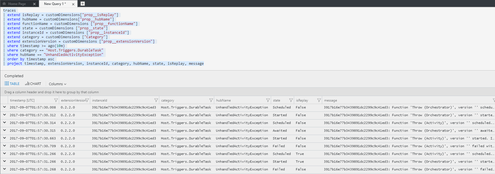
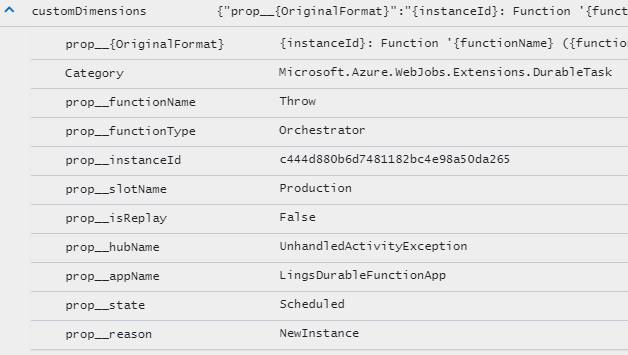

# Durable Functions patterns and technical concepts (Azure Functions)

Durable Functions is an extension of [Azure Functions](../functions-overview.md) and [Azure WebJobs](../../app-service/web-sites-create-web-jobs.md). You can use Durable Functions to write stateful functions in a serverless environment. The extension manages state, checkpoints, and restarts for you. 

This article provides detailed information about the behaviors of the Durable Functions extension for Azure Functions and common implementation patterns.

> [!NOTE]
> Durable Functions is an advanced extension for Azure Functions that isn't appropriate for all applications. This article assumes that you have a strong familiarity with concepts in [Azure Functions](../functions-overview.md) and the challenges involved in serverless application development.

## Patterns

This section describes some typical application patterns that can benefit from Durable Functions.

### <a name="chaining"></a>Pattern #1: Function chaining

*Function chaining* refers to the pattern of executing a sequence of functions in a specific order. Often the output of one function needs to be applied to the input of another function.


You can use Durable Functions to implement this pattern concisely in code.

#### C# script

```csharp
public static async Task<object> Run(DurableOrchestrationContext context)
{
    try
    {
        var x = await context.CallActivityAsync<object>("F1");
        var y = await context.CallActivityAsync<object>("F2", x);
        var z = await context.CallActivityAsync<object>("F3", y);
        return  await context.CallActivityAsync<object>("F4", z);
    }
    catch (Exception)
    {
        // Error handling/compensation goes here.
    }
}
```

> [!NOTE]
> There are subtle differences between writing a precompiled durable function in C# and writing a precompiled durable function as shown in the C# script sample. A C# precompiled function requires durable parameters to be decorated with respective attributes. An example is the `[OrchestrationTrigger]` attribute for the `DurableOrchestrationContext` parameter. If the parameters aren't properly decorated, the runtime can't inject the variables to the function. An error occurs. For more examples, see [these GitHub samples](https://github.com/Azure/azure-functions-durable-extension/blob/master/samples).

#### JavaScript (Azure Functions 2.x only)

```javascript
const df = require("durable-functions");

module.exports = df.orchestrator(function*(context) {
    const x = yield context.df.callActivity("F1");
    const y = yield context.df.callActivity("F2", x);
    const z = yield context.df.callActivity("F3", y);
    return yield context.df.callActivity("F4", z);
});
```

The values **F1**, **F2**, **F3**, and **F4** are the names of other functions in the function app. Implement control flow by using normal imperative coding constructs. Code executes top-down and can involve existing language control flow semantics, like conditionals and loops. You can include error handling logic in try/catch/finally blocks.

The `context` parameter [DurableOrchestrationContext] \(.NET\) and the `context.df` object (JavaScript) provide methods for invoking other functions by name, passing parameters, and returning function output. Each time the code calls `await` (C#) or `yield` (JavaScript), the Durable Functions framework checkpoints the progress of the current function instance. If the process or VM recycles midway through the execution, the function instance resumes from the previous `await` or `yield` call. More on this restart behavior later.

> [!NOTE]
> The `context` object in JavaScript represents the [function context](../functions-reference-node.md#context-object) as a whole, not the [DurableOrchestrationContext] parameter.

### <a name="fan-in-out"></a>Pattern #2: Fan-out/fan-in

*Fan-out/fan-in* refers to the pattern of executing multiple functions in parallel and then waiting for all the functions to finish. Often, some aggregation work is done on results that are returned from the functions.


With normal functions, you can fan out by having the function send multiple messages to a queue. However, fanning back in is much more challenging. To fan in, you'd have to write code to track when the queue-triggered functions end and store function outputs. The Durable Functions extension handles this pattern with relatively simple code.

#### C# script

```csharp
public static async Task Run(DurableOrchestrationContext context)
{
    var parallelTasks = new List<Task<int>>();

    // Get a list of N work items to process in parallel.
    object[] workBatch = await context.CallActivityAsync<object[]>("F1");
    for (int i = 0; i < workBatch.Length; i++)
    {
        Task<int> task = context.CallActivityAsync<int>("F2", workBatch[i]);
        parallelTasks.Add(task);
    }

    await Task.WhenAll(parallelTasks);

    // Aggregate all N outputs and send the result to F3.
    int sum = parallelTasks.Sum(t => t.Result);
    await context.CallActivityAsync("F3", sum);
}
```

#### JavaScript (Azure Functions 2.x only)

```javascript
const df = require("durable-functions");

module.exports = df.orchestrator(function*(context) {
    const parallelTasks = [];

    // Get a list of N work items to process in parallel.
    const workBatch = yield context.df.callActivity("F1");
    for (let i = 0; i < workBatch.length; i++) {
        parallelTasks.push(context.df.callActivity("F2", workBatch[i]));
    }

    yield context.df.Task.all(parallelTasks);

    // Aggregate all N outputs and send the result to F3.
    const sum = parallelTasks.reduce((prev, curr) => prev + curr, 0);
    yield context.df.callActivity("F3", sum);
});
```

The fan-out work is distributed to multiple instances of function `F2`. The work is tracked by using a dynamic list of tasks. The .NET `Task.WhenAll` API or JavaScript `context.df.Task.all` API is called to wait for all the called functions to finish. Then, the `F2` function outputs are aggregated from the dynamic task list and passed on to the `F3` function.

The automatic checkpointing that happens at the `await` or `yield` call on `Task.WhenAll` or `context.df.Task.all` ensures that any midway crash or reboot doesn't require a restart of any already completed tasks.

### <a name="async-http"></a>Pattern #3: Async HTTP APIs

The third pattern is all about the problem of coordinating the state of long-running operations with external clients. A common way to implement this pattern is by having the long-running action triggered by an HTTP call, and then redirecting the client to a status endpoint that they can poll to learn when the operation completes.


Durable Functions provides built-in APIs that simplify the code you write for interacting with long-running function executions. The quickstart samples ([C#](durable-functions-create-first-csharp.md) and [JavaScript](quickstart-js-vscode.md)) show a simple REST command that you can use to start new orchestrator function instances. After an instance is started, the extension exposes webhook HTTP APIs that query the orchestrator function status. The following example shows the REST commands to start an orchestrator and to query its status. For clarity, some details are omitted from the example.

```
> curl -X POST https://myfunc.azurewebsites.net/orchestrators/DoWork -H "Content-Length: 0" -i
HTTP/1.1 202 Accepted
Content-Type: application/json
Location: https://myfunc.azurewebsites.net/admin/extensions/DurableTaskExtension/b79baf67f717453ca9e86c5da21e03ec

{"id":"b79baf67f717453ca9e86c5da21e03ec", ...}

> curl https://myfunc.azurewebsites.net/admin/extensions/DurableTaskExtension/b79baf67f717453ca9e86c5da21e03ec -i
HTTP/1.1 202 Accepted
Content-Type: application/json
Location: https://myfunc.azurewebsites.net/admin/extensions/DurableTaskExtension/b79baf67f717453ca9e86c5da21e03ec

{"runtimeStatus":"Running","lastUpdatedTime":"2017-03-16T21:20:47Z", ...}

> curl https://myfunc.azurewebsites.net/admin/extensions/DurableTaskExtension/b79baf67f717453ca9e86c5da21e03ec -i
HTTP/1.1 200 OK
Content-Length: 175
Content-Type: application/json

{"runtimeStatus":"Completed","lastUpdatedTime":"2017-03-16T21:20:57Z", ...}
```

Because the state is managed by the Durable Functions runtime, you don't have to implement your own status-tracking mechanism.

Even though the Durable Functions extension has built-in webhooks for managing long-running orchestrations, you can implement this pattern yourself by using your own function triggers (such as HTTP, a queue, or an Azure Event Hubs instance) and the `orchestrationClient` binding. For example, you could use a queue message to trigger termination. Or you could use an HTTP trigger that's protected by an Azure Active Directory authentication policy instead of the built-in webhooks that use a generated key for authentication.

#### C#

```csharp
// HTTP-triggered function to start a new orchestrator function instance.
public static async Task<HttpResponseMessage> Run(
    HttpRequestMessage req,
    DurableOrchestrationClient starter,
    string functionName,
    ILogger log)
{
    // The function name comes from the request URL.
    // The function input comes from the request content.
    dynamic eventData = await req.Content.ReadAsAsync<object>();
    string instanceId = await starter.StartNewAsync(functionName, eventData);

    log.LogInformation($"Started orchestration with ID = '{instanceId}'.");

    return starter.CreateCheckStatusResponse(req, instanceId);
}
```

#### JavaScript (Functions 2.x only)

```javascript
// HTTP-triggered function to start a new orchestrator function instance.
const df = require("durable-functions");

module.exports = async function (context, req) {
    const client = df.getClient(context);

    // The function name comes from the request URL.
    // The function input comes from the request content.
    const eventData = req.body;
    const instanceId = await client.startNew(req.params.functionName, undefined, eventData);

    context.log(`Started orchestration with ID = '${instanceId}'.`);

    return client.createCheckStatusResponse(req, instanceId);
};
```

> [!WARNING]
> When you develop locally in JavaScript, you must set the environment variable `WEBSITE_HOSTNAME` to `localhost:<port>` (for example, `localhost:7071`) to use methods on `DurableOrchestrationClient`. For more information about this requirement, see [GitHub issue 28](https://github.com/Azure/azure-functions-durable-js/issues/28).

In .NET, the [DurableOrchestrationClient](https://azure.github.io/azure-functions-durable-extension/api/Microsoft.Azure.WebJobs.DurableOrchestrationClient.html) `starter` parameter is a value from the `orchestrationClient` output binding, which is part of the Durable Functions extension. In JavaScript, this object is returned by calling `df.getClient(context)`. These objects provide methods for starting, sending events to, terminating, and querying for new or existing orchestrator function instances.

In the previous example, an HTTP triggered-function takes in a `functionName` value from the incoming URL and passes the value to [StartNewAsync](https://azure.github.io/azure-functions-durable-extension/api/Microsoft.Azure.WebJobs.DurableOrchestrationClient.html#Microsoft_Azure_WebJobs_DurableOrchestrationClient_StartNewAsync_). The [CreateCheckStatusResponse](https://azure.github.io/azure-functions-durable-extension/api/Microsoft.Azure.WebJobs.DurableOrchestrationClient.html#Microsoft_Azure_WebJobs_DurableOrchestrationClient_CreateCheckStatusResponse_System_Net_Http_HttpRequestMessage_System_String_) binding API then returns a response that contains a `Location` header and additional information about the instance that can later be used to look up the status of the started instance or terminate it.

### <a name="monitoring"></a>Pattern #4: Monitoring

The monitor pattern refers to a flexible recurring process in a workflow. An example is polling until certain conditions are met. A regular [timer trigger](../functions-bindings-timer.md) can address a basic scenario, such as a periodic cleanup job, but its interval is static and managing instance lifetimes becomes complex. You can use Durable Functions to create flexible recurrence intervals, manage task lifetimes, and create multiple monitor processes from a single orchestration.

An example is reversing the earlier async HTTP API scenario. Instead of exposing an endpoint for an external client to monitor a long-running operation, the long-running monitor consumes an external endpoint and waits for a state change.


Using Durable Functions, in a few lines of code, you can create multiple monitors that observe arbitrary endpoints. The monitors can end execution when a condition is met or the monitors can be terminated by the [DurableOrchestrationClient](durable-functions-instance-management.md). The monitors' wait interval can be changed based on a specific condition (for example, exponential backoff.) The following code implements a basic monitor:

#### C# script

```csharp
public static async Task Run(DurableOrchestrationContext context)
{
    int jobId = context.GetInput<int>();
    int pollingInterval = GetPollingInterval();
    DateTime expiryTime = GetExpiryTime();

    while (context.CurrentUtcDateTime < expiryTime)
    {
        var jobStatus = await context.CallActivityAsync<string>("GetJobStatus", jobId);
        if (jobStatus == "Completed")
        {
            // Perform an action when a condition is met.
            await context.CallActivityAsync("SendAlert", machineId);
            break;
        }

        // Orchestration sleeps until this time.
        var nextCheck = context.CurrentUtcDateTime.AddSeconds(pollingInterval);
        await context.CreateTimer(nextCheck, CancellationToken.None);
    }

    // Perform further work here, or let the orchestration end.
}
```

#### JavaScript (Azure Functions 2.x only)

```javascript
const df = require("durable-functions");
const moment = require("moment");

module.exports = df.orchestrator(function*(context) {
    const jobId = context.df.getInput();
    const pollingInternal = getPollingInterval();
    const expiryTime = getExpiryTime();

    while (moment.utc(context.df.currentUtcDateTime).isBefore(expiryTime)) {
        const jobStatus = yield context.df.callActivity("GetJobStatus", jobId);
        if (jobStatus === "Completed") {
            // Perform an action when a condition is met.
            yield context.df.callActivity("SendAlert", machineId);
            break;
        }

        // Orchestration sleeps until this time.
        const nextCheck = moment.utc(context.df.currentUtcDateTime).add(pollingInterval, 's');
        yield context.df.createTimer(nextCheck.toDate());
    }

    // Perform further work here, or let the orchestration end.
});
```

When a request is received, a new orchestration instance is created for that job ID. The instance polls a status until a condition is met and the loop is exited. A durable timer controls the polling interval. Further work can then be performed, or the orchestration can end. When the `context.CurrentUtcDateTime` (.NET) or `context.df.currentUtcDateTime` (JavaScript) exceeds the `expiryTime`, the monitor ends.

### <a name="human"></a>Pattern #5: Human interaction

Many processes involve some kind of human interaction. The tricky thing about involving humans in an automated process is that people are not always as highly available and responsive as cloud services. Automated processes must allow for this, and they often do so by using timeouts and compensation logic.

One example of a business process that involves human interaction is an approval process. For example, approval from a manager might be required for an expense report that exceeds a certain amount. If the manager doesn't approve within 72 hours (maybe they went on vacation), an escalation process kicks in to get the approval from someone else (perhaps the manager's manager).


You can implement the pattern by using an orchestrator function. The orchestrator uses a [durable timer](durable-functions-timers.md) to request approval and escalate if timeout occurs. The orchestrator waits for an [external event](durable-functions-external-events.md), which is the notification that's generated by some human interaction.

#### C# script

```csharp
public static async Task Run(DurableOrchestrationContext context)
{
    await context.CallActivityAsync("RequestApproval");
    using (var timeoutCts = new CancellationTokenSource())
    {
        DateTime dueTime = context.CurrentUtcDateTime.AddHours(72);
        Task durableTimeout = context.CreateTimer(dueTime, timeoutCts.Token);

        Task<bool> approvalEvent = context.WaitForExternalEvent<bool>("ApprovalEvent");
        if (approvalEvent == await Task.WhenAny(approvalEvent, durableTimeout))
        {
            timeoutCts.Cancel();
            await context.CallActivityAsync("ProcessApproval", approvalEvent.Result);
        }
        else
        {
            await context.CallActivityAsync("Escalate");
        }
    }
}
```

#### JavaScript (Azure Functions 2.x only)

```javascript
const df = require("durable-functions");
const moment = require('moment');

module.exports = df.orchestrator(function*(context) {
    yield context.df.callActivity("RequestApproval");

    const dueTime = moment.utc(context.df.currentUtcDateTime).add(72, 'h');
    const durableTimeout = context.df.createTimer(dueTime.toDate());

    const approvalEvent = context.df.waitForExternalEvent("ApprovalEvent");
    if (approvalEvent === yield context.df.Task.any([approvalEvent, durableTimeout])) {
        durableTimeout.cancel();
        yield context.df.callActivity("ProcessApproval", approvalEvent.result);
    } else {
        yield context.df.callActivity("Escalate");
    }
});
```

To create the durable timer, call `context.CreateTimer` (.NET) or `context.df.createTimer` (JavaScript). The notification is received by `context.WaitForExternalEvent` (.NET) or `context.df.waitForExternalEvent` (JavaScript). Then, `Task.WhenAny` (.NET) or `context.df.Task.any` (JavaScript) is called to decide whether to escalate (timeout happens first) or process the approval (the approval is received before timeout).

An external client can deliver the event notification to a waiting orchestrator function by using either the [built-in HTTP APIs](durable-functions-http-api.md#raise-event) or by using the [DurableOrchestrationClient.RaiseEventAsync](https://azure.github.io/azure-functions-durable-extension/api/Microsoft.Azure.WebJobs.DurableOrchestrationClient.html#Microsoft_Azure_WebJobs_DurableOrchestrationClient_RaiseEventAsync_System_String_System_String_System_Object_) API from another function:

```csharp
public static async Task Run(string instanceId, DurableOrchestrationClient client)
{
    bool isApproved = true;
    await client.RaiseEventAsync(instanceId, "ApprovalEvent", isApproved);
}
```

```javascript
const df = require("durable-functions");

module.exports = async function (context) {
    const client = df.getClient(context);
    const isApproved = true;
    await client.raiseEvent(instanceId, "ApprovalEvent", isApproved);
};
```

## The technology

Behind the scenes, the Durable Functions extension is built on top of the [Durable Task Framework](https://github.com/Azure/durabletask), an open-source library on GitHub that's used to build durable task orchestrations. Much like how Azure Functions is the serverless evolution of Azure WebJobs, Durable Functions is the serverless evolution of the Durable Task Framework. The Durable Task Framework is used heavily both within and outside Microsoft to automate mission-critical processes. It's a natural fit for the serverless Azure Functions environment.

### Event sourcing, checkpointing, and replay

Orchestrator functions reliably maintain their execution state by using a design pattern known as [event sourcing](https://docs.microsoft.com/azure/architecture/patterns/event-sourcing). Instead of directly storing the current state of an orchestration, the durable extension uses an append-only store to record the full series of actions that the function orchestration takes. An append-only store has many benefits compared to "dumping" the full runtime state, including improving performance, scalability, and responsiveness. Other benefits include providing eventual consistency for transactional data and maintaining full audit trails and history. The audit trails themselves enable reliable compensating actions.

Durable Functions uses event sourcing transparently. Behind the scenes, the `await` (C#) or `yield` (JavaScript) operator in an orchestrator function yields control of the orchestrator thread back to the Durable Task Framework dispatcher. The dispatcher then commits any new actions that the orchestrator function scheduled (such as calling one or more child functions or scheduling a durable timer) to storage. The transparent commit action appends to the execution history of the orchestration instance. The history is stored in a storage table. The commit action then adds messages to a queue to schedule the actual work. At this point, the orchestrator function can be unloaded from memory. Billing for the orchestrator function stops if you're using the Azure Functions Consumption plan. When there's more work to do, the function is restarted and its state is reconstructed.

When an orchestration function is given more work to do (for example, a response message is received or a durable timer expires), the orchestrator wakes up again and re-executes the entire function from the start to rebuild the local state. During the replay, if the code tries to call a function (or do any other async work), the Durable Task Framework consults with the execution history of the current orchestration. If it finds that the [activity function](durable-functions-types-features-overview.md#activity-functions) has already executed and yielded some result, it replays that function's result and the orchestrator code continues running. Replay continues happening until the function code gets to a point where either it's finished or it has scheduled new async work.

### Orchestrator code constraints

The replay behavior of orchestrator code creates constraints on the type of code that can be written in an orchestrator function. For example, orchestrator code must be deterministic because it will be replayed multiple times and it must produce the same result each time. For the complete list of constraints, see [Orchestrator code constraints](durable-functions-checkpointing-and-replay.md#orchestrator-code-constraints).

## Monitoring and diagnostics

The Durable Functions extension automatically emits structured tracking data to [Application Insights](../functions-monitoring.md) when you configure the function app with an Azure Application Insights instrumentation key. The tracking data can be used to monitor the actions and progress of your orchestrations.

Here's an example of what the Durable Functions tracking events look like in the Application Insights portal when you use [Application Insights Analytics](../../application-insights/app-insights-analytics.md):



You can find useful structured data in the `customDimensions` field in each log entry. Here's an example of an  entry fully expanded:



Because of the replay behavior of the Durable Task Framework dispatcher, you can expect to see redundant log entries for replayed actions. Redundant log entries can be useful to understand the replay behavior of the core engine. The [Diagnostics](durable-functions-diagnostics.md) article shows sample queries that filter out replay logs so you can see just the "real-time" logs.

## Storage and scalability

The Durable Functions extension uses Azure Storage queues, tables, and blobs to persist execution history state and trigger function execution. You can use the default storage account for the function app, or you can configure a separate storage account. You might want a separate account due to storage throughput limits. The orchestrator code you write doesn't need to (and shouldn't) interact with the entities in these storage accounts. The entities are managed directly by the Durable Task Framework as an implementation detail.

Orchestrator functions schedule activity functions and receive their responses via internal queue messages. When a function app runs in the Azure Functions Consumption plan, [Azure Functions Scale Controller](../functions-scale.md#how-the-consumption-plan-works) monitors these queues, and new compute instances are added as needed. When scaled out to multiple VMs, an orchestrator function might run on one VM. Activity functions that the orchestrator function calls might run on several different VMs. For more information about the scale behavior of Durable Functions, see [Performance and scale](durable-functions-perf-and-scale.md).

The execution history for orchestrator accounts is stored in table storage. Whenever an instance rehydrates on a particular VM, it fetches its execution history from table storage so it can rebuild its local state. A convenient aspect of having the history available in table storage is that you can take a look and see the history of your orchestrations by using tools like [Microsoft Azure Storage Explorer](../../vs-azure-tools-storage-manage-with-storage-explorer.md).

Storage blobs are used primarily as a leasing mechanism to coordinate the scale-out of orchestration instances across multiple VMs. Storage blobs are also used to hold data for large messages that can't be stored directly in tables or queues.


> [!WARNING]
> Although it's easy and convenient to see execution history in table storage, avoid taking any dependency on this table. The table might change as the Durable Functions extension evolves.

## Known issues and FAQ

All known issues should be tracked in the [GitHub issues](https://github.com/Azure/azure-functions-durable-extension/issues) list. If you run into a problem and can't find the issue in GitHub, open a new issue and include a detailed description of the problem.

## Next steps

To learn more about Durable Functions, see [Overview of function types and features for Durable Functions (Azure Functions)](durable-functions-types-features-overview.md). To get started:

> [!div class="nextstepaction"]
> [Create your first durable function](durable-functions-create-first-csharp.md)

[DurableOrchestrationContext]: https://azure.github.io/azure-functions-durable-extension/api/Microsoft.Azure.WebJobs.DurableOrchestrationContext.html