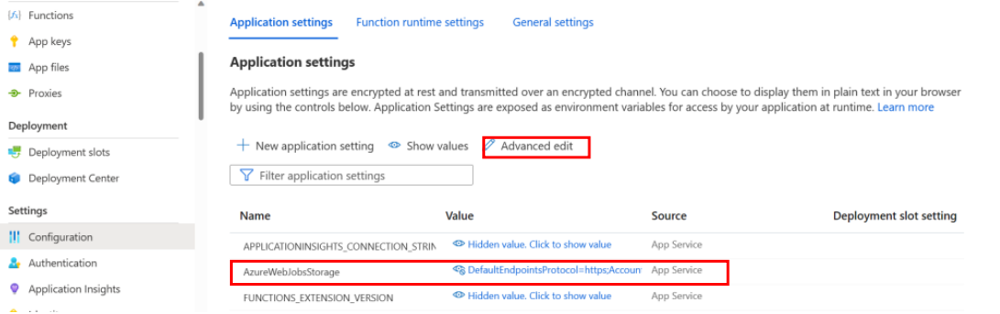
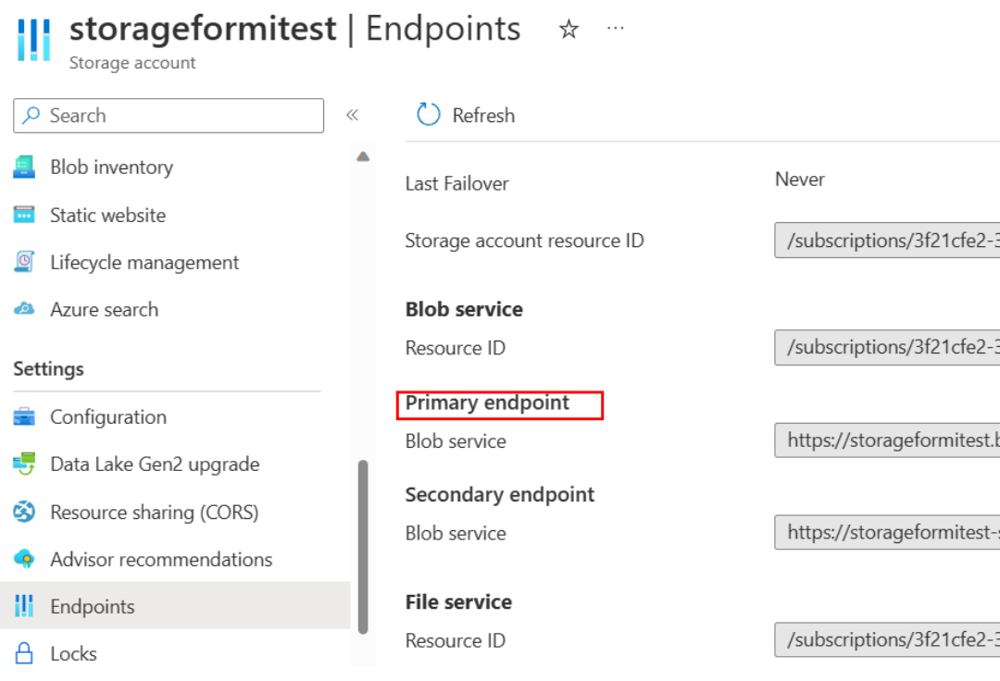
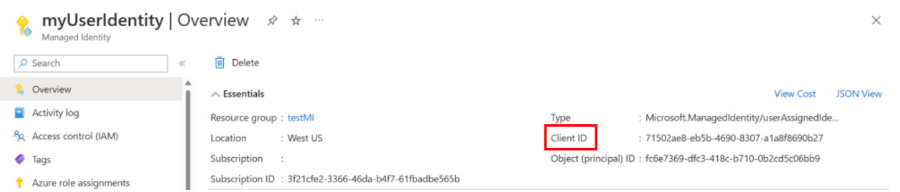
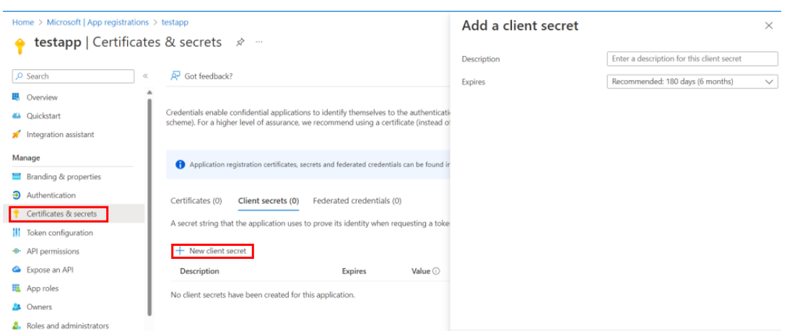
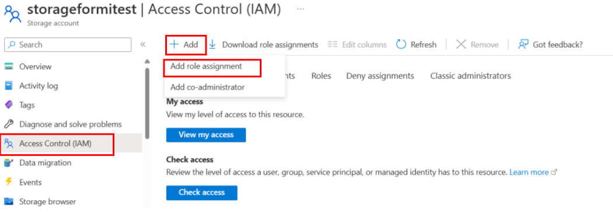
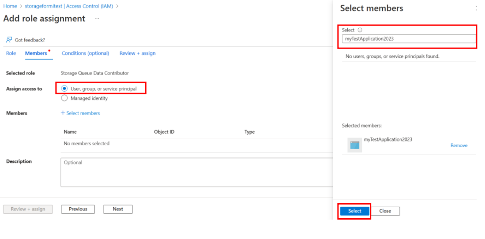
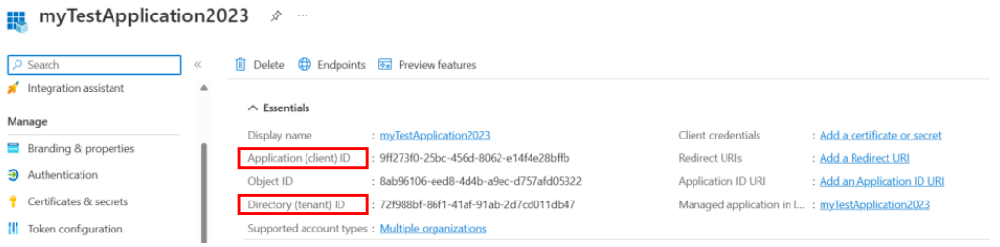
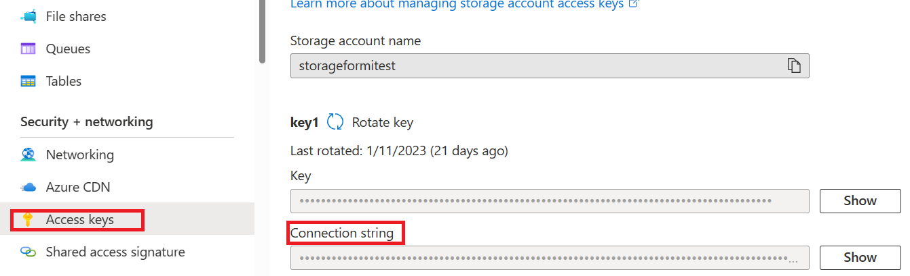

# Configure Durable Function with Azure Active Directory

[Azure Active Directory](../../active-directory/fundamentals/active-directory-whatis.md)(Azure AD) is a cloud-based identity and access management service.Using the default storage provider, Durable Functions needs to access to credentials to authenticate against an Azure storage account. Identity-based connections allow Durable Functions to make authorized requests against Azure Active Directory (Azure AD) protected resources, like an Azure Storage account, without the need to manage secrets manually. In this article, we walk though how to configure a Durable Functions app to utilize two kinds of Identity-based connections: **Managed Identity Credentials** and **Client Secret Credentials**.


## Managed Identity

A [Managed identities](../../app-service/overview-managed-identity.md) allows your app to easily access other Azure AD-protected resources such as Azure Key Vault. This can be only used on Azure Portal. Managed Identity is supported by Durable Extension starting at version **2.7.0**, but we encourage customers to use the latest version package of [Durable Functions](https://www.nuget.org/packages/Microsoft.Azure.WebJobs.Extensions.DurableTask/2.9.1).  

### Prerequisites

The following steps assume that you are starting with an existing Durable Functions app and are familiar with how to operate it. 
In particular, this QuickStart assumes that you have already: 

* Created an Azure Functions project on Azure Portal or deploy local Azure Function to Azure. 

* Added Durable Functions to your project with an orchestrator function and a client function that triggers it. 

* Learned configuration change on Azure. 

### Enable Managed Identity

Only one identity is needed for your function, either a **system-assignedidentity** or a **user-assigned identity**. To enable Managed Identity for your function and know the difference between the two identities, follow the detailed instruction here [Managed identities](../../app-service/overview-managed-identity.md).   

### Give managed identity the RBAC resources 

In the function’s associated storage account page, give these three roles to the managed identity created in last step according to this [instruction](../../active-directory/managed-identities-azure-resources/howto-assign-access-portal.md). 
* Storage Queue Data Contributor 

* Storage Blob Data Contributor 

* Storage Table Data Contributor 

### Change Configuration 

Navigate to function’s Configuration, do the following steps: 

1. Remove the default value "AzureWebJobsStorage". 

   

2. Link Azure storage account by adding either one of the following value settings: 

   * AzureWebJobsStorage__accountName: MyStorageAccount 
   * AzureWebJobsStorage__blobServiceUri: MyBlobEndpoint; AzureWebJobsStorage__queueServiceUri: MyQueueEndpoint;AzureWebJobsStorage__tableServiceUri: MyTableEndpoint. 
   
   The values for these variables can be found in the storage account blade under the Endpoints tab. 
   

3. Managed Identity setting: 

   * If **system-assigned identity** should be used: 
   Specify nothing else and let the [DefaultAzureCredential Class](https://learn.microsoft.com/en-us/dotnet/api/azure.identity.defaultazurecredential?view=azure-dotnet) take care of everything. 

   * If **user-assigned identity** should be used: 
   Add the following value settings in configuration: 
     * AzureWebJobsStorage__credential: managedidentity 
     * AzureWebJobsStorage__clientId: MyUserIdentityClientId
    


## Client Secret Credential

Registering a client application on Azure Active Directory (Azure AD) can also help us get access to Azure service. In the following steps, you will learn how to use client secret credentials for authentication.  This method can be used both locally and on Azure. However, Client Secret Credential is less recommended compared to Managed Identity since this is very sensitive information and including this in your function might cause security concerns. 

### Prerequisites 

The following steps assume that you are starting with an existing Durable Functions app and are familiar with how to operate it. 
In particular, this quickstart assumes that you have already: 

* Created an Azure Functions project on your local machine. 

* Added Durable Functions to your project with an orchestrator function and a client function that triggers it. 

* Configured the project for local debugging. 

* Learned how to deploy an Azure Functions project to Azure. 

### Register a Client Application on Azure Active Directory 
1. Register an application under Azure Active Directory on Azure Portal according to [here](../../healthcare-apis/register-application.md)

2. Create Client Secret for your application. In your app,  
   1. Select Certificates & Secrets and select New Client Secret.  
   2. Add description and select secret valid time in Expires field.  
   3. After creating the new secret, copy and save the secret value carefully because it will not show up again.  
   
   

### Give Client Application the RBAC resources 

Give these three roles to your client application created with the following steps. 
* Storage Queue Data Contributor 

* Storage Blob Data Contributor 

* Storage Table Data Contributor 

1. Navigate to function’s storage account Access Control(IAM), select add new role assignment. 

   

2. Choose the required role, next, then search for your application, review and add. 

   

### Change Configuration 

For Azure Portal run and test, specify the following in your function’s **Configuration**. For local run and test, specify environment variables in the function’s **local.settings.json** file. 

1. Remove the default value "AzureWebJobsStorage". 

2. Link Azure storage account by adding either one of the following value settings:
   * AzureWebJobsStorage__accountName: MyStorageAccount 

   * AzureWebJobsStorage__blobServiceUri: MyBlobEndpoint; AzureWebJobsStorage__queueServiceUri: MyQueueEndpoint; AzureWebJobsStorage__tableServiceUri: MyTableEndpoint. 
   The values for these Uri variables can be found in the storage account blade under the **Endpoints** tab. 
   
   

3. Add client secret credentials by specifying the following values: 
   * AzureWebJobsStorage__clientId: MyClientId; 

   * AzureWebJobsStorage__ClientSecret: MyClientSecret;  

   * AzureWebJobsStorage__tenantId: MyTenantId. 

   Client Secret is saved when you create it, and the other two id can be found on your client application’s overview page. 
   
   


## (Optional) custom non-AzureWebJobsStorage connection  

Durable Function supports using a separate storage account for Durable Task related operations. If this setting is desired, the steps are as follows:  

1. Use the following configuration in host.json: 
    ```json
    {
        "extensions":{
           "durableTask":{
              "hubName": "myTestHub",
              "storageProvider":{
               "connectionStringName": "MySeperateStorageAccount"
              }
           }
        }
    }
    ```

2. In function’s configuration or local.settings.json , add value  **mySeparateStorageAccount: storage account connection string**. Connection string can be found in the storage account’s Access keys: 

   
