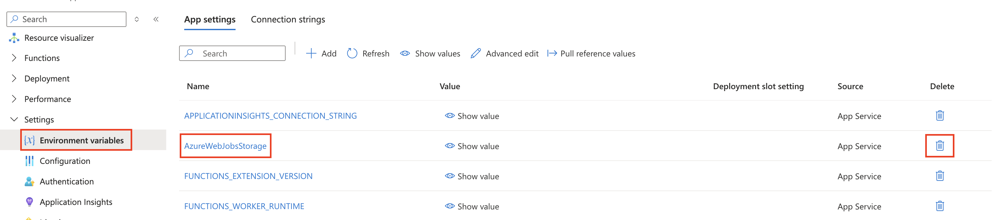
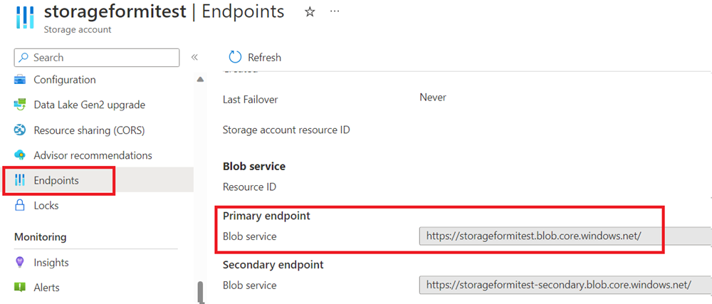
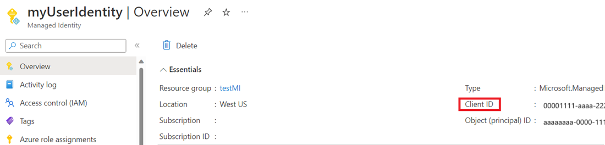
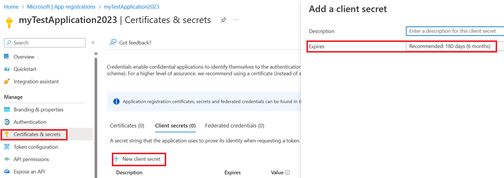
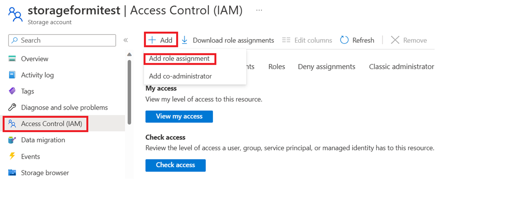
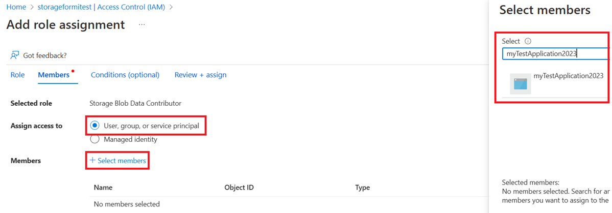
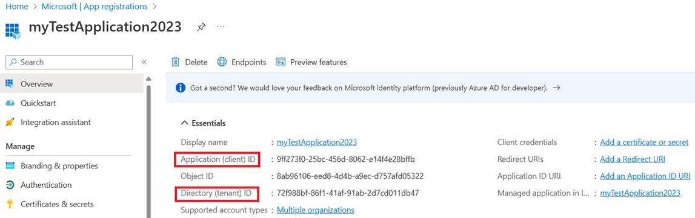

# Configure Durable Functions with Azure Active Directory

[Azure Active Directory](../../active-directory/fundamentals/active-directory-whatis.md) (Azure AD) is a cloud-based identity and access management service. Identity-based connections allow Durable Functions to make authorized requests against Azure AD protected resources, like an Azure Storage account, without the need to manage secrets manually. Using the default Azure storage provider, Durable Functions needs to authenticate against an Azure storage account. In this article, we show how to configure a Durable Functions app to utilize two kinds of Identity-based connections: **managed identity credentials** and **client secret credentials**.

## Configure your app to use managed identity (recommended)

A [managed identity](../../app-service/overview-managed-identity.md) allows your app to easily access other Azure AD-protected resources such as Azure Key Vault. Managed identity is supported in [Durable Functions extension](https://www.nuget.org/packages/Microsoft.Azure.WebJobs.Extensions.DurableTask) versions **2.7.0** and greater. 
> [!NOTE]
> Strictly speaking, a managed identity is only available to apps when executing on Azure. When configured to use identity-based connections, a locally executing app will utilize your **developer credentials** to authenticate with Azure resources. Then, when deployed on Azure, it will utilize your managed identity configuration instead.

### Prerequisites

The following steps assume that you're starting with an existing Durable Functions app and are familiar with how to operate it. 
In particular, this quickstart assumes that you have already: 

* Created a Durable Functions project in the Azure portal or deployed a local Durable Functions to Azure. 

If this isn't the case, we suggest you start with one of the following articles, which provides detailed instructions on how to achieve all the requirements above:

- [Create your first durable function - C#](durable-functions-create-first-csharp.md)
- [Create your first durable function - JavaScript](quickstart-js-vscode.md)
- [Create your first durable function - Python](quickstart-python-vscode.md)
- [Create your first durable function - PowerShell](quickstart-powershell-vscode.md)
- [Create your first durable function - Java](quickstart-java.md)

### Enable managed identity

Only one identity is needed for your function, either a **system assigned managed identity** or a **user assigned managed identity**. To enable a managed identity for your function and learn more about the differences between the two identities, read the detailed instructions [here](../../app-service/overview-managed-identity.md).   

### Assign Role-based Access Controls (RBAC) to managed identity

Navigate to your app's storage resource on the Azure portal. Follow [these instructions](../../active-directory/managed-identities-azure-resources/howto-assign-access-portal.md) to assign the following roles to your managed identity resource.

* Storage Queue Data Contributor 
* Storage Blob Data Contributor 
* Storage Table Data Contributor 

### Add managed identity configuration in the Azure portal

Navigate to your Azure function app’s **Configuration** page and perform the following changes: 

1. Remove the default value "AzureWebJobsStorage". 

  

2. Link your Azure storage account by adding **either one** of the following value settings: 

   * **AzureWebJobsStorage__accountName**: For example: `mystorageaccount123`

   * **AzureWebJobsStorage__blobServiceUri**: Example: `https://mystorageaccount123.blob.core.windows.net/` 

     **AzureWebJobsStorage__queueServiceUri**: Example: `https://mystorageaccount123.queue.core.windows.net/` 

     **AzureWebJobsStorage__tableServiceUri**: Example: `https://mystorageaccount123.table.core.windows.net/` 

     > [!NOTE] 
     > If you are using [Azure Government](../../azure-government/documentation-government-welcome.md) or any other cloud that's separate from global Azure, then you will need to use this second option to provide specific service URLs. The values for these settings can be found in the storage account under the **Endpoints** tab. For more information on using Azure Storage with Azure Government, see the [Develop with Storage API on Azure Government](../../azure-government/documentation-government-get-started-connect-to-storage.md) documentation. 

   

3. Finalize your managed identity configuration: 

   * If **system-assigned identity** should be used, then specify nothing else. 

   * If **user-assigned identity** should be used, then add the following app settings values in your app configuration:  
     * **AzureWebJobsStorage__credential**: managedidentity 

     * **AzureWebJobsStorage__clientId**: (This is a GUID value that you obtain from the Azure AD portal)

     

## Configure your app to use client secret credentials

Registering a client application in Azure Active Directory (Azure AD) is another way you can configure access to an Azure service. In the following steps, you will learn how to use client secret credentials for authentication to your Azure Storage account. This method can be used by function apps both locally and on Azure. However, client secret credential is **less recommended** than managed identity as it's more complicated to configure and manage and it requires sharing a secret credential with the Azure Functions service.

### Prerequisites 

The following steps assume that you're starting with an existing Durable Functions app and are familiar with how to operate it. 
In particular, this quickstart assumes that you have already: 

* Created a Durable Functions project on your local machine or in the Azure portal. 

### Register a client application on Azure Active Directory 
1. Register a client application under Azure Active Directory in the Azure portal according to [these instructions](../../healthcare-apis/register-application.md).

2. Create a client secret for your client application. In your registered application:  

   1. Select **Certificates & Secrets** and select **New client secret**.  

   2. Fill in a **Description** and choose secret valid time in the **Expires** field.  

   3. Copy and save the secret value carefully because it will not show up again after you leave the page. 
   
   

### Assign Role-based Access Controls (RBAC) to the client application 

Assign these three roles to your client application with the following steps. 

* Storage Queue Data Contributor 
* Storage Blob Data Contributor 
* Storage Table Data Contributor 

1. Navigate to your function’s storage account **Access Control (IAM)** page and add a new role assignment. 

   

2. Choose the required role, click next, then search for your application, review and add. 

   

### Add client secret configuration 

To run and test in Azure, specify the followings in your Azure function app’s **Configuration** page in the Azure portal. To run and test locally, specify the following in the function’s **local.settings.json** file. 

1. Remove the default value "AzureWebJobsStorage". 

2. Link Azure storage account by adding either one of the following value settings:

   * **AzureWebJobsStorage__accountName**: For example: `mystorageaccount123` 

   * **AzureWebJobsStorage__blobServiceUri**: Example: `https://mystorageaccount123.blob.core.windows.net/` 

     **AzureWebJobsStorage__queueServiceUri**: Example: `https://mystorageaccount123.queue.core.windows.net/` 

     **AzureWebJobsStorage__tableServiceUri**: Example: `https://mystorageaccount123.table.core.windows.net/` 
   
   The values for these Uri variables can be found in the storage account under the **Endpoints** tab. 
   
   

3. Add a client secret credential by specifying the following values: 
   * **AzureWebJobsStorage__clientId**: (this is a GUID value found in the Azure AD application page) 

   * **AzureWebJobsStorage__ClientSecret**: (this is the secret value generated in the Azure AD portal in a previous step)

   * **AzureWebJobsStorage__tenantId**: (this is the tenant ID that the Azure AD application is registered in)

   The client ID and tenant ID values can be found on your client application’s overview page. The client secret value is the one that was carefully saved in the previous step. It will not be available after the page is refreshed. 
   
   

