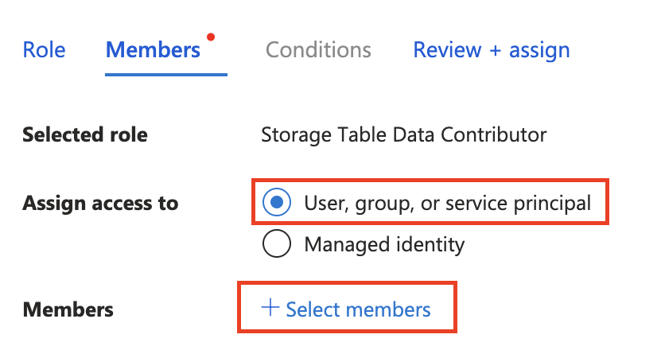
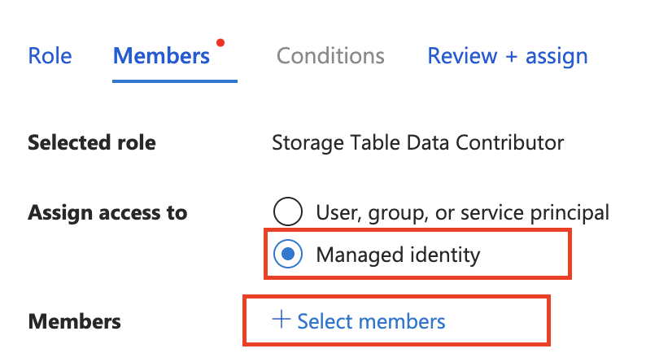

# Quickstart: Configure Durable Functions with managed identity 

A managed identity from the access management service [Microsoft Entra ID](../../active-directory/fundamentals/active-directory-whatis.md) allows your app to access other Microsoft Entra protected resources, such as an Azure Storage account, without handling secrets manually. The identity is managed by the Azure platform, so you do *not* need to provision or rotate any secrets. The recommended way to authenticate access to Azure resources is through using such an identity. 

In this quickstart, you complete steps to configure a Durable Functions app using the default **Azure Storage provider** to use identity-based connections for storage account access. 

> [!NOTE]
> Managed identity is supported in [Durable Functions extension](https://www.nuget.org/packages/Microsoft.Azure.WebJobs.Extensions.DurableTask) versions **2.7.0** and greater.

If you don't have an Azure account, create a [free account](https://azure.microsoft.com/free/?WT.mc_id=A261C142F) before you begin.

## Prerequisites

To complete this quickstart, you need:

- An existing Durable Functions project created in the Azure portal or a local Durable Functions project deployed to Azure.
- Familiarity running a Durable Functions app in Azure. 

If you don't have an existing Durable Functions project deployed in Azure, we recommend that you start with one of the following quickstarts:

- [Create your first durable function - C#](durable-functions-create-first-csharp.md)
- [Create your first durable function - JavaScript](quickstart-js-vscode.md)
- [Create your first durable function - Python](quickstart-python-vscode.md)
- [Create your first durable function - PowerShell](quickstart-powershell-vscode.md)
- [Create your first durable function - Java](quickstart-java.md)


## Local development 

### Use Azure Storage emulator
When developing locally, it's recommended that you use Azurite, which is Azure Storage's local emulator. Configure your app to the emulator by specifying `"AzureWebJobsStorage": "UseDevelopmentStorage = true"` in the local.settings.json.

### Identity-based connections for local development
Strictly speaking, a managed identity is only available to apps when executing on Azure. However, you can still configure a locally running app to use identity-based connection by using your developer credentials to authenticate against Azure resources. Then, when deployed on Azure, the app will utilize your managed identity configuration instead.

When using developer credentials, the connection attempts to get a token from the following locations, in the said order, for access to your Azure resources:

- A local cache shared between Microsoft applications
- The current user context in Visual Studio
- The current user context in Visual Studio Code
- The current user context in the Azure CLI

If none of these options are successful, an error stating that the app cannot retrieve authentication token for your Azure resources shows up. 

#### Configure runtime to use local developer identity
1. Specify the name of your Azure Storage account in local.settings.json, for example: 
   ```json
   {
      "IsEncrypted": false,
      "Values": {
         "AzureWebJobsStorage__accountName": "<<your Azure Storage account name>>",
         "FUNCTIONS_WORKER_RUNTIME": "dotnet-isolated"
      }
   }
   ```
2. Go to the Azure Storage account resource on the Azure portal, navigate to the **Access Control (IAM)** tab, and click on **Add role assignment**. Find the following roles: 
   * Storage Queue Data Contributor 
   * Storage Blob Data Contributor 
   * Storage Table Data Contributor 

   Assign the roles to yourself by clicking **"+ Select members"** and finding your email in the pop-up window. (This email is the one you use to log into Microsoft applications, Azure CLI, or editors in the Visual Studio family.)

   

## Identity-based connections for app deployed to Azure

### Enable managed identity resource 

To begin, enable a managed identity for your application. Your function app must have either a system-assigned managed identity or a user-assigned managed identity. To enable a managed identity for your function app, and to learn more about the differences between the two types of identities, see the [managed identity overview](../../app-service/overview-managed-identity.md).   

### Assign access roles to the managed identity

Navigate to your app's Azure Storage resource on the Azure portal and [assign](/entra/identity/managed-identities-azure-resources/how-to-assign-access-azure-resource) three role-based access control (RBAC) roles to your managed identity resource:

* Storage Queue Data Contributor 
* Storage Blob Data Contributor 
* Storage Table Data Contributor 

To find your identity resource, select assign access to **Managed identity** and then **+ Select members** 



### Add managed identity configuration to your app

Before you can use your app's managed identity, make some changes to the app settings:

1. In the Azure portal, on your function app resource menu under **Settings**, select **Environment variables**.

1. In the list of settings, find **AzureWebJobsStorage** and select the **Delete** icon.
  [ ](./media/durable-functions-configure-df-with-credentials/durable-functions-managed-identity-scenario-01.png#lightbox)

1. Add a setting to link your Azure storage account to the application.

   Use *one of the following methods* depending on the cloud that your app runs in:

   - **Azure cloud**: If your app runs in *global Azure*, add the setting `AzureWebJobsStorage__accountName` that identifies an Azure storage account name. Example value: `mystorageaccount123`

   - **Non-Azure cloud**: If your application runs in a cloud outside of Azure, you must add the following three settings to provide specific service URIs (or *endpoints*) of the storage account instead of an account name.

      - Setting name: `AzureWebJobsStorage__blobServiceUri`

         Example value: `https://mystorageaccount123.blob.core.windows.net/` 

      - Setting name: `AzureWebJobsStorage__queueServiceUri`

         Example value: `https://mystorageaccount123.queue.core.windows.net/` 

      - Setting name: `AzureWebJobsStorage__tableServiceUri`

         Example value: `https://mystorageaccount123.table.core.windows.net/` 

   You can get the values for these URI variables in the storage account information from the **Endpoints** tab.

   

   > [!NOTE] 
   > If you are using [Azure Government](../../azure-government/documentation-government-welcome.md) or any other cloud that's separate from global Azure, you must use the option that provides specific service URIs instead of just the storage account name. For more information on using Azure Storage with Azure Government, see the [Develop by using the Storage API in Azure Government](../../azure-government/documentation-government-get-started-connect-to-storage.md). 

1. Finish your managed identity configuration (remember to click "Apply" after making the setting changes): 

   * If you use a *system-assigned identity*, make no other changes. 

   * If you use a *user-assigned identity*, add the following settings in your app configuration:  

     * **AzureWebJobsStorage__credential**, enter **managedidentity** 

     * **AzureWebJobsStorage__clientId**, get this GUID value from your managed identity resource

     

   > [!NOTE] 
   > Durable Functions does *not* support `managedIdentityResourceId` when using user-assigned identity. Use `clientId` instead. 


