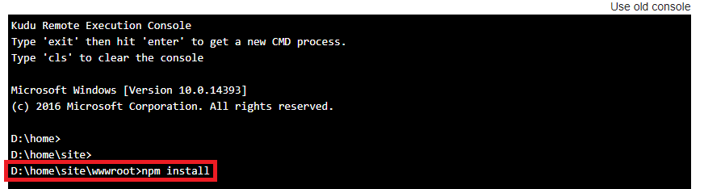

# Create Durable Functions using the Azure portal

The [Durable Functions](durable-functions-overview.md) extension for Azure Functions is provided in the NuGet package [Microsoft.Azure.WebJobs.Extensions.DurableTask](https://www.nuget.org/packages/Microsoft.Azure.WebJobs.Extensions.DurableTask). This extension must be installed in your function app. This article shows how to install this package so that you can develop durable functions in the Azure portal.

> [!NOTE]
> 
> * If you are developing durable functions in C#, you should instead consider [Visual Studio 2019 development](durable-functions-create-first-csharp.md).
> * If you are developing durable functions in JavaScript, you should instead consider [Visual Studio Code development](./quickstart-js-vscode.md).

## Create a function app

You must have a function app to host the execution of any function. A function app lets you group your functions as a logical unit for easier management, deployment, scaling, and sharing of resources. You can create a .NET or JavaScript app.

[!INCLUDE [Create function app Azure portal](../../../includes/functions-create-function-app-portal.md)]

By default, the function app created uses version 2.x of the Azure Functions runtime. The Durable Functions extension works on both versions 1.x and 2.x of the Azure Functions runtime in C#, and version 2.x in JavaScript. However, templates are only available when targeting version 2.x of the runtime regardless of the chosen language.

## Install the durable-functions npm package (JavaScript only)

If you are creating JavaScript Durable Functions, you'll need to install the [`durable-functions` npm package](https://www.npmjs.com/package/durable-functions):

1. From your function app's page, select **Advanced Tools** under **Development Tools** in the left pane.

   :::image type="content" source="./media/durable-functions-create-portal/function-app-platform-features-choose-kudu.png" alt-text="Functions platform features choose Kudu":::

2. In the **Advanced Tools** page, select **Go**.

3. Inside the Kudu console, select **Debug console**, and then **CMD**.

   :::image type="content" source="./media/durable-functions-create-portal/kudu-choose-debug-console.png" alt-text="Kudu debug console":::

3. Your function app's file directory structure should display. Navigate to the `site/wwwroot` folder. From there, you can upload a `package.json` file by dragging and dropping it into the file directory window. A sample `package.json` is below:

    ```json
    {
      "dependencies": {
        "durable-functions": "^1.3.1"
      }
    }
    ```

   :::image type="content" source="./media/durable-functions-create-portal/kudu-choose-debug-console.png" alt-text="Kudu upload package.json":::

4. Once your `package.json` is uploaded, run the `npm install` command from the Kudu Remote Execution Console.

   
   
## Create an orchestrator function

1. In your function app, select **Functions** from the left pane, and then select **Add** from the top menu. 

1. In the search field of the **New Function** page, enter `durable`, and then choose the **Durable Functions HTTP starter** template.

   :::image type="content" source="./media/durable-functions-create-portal/durable-functions-http-starter-template.png" alt-text="Select Durable Functions HTTP starter":::

1. For the **New Function** name, enter `HttpStart`, and then select **Create Function**.

   The function created is used to start the orchestration.

1. Create another function in the function app, this time by using the **Durable Functions orchestrator** template. Name your new orchestration function `HelloSequence`.

1. Create a third function named `Hello` by using the **Durable Functions activity** template.

## Test the durable function orchestration

1. Go back to the **HttpStart** function, choose **Get function Url**, and select the **Copy to clipboard** icon to copy the URL. You use this URL to start the **HelloSequence** function.

1. Use an HTTP tool like Postman or cURL to send a POST request to the URL that you copied. The following example is a cURL command that sends a POST request to the durable function:

    ```bash
    curl -X POST https://{your-function-app-name}.azurewebsites.net/api/orchestrators/{functionName} --header "Content-Length: 0"
    ```

    In this example, `{your-function-app-name}` is the domain that is the name of your function app, and `{functionName}` is the **HelloSequence** orchestrator function. The response message contains a set of URI endpoints that you can use to monitor and manage the execution, which looks like the following example:

    ```json
    {  
       "id":"10585834a930427195479de25e0b952d",
       "statusQueryGetUri":"https://...",
       "sendEventPostUri":"https://...",
       "terminatePostUri":"https://...",
       "rewindPostUri":"https://..."
    }
    ```

1. Call the `statusQueryGetUri` endpoint URI and you see the current status of the durable function, which might look like this example:

    ```json
        {
            "runtimeStatus": "Running",
            "input": null,
            "output": null,
            "createdTime": "2017-12-01T05:37:33Z",
            "lastUpdatedTime": "2017-12-01T05:37:36Z"
        }
    ```

1. Continue calling the `statusQueryGetUri` endpoint until the status changes to **Completed**, and you see a response like the following example:

    ```json
    {
            "runtimeStatus": "Completed",
            "input": null,
            "output": [
                "Hello Tokyo!",
                "Hello Seattle!",
                "Hello London!"
            ],
            "createdTime": "2017-12-01T05:38:22Z",
            "lastUpdatedTime": "2017-12-01T05:38:28Z"
        }
    ```

Your first durable function is now up and running in Azure.

## Next steps

> [!div class="nextstepaction"]
> [Learn about common durable function patterns](durable-functions-overview.md#application-patterns)
