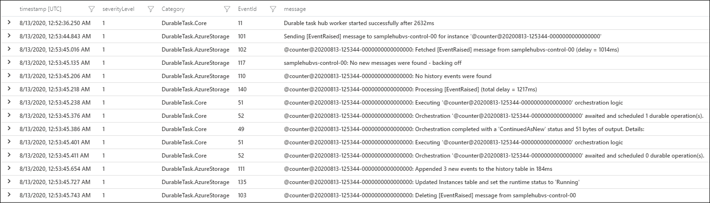

# Diagnostics in Durable Functions in Azure

There are several options for diagnosing issues with [Durable Functions](durable-functions-overview.md). Some of these options are the same for regular functions and some of them are unique to Durable Functions.

## Application Insights

[Application Insights](../../azure-monitor/app/app-insights-overview.md) is the recommended way to do diagnostics and monitoring in Azure Functions. The same applies to Durable Functions. For an overview of how to leverage Application Insights in your function app, see [Monitor Azure Functions](../functions-monitoring.md).

The Azure Functions Durable Extension also emits *tracking events* that allow you to trace the end-to-end execution of an orchestration. These tracking events can be found and queried using the [Application Insights Analytics](../../azure-monitor/logs/log-query-overview.md) tool in the Azure portal.

### Tracking data

Each lifecycle event of an orchestration instance causes a tracking event to be written to the **traces** collection in Application Insights. This event contains a **customDimensions** payload with several fields.  Field names are all prepended with `prop__`.

* **hubName**: The name of the task hub in which your orchestrations are running.
* **appName**: The name of the function app. This field is useful when you have multiple function apps sharing the same Application Insights instance.
* **slotName**: The [deployment slot](../functions-deployment-slots.md) in which the current function app is running. This field is useful when you use deployment slots to version your orchestrations.
* **functionName**: The name of the orchestrator or activity function.
* **functionType**: The type of the function, such as **Orchestrator** or **Activity**.
* **instanceId**: The unique ID of the orchestration instance.
* **state**: The lifecycle execution state of the instance. Valid values include:
  * **Scheduled**: The function was scheduled for execution but hasn't started running yet.
  * **Started**: The function has started running but has not yet awaited or completed.
  * **Awaited**: The orchestrator has scheduled some work and is waiting for it to complete.
  * **Listening**: The orchestrator is listening for an external event notification.
  * **Completed**: The function has completed successfully.
  * **Failed**: The function failed with an error.
* **reason**: Additional data associated with the tracking event. For example, if an instance is waiting for an external event notification, this field indicates the name of the event it is waiting for. If a function has failed, this field will contain the error details.
* **isReplay**: Boolean value indicating whether the tracking event is for replayed execution.
* **extensionVersion**: The version of the Durable Task extension. The version information is especially important data when reporting possible bugs in the extension. Long-running instances may report multiple versions if an update occurs while it is running.
* **sequenceNumber**: Execution sequence number for an event. Combined with the timestamp helps to order the events by execution time. *Note that this number will be reset to zero if the host restarts while the instance is running, so it's important to always sort by timestamp first, then sequenceNumber.*

The verbosity of tracking data emitted to Application Insights can be configured in the `logger` (Functions 1.x) or `logging` (Functions 2.0) section of the `host.json` file.

#### Functions 1.0

```json
{
    "logger": {
        "categoryFilter": {
            "categoryLevels": {
                "Host.Triggers.DurableTask": "Information"
            }
        }
    }
}
```

#### Functions 2.0

```json
{
    "logging": {
        "logLevel": {
            "Host.Triggers.DurableTask": "Information",
        },
    }
}
```

By default, all *non-replay* tracking events are emitted. The volume of data can be reduced by setting `Host.Triggers.DurableTask` to `"Warning"` or `"Error"` in which case tracking events will only be emitted for exceptional situations. To enable emitting the verbose orchestration replay events, set the `logReplayEvents` to `true` in the [host.json](durable-functions-bindings.md#host-json) configuration file.

> [!NOTE]
> By default, Application Insights telemetry is sampled by the Azure Functions runtime to avoid emitting data too frequently. This can cause tracking information to be lost when many lifecycle events occur in a short period of time. The [Azure Functions Monitoring article](../configure-monitoring.md#configure-sampling) explains how to configure this behavior.

Inputs and outputs of orchestrator, activity, and entity functions are not logged by default. This default behavior is recommended because logging inputs and outputs could increase Application Insights costs. Function input and output payloads may also contain sensitive information. Instead, the number of bytes for function inputs and outputs are logged instead of the actual payloads by default. If you want the Durable Functions extension to log the full input and output payloads, set the `traceInputsAndOutputs` property to `true` in the [host.json](durable-functions-bindings.md#host-json) configuration file.

### Single instance query

The following query shows historical tracking data for a single instance of the [Hello Sequence](durable-functions-sequence.md) function orchestration. It's written using the [Kusto Query Language](/azure/data-explorer/kusto/query/). It filters out replay execution so that only the *logical* execution path is shown. Events can be ordered by sorting by `timestamp` and `sequenceNumber` as shown in the query below:

```kusto
let targetInstanceId = "ddd1aaa685034059b545eb004b15d4eb";
let start = datetime(2018-03-25T09:20:00);
traces
| where timestamp > start and timestamp < start + 30m
| where customDimensions.Category == "Host.Triggers.DurableTask"
| extend functionName = customDimensions["prop__functionName"]
| extend instanceId = customDimensions["prop__instanceId"]
| extend state = customDimensions["prop__state"]
| extend isReplay = tobool(tolower(customDimensions["prop__isReplay"]))
| extend sequenceNumber = tolong(customDimensions["prop__sequenceNumber"])
| where isReplay != true
| where instanceId == targetInstanceId
| sort by timestamp asc, sequenceNumber asc
| project timestamp, functionName, state, instanceId, sequenceNumber, appName = cloud_RoleName
```

The result is a list of tracking events that shows the execution path of the orchestration, including any activity functions ordered by the execution time in ascending order.


### Instance summary query

The following query displays the status of all orchestration instances that were run in a specified time range.

```kusto
let start = datetime(2017-09-30T04:30:00);
traces
| where timestamp > start and timestamp < start + 1h
| where customDimensions.Category == "Host.Triggers.DurableTask"
| extend functionName = tostring(customDimensions["prop__functionName"])
| extend instanceId = tostring(customDimensions["prop__instanceId"])
| extend state = tostring(customDimensions["prop__state"])
| extend isReplay = tobool(tolower(customDimensions["prop__isReplay"]))
| extend output = tostring(customDimensions["prop__output"])
| where isReplay != true
| summarize arg_max(timestamp, *) by instanceId
| project timestamp, instanceId, functionName, state, output, appName = cloud_RoleName
| order by timestamp asc
```

The result is a list of instance IDs and their current runtime status.


## Durable Task Framework Logging

The Durable extension logs are useful for understanding the behavior of your orchestration logic. However, these logs don't always contain enough information to debug framework-level performance and reliability issues. Starting in **v2.3.0** of the Durable extension, logs emitted by the underlying Durable Task Framework (DTFx) are also available for collection.

When looking at logs emitted by the DTFx, it's important to understand that the DTFx engine is composed of two components: the core dispatch engine (`DurableTask.Core`) and one of many supported storage providers (Durable Functions uses `DurableTask.AzureStorage` by default but [other options are available](durable-functions-storage-providers.md)).

* **DurableTask.Core**: Core orchestration execution and low-level scheduling logs and telemetry.
* **DurableTask.AzureStorage**: Backend logs specific to the Azure Storage state provider. These logs include detailed interactions with the internal queues, blobs, and storage tables used to store and fetch internal orchestration state.
* **DurableTask.Netherite**: Backend logs specific to the [Netherite storage provider](https://microsoft.github.io/durabletask-netherite), if enabled.
* **DurableTask.SqlServer**: Backend logs specific to the [Microsoft SQL (MSSQL) storage provider](https://microsoft.github.io/durabletask-mssql), if enabled.

You can enable these logs by updating the `logging/logLevel` section of your function app's **host.json** file. The following example shows how to enable warning and error logs from both `DurableTask.Core` and `DurableTask.AzureStorage`:

```json
{
  "version": "2.0",
  "logging": {
    "logLevel": {
      "DurableTask.AzureStorage": "Warning",
      "DurableTask.Core": "Warning"
    }
  }
}
```

If you have Application Insights enabled, these logs will be automatically added to the `trace` collection. You can search them the same way that you search for other `trace` logs using Kusto queries.

> [!NOTE]
> For production applications, it is recommended that you enable `DurableTask.Core` and the appropriate storage provider (e.g. `DurableTask.AzureStorage`) logs using the `"Warning"` filter. Higher verbosity filters such as `"Information"` are very useful for debugging performance issues. However, these log events can be high-volume and can significantly increase Application Insights data storage costs.

The following Kusto query shows how to query for DTFx logs. The most important part of the query is `where customerDimensions.Category startswith "DurableTask"` since that filters the results to logs in the `DurableTask.Core` and `DurableTask.AzureStorage` categories.

```kusto
traces
| where customDimensions.Category startswith "DurableTask"
| project
    timestamp,
    severityLevel,
    Category = customDimensions.Category,
    EventId = customDimensions.EventId,
    message,
    customDimensions
| order by timestamp asc 
```
The result is a set of logs written by the Durable Task Framework log providers.



For more information about what log events are available, see the [Durable Task Framework structured logging documentation on GitHub](https://github.com/Azure/durabletask/tree/master/src/DurableTask.Core/Logging#durabletaskcore-logging).

## App Logging

It's important to keep the orchestrator replay behavior in mind when writing logs directly from an orchestrator function. For example, consider the following orchestrator function:

# [C# (InProc)](#tab/csharp-inproc)

```csharp
[FunctionName("FunctionChain")]
public static async Task Run(
    [OrchestrationTrigger] IDurableOrchestrationContext context,
    ILogger log)
{
    log.LogInformation("Calling F1.");
    await context.CallActivityAsync("F1");
    log.LogInformation("Calling F2.");
    await context.CallActivityAsync("F2");
    log.LogInformation("Calling F3");
    await context.CallActivityAsync("F3");
    log.LogInformation("Done!");
}
```

# [C# (Isolated)](#tab/csharp-isolated)

```csharp
[Function("FunctionChain")]
public static async Task Run(
    [OrchestrationTrigger] TaskOrchestrationContext context,
    FunctionContext executionContext)
{
    ILogger log = executionContext.GetLogger("FunctionChain");
    log.LogInformation("Calling F1.");
    await context.CallActivityAsync("F1");
    log.LogInformation("Calling F2.");
    await context.CallActivityAsync("F2");
    log.LogInformation("Calling F3");
    await context.CallActivityAsync("F3");
    log.LogInformation("Done!");
}
```

# [JavaScript](#tab/javascript)

```javascript
const df = require("durable-functions");

module.exports = df.orchestrator(function*(context){
    context.log("Calling F1.");
    yield context.df.callActivity("F1");
    context.log("Calling F2.");
    yield context.df.callActivity("F2");
    context.log("Calling F3.");
    yield context.df.callActivity("F3");
    context.log("Done!");
});
```

# [Python](#tab/python)

```python
import logging
import azure.functions as func
import azure.durable_functions as df

def orchestrator_function(context: df.DurableOrchestrationContext):
    logging.info("Calling F1.")
    yield context.call_activity("F1")
    logging.info("Calling F2.")
    yield context.call_activity("F2")
    logging.info("Calling F3.")
    yield context.call_activity("F3")
    return None

main = df.Orchestrator.create(orchestrator_function)
```

# [Java](#tab/java)

```java
@FunctionName("FunctionChain")
public void functionChain(
        @DurableOrchestrationTrigger(name = "ctx") TaskOrchestrationContext ctx,
        ExecutionContext functionContext) {
    Logger log = functionContext.getLogger();
    log.info("Calling F1.");
    ctx.callActivity("F1").await();
    log.info("Calling F2.");
    ctx.callActivity("F2").await();
    log.info("Calling F3.");
    ctx.callActivity("F3").await();
    log.info("Done!");
}
```

---

The resulting log data is going to look something like the following example output:

```txt
Calling F1.
Calling F1.
Calling F2.
Calling F1.
Calling F2.
Calling F3.
Calling F1.
Calling F2.
Calling F3.
Done!
```

> [!NOTE]
> Remember that while the logs claim to be calling F1, F2, and F3, those functions are only *actually* called the first time they are encountered. Subsequent calls that happen during replay are skipped and the outputs are replayed to the orchestrator logic.

If you want to only write logs on non-replay executions, you can write a conditional expression to log only if the "is replaying" flag is `false`. Consider the example above, but this time with replay checks.

# [C# (InProc)](#tab/csharp-inproc)

```csharp
[FunctionName("FunctionChain")]
public static async Task Run(
    [OrchestrationTrigger] IDurableOrchestrationContext context,
    ILogger log)
{
    if (!context.IsReplaying) log.LogInformation("Calling F1.");
    await context.CallActivityAsync("F1");
    if (!context.IsReplaying) log.LogInformation("Calling F2.");
    await context.CallActivityAsync("F2");
    if (!context.IsReplaying) log.LogInformation("Calling F3");
    await context.CallActivityAsync("F3");
    log.LogInformation("Done!");
}
```

Starting in Durable Functions 2.0, .NET orchestrator functions also have the option to create an `ILogger` that automatically filters out log statements during replay. This automatic filtering is done using the [IDurableOrchestrationContext.CreateReplaySafeLogger(ILogger)](/dotnet/api/microsoft.azure.webjobs.extensions.durabletask.durablecontextextensions.createreplaysafelogger) API.

```csharp
[FunctionName("FunctionChain")]
public static async Task Run(
    [OrchestrationTrigger] IDurableOrchestrationContext context,
    ILogger log)
{
    log = context.CreateReplaySafeLogger(log);
    log.LogInformation("Calling F1.");
    await context.CallActivityAsync("F1");
    log.LogInformation("Calling F2.");
    await context.CallActivityAsync("F2");
    log.LogInformation("Calling F3");
    await context.CallActivityAsync("F3");
    log.LogInformation("Done!");
}
```

> [!NOTE]
> The previous C# examples are for Durable Functions 2.x. For Durable Functions 1.x, you must use `DurableOrchestrationContext` instead of `IDurableOrchestrationContext`. For more information about the differences between versions, see the [Durable Functions versions](durable-functions-versions.md) article.

# [C# (Isolated)](#tab/csharp-isolated)

In Durable Functions for .NET-isolated, you can create an `ILogger` that automatically filters out log statements during replay. The main difference with Durable Functions in-proc is that you do not provide an existing `ILogger`. This logger is created via the `TaskOrchestrationContext.CreateReplaySafeLogger` overloads.

```csharp
[Function("FunctionChain")]
public static async Task Run([OrchestrationTrigger] TaskOrchestrationContext context)
{
    ILogger log = context.CreateReplaySafeLogger("FunctionChain");
    log.LogInformation("Calling F1.");
    await context.CallActivityAsync("F1");
    log.LogInformation("Calling F2.");
    await context.CallActivityAsync("F2");
    log.LogInformation("Calling F3");
    await context.CallActivityAsync("F3");
    log.LogInformation("Done!");
}
```

> [!NOTE]
> The ability to wrap an existing `ILogger` into a replay-safe logger has been removed in Durable Functions for .NET isolated worker.

# [JavaScript](#tab/javascript)

```javascript
const df = require("durable-functions");

module.exports = df.orchestrator(function*(context){
    if (!context.df.isReplaying) context.log("Calling F1.");
    yield context.df.callActivity("F1");
    if (!context.df.isReplaying) context.log("Calling F2.");
    yield context.df.callActivity("F2");
    if (!context.df.isReplaying) context.log("Calling F3.");
    yield context.df.callActivity("F3");
    context.log("Done!");
});
```

# [Python](#tab/python)

```python
import logging
import azure.functions as func
import azure.durable_functions as df

def orchestrator_function(context: df.DurableOrchestrationContext):
    if not context.is_replaying:
        logging.info("Calling F1.")
    yield context.call_activity("F1")
    if not context.is_replaying:
        logging.info("Calling F2.")
    yield context.call_activity("F2")
    if not context.is_replaying:
        logging.info("Calling F3.")
    yield context.call_activity("F3")
    logging.info("Done!")
    return None

main = df.Orchestrator.create(orchestrator_function)
```

# [Java](#tab/java)

```java
@FunctionName("FunctionChain")
public void functionChain(
        @DurableOrchestrationTrigger(name = "ctx") TaskOrchestrationContext ctx,
        ExecutionContext functionContext) {
    Logger log = functionContext.getLogger();
    if (!ctx.getIsReplaying()) log.info("Calling F1.");
    ctx.callActivity("F1").await();
    if (!ctx.getIsReplaying()) log.info("Calling F2.");
    ctx.callActivity("F2").await();
    if (!ctx.getIsReplaying()) log.info("Calling F3.");
    ctx.callActivity("F3").await();
    log.info("Done!");
}
```

---

With the previously mentioned changes, the log output is as follows:

```txt
Calling F1.
Calling F2.
Calling F3.
Done!
```

## Custom Status

Custom orchestration status lets you set a custom status value for your orchestrator function. This custom status is then visible to external clients via the [HTTP status query API](durable-functions-http-api.md#get-instance-status) or via language-specific API calls. The custom orchestration status enables richer monitoring for orchestrator functions. For example, the orchestrator function code can invoke the "set custom status" API to update the progress for a long-running operation. A client, such as a web page or other external system, could then periodically query the HTTP status query APIs for richer progress information. Sample code for setting a custom status value in an orchestrator function is provided below:

# [C# (InProc)](#tab/csharp-inproc)

```csharp
[FunctionName("SetStatusTest")]
public static async Task SetStatusTest([OrchestrationTrigger] IDurableOrchestrationContext context)
{
    // ...do work...

    // update the status of the orchestration with some arbitrary data
    var customStatus = new { completionPercentage = 90.0, status = "Updating database records" };
    context.SetCustomStatus(customStatus);

    // ...do more work...
}
```

> [!NOTE]
> The previous C# example is for Durable Functions 2.x. For Durable Functions 1.x, you must use `DurableOrchestrationContext` instead of `IDurableOrchestrationContext`. For more information about the differences between versions, see the [Durable Functions versions](durable-functions-versions.md) article.

# [C# (Isolated)](#tab/csharp-isolated)

```csharp
[Function("SetStatusTest")]
public static async Task SetStatusTest([OrchestrationTrigger] TaskOrchestrationContext context)
{
    // ...do work...

    // update the status of the orchestration with some arbitrary data
    var customStatus = new { completionPercentage = 90.0, status = "Updating database records" };
    context.SetCustomStatus(customStatus);

    // ...do more work...
}
```

# [JavaScript](#tab/javascript)

```javascript
const df = require("durable-functions");

module.exports = df.orchestrator(function*(context) {
    // ...do work...

    // update the status of the orchestration with some arbitrary data
    const customStatus = { completionPercentage: 90.0, status: "Updating database records", };
    context.df.setCustomStatus(customStatus);

    // ...do more work...
});
```

# [Python](#tab/python)

```python
import logging
import azure.functions as func
import azure.durable_functions as df

def orchestrator_function(context: df.DurableOrchestrationContext):
    # ...do work...

    # update the status of the orchestration with some arbitrary data
    custom_status = {'completionPercentage': 90.0, 'status': 'Updating database records'}
    context.set_custom_status(custom_status)
    # ...do more work...

    return None

main = df.Orchestrator.create(orchestrator_function)
```

# [Java](#tab/java)

```java
@FunctionName("SetStatusTest")
public void setStatusTest(
        @DurableOrchestrationTrigger(name = "ctx") TaskOrchestrationContext ctx) {
    // ...do work...

    // update the status of the orchestration with some arbitrary data
    ctx.setCustomStatus(new Object() {
        public final double completionPercentage = 90.0;
        public final String status = "Updating database records";
    });

    // ...do more work...
}
```

---

While the orchestration is running, external clients can fetch this custom status:

```http
GET /runtime/webhooks/durabletask/instances/instance123?code=XYZ

```

Clients will get the following response:

```json
{
  "runtimeStatus": "Running",
  "input": null,
  "customStatus": { "completionPercentage": 90.0, "status": "Updating database records" },
  "output": null,
  "createdTime": "2017-10-06T18:30:24Z",
  "lastUpdatedTime": "2017-10-06T19:40:30Z"
}
```

> [!WARNING]
> The custom status payload is limited to 16 KB of UTF-16 JSON text because it needs to be able to fit in an Azure Table Storage column. You can use external storage if you need larger payload.

## Debugging

Azure Functions supports debugging function code directly, and that same support carries forward to Durable Functions, whether running in Azure or locally. However, there are a few behaviors to be aware of when debugging:

* **Replay**: Orchestrator functions regularly [replay](durable-functions-orchestrations.md#reliability) when new inputs are received. This behavior means a single *logical* execution of an orchestrator function can result in hitting the same breakpoint multiple times, especially if it is set early in the function code.
* **Await**: Whenever an `await` is encountered in an orchestrator function, it yields control back to the Durable Task Framework dispatcher. If it is the first time a particular `await` has been encountered, the associated task is *never* resumed. Because the task never resumes, stepping *over* the await (F10 in Visual Studio) is not possible. Stepping over only works when a task is being replayed.
* **Messaging timeouts**: Durable Functions internally uses queue messages to drive execution of orchestrator, activity, and entity functions. In a multi-VM environment, breaking into the debugging for extended periods of time could cause another VM to pick up the message, resulting in duplicate execution. This behavior exists for regular queue-trigger functions as well, but is important to point out in this context since the queues are an implementation detail.
* **Stopping and starting**: Messages in Durable functions persist between debug sessions. If you stop debugging and terminate the local host process while a durable function is executing, that function may re-execute automatically in a future debug session. This behavior can be confusing when not expected. Using a [fresh task hub](durable-functions-task-hubs.md#task-hub-management) or clearing the task hub contents between debug sessions is one technique to avoid this behavior.

> [!TIP]
> When setting breakpoints in orchestrator functions, if you want to only break on non-replay execution, you can set a conditional breakpoint that breaks only if the "is replaying" value is `false`.

## Storage

By default, Durable Functions stores state in Azure Storage. This behavior means you can inspect the state of your orchestrations using tools such as [Microsoft Azure Storage Explorer](../../vs-azure-tools-storage-manage-with-storage-explorer.md).


This is useful for debugging because you see exactly what state an orchestration may be in. Messages in the queues can also be examined to learn what work is pending (or stuck in some cases).

> [!WARNING]
> While it's convenient to see execution history in table storage, avoid taking any dependency on this table. It may change as the Durable Functions extension evolves.

> [!NOTE]
> Other storage providers can be configured instead of the default Azure Storage provider. Depending on the storage provider configured for your app, you may need to use different tools to inspect the underlying state. For more information, see the [Durable Functions Storage Providers](durable-functions-storage-providers.md) documentation.

## Durable Functions troubleshooting guide

To troubleshoot common problem symptoms such as orchestrations being stuck, failing to start, running slowly, etc., refer to this [troubleshooting guide](durable-functions-troubleshooting-guide.md). 

## 3rd party tools

The Durable Functions community publishes a variety of tools that can be useful for debugging, diagnostics, or monitoring. One such tool is the open source [Durable Functions Monitor](https://github.com/scale-tone/DurableFunctionsMonitor#durable-functions-monitor), a graphical tool for monitoring, managing, and debugging your orchestration instances.

## Next steps

> [!div class="nextstepaction"]
> [Learn more about monitoring in Azure Functions](../functions-monitoring.md)
