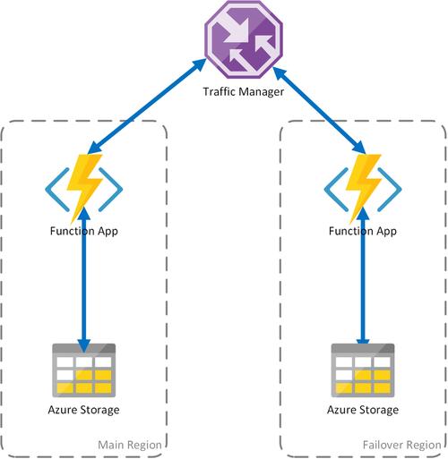
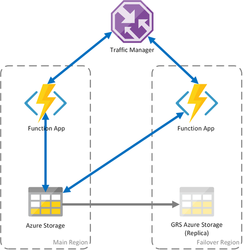

# Disaster recovery and geo-distribution in Azure Durable Functions

Microsoft strives to ensure that Azure services are always available. However, unplanned service outages may occur. If your application requires resiliency, Microsoft recommends configuring your app for geo-redundancy. Additionally, customers should have a disaster recovery plan in place for handling a regional service outage. An important part of a disaster recovery plan is preparing to fail over to the secondary replica of your app and storage in the event that the primary replica becomes unavailable.

In Durable Functions, all state is persisted in Azure Storage by default. A [task hub](durable-functions-task-hubs.md) is a logical container for Azure Storage resources that are used for [orchestrations](durable-functions-types-features-overview.md#orchestrator-functions) and [entities](durable-functions-types-features-overview.md#entity-functions). Orchestrator, activity, and entity functions can only interact with each other when they belong to the same task hub. This document will refer to task hubs when describing scenarios for keeping these Azure Storage resources highly available.

> [!NOTE]
> The guidance in this article assumes that you are using the default Azure Storage provider for storing Durable Functions runtime state. However, it's possible to configure alternate storage providers that store state elsewhere, like a SQL Server database. Different disaster recovery and geo-distribution strategies may be required for the alternate storage providers. For more information on the alternate storage providers, see the [Durable Functions storage providers](durable-functions-storage-providers.md) documentation.

Orchestrations and entities can be triggered using [client functions](durable-functions-types-features-overview.md#client-functions) that are themselves triggered via HTTP or one of the other supported Azure Functions trigger types. They can also be triggered using [built-in HTTP APIs](durable-functions-http-features.md#built-in-http-apis). For simplicity, this article will focus on scenarios involving Azure Storage and HTTP-based function triggers, and options to increase availability and minimize downtime during disaster recovery activities. Other trigger types, such as Service Bus or Azure Cosmos DB triggers, will not be explicitly covered.

The following scenarios are based on Active-Passive configurations, since they are guided by the usage of Azure Storage. This pattern consists of deploying a backup (passive) function app to a different region. Traffic Manager will monitor the primary (active) function app for HTTP availability. It will fail over to the backup function app if the primary fails. For more information, see [Azure Traffic Manager](https://azure.microsoft.com/services/traffic-manager/)'s [Priority Traffic-Routing Method.](../../traffic-manager/traffic-manager-routing-methods.md#priority-traffic-routing-method)

> [!NOTE]
> - The proposed Active-Passive configuration ensures that a client is always able to trigger new orchestrations via HTTP. However, as a consequence of having two function apps sharing the same task hub in storage, some background storage transactions will be distributed between both of them. This configuration therefore incurs some added egress costs for the secondary function app.
> - The underlying storage account and task hub are created in the primary region, and are shared by both function apps.
> - All function apps that are redundantly deployed must share the same function access keys in the case of being activated via HTTP. The Functions Runtime exposes a [management API](https://github.com/Azure/azure-functions-host/wiki/Key-management-API) that enables consumers to programmatically add, delete, and update function keys. Key management is also possible using [Azure Resource Manager APIs](https://www.markheath.net/post/managing-azure-functions-keys-2).

## Scenario 1 - Load balanced compute with shared storage

If the compute infrastructure in Azure fails, the function app may become unavailable. To minimize the possibility of such downtime, this scenario uses two function apps deployed to different regions.
Traffic Manager is configured to detect problems in the primary function app and automatically redirect traffic to the function app in the secondary region. This function app shares the same Azure Storage account and Task Hub. Therefore, the state of the function apps isn't lost and work can resume normally. Once health is restored to the primary region, Azure Traffic Manager will start routing requests to that function app automatically.

There are several benefits when using this deployment scenario:

- If the compute infrastructure fails, work can resume in the failover region without data loss.
- Traffic Manager takes care of the automatic failover to the healthy function app automatically.
- Traffic Manager automatically re-establishes traffic to the primary function app after the outage has been corrected.

However,  using this scenario consider:

- If the function app is deployed using a dedicated App Service plan, replicating the compute infrastructure in the failover datacenter increases costs.
- This scenario covers outages at the compute infrastructure, but the storage account continues to be the single point of failure for the function App. If a Storage outage occurs, the application suffers downtime.
- If the function app is failed over, there will be increased latency since it will access its storage account across regions.
- Accessing the storage service from a different region where it's located incurs in higher cost due to network egress traffic.
- This scenario depends on Traffic Manager. Considering [how Traffic Manager works](../../traffic-manager/traffic-manager-how-it-works.md), it may be some time until a client application that consumes a Durable Function needs to query again the function app address from Traffic Manager.

> [!NOTE]
> Starting in **v2.3.0** of the Durable Functions extension, two function apps can be run safely at the same time with the same storage account and task hub configuration. The first app to start will acquire an application-level blob lease that prevents other apps from stealing messages from the task hub queues. If this first app stops running, its lease will expire and can be acquired by a second app, which will then proceed to process task hub messages.
> 
> Prior to v2.3.0, function apps that are configured to use the same storage account will process messages and update storage artifacts concurrently, resulting in much higher overall latencies and egress costs. If the primary and replica apps ever have different code deployed to them, even temporarily, then orchestrations could also fail to execute correctly because of orchestrator function inconsistencies across the two apps. It is therefore recommended that all apps that require geo-distribution for disaster recovery purposes use v2.3.0 or higher of the Durable extension.

## Scenario 2 - Load balanced compute with regional storage

The preceding scenario covers only the case of failure in the compute infrastructure. If the storage service fails, it will result in an outage of the function app.
To ensure continuous operation of the durable functions, this scenario uses a local storage account on each region to which the function apps are deployed.

This approach adds improvements on the previous scenario:

- If the function app fails, Traffic Manager takes care of failing over to the secondary region. However, because the function app relies on its own storage account, the durable functions continue to work.
- During a failover, there is no additional latency in the failover region since the function app and the storage account are colocated.
- Failure of the storage layer will cause failures in the durable functions, which in turn will trigger a redirection to the failover region. Again, since the function app and storage are isolated per region, the durable functions will continue to work.

Important considerations for this scenario:

- If the function app is deployed using a dedicated App Service plan, replicating the compute infrastructure in the failover datacenter increases costs.
- Current state isn't failed over, which implies that existing orchestrations and entities will be effectively paused and unavailable until the primary region recovers.

To summarize, the tradeoff between the first and second scenario is that latency is preserved and egress costs are minimized but existing orchestrations and entities will be unavailable during the downtime. Whether these tradeoffs are acceptable depends on the requirements of the application.

## Scenario 3 - Load balanced compute with GRS shared storage

This scenario is a modification over the first scenario, implementing a shared storage account. The main difference is that the storage account is created with geo-replication enabled.
Functionally, this scenario provides the same advantages as Scenario 1, but it enables additional data recovery advantages:

- Geo-redundant storage (GRS) and Read-access GRS (RA-GRS) maximize availability for your storage account.
- If there is a regional outage of the Storage service, you can [manually initiate a failover to the secondary replica](../../storage/common/storage-initiate-account-failover.md). In extreme circumstances where a region is lost due to a significant disaster, Microsoft may initiate a regional failover. In this case, no action on your part is required.
- When a failover happens, state of the durable functions will be preserved up to the last replication of the storage account, which typically occurs every few minutes.

As with the other scenarios, there are important considerations:

- A failover to the replica may take some time. Until the failover completes and Azure Storage DNS records have been updated, the function app will suffer an outage.
- There is an increased cost for using geo-replicated storage accounts.
- GRS replication copies your data asynchronously. Some of the latest transactions might be lost because of the latency of the replication process.

> [!NOTE]
> As described in Scenario 1, it is strongly recommended that function apps deployed with this strategy use **v2.3.0** or higher of the Durable Functions extension.

For more information, see the [Azure Storage disaster recovery and storage account failover](../../storage/common/storage-disaster-recovery-guidance.md) documentation.

## Next steps

> [!div class="nextstepaction"]
> [Learn more about designing highly available applications in Azure Storage](../../storage/common/geo-redundant-design.md)
