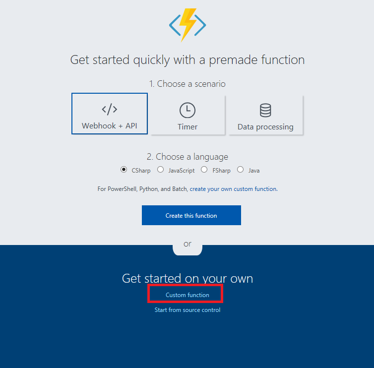
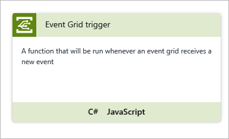
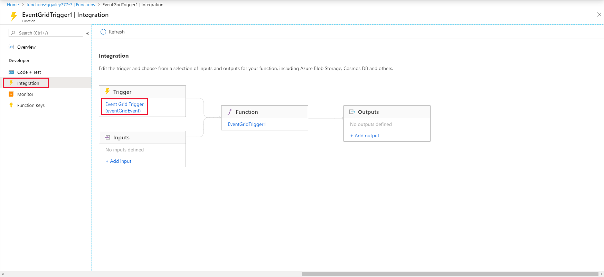

# Durable Functions publishing to Azure Event Grid (preview)

This article shows how to set up Durable Functions to publish orchestration lifecycle events (such as created, completed, and failed) to a custom [Azure Event Grid Topic](https://docs.microsoft.com/azure/event-grid/overview).

Following are some scenarios where this feature is useful:

* **DevOps scenarios like blue/green deployments**: You might want to know if any tasks are running before implementing the [side-by-side deployment strategy](durable-functions-versioning.md#side-by-side-deployments).

* **Advanced monitoring and diagnostics support**: You can keep track of orchestration status information in an external store optimized for queries, such as SQL database or CosmosDB.

* **Long-running background activity**: If you use Durable Functions for a long-running background activity, this feature helps you to know the current status.

## Prerequisites

* Install [Microsoft.Azure.WebJobs.Extensions.DurableTask](https://www.nuget.org/packages/Microsoft.Azure.WebJobs.Extensions.DurableTask) 1.3.0-rc or later in your Durable Functions project.
* Install [Azure Storage Emulator](https://docs.microsoft.com/azure/storage/common/storage-use-emulator).
* Install [Azure CLI](https://docs.microsoft.com/cli/azure/?view=azure-cli-latest) or use [Azure Cloud Shell](https://docs.microsoft.com/azure/cloud-shell/overview)

## Create a custom event grid topic

Create an event grid topic for sending events from Durable Functions. The following instructions show how to create a topic by using Azure CLI. For information about how to do it by using PowerShell or the Azure portal, refer to the following articles:

* [EventGrid Quickstarts: Create custom event - PowerShell](https://docs.microsoft.com/azure/event-grid/custom-event-quickstart-powershell)
* [EventGrid Quickstarts: Create custom event - Azure portal](https://docs.microsoft.com/azure/event-grid/custom-event-quickstart-portal)

### Create a resource group

Create a resource group with the `az group create` command. Currently, Azure Event Grid doesn't support all regions. For information about which regions are supported, see the [Azure Event Grid overview](https://docs.microsoft.com/azure/event-grid/overview).

```bash
az group create --name eventResourceGroup --location westus2
```

### Create a custom topic

An event grid topic provides a user-defined endpoint that you post your event to. Replace `<topic_name>` with a unique name for your topic. The topic name must be unique because it becomes a DNS entry.

```bash
az eventgrid topic create --name <topic_name> -l westus2 -g eventResourceGroup
```

## Get the endpoint and key

Get the endpoint of the topic. Replace `<topic_name>` with the name you chose.

```bash
az eventgrid topic show --name <topic_name> -g eventResourceGroup --query "endpoint" --output tsv
```

Get the topic key. Replace `<topic_name>` with the name you chose.

```bash
az eventgrid topic key list --name <topic_name> -g eventResourceGroup --query "key1" --output tsv
```

Now you can send events to the topic.

## Configure Azure Event Grid publishing

In your Durable Functions project, find the `host.json` file.

Add `eventGridTopicEndpoint` and `eventGridKeySettingName` in a `durableTask` property.

```json
{
    "durableTask": {
        "eventGridTopicEndpoint": "https://<topic_name>.westus2-1.eventgrid.azure.net/api/events",
        "eventGridKeySettingName": "EventGridKey"
    }
}
```

The possible Azure Event Grid configuration properties can be found in the [host.json documentation](../functions-host-json.md#durabletask). After you configure the `host.json` file, your function app sends lifecycle events to the event grid topic. This works when you run your function app both locally and in Azure.```

Set the app setting for the topic key in the Function App and `local.setting.json`. The following JSON is a sample of the `local.settings.json` for local debugging. Replace `<topic_key>` with the topic key.  

```json
{
    "IsEncrypted": false,
    "Values": {
        "AzureWebJobsStorage": "UseDevelopmentStorage=true",
        "AzureWebJobsDashboard": "UseDevelopmentStorage=true",
        "EventGridKey": "<topic_key>"
    }
}
```

Make sure that [Storage Emulator](https://docs.microsoft.com/azure/storage/common/storage-use-emulator) is working. It's a good idea to run the `AzureStorageEmulator.exe clear all` command before executing.

## Create functions that listen for events

Create a Function App. It's best to locate it in the same region as the event grid topic.

### Create an event grid trigger function

Create a function to receive the lifecycle events. Select **Custom Function**.



Choose Event Grid Trigger, and select `C#`.



Enter the name of the function, and then select `Create`.


A function with the following code is created:

```csharp
#r "Newtonsoft.Json"
using Newtonsoft.Json;
using Newtonsoft.Json.Linq;
using Microsoft.Extensions.Logging;

public static void Run(JObject eventGridEvent, ILogger log)
{
    log.LogInformation(eventGridEvent.ToString(Formatting.Indented));
}
```

Select `Add Event Grid Subscription`. This operation adds an event grid subscription for the event grid topic that you created. For more information, see [Concepts in Azure Event Grid](https://docs.microsoft.com/azure/event-grid/concepts)



Select `Event Grid Topics` for **Topic Type**. Select the resource group that you created for the event grid topic. Then select the instance of the event grid topic. Press `Create`.


Now you're ready to receive lifecycle events.

## Create Durable Functions to send the events

In your Durable Functions project, start debugging on your local machine.  The following code is the same as the template code for the Durable Functions. You already configured `host.json` and `local.settings.json` on your local machine.

```csharp
using System.Collections.Generic;
using System.Net.Http;
using System.Threading.Tasks;
using Microsoft.Azure.WebJobs;
using Microsoft.Azure.WebJobs.Extensions.Http;
using Microsoft.Azure.WebJobs.Host;
using Microsoft.Extensions.Logging;

namespace LifeCycleEventSpike
{
    public static class Sample
    {
        [FunctionName("Sample")]
        public static async Task<List<string>> RunOrchestrator(
            [OrchestrationTrigger] DurableOrchestrationContext context)
        {
            var outputs = new List<string>();

            // Replace "hello" with the name of your Durable Activity Function.
            outputs.Add(await context.CallActivityAsync<string>("Sample_Hello", "Tokyo"));
            outputs.Add(await context.CallActivityAsync<string>("Sample_Hello", "Seattle"));
            outputs.Add(await context.CallActivityAsync<string>("Sample_Hello", "London"));

            // returns ["Hello Tokyo!", "Hello Seattle!", "Hello London!"]
            return outputs;
        }

        [FunctionName("Sample_Hello")]
        public static string SayHello([ActivityTrigger] string name, ILogger log)
        {
            log.LogInformation($"Saying hello to {name}.");
            return $"Hello {name}!";
        }

        [FunctionName("Sample_HttpStart")]
        public static async Task<HttpResponseMessage> HttpStart(
            [HttpTrigger(AuthorizationLevel.Anonymous, "get", "post")]HttpRequestMessage req,
            [OrchestrationClient]DurableOrchestrationClient starter,
            ILogger log)
        {
            // Function input comes from the request content.
            string instanceId = await starter.StartNewAsync("Sample", null);
            log.LogInformation($"Started orchestration with ID = '{instanceId}'.");
            return starter.CreateCheckStatusResponse(req, instanceId);
        }
    }
}
```

If you call the `Sample_HttpStart` with Postman or your browser, Durable Function starts to send lifecycle events. The endpoint is usually `http://localhost:7071/api/Sample_HttpStart` for local debugging.

See the logs from the function that you created in the Azure portal.

```
2018-04-20T09:28:21.041 [Info] Function started (Id=3301c3ef-625f-40ce-ad4c-9ba2916b162d)
2018-04-20T09:28:21.104 [Info] {
    "id": "054fe385-c017-4ce3-b38a-052ac970c39d",
    "subject": "durable/orchestrator/Running",
    "data": {
        "hubName": "DurableFunctionsHub",
        "functionName": "Sample",
        "instanceId": "055d045b1c8a415b94f7671d8df693a6",
        "reason": "",
        "runtimeStatus": "Running"
    },
    "eventType": "orchestratorEvent",
    "eventTime": "2018-04-20T09:28:19.6492068Z",
    "dataVersion": "1.0",
    "metadataVersion": "1",
    "topic": "/subscriptions/<your_subscription_id>/resourceGroups/eventResourceGroup/providers/Microsoft.EventGrid/topics/durableTopic"
}

2018-04-20T09:28:21.104 [Info] Function completed (Success, Id=3301c3ef-625f-40ce-ad4c-9ba2916b162d, Duration=65ms)
2018-04-20T09:28:37.098 [Info] Function started (Id=36fadea5-198b-4345-bb8e-2837febb89a2)
2018-04-20T09:28:37.098 [Info] {
    "id": "8cf17246-fa9c-4dad-b32a-5a868104f17b",
    "subject": "durable/orchestrator/Completed",
    "data": {
        "hubName": "DurableFunctionsHub",
        "functionName": "Sample",
        "instanceId": "055d045b1c8a415b94f7671d8df693a6",
        "reason": "",
        "runtimeStatus": "Completed"
    },
    "eventType": "orchestratorEvent",
    "eventTime": "2018-04-20T09:28:36.5061317Z",
    "dataVersion": "1.0",
    "metadataVersion": "1",
    "topic": "/subscriptions/<your_subscription_id>/resourceGroups/eventResourceGroup/providers/Microsoft.EventGrid/topics/durableTopic"
}
2018-04-20T09:28:37.098 [Info] Function completed (Success, Id=36fadea5-198b-4345-bb8e-2837febb89a2, Duration=0ms)
```

## Event Schema

The following list explains the lifecycle events schema:

* **`id`**: Unique identifier for the event grid event.
* **`subject`**: Path to the event subject. `durable/orchestrator/{orchestrationRuntimeStatus}`. `{orchestrationRuntimeStatus}` will be `Running`, `Completed`, `Failed`, and `Terminated`.  
* **`data`**: Durable Functions Specific Parameters.
  * **`hubName`**: [TaskHub](durable-functions-task-hubs.md) name.
  * **`functionName`**: Orchestrator function name.
  * **`instanceId`**: Durable Functions instanceId.
  * **`reason`**: Additional data associated with the tracking event. For more information, see [Diagnostics in Durable Functions (Azure Functions)](durable-functions-diagnostics.md)
  * **`runtimeStatus`**: Orchestration Runtime Status. Running, Completed, Failed, Canceled.
* **`eventType`**: "orchestratorEvent"
* **`eventTime`**: Event time (UTC).
* **`dataVersion`**: Version of the lifecycle event schema.
* **`metadataVersion`**:  Version of the metadata.
* **`topic`**: Event grid topic resource.

## How to test locally

To test locally, use [ngrok](../functions-bindings-event-grid.md#local-testing-with-ngrok).

## Next steps

> [!div class="nextstepaction"]
> [Learn instance management in Durable Functions](durable-functions-instance-management.md)

> [!div class="nextstepaction"]
> [Learn versioning in Durable Functions](durable-functions-versioning.md)
