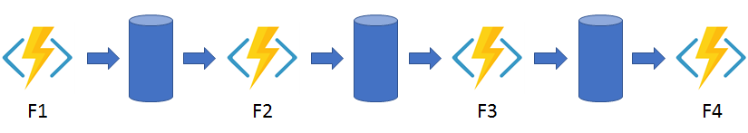
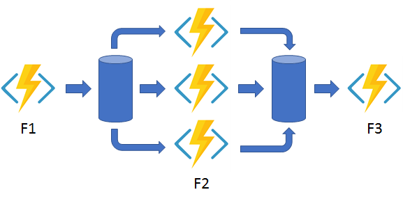
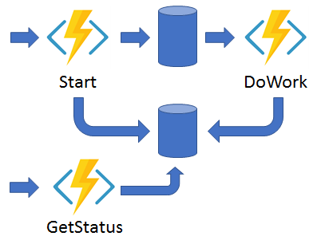
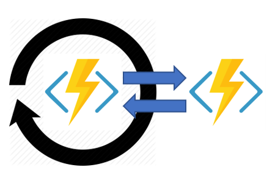
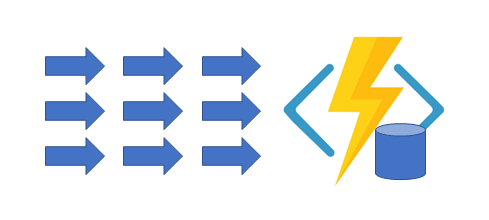

# What are Durable Functions?

*Durable Functions* is an extension of [Azure Functions](../functions-overview.md) that lets you write stateful functions in a serverless compute environment. The extension lets you define stateful workflows by writing [*orchestrator functions*](durable-functions-orchestrations.md) and stateful entities by writing [*entity functions*](durable-functions-entities.md) using the Azure Functions programming model. Behind the scenes, the extension manages state, checkpoints, and restarts for you, allowing you to focus on your business logic.

## <a name="language-support"></a>Supported languages

Durable Functions is designed to work with all Azure Functions programming languages but may have different minimum requirements for each language. The following table shows the minimum supported app configurations:

| Language stack | Azure Functions Runtime versions | Language worker version | Minimum bundles version |
| - | - | - | - |
| .NET / C# / F# | Functions 1.0+ | In-process <br/> Out-of-process | n/a |
| JavaScript/TypeScript (V3 prog. model) | Functions 2.0+ | Node 8+ | 2.x bundles |
| JavaScript/TypeScript (V4 prog. model) | Functions 4.25+ | Node 18+ | 3.15+ bundles |
| Python | Functions 2.0+ | Python 3.7+ | 2.x bundles |
| Python (V2 prog. model) | Functions 4.0+ | Python 3.7+ | 3.15+ bundles |
| PowerShell | Functions 3.0+ | PowerShell 7+ | 2.x bundles |
| Java | Functions 4.0+ | Java 8+ | 4.x bundles |

::: zone pivot="javascript"
[!INCLUDE [functions-nodejs-model-tabs-description](../../../includes/functions-nodejs-model-tabs-description.md)]
::: zone-end

Like Azure Functions, there are templates to help you develop Durable Functions using [Visual Studio](durable-functions-create-first-csharp.md), [Visual Studio Code](quickstart-js-vscode.md), and the [Azure portal](durable-functions-create-portal.md).

## Application patterns

The primary use case for Durable Functions is simplifying complex, stateful coordination requirements in serverless applications. The following sections describe typical application patterns that can benefit from Durable Functions:

* [Function chaining](#chaining)
* [Fan-out/fan-in](#fan-in-out)
* [Async HTTP APIs](#async-http)
* [Monitoring](#monitoring)
* [Human interaction](#human)
* [Aggregator (stateful entities)](#aggregator)

### <a name="chaining"></a>Pattern #1: Function chaining

In the function chaining pattern, a sequence of functions executes in a specific order. In this pattern, the output of one function is applied to the input of another function. The use of queues between each function ensures that the system stays durable and scalable, even though there is a flow of control from one function to the next.




You can use Durable Functions to implement the function chaining pattern concisely as shown in the following example.

In this example, the values `F1`, `F2`, `F3`, and `F4` are the names of other functions in the same function app. You can implement control flow by using normal imperative coding constructs. Code executes from the top down. The code can involve existing language control flow semantics, like conditionals and loops. You can include error handling logic in `try`/`catch`/`finally` blocks.

::: zone pivot="csharp"

# [C# (InProc)](#tab/in-process)

```csharp
[FunctionName("Chaining")]
public static async Task<object> Run(
    [OrchestrationTrigger] IDurableOrchestrationContext context)
{
    try
    {
        var x = await context.CallActivityAsync<object>("F1", null);
        var y = await context.CallActivityAsync<object>("F2", x);
        var z = await context.CallActivityAsync<object>("F3", y);
        return  await context.CallActivityAsync<object>("F4", z);
    }
    catch (Exception)
    {
        // Error handling or compensation goes here.
    }
}
```

You can use the `context` parameter to invoke other functions by name, pass parameters, and return function output. Each time the code calls `await`, the Durable Functions framework checkpoints the progress of the current function instance. If the process or virtual machine recycles midway through the execution, the function instance resumes from the preceding `await` call. For more information, see the next section, Pattern #2: Fan out/fan in.

# [C# (Isolated)](#tab/isolated-process)

```csharp
[Function("Chaining")]
public static async Task<object> Run(
    [OrchestrationTrigger] TaskOrchestrationContext context)
{
    try
    {
        var x = await context.CallActivityAsync<object>("F1", null);
        var y = await context.CallActivityAsync<object>("F2", x);
        var z = await context.CallActivityAsync<object>("F3", y);
        return  await context.CallActivityAsync<object>("F4", z);
    }
    catch (Exception)
    {
        // Error handling or compensation goes here.
    }
}
```

You can use the `context` parameter to invoke other functions by name, pass parameters, and return function output. Each time the code calls `await`, the Durable Functions framework checkpoints the progress of the current function instance. If the process or virtual machine recycles midway through the execution, the function instance resumes from the preceding `await` call. For more information, see the next section, Pattern #2: Fan out/fan in.

::: zone-end
::: zone pivot="javascript"

# [Model v3](#tab/nodejs-v3)

```javascript
const df = require("durable-functions");

module.exports = df.orchestrator(function*(context) {
    try {
        const x = yield context.df.callActivity("F1");
        const y = yield context.df.callActivity("F2", x);
        const z = yield context.df.callActivity("F3", y);
        return    yield context.df.callActivity("F4", z);
    } catch (error) {
        // Error handling or compensation goes here.
    }
});
```

You can use the `context.df` object to invoke other functions by name, pass parameters, and return function output. Each time the code calls `yield`, the Durable Functions framework checkpoints the progress of the current function instance. If the process or virtual machine recycles midway through the execution, the function instance resumes from the preceding `yield` call. For more information, see the next section, Pattern #2: Fan out/fan in.

> [!NOTE]
> The `context` object in JavaScript represents the entire [function context](../functions-reference-node.md#context-object). Access the Durable Functions context using the `df` property on the main context.

# [Model v4](#tab/nodejs-v4)

```javascript
const df = require("durable-functions");

df.app.orchestration("chainingDemo", function* (context) {
    try {
        const x = yield context.df.callActivity("F1");
        const y = yield context.df.callActivity("F2", x);
        const z = yield context.df.callActivity("F3", y);
        return yield context.df.callActivity("F4", z);
    } catch (error) {
        // Error handling or compensation goes here.
    }
});
```

You can use the `context.df` object to invoke other functions by name, pass parameters, and return function output. Each time the code calls `yield`, the Durable Functions framework checkpoints the progress of the current function instance. If the process or virtual machine recycles midway through the execution, the function instance resumes from the preceding `yield` call. For more information, see the next section, Pattern #2: Fan out/fan in.

> [!NOTE]
> The `context` object in JavaScript represents the entire [function context](../functions-reference-node.md#context-object). Access the Durable Functions context using the `df` property on the main context.

::: zone-end
::: zone pivot="python"

# [Python](#tab/v1-model)

```python
import azure.functions as func
import azure.durable_functions as df


def orchestrator_function(context: df.DurableOrchestrationContext):
    x = yield context.call_activity("F1", None)
    y = yield context.call_activity("F2", x)
    z = yield context.call_activity("F3", y)
    result = yield context.call_activity("F4", z)
    return result


main = df.Orchestrator.create(orchestrator_function)
```

You can use the `context` object to invoke other functions by name, pass parameters, and return function output. Each time the code calls `yield`, the Durable Functions framework checkpoints the progress of the current function instance. If the process or virtual machine recycles midway through the execution, the function instance resumes from the preceding `yield` call. For more information, see the next section, Pattern #2: Fan out/fan in.

> [!NOTE]
> The `context` object in Python represents the orchestration context. Access the main Azure Functions context using the `function_context` property on the orchestration context.

# [Python (V2 model)](#tab/v2-model)

```python
import azure.functions as func
import azure.durable_functions as df

myApp = df.DFApp(http_auth_level=func.AuthLevel.ANONYMOUS)

@myApp.orchestration_trigger(context_name="context")
def orchestrator_function(context: df.DurableOrchestrationContext):
    x = yield context.call_activity("F1", None)
    y = yield context.call_activity("F2", x)
    z = yield context.call_activity("F3", y)
    result = yield context.call_activity("F4", z)
    return result

```

You can use the `context` object to invoke other functions by name, pass parameters, and return function output. Each time the code calls `yield`, the Durable Functions framework checkpoints the progress of the current function instance. If the process or virtual machine recycles midway through the execution, the function instance resumes from the preceding `yield` call. For more information, see the next section, Pattern #2: Fan out/fan in.

> [!NOTE]
> The `context` object in Python represents the orchestration context. Access the main Azure Functions context using the `function_context` property on the orchestration context.

::: zone-end
::: zone pivot="powershell"

```PowerShell
param($Context)

$X = Invoke-DurableActivity -FunctionName 'F1'
$Y = Invoke-DurableActivity -FunctionName 'F2' -Input $X
$Z = Invoke-DurableActivity -FunctionName 'F3' -Input $Y
Invoke-DurableActivity -FunctionName 'F4' -Input $Z
```

You can use the `Invoke-DurableActivity` command to invoke other functions by name, pass parameters, and return function output. Each time the code calls `Invoke-DurableActivity` without the `NoWait` switch, the Durable Functions framework checkpoints the progress of the current function instance. If the process or virtual machine recycles midway through the execution, the function instance resumes from the preceding `Invoke-DurableActivity` call. For more information, see the next section, Pattern #2: Fan out/fan in.

::: zone-end
::: zone pivot="java"

```java
@FunctionName("Chaining")
public double functionChaining(
        @DurableOrchestrationTrigger(name = "ctx") TaskOrchestrationContext ctx) {
    String input = ctx.getInput(String.class);
    int x = ctx.callActivity("F1", input, int.class).await();
    int y = ctx.callActivity("F2", x, int.class).await();
    int z = ctx.callActivity("F3", y, int.class).await();
    return  ctx.callActivity("F4", z, double.class).await();
}
```

You can use the `ctx` object to invoke other functions by name, pass parameters, and return function output. The output of these method calls is a `Task<V>` object where `V` is the type of data returned by the invoked function. Each time you call `Task<V>.await()`, the Durable Functions framework checkpoints the progress of the current function instance. If the process unexpectedly recycles midway through the execution, the function instance resumes from the preceding `Task<V>.await()` call. For more information, see the next section, Pattern #2: Fan out/fan in.

::: zone-end

### <a name="fan-in-out"></a>Pattern #2: Fan out/fan in

In the fan out/fan in pattern, you execute multiple functions in parallel and then wait for all functions to finish. Often, some aggregation work is done on the results that are returned from the functions.



With normal functions, you can fan out by having the function send multiple messages to a queue. Fanning back in is much more challenging. To fan in, in a normal function, you write code to track when the queue-triggered functions end, and then store function outputs.

The Durable Functions extension handles this pattern with relatively simple code:

::: zone pivot="csharp"

# [C# (InProc)](#tab/in-process)

```csharp
[FunctionName("FanOutFanIn")]
public static async Task Run(
    [OrchestrationTrigger] IDurableOrchestrationContext context)
{
    var parallelTasks = new List<Task<int>>();

    // Get a list of N work items to process in parallel.
    object[] workBatch = await context.CallActivityAsync<object[]>("F1", null);
    for (int i = 0; i < workBatch.Length; i++)
    {
        Task<int> task = context.CallActivityAsync<int>("F2", workBatch[i]);
        parallelTasks.Add(task);
    }

    await Task.WhenAll(parallelTasks);

    // Aggregate all N outputs and send the result to F3.
    int sum = parallelTasks.Sum(t => t.Result);
    await context.CallActivityAsync("F3", sum);
}
```

The fan-out work is distributed to multiple instances of the `F2` function. The work is tracked by using a dynamic list of tasks. `Task.WhenAll` is called to wait for all the called functions to finish. Then, the `F2` function outputs are aggregated from the dynamic task list and passed to the `F3` function.

The automatic checkpointing that happens at the `await` call on `Task.WhenAll` ensures that a potential midway crash or reboot doesn't require restarting an already completed task.

# [C# (Isolated)](#tab/isolated-process)

```csharp
[Function("FanOutFanIn")]
public static async Task Run(
    [OrchestrationTrigger] TaskOrchestrationContext context)
{
    var parallelTasks = new List<Task<int>>();

    // Get a list of N work items to process in parallel.
    object[] workBatch = await context.CallActivityAsync<object[]>("F1", null);
    for (int i = 0; i < workBatch.Length; i++)
    {
        Task<int> task = context.CallActivityAsync<int>("F2", workBatch[i]);
        parallelTasks.Add(task);
    }

    await Task.WhenAll(parallelTasks);

    // Aggregate all N outputs and send the result to F3.
    int sum = parallelTasks.Sum(t => t.Result);
    await context.CallActivityAsync("F3", sum);
}
```

The fan-out work is distributed to multiple instances of the `F2` function. The work is tracked by using a dynamic list of tasks. `Task.WhenAll` is called to wait for all the called functions to finish. Then, the `F2` function outputs are aggregated from the dynamic task list and passed to the `F3` function.

The automatic checkpointing that happens at the `await` call on `Task.WhenAll` ensures that a potential midway crash or reboot doesn't require restarting an already completed task.

::: zone-end
::: zone pivot="javascript"

# [Model v3](#tab/nodejs-v3)

```javascript
const df = require("durable-functions");

module.exports = df.orchestrator(function*(context) {
    const parallelTasks = [];

    // Get a list of N work items to process in parallel.
    const workBatch = yield context.df.callActivity("F1");
    for (let i = 0; i < workBatch.length; i++) {
        parallelTasks.push(context.df.callActivity("F2", workBatch[i]));
    }

    yield context.df.Task.all(parallelTasks);

    // Aggregate all N outputs and send the result to F3.
    const sum = parallelTasks.reduce((prev, curr) => prev + curr, 0);
    yield context.df.callActivity("F3", sum);
});
```

The fan-out work is distributed to multiple instances of the `F2` function. The work is tracked by using a dynamic list of tasks. `context.df.Task.all` API is called to wait for all the called functions to finish. Then, the `F2` function outputs are aggregated from the dynamic task list and passed to the `F3` function.

The automatic checkpointing that happens at the `yield` call on `context.df.Task.all` ensures that a potential midway crash or reboot doesn't require restarting an already completed task.

# [Model v4](#tab/nodejs-v4)

```javascript
const df = require("durable-functions");

df.app.orchestration("fanOutFanInDemo", function* (context) {
    const parallelTasks = [];

    // Get a list of N work items to process in parallel.
    const workBatch = yield context.df.callActivity("F1");
    for (let i = 0; i < workBatch.length; i++) {
        parallelTasks.push(context.df.callActivity("F2", workBatch[i]));
    }

    yield context.df.Task.all(parallelTasks);

    // Aggregate all N outputs and send the result to F3.
    const sum = parallelTasks.reduce((prev, curr) => prev + curr, 0);
    yield context.df.callActivity("F3", sum);
});
```

The fan-out work is distributed to multiple instances of the `F2` function. The work is tracked by using a dynamic list of tasks. `context.df.Task.all` API is called to wait for all the called functions to finish. Then, the `F2` function outputs are aggregated from the dynamic task list and passed to the `F3` function.

The automatic checkpointing that happens at the `yield` call on `context.df.Task.all` ensures that a potential midway crash or reboot doesn't require restarting an already completed task.

::: zone-end
::: zone pivot="python"

# [Python](#tab/v1-model)

```python
import azure.durable_functions as df


def orchestrator_function(context: df.DurableOrchestrationContext):
    # Get a list of N work items to process in parallel.
    work_batch = yield context.call_activity("F1", None)

    parallel_tasks = [ context.call_activity("F2", b) for b in work_batch ]
    
    outputs = yield context.task_all(parallel_tasks)

    # Aggregate all N outputs and send the result to F3.
    total = sum(outputs)
    yield context.call_activity("F3", total)


main = df.Orchestrator.create(orchestrator_function)
```

The fan-out work is distributed to multiple instances of the `F2` function. The work is tracked by using a dynamic list of tasks. `context.task_all` API is called to wait for all the called functions to finish. Then, the `F2` function outputs are aggregated from the dynamic task list and passed to the `F3` function.

The automatic checkpointing that happens at the `yield` call on `context.task_all` ensures that a potential midway crash or reboot doesn't require restarting an already completed task.

# [Python (V2 model)](#tab/v2-model)

```python
import azure.functions as func
import azure.durable_functions as df

myApp = df.DFApp(http_auth_level=func.AuthLevel.ANONYMOUS)

@myApp.orchestration_trigger(context_name="context")
def orchestrator_function(context: df.DurableOrchestrationContext):
    # Get a list of N work items to process in parallel.
    work_batch = yield context.call_activity("F1", None)

    parallel_tasks = [ context.call_activity("F2", b) for b in work_batch ]
    
    outputs = yield context.task_all(parallel_tasks)

    # Aggregate all N outputs and send the result to F3.
    total = sum(outputs)
    yield context.call_activity("F3", total)
```

The fan-out work is distributed to multiple instances of the `F2` function. The work is tracked by using a dynamic list of tasks. `context.task_all` API is called to wait for all the called functions to finish. Then, the `F2` function outputs are aggregated from the dynamic task list and passed to the `F3` function.

The automatic checkpointing that happens at the `yield` call on `context.task_all` ensures that a potential midway crash or reboot doesn't require restarting an already completed task.

::: zone-end
::: zone pivot="powershell"

```PowerShell
param($Context)

# Get a list of work items to process in parallel.
$WorkBatch = Invoke-DurableActivity -FunctionName 'F1'

$ParallelTasks =
    foreach ($WorkItem in $WorkBatch) {
        Invoke-DurableActivity -FunctionName 'F2' -Input $WorkItem -NoWait
    }

$Outputs = Wait-ActivityFunction -Task $ParallelTasks

# Aggregate all outputs and send the result to F3.
$Total = ($Outputs | Measure-Object -Sum).Sum
Invoke-DurableActivity -FunctionName 'F3' -Input $Total
```

The fan-out work is distributed to multiple instances of the `F2` function. Please note the usage of the `NoWait` switch on the `F2` function invocation: this switch allows the orchestrator to proceed invoking `F2` without waiting for activity completion. The work is tracked by using a dynamic list of tasks. The `Wait-ActivityFunction` command is called to wait for all the called functions to finish. Then, the `F2` function outputs are aggregated from the dynamic task list and passed to the `F3` function.

The automatic checkpointing that happens at the `Wait-ActivityFunction` call ensures that a potential midway crash or reboot doesn't require restarting an already completed task.

::: zone-end
::: zone pivot="java"

```java
@FunctionName("FanOutFanIn")
public Integer fanOutFanInOrchestrator(
        @DurableOrchestrationTrigger(name = "ctx") TaskOrchestrationContext ctx) {
    // Get the list of work-items to process in parallel
    List<?> batch = ctx.callActivity("F1", List.class).await();

    // Schedule each task to run in parallel
    List<Task<Integer>> parallelTasks = batch.stream()
            .map(item -> ctx.callActivity("F2", item, Integer.class))
            .collect(Collectors.toList());

    // Wait for all tasks to complete, then return the aggregated sum of the results
    List<Integer> results = ctx.allOf(parallelTasks).await();
    return results.stream().reduce(0, Integer::sum);
}
```

The fan-out work is distributed to multiple instances of the `F2` function. The work is tracked by using a dynamic list of tasks. `ctx.allOf(parallelTasks).await()` is called to wait for all the called functions to finish. Then, the `F2` function outputs are aggregated from the dynamic task list and returned as the orchestrator function's output.

The automatic checkpointing that happens at the `.await()` call on `ctx.allOf(parallelTasks)` ensures that an unexpected process recycle doesn't require restarting any already completed tasks.

::: zone-end

> [!NOTE]
> In rare circumstances, it's possible that a crash could happen in the window after an activity function completes but before its completion is saved into the orchestration history. If this happens, the activity function would re-run from the beginning after the process recovers.

### <a name="async-http"></a>Pattern #3: Async HTTP APIs

The async HTTP API pattern addresses the problem of coordinating the state of long-running operations with external clients. A common way to implement this pattern is by having an HTTP endpoint trigger the long-running action. Then, redirect the client to a status endpoint that the client polls to learn when the operation is finished.



Durable Functions provides **built-in support** for this pattern, simplifying or even removing the code you need to write to interact with long-running function executions. For example, the Durable Functions quickstart samples ([C#](durable-functions-create-first-csharp.md), [JavaScript](quickstart-js-vscode.md), [TypeScript](quickstart-ts-vscode.md), [Python](quickstart-python-vscode.md), [PowerShell](quickstart-powershell-vscode.md), and [Java](quickstart-java.md)) show a simple REST command that you can use to start new orchestrator function instances. After an instance starts, the extension exposes webhook HTTP APIs that query the orchestrator function status. 

The following example shows REST commands that start an orchestrator and query its status. For clarity, some protocol details are omitted from the example.

```
> curl -X POST https://myfunc.azurewebsites.net/api/orchestrators/DoWork -H "Content-Length: 0" -i
HTTP/1.1 202 Accepted
Content-Type: application/json
Location: https://myfunc.azurewebsites.net/runtime/webhooks/durabletask/instances/b79baf67f717453ca9e86c5da21e03ec

{"id":"b79baf67f717453ca9e86c5da21e03ec", ...}

> curl https://myfunc.azurewebsites.net/runtime/webhooks/durabletask/instances/b79baf67f717453ca9e86c5da21e03ec -i
HTTP/1.1 202 Accepted
Content-Type: application/json
Location: https://myfunc.azurewebsites.net/runtime/webhooks/durabletask/instances/b79baf67f717453ca9e86c5da21e03ec

{"runtimeStatus":"Running","lastUpdatedTime":"2019-03-16T21:20:47Z", ...}

> curl https://myfunc.azurewebsites.net/runtime/webhooks/durabletask/instances/b79baf67f717453ca9e86c5da21e03ec -i
HTTP/1.1 200 OK
Content-Length: 175
Content-Type: application/json

{"runtimeStatus":"Completed","lastUpdatedTime":"2019-03-16T21:20:57Z", ...}
```

Because the Durable Functions runtime manages state for you, you don't need to implement your own status-tracking mechanism.

The Durable Functions extension exposes built-in HTTP APIs that manage long-running orchestrations. You can alternatively implement this pattern yourself by using your own function triggers (such as HTTP, a queue, or Azure Event Hubs) and the [durable client binding](durable-functions-bindings.md#orchestration-client). For example, you might use a queue message to trigger termination. Or, you might use an HTTP trigger that's protected by an Azure Active Directory authentication policy instead of the built-in HTTP APIs that use a generated key for authentication.

For more information, see the [HTTP features](durable-functions-http-features.md) article, which explains how you can expose asynchronous, long-running processes over HTTP using the Durable Functions extension.

### <a name="monitoring"></a>Pattern #4: Monitor

The monitor pattern refers to a flexible, recurring process in a workflow. An example is polling until specific conditions are met. You can use a regular [timer trigger](../functions-bindings-timer.md) to address a basic scenario, such as a periodic cleanup job, but its interval is static and managing instance lifetimes becomes complex. You can use Durable Functions to create flexible recurrence intervals, manage task lifetimes, and create multiple monitor processes from a single orchestration.

An example of the monitor pattern is to reverse the earlier async HTTP API scenario. Instead of exposing an endpoint for an external client to monitor a long-running operation, the long-running monitor consumes an external endpoint, and then waits for a state change.



In a few lines of code, you can use Durable Functions to create multiple monitors that observe arbitrary endpoints. The monitors can end execution when a condition is met, or another function can use the durable orchestration client to terminate the monitors. You can change a monitor's `wait` interval based on a specific condition (for example, exponential backoff.) 

The following code implements a basic monitor:

::: zone pivot="csharp"

# [C# (InProc)](#tab/in-process)

```csharp
[FunctionName("MonitorJobStatus")]
public static async Task Run(
    [OrchestrationTrigger] IDurableOrchestrationContext context)
{
    int jobId = context.GetInput<int>();
    int pollingInterval = GetPollingInterval();
    DateTime expiryTime = GetExpiryTime();

    while (context.CurrentUtcDateTime < expiryTime)
    {
        var jobStatus = await context.CallActivityAsync<string>("GetJobStatus", jobId);
        if (jobStatus == "Completed")
        {
            // Perform an action when a condition is met.
            await context.CallActivityAsync("SendAlert", jobId);
            break;
        }

        // Orchestration sleeps until this time.
        var nextCheck = context.CurrentUtcDateTime.AddSeconds(pollingInterval);
        await context.CreateTimer(nextCheck, CancellationToken.None);
    }

    // Perform more work here, or let the orchestration end.
}
```

# [C# (Isolated)](#tab/isolated-process)

```csharp
[Function("MonitorJobStatus")]
public static async Task Run(
    [OrchestrationTrigger] TaskOrchestrationContext context, int jobId)
{
    int pollingInterval = GetPollingInterval();
    DateTime expiryTime = GetExpiryTime();

    while (context.CurrentUtcDateTime < expiryTime)
    {
        var jobStatus = await context.CallActivityAsync<string>("GetJobStatus", jobId);
        if (jobStatus == "Completed")
        {
            // Perform an action when a condition is met.
            await context.CallActivityAsync("SendAlert", jobId);
            break;
        }

        // Orchestration sleeps until this time.
        var nextCheck = context.CurrentUtcDateTime.AddSeconds(pollingInterval);
        await context.CreateTimer(nextCheck, CancellationToken.None);
    }

    // Perform more work here, or let the orchestration end.
}
```

::: zone-end
::: zone pivot="javascript"

# [Model v3](#tab/nodejs-v3)

```javascript
const df = require("durable-functions");
const moment = require("moment");

module.exports = df.orchestrator(function*(context) {
    const jobId = context.df.getInput();
    const pollingInterval = getPollingInterval();
    const expiryTime = getExpiryTime();

    while (moment.utc(context.df.currentUtcDateTime).isBefore(expiryTime)) {
        const jobStatus = yield context.df.callActivity("GetJobStatus", jobId);
        if (jobStatus === "Completed") {
            // Perform an action when a condition is met.
            yield context.df.callActivity("SendAlert", jobId);
            break;
        }

        // Orchestration sleeps until this time.
        const nextCheck = moment.utc(context.df.currentUtcDateTime).add(pollingInterval, 's');
        yield context.df.createTimer(nextCheck.toDate());
    }

    // Perform more work here, or let the orchestration end.
});
```

# [Model v4](#tab/nodejs-v4)

```javascript
const df = require("durable-functions");
const { DateTime } = require("luxon");

df.app.orchestration("monitorDemo", function* (context) {
    const jobId = context.df.getInput();
    const pollingInterval = getPollingInterval();
    const expiryTime = getExpiryTime();

    while (DateTime.fromJSDate(context.df.currentUtcDateTime) < DateTime.fromJSDate(expiryTime)) {
        const jobStatus = yield context.df.callActivity("GetJobStatus", jobId);
        if (jobStatus === "Completed") {
            // Perform an action when a condition is met.
            yield context.df.callActivity("SendAlert", machineId);
            break;
        }

        // Orchestration sleeps until this time.
        const nextCheck = DateTime.fromJSDate(context.df.currentUtcDateTime).plus({
            seconds: pollingInterval,
        });
        yield context.df.createTimer(nextCheck.toJSDate());
    }

    // Perform more work here, or let the orchestration end.
});
```

::: zone-end
::: zone pivot="python"

# [Python](#tab/v1-model)

```python
import azure.durable_functions as df
import json
from datetime import timedelta 


def orchestrator_function(context: df.DurableOrchestrationContext):
    job = json.loads(context.get_input())
    job_id = job["jobId"]
    polling_interval = job["pollingInterval"]
    expiry_time = job["expiryTime"]

    while context.current_utc_datetime < expiry_time:
        job_status = yield context.call_activity("GetJobStatus", job_id)
        if job_status == "Completed":
            # Perform an action when a condition is met.
            yield context.call_activity("SendAlert", job_id)
            break

        # Orchestration sleeps until this time.
        next_check = context.current_utc_datetime + timedelta(seconds=polling_interval)
        yield context.create_timer(next_check)

    # Perform more work here, or let the orchestration end.


main = df.Orchestrator.create(orchestrator_function)
```

# [Python (V2 model)](#tab/v2-model)

```python
import json
from datetime import timedelta 

import azure.functions as func
import azure.durable_functions as df

myApp = df.DFApp(http_auth_level=func.AuthLevel.ANONYMOUS)

@myApp.orchestration_trigger(context_name="context")
def orchestrator_function(context: df.DurableOrchestrationContext):
    job = json.loads(context.get_input())
    job_id = job["jobId"]
    polling_interval = job["pollingInterval"]
    expiry_time = job["expiryTime"]

    while context.current_utc_datetime < expiry_time:
        job_status = yield context.call_activity("GetJobStatus", job_id)
        if job_status == "Completed":
            # Perform an action when a condition is met.
            yield context.call_activity("SendAlert", job_id)
            break

        # Orchestration sleeps until this time.
        next_check = context.current_utc_datetime + timedelta(seconds=polling_interval)
        yield context.create_timer(next_check)

    # Perform more work here, or let the orchestration end.
```

::: zone-end
::: zone pivot="powershell"

```powershell
param($Context)

$output = @()

$jobId = $Context.Input.JobId
$machineId = $Context.Input.MachineId
$pollingInterval = New-TimeSpan -Seconds $Context.Input.PollingInterval
$expiryTime = $Context.Input.ExpiryTime

while ($Context.CurrentUtcDateTime -lt $expiryTime) {
    $jobStatus = Invoke-DurableActivity -FunctionName 'GetJobStatus' -Input $jobId
    if ($jobStatus -eq "Completed") {
        # Perform an action when a condition is met.
        $output += Invoke-DurableActivity -FunctionName 'SendAlert' -Input $machineId
        break
    }

    # Orchestration sleeps until this time.
    Start-DurableTimer -Duration $pollingInterval
}

# Perform more work here, or let the orchestration end.

$output
```

::: zone-end
::: zone pivot="java"

```java
@FunctionName("Monitor")
public String monitorOrchestrator(
        @DurableOrchestrationTrigger(name = "ctx") TaskOrchestrationContext ctx) {
    JobInfo jobInfo = ctx.getInput(JobInfo.class);
    String jobId = jobInfo.getJobId();
    Instant expiryTime = jobInfo.getExpirationTime();

    while (ctx.getCurrentInstant().compareTo(expiryTime) < 0) {
        String status = ctx.callActivity("GetJobStatus", jobId, String.class).await();

        // Perform an action when a condition is met
        if (status.equals("Completed")) {
            // send an alert and exit
            ctx.callActivity("SendAlert", jobId).await();
            break;
        }

        // wait N minutes before doing the next poll
        Duration pollingDelay = jobInfo.getPollingDelay();
        ctx.createTimer(pollingDelay).await();
    }

    return "done";
}
```

::: zone-end


When a request is received, a new orchestration instance is created for that job ID. The instance polls a status until either a condition is met or until a timeout expires. A durable timer controls the polling interval. Then, more work can be performed, or the orchestration can end.

### <a name="human"></a>Pattern #5: Human interaction

Many automated processes involve some kind of human interaction. Involving humans in an automated process is tricky because people aren't as highly available and as responsive as cloud services. An automated process might allow for this interaction by using timeouts and compensation logic.

An approval process is an example of a business process that involves human interaction. Approval from a manager might be required for an expense report that exceeds a certain dollar amount. If the manager doesn't approve the expense report within 72 hours (maybe the manager went on vacation), an escalation process kicks in to get the approval from someone else (perhaps the manager's manager).


You can implement the pattern in this example by using an orchestrator function. The orchestrator uses a [durable timer](durable-functions-timers.md) to request approval. The orchestrator escalates if timeout occurs. The orchestrator waits for an [external event](durable-functions-external-events.md), such as a notification that's generated by a human interaction.

These examples create an approval process to demonstrate the human interaction pattern:

::: zone pivot="csharp"

# [C# (InProc)](#tab/in-process)

```csharp
[FunctionName("ApprovalWorkflow")]
public static async Task Run(
    [OrchestrationTrigger] IDurableOrchestrationContext context)
{
    await context.CallActivityAsync("RequestApproval", null);
    using (var timeoutCts = new CancellationTokenSource())
    {
        DateTime dueTime = context.CurrentUtcDateTime.AddHours(72);
        Task durableTimeout = context.CreateTimer(dueTime, timeoutCts.Token);

        Task<bool> approvalEvent = context.WaitForExternalEvent<bool>("ApprovalEvent");
        if (approvalEvent == await Task.WhenAny(approvalEvent, durableTimeout))
        {
            timeoutCts.Cancel();
            await context.CallActivityAsync("ProcessApproval", approvalEvent.Result);
        }
        else
        {
            await context.CallActivityAsync("Escalate", null);
        }
    }
}
```

To create the durable timer, call `context.CreateTimer`. The notification is received by `context.WaitForExternalEvent`. Then, `Task.WhenAny` is called to decide whether to escalate (timeout happens first) or process the approval (the approval is received before timeout).

# [C# (Isolated)](#tab/isolated-process)

```csharp
[Function("ApprovalWorkflow")]
public static async Task Run(
    [OrchestrationTrigger] TaskOrchestrationContext context)
{
    await context.CallActivityAsync("RequestApproval", null);
    using (var timeoutCts = new CancellationTokenSource())
    {
        DateTime dueTime = context.CurrentUtcDateTime.AddHours(72);
        Task durableTimeout = context.CreateTimer(dueTime, timeoutCts.Token);

        Task<bool> approvalEvent = context.WaitForExternalEvent<bool>("ApprovalEvent");
        if (approvalEvent == await Task.WhenAny(approvalEvent, durableTimeout))
        {
            timeoutCts.Cancel();
            await context.CallActivityAsync("ProcessApproval", approvalEvent.Result);
        }
        else
        {
            await context.CallActivityAsync("Escalate", null);
        }
    }
}
```

To create the durable timer, call `context.CreateTimer`. The notification is received by `context.WaitForExternalEvent`. Then, `Task.WhenAny` is called to decide whether to escalate (timeout happens first) or process the approval (the approval is received before timeout).

::: zone-end
::: zone pivot="javascript"

# [Model v3](#tab/nodejs-v3)

```javascript
const df = require("durable-functions");
const moment = require('moment');

module.exports = df.orchestrator(function*(context) {
    yield context.df.callActivity("RequestApproval");

    const dueTime = moment.utc(context.df.currentUtcDateTime).add(72, 'h');
    const durableTimeout = context.df.createTimer(dueTime.toDate());

    const approvalEvent = context.df.waitForExternalEvent("ApprovalEvent");
    const winningEvent = yield context.df.Task.any([approvalEvent, durableTimeout]);
    if (winningEvent === approvalEvent) {
        durableTimeout.cancel();
        yield context.df.callActivity("ProcessApproval", approvalEvent.result);
    } else {
        yield context.df.callActivity("Escalate");
    }
});
```

To create the durable timer, call `context.df.createTimer`. The notification is received by `context.df.waitForExternalEvent`. Then, `context.df.Task.any` is called to decide whether to escalate (timeout happens first) or process the approval (the approval is received before timeout).

# [Model v4](#tab/nodejs-v4)

```javascript
const df = require("durable-functions");
const { DateTime } = require("luxon");

df.app.orchestration("humanInteractionDemo", function* (context) {
    yield context.df.callActivity("RequestApproval");

    const dueTime = DateTime.fromJSDate(context.df.currentUtcDateTime).plus({ hours: 72 });
    const durableTimeout = context.df.createTimer(dueTime.toJSDate());

    const approvalEvent = context.df.waitForExternalEvent("ApprovalEvent");
    const winningEvent = yield context.df.Task.any([approvalEvent, durableTimeout]);
    if (winningEvent === approvalEvent) {
        durableTimeout.cancel();
        yield context.df.callActivity("ProcessApproval", approvalEvent.result);
    } else {
        yield context.df.callActivity("Escalate");
    }
});
```

To create the durable timer, call `context.df.createTimer`. The notification is received by `context.df.waitForExternalEvent`. Then, `context.df.Task.any` is called to decide whether to escalate (timeout happens first) or process the approval (the approval is received before timeout).

::: zone-end
::: zone pivot="python"

# [Python](#tab/v1-model)

```python
import azure.durable_functions as df
import json
from datetime import timedelta 


def orchestrator_function(context: df.DurableOrchestrationContext):
    yield context.call_activity("RequestApproval", None)

    due_time = context.current_utc_datetime + timedelta(hours=72)
    durable_timeout_task = context.create_timer(due_time)
    approval_event_task = context.wait_for_external_event("ApprovalEvent")

    winning_task = yield context.task_any([approval_event_task, durable_timeout_task])

    if approval_event_task == winning_task:
        durable_timeout_task.cancel()
        yield context.call_activity("ProcessApproval", approval_event_task.result)
    else:
        yield context.call_activity("Escalate", None)


main = df.Orchestrator.create(orchestrator_function)
```

To create the durable timer, call `context.create_timer`. The notification is received by `context.wait_for_external_event`. Then, `context.task_any` is called to decide whether to escalate (timeout happens first) or process the approval (the approval is received before timeout).

# [Python (V2 model)](#tab/v2-model)

```python
import json
from datetime import timedelta 

import azure.functions as func
import azure.durable_functions as df

myApp = df.DFApp(http_auth_level=func.AuthLevel.ANONYMOUS)

@myApp.orchestration_trigger(context_name="context")
def orchestrator_function(context: df.DurableOrchestrationContext):
    yield context.call_activity("RequestApproval", None)

    due_time = context.current_utc_datetime + timedelta(hours=72)
    durable_timeout_task = context.create_timer(due_time)
    approval_event_task = context.wait_for_external_event("ApprovalEvent")

    winning_task = yield context.task_any([approval_event_task, durable_timeout_task])

    if approval_event_task == winning_task:
        durable_timeout_task.cancel()
        yield context.call_activity("ProcessApproval", approval_event_task.result)
    else:
        yield context.call_activity("Escalate", None)
```

To create the durable timer, call `context.create_timer`. The notification is received by `context.wait_for_external_event`. Then, `context.task_any` is called to decide whether to escalate (timeout happens first) or process the approval (the approval is received before timeout).

::: zone-end
::: zone pivot="powershell"

```powershell
param($Context)

$output = @()

$duration = New-TimeSpan -Seconds $Context.Input.Duration
$managerId = $Context.Input.ManagerId

$output += Invoke-DurableActivity -FunctionName "RequestApproval" -Input $managerId

$durableTimeoutEvent = Start-DurableTimer -Duration $duration -NoWait
$approvalEvent = Start-DurableExternalEventListener -EventName "ApprovalEvent" -NoWait

$firstEvent = Wait-DurableTask -Task @($approvalEvent, $durableTimeoutEvent) -Any

if ($approvalEvent -eq $firstEvent) {
    Stop-DurableTimerTask -Task $durableTimeoutEvent
    $output += Invoke-DurableActivity -FunctionName "ProcessApproval" -Input $approvalEvent
}
else {
    $output += Invoke-DurableActivity -FunctionName "EscalateApproval"
}

$output
```
To create the durable timer, call `Start-DurableTimer`. The notification is received by `Start-DurableExternalEventListener`. Then, `Wait-DurableTask` is called to decide whether to escalate (timeout happens first) or process the approval (the approval is received before timeout).

::: zone-end
::: zone pivot="java"

```java
@FunctionName("ApprovalWorkflow")
public void approvalWorkflow(
        @DurableOrchestrationTrigger(name = "ctx") TaskOrchestrationContext ctx) {
    ApprovalInfo approvalInfo = ctx.getInput(ApprovalInfo.class);
    ctx.callActivity("RequestApproval", approvalInfo).await();

    Duration timeout = Duration.ofHours(72);
    try {
        // Wait for an approval. A TaskCanceledException will be thrown if the timeout expires.
        boolean approved = ctx.waitForExternalEvent("ApprovalEvent", timeout, boolean.class).await();
        approvalInfo.setApproved(approved);

        ctx.callActivity("ProcessApproval", approvalInfo).await();
    } catch (TaskCanceledException timeoutEx) {
        ctx.callActivity("Escalate", approvalInfo).await();
    }
}
```

The `ctx.waitForExternalEvent(...).await()` method call pauses the orchestration until it receives an event named `ApprovalEvent`, which has a `boolean` payload. If the event is received, an activity function is called to process the approval result. However, if no such event is received before the `timeout` (72 hours) expires, a `TaskCanceledException` is raised and the `Escalate` activity function is called.

::: zone-end

> [!NOTE]
> There is no charge for time spent waiting for external events when running in the Consumption plan.

An external client can deliver the event notification to a waiting orchestrator function by using the [built-in HTTP APIs](durable-functions-http-api.md#raise-event):

```bash
curl -d "true" http://localhost:7071/runtime/webhooks/durabletask/instances/{instanceId}/raiseEvent/ApprovalEvent -H "Content-Type: application/json"
```

An event can also be raised using the durable orchestration client from another function in the same function app:

::: zone pivot="csharp"

# [C# (InProc)](#tab/in-process)

```csharp
[FunctionName("RaiseEventToOrchestration")]
public static async Task Run(
    [HttpTrigger] string instanceId,
    [DurableClient] IDurableOrchestrationClient client)
{
    bool isApproved = true;
    await client.RaiseEventAsync(instanceId, "ApprovalEvent", isApproved);
}
```

# [C# (Isolated)](#tab/isolated-process)

```csharp
[Function("RaiseEventToOrchestration")]
public static async Task Run(
    [HttpTrigger] string instanceId,
    [DurableClient] DurableTaskClient client)
{
    bool isApproved = true;
    await client.RaiseEventAsync(instanceId, "ApprovalEvent", isApproved);
}
```

::: zone-end
::: zone pivot="javascript"

# [Model v3](#tab/nodejs-v3)

```javascript
const df = require("durable-functions");

module.exports = async function (context) {
    const client = df.getClient(context);
    const isApproved = true;
    await client.raiseEvent(instanceId, "ApprovalEvent", isApproved);
};
```

# [Model v4](#tab/nodejs-v4)

```javascript
const df = require("durable-functions");
const { app } = require("@azure/functions");

app.get("raiseEventToOrchestration", async function (request, context) {
    const instanceId = await request.text();
    const client = df.getClient(context);
    const isApproved = true;
    await client.raiseEvent(instanceId, "ApprovalEvent", isApproved);
});
```

::: zone-end
::: zone pivot="python"

# [Python](#tab/v1-model)

```python
import azure.functions as func
import azure.durable_functions as df

myApp = df.DFApp(http_auth_level=func.AuthLevel.ANONYMOUS)

# An HTTP-Triggered Function with a Durable Functions Client binding
@myApp.route(route="orchestrators/{functionName}")
@myApp.durable_client_input(client_name="client")
async def main(client):
    is_approved = True
    await client.raise_event(instance_id, "ApprovalEvent", is_approved)
```


# [Python (V2 model)](#tab/v2-model)

```python
import azure.functions as func
import azure.durable_functions as df

myApp = df.DFApp(http_auth_level=func.AuthLevel.ANONYMOUS)

@myApp.route(route="orchestrators/{functionName}")
@myApp.durable_client_input(client_name="client")
async def main(client: str):
    is_approved = True
    await client.raise_event(instance_id, "ApprovalEvent", is_approved)
```

::: zone-end
::: zone pivot="powershell"

```powershell

Send-DurableExternalEvent -InstanceId $InstanceId -EventName "ApprovalEvent" -EventData "true"

```

::: zone-end
::: zone pivot="java"

```java
@FunctionName("RaiseEventToOrchestration")
public void raiseEventToOrchestration(
        @HttpTrigger(name = "instanceId") String instanceId,
        @DurableClientInput(name = "durableContext") DurableClientContext durableContext) {

    DurableTaskClient client = durableContext.getClient();
    client.raiseEvent(instanceId, "ApprovalEvent", true);
}
```

::: zone-end

### <a name="aggregator"></a>Pattern #6: Aggregator (stateful entities)

The sixth pattern is about aggregating event data over a period of time into a single, addressable *entity*. In this pattern, the data being aggregated may come from multiple sources, may be delivered in batches, or may be scattered over long-periods of time. The aggregator might need to take action on event data as it arrives, and external clients may need to query the aggregated data.



The tricky thing about trying to implement this pattern with normal, stateless functions is that concurrency control becomes a huge challenge. Not only do you need to worry about multiple threads modifying the same data at the same time, you also need to worry about ensuring that the aggregator only runs on a single VM at a time.

You can use [Durable entities](durable-functions-entities.md) to easily implement this pattern as a single function.

::: zone pivot="csharp"

> [!NOTE]
> Support for Durable entities is currently in **preview** for the .NET-isolated worker.

# [C# (InProc)](#tab/in-process)

```csharp
[FunctionName("Counter")]
public static void Counter([EntityTrigger] IDurableEntityContext ctx)
{
    int currentValue = ctx.GetState<int>();
    switch (ctx.OperationName.ToLowerInvariant())
    {
        case "add":
            int amount = ctx.GetInput<int>();
            ctx.SetState(currentValue + amount);
            break;
        case "reset":
            ctx.SetState(0);
            break;
        case "get":
            ctx.Return(currentValue);
            break;
    }
}
```

Durable entities can also be modeled as classes in .NET. This model can be useful if the list of operations is fixed and becomes large. The following example is an equivalent implementation of the `Counter` entity using .NET classes and methods.

```csharp
public class Counter
{
    [JsonProperty("value")]
    public int CurrentValue { get; set; }

    public void Add(int amount) => this.CurrentValue += amount;

    public void Reset() => this.CurrentValue = 0;

    public int Get() => this.CurrentValue;

    [FunctionName(nameof(Counter))]
    public static Task Run([EntityTrigger] IDurableEntityContext ctx)
        => ctx.DispatchAsync<Counter>();
}
```

# [C# (Isolated)](#tab/isolated-process)

```csharp
public static Task DispatchAsync([EntityTrigger] TaskEntityDispatcher dispatcher)
    {
        return dispatcher.DispatchAsync(operation =>
        {
            if (operation.State.GetState(typeof(int)) is null)
            {
                operation.State.SetState(0);
            }

            switch (operation.Name.ToLowerInvariant())
            {
                case "add":
                    int state = operation.State.GetState<int>();
                    state += operation.GetInput<int>();
                    operation.State.SetState(state);
                    return new(state);
                case "reset":
                    operation.State.SetState(0);
                    break;
                case "get":
                    return new((operation.State.GetState(typeof(int)) as int?) ?? 0);
                case "delete": 
                    operation.State.SetState(null);
                    break; 
            }

            return default;
        });
    }
```

Durable entities can also be modeled as classes in .NET. This model can be useful if the list of operations is fixed and becomes large. The following example is an equivalent implementation of the `Counter` entity using .NET classes and methods.

```csharp
public class Counter
{
    public int CurrentValue { get; set; }

    public void Add(int amount) => this.CurrentValue += amount;

    public void Reset() => this.CurrentValue = 0;

    public int Get() => this.CurrentValue;

    [FunctionName(nameof(Counter))]
    public static Task RunEntityAsync([EntityTrigger] TaskEntityDispatcher dispatcher)
    {
        return dispatcher.DispatchAsync<Counter>();
    }
}
```
::: zone-end
::: zone pivot="javascript"

# [Model v3](#tab/nodejs-v3)

```javascript
const df = require("durable-functions");

module.exports = df.entity(function(context) {
    const currentValue = context.df.getState(() => 0);
    switch (context.df.operationName) {
        case "add":
            const amount = context.df.getInput();
            context.df.setState(currentValue + amount);
            break;
        case "reset":
            context.df.setState(0);
            break;
        case "get":
            context.df.return(currentValue);
            break;
    }
});
```

# [Model v4](#tab/nodejs-v4)

```javascript
const df = require("durable-functions");

df.app.entity("entityDemo", function (context) {
    const currentValue = context.df.getState(() => 0);
    switch (context.df.operationName) {
        case "add":
            const amount = context.df.getInput();
            context.df.setState(currentValue + amount);
            break;
        case "reset":
            context.df.setState(0);
            break;
        case "get":
            context.df.return(currentValue);
            break;
    }
});
```

::: zone-end
::: zone pivot="python"

# [Python](#tab/v1-model)

```python
import azure.functions as func
import azure.durable_functions as df


def entity_function(context: df.DurableOrchestrationContext):

    current_value = context.get_state(lambda: 0)
    operation = context.operation_name
    if operation == "add":
        amount = context.get_input()
        current_value += amount
        context.set_result(current_value)
    elif operation == "reset":
        current_value = 0
    elif operation == "get":
        context.set_result(current_value)
    
    context.set_state(current_value)

main = df.Entity.create(entity_function)
```

# [Python (V2 model)](#tab/v2-model)

```python
import azure.functions as func
import azure.durable_functions as df

myApp = df.DFApp(http_auth_level=func.AuthLevel.ANONYMOUS)

@myApp.entity_trigger(context_name="context")
def entity_function(context: df.DurableOrchestrationContext):

    current_value = context.get_state(lambda: 0)
    operation = context.operation_name
    if operation == "add":
        amount = context.get_input()
        current_value += amount
        context.set_result(current_value)
    elif operation == "reset":
        current_value = 0
    elif operation == "get":
        context.set_result(current_value)
    
    context.set_state(current_value)
```

::: zone-end
::: zone pivot="powershell"

> [!NOTE]
> Durable entities are currently not supported in PowerShell.

::: zone-end
::: zone pivot="java"

> [!NOTE]
> Durable entities are currently not supported in Java.

::: zone-end

Clients can enqueue *operations* for (also known as "signaling") an entity function using the [entity client binding](durable-functions-bindings.md#entity-client).

::: zone pivot="csharp"

# [C# (InProc)](#tab/in-process)

```csharp
[FunctionName("EventHubTriggerCSharp")]
public static async Task Run(
    [EventHubTrigger("device-sensor-events")] EventData eventData,
    [DurableClient] IDurableEntityClient entityClient)
{
    var metricType = (string)eventData.Properties["metric"];
    var delta = BitConverter.ToInt32(eventData.Body, eventData.Body.Offset);

    // The "Counter/{metricType}" entity is created on-demand.
    var entityId = new EntityId("Counter", metricType);
    await entityClient.SignalEntityAsync(entityId, "add", delta);
}
```

> [!NOTE]
> Dynamically generated proxies are also available in .NET for signaling entities in a type-safe way. And in addition to signaling, clients can also query for the state of an entity function using [type-safe methods](durable-functions-dotnet-entities.md#accessing-entities-through-interfaces) on the orchestration client binding.

# [C# (Isolated)](#tab/isolated-process)

```csharp
[Function("EventHubTriggerCSharp")]
public static async Task Run(
    [EventHubTrigger("device-sensor-events")] EventData eventData, 
    [DurableClient] DurableTaskClient client)
{
    var metricType = (string)eventData.Properties["metric"];
    var delta = BitConverter.ToInt32(eventData.Body, eventData.Body.Offset);

    // The "Counter/{metricType}" entity is created on-demand.
    var entityId = new EntityInstanceId("Counter", metricType);
    await client.Entities.SignalEntityAsync(entityId, "add", delta);
}
```
::: zone-end
::: zone pivot="javascript"

# [Model v3](#tab/nodejs-v3)

```javascript
const df = require("durable-functions");
const { app } = require("@azure/functions");

module.exports = async function (context) {
    const client = df.getClient(context);
    const entityId = new df.EntityId("Counter", "myCounter");
    await client.signalEntity(entityId, "add", 1);
};
```

# [Model v4](#tab/nodejs-v4)

```javascript
const df = require("durable-functions");
const { app } = require("@azure/functions");

app.get("signalEntityDemo", async function (request, context) {
    const client = df.getClient(context);
    const entityId = new df.EntityId("Counter", "myCounter");
    await client.signalEntity(entityId, "add", 1);
});
```

::: zone-end
::: zone pivot="python"

# [Python](#tab/v1-model)

```python
import azure.functions as func
import azure.durable_functions as df

async def main(req: func.HttpRequest, starter: str) -> func.HttpResponse:
    client = df.DurableOrchestrationClient(starter)
    entity_id = df.EntityId("Counter", "myCounter")
    instance_id = await client.signal_entity(entity_id, "add", 1)
    return func.HttpResponse("Entity signaled")
```

# [Python (V2 model)](#tab/v2-model)

```python
import azure.functions as func
import azure.durable_functions as df

myApp = df.DFApp(http_auth_level=func.AuthLevel.ANONYMOUS)

@myApp.route(route="orchestrators/{functionName}")
@myApp.durable_client_input(client_name="client")
async def main(req: func.HttpRequest, client) -> func.HttpResponse:
    entity_id = df.EntityId("Counter", "myCounter")
    instance_id = await client.signal_entity(entity_id, "add", 1)
    return func.HttpResponse("Entity signaled")
```

::: zone-end
::: zone pivot="powershell"

> [!NOTE]
> Durable entities are currently not supported in PowerShell.

::: zone-end
::: zone pivot="java"

> [!NOTE]
> Durable entities are currently not supported in Java.

::: zone-end

Entity functions are available in [Durable Functions 2.0](durable-functions-versions.md) and above for C#, JavaScript, and Python.

## The technology

Behind the scenes, the Durable Functions extension is built on top of the [Durable Task Framework](https://github.com/Azure/durabletask), an open-source library on GitHub that's used to build workflows in code. Like Azure Functions is the serverless evolution of Azure WebJobs, Durable Functions is the serverless evolution of the Durable Task Framework. Microsoft and other organizations use the Durable Task Framework extensively to automate mission-critical processes. It's a natural fit for the serverless Azure Functions environment.

## Code constraints

In order to provide reliable and long-running execution guarantees, orchestrator functions have a set of coding rules that must be followed. For more information, see the [Orchestrator function code constraints](durable-functions-code-constraints.md) article.

## Billing

Durable Functions are billed the same as Azure Functions. For more information, see [Azure Functions pricing](https://azure.microsoft.com/pricing/details/functions/). When executing orchestrator functions in the Azure Functions [Consumption plan](../consumption-plan.md), there are some billing behaviors to be aware of. For more information on these behaviors, see the [Durable Functions billing](durable-functions-billing.md) article.

## Jump right in

You can get started with Durable Functions in under 10 minutes by completing one of these language-specific quickstart tutorials:

* [C# using Visual Studio 2019](durable-functions-create-first-csharp.md)
* [JavaScript using Visual Studio Code](quickstart-js-vscode.md)
* [TypeScript using Visual Studio Code](quickstart-ts-vscode.md)
* [Python using Visual Studio Code](quickstart-python-vscode.md)
* [PowerShell using Visual Studio Code](quickstart-powershell-vscode.md)
* [Java using Maven](quickstart-java.md)

In these quickstarts, you locally create and test a "hello world" durable function. You then publish the function code to Azure. The function you create orchestrates and chains together calls to other functions.

## Publications

Durable Functions is developed in collaboration with Microsoft Research. As a result, the Durable Functions team actively produces research papers and artifacts; these include:

* [Durable Functions: Semantics for Stateful Serverless](https://www.microsoft.com/research/uploads/prod/2021/10/DF-Semantics-Final.pdf) *(OOPSLA'21)*
* [Serverless Workflows with Durable Functions and Netherite](https://arxiv.org/pdf/2103.00033.pdf) *(pre-print)*

## Learn more

The following video highlights the benefits of Durable Functions:

> [!VIDEO https://learn.microsoft.com/Shows/Azure-Friday/Durable-Functions-in-Azure-Functions/player] 

For a more in-depth discussion of Durable Functions and the underlying technology, see the following video (it's focused on .NET, but the concepts also apply to other supported languages):

> [!VIDEO https://learn.microsoft.com/Events/dotnetConf/2018/S204/player]

Because Durable Functions is an advanced extension for [Azure Functions](../functions-overview.md), it isn't appropriate for all applications. For a comparison with other Azure orchestration technologies, see [Compare Azure Functions and Azure Logic Apps](../functions-compare-logic-apps-ms-flow-webjobs.md#compare-azure-functions-and-azure-logic-apps).

## Next steps

> [!div class="nextstepaction"]
> [Durable Functions function types and features](durable-functions-types-features-overview.md)
