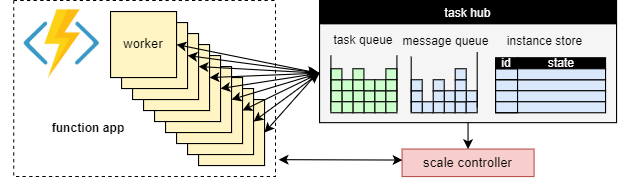

# Performance and scale in Durable Functions (Azure Functions)

To optimize performance and scalability, it's important to understand the unique scaling characteristics of [Durable Functions](durable-functions-overview.md). In this article, we explain how workers are scaled based on load, and how one can tune the various parameters.

## Worker scaling

A fundamental benefit of the [task hub concept](durable-functions-task-hubs.md) is that the number of workers that process task hub work items can be continuously adjusted. In particular, applications can add more workers (*scale out*) if the work needs to be processed more quickly, and can remove workers (*scale in*) if there is not enough work to keep the workers busy.
It is even possible to *scale to zero* if the task hub is completely idle. When scaled to zero, there are no workers at all; only the scale controller and the storage need to remain active.

The following diagram illustrates this concept:



### Automatic scaling

As with all Azure Functions running in the Consumption and Elastic Premium plans, Durable Functions supports auto-scale via the [Azure Functions scale controller](../event-driven-scaling.md#runtime-scaling). The Scale Controller monitors how long messages and tasks have to wait before they are processed. Based on these latencies it can decide whether to add or remove workers.

> [!NOTE]
> Starting with Durable Functions 2.0, function apps can be configured to run within VNET-protected service endpoints in the Elastic Premium plan. In this configuration, the Durable Functions triggers initiate scale requests instead of the Scale Controller. For more information, see [Runtime scale monitoring](../functions-networking-options.md#premium-plan-with-virtual-network-triggers).

On a premium plan, automatic scaling can help to keep the number of workers (and therefore the operating cost) roughly proportional to the load that the application is experiencing.

### CPU usage

**Orchestrator functions** are executed on a single thread to ensure that execution can be deterministic across many replays. Because of this single-threaded execution, it's important that orchestrator function threads do not perform CPU-intensive tasks, do I/O, or block for any reason. Any work that may require I/O, blocking, or multiple threads should be moved into activity functions.

**Activity functions** have all the same behaviors as regular queue-triggered functions. They can safely do I/O, execute CPU intensive operations, and use multiple threads. Because activity triggers are stateless, they can freely scale out to an unbounded number of VMs.

**Entity functions** are also executed on a single thread and operations are processed one-at-a-time. However, entity functions do not have any restrictions on the type of code that can be executed.

### Function timeouts

Activity, orchestrator, and entity functions are subject to the same [function timeouts](../functions-scale.md#timeout) as all Azure Functions. As a general rule, Durable Functions treats function timeouts the same way as unhandled exceptions thrown by the application code.

For example, if an activity times out, the function execution is recorded as a failure, and the orchestrator is notified and handles the timeout just like any other exception: retries take place if specified by the call, or an exception handler may be executed.

### Entity operation batching

To improve performance and reduce cost, a single work item may execute an entire batch of entity operations. On consumption plans, each batch is then billed as a single function execution.

By default, the maximum batch size is 50 for consumption plans and 5000 for all other plans. The maximum batch size can also be configured in the [host.json](durable-functions-bindings.md#host-json) file. If the maximum batch size is 1, batching is effectively disabled.

> [!NOTE]
> If individual entity operations take a long time to execute, it may be beneficial to limit the maximum batch size to reduce the risk of [function timeouts](#function-timeouts), in particular on consumption plans.

## Instance caching

Generally, to process an [orchestration work item](durable-functions-task-hubs.md#work-items), a worker has to both

1. Fetch the orchestration history.
1. Replay the orchestrator code using the history.

If the same worker is processing multiple work items for the same orchestration, the storage provider can optimize this process by caching the history in the worker's memory, which eliminates the first step. Moreover, it can cache the mid-execution orchestrator, which eliminates the second step, the history replay, as well.

The typical effect of caching is reduced I/O against the underlying storage service, and overall improved throughput and latency. On the other hand, caching increases the memory consumption on the worker.  

Instance caching is currently supported by the Azure Storage provider and by the Netherite storage provider. The table below provides a comparison.

|| Azure Storage provider | Netherite storage provider | MSSQL storage provider |
|----|----|----|----|
| **Instance caching**    | Supported<br/>(.NET in-process worker only)       | Supported          | Not supported |
| **Default setting**      | Disabled       | Enabled   | n/a |
| **Mechanism**        | Extended Sessions       | Instance Cache   | n/a |
| **Documentation**  |  See [Extended sessions](durable-functions-azure-storage-provider.md#extended-sessions) | See [Instance cache](https://microsoft.github.io/durabletask-netherite/#/caching) | n/a |

> [!TIP]
> Caching can reduce how often histories are replayed, but it cannot eliminate replay altogether. When developing orchestrators, we highly recommend testing them on a configuration that disables caching. This forced-replay behavior can useful for detecting [orchestrator function code constraints](durable-functions-code-constraints.md) violations at development time.  

### Comparison of caching mechanisms

The providers use different mechanisms to implement caching, and offer different parameters to configure the caching behavior.

* **Extended sessions**, as used by the Azure Storage provider, keep mid-execution orchestrators in memory until they are idle for some time. The parameters to control this mechanism are  `extendedSessionsEnabled` and `extendedSessionIdleTimeoutInSeconds`. For more details, see the section [Extended sessions](durable-functions-azure-storage-provider.md#extended-sessions) of the Azure Storage provider documentation.

> [!NOTE]
> Extended sessions are supported only in the .NET in-process worker.

* The **Instance cache**, as used by the Netherite storage provider, keeps the state of all instances, including their histories, in the worker's memory, while keeping track of the total memory used. If the cache size exceeds the limit configured by `InstanceCacheSizeMB`, the least recently used instance data is evicted. If `CacheOrchestrationCursors` is set to true, the cache also stores the mid-execution orchestrators along with the instance state.
 For more details, see the section [Instance cache](https://microsoft.github.io/durabletask-netherite/#/caching) of the Netherite storage provider documentation.

> [!NOTE]
> Instance caches work for all language SDKs, but the `CacheOrchestrationCursors` option is available only for the .NET in-process worker.

## Concurrency throttles

A single worker instance can execute multiple [work items](durable-functions-task-hubs.md#work-items) concurrently. This helps to increase parallelism and more efficiently utilize the workers.
However, if a worker attempts to process too many work items at the same time, it may exhaust its available resources, such as the CPU load, the number of network connections, or the available memory.

To ensure that an individual worker does not overcommit, it may be necessary to throttle the per-instance concurrency. By limiting the number of functions that are concurrently running on each worker, we can avoid exhausting the resource limits on that worker.

> [!NOTE]
> The concurrency throttles only apply locally, to limit what is currently being processed **per worker**. Thus, these throttles do not limit the total throughput of the system.

> [!TIP]
> In some cases, throttling the per-worker concurrency can actually *increase* the total throughput of the system. This can occur when each worker takes less work, causing the scale controller to add more workers to keep up with the queues, which then increases the total throughput.

### Configuration of throttles

Activity, orchestrator, and entity function concurrency limits can be configured in the **host.json** file. The relevant settings are `durableTask/maxConcurrentActivityFunctions` for activity functions and `durableTask/maxConcurrentOrchestratorFunctions` for both orchestrator and entity functions. These settings control the maximum number of orchestrator, entity, or activity functions that are loaded into memory on a single worker.

> [!NOTE]
> Orchestrations and entities are only loaded into memory when they are actively processing events or operations, or if [instance caching](durable-functions-perf-and-scale.md#instance-caching) is enabled. After executing their logic and awaiting (i.e. hitting an `await` (C#) or `yield` (JavaScript, Python) statement in the orchestrator function code), they may be unloaded from memory. Orchestrations and entities that are unloaded from memory don't count towards the `maxConcurrentOrchestratorFunctions` throttle. Even if millions of orchestrations or entities are in the "Running" state, they only count towards the throttle limit when they are loaded into active memory. An orchestration that schedules an activity function similarly doesn't count towards the throttle if the orchestration is waiting for the activity to finish executing.

#### Functions 2.0

```json
{
  "extensions": {
    "durableTask": {
      "maxConcurrentActivityFunctions": 10,
      "maxConcurrentOrchestratorFunctions": 10
    }
  }
}
```

#### Functions 1.x

```json
{
  "durableTask": {
    "maxConcurrentActivityFunctions": 10,
    "maxConcurrentOrchestratorFunctions": 10
  }
}
```

### Language runtime considerations

The language runtime you select may impose strict concurrency restrictions or your functions. For example, Durable Function apps written in Python or PowerShell may only support running a single function at a time on a single VM. This can result in significant performance problems if not carefully accounted for. For example, if an orchestrator fans-out to 10 activities but the language runtime restricts concurrency to just one function, then 9 of the 10 activity functions will be stuck waiting for a chance to run. Furthermore, these 9 stuck activities will not be able to be load balanced to any other workers because the Durable Functions runtime will have already loaded them into memory. This becomes especially problematic if the activity functions are long-running.

If the language runtime you are using places a restriction on concurrency, you should update the Durable Functions concurrency settings to match the concurrency settings of your language runtime. This ensures that the Durable Functions runtime will not attempt to run more functions concurrently than is allowed by the language runtime, allowing any pending activities to be load balanced to other VMs. For example, if you have a Python app that restricts concurrency to 4 functions (perhaps it's only configured with 4 threads on a single language worker process or 1 thread on 4 language worker processes) then you should configure both `maxConcurrentOrchestratorFunctions` and `maxConcurrentActivityFunctions` to 4.

For more information and performance recommendations for Python, see [Improve throughput performance of Python apps in Azure Functions](../python-scale-performance-reference.md). The techniques mentioned in this Python developer reference documentation can have a substantial impact on Durable Functions performance and scalability.

## Partition count

Some of the storage providers use a *partitioning* mechanism and allow specifying a `partitionCount` parameter.

When using partitioning, workers do not directly compete for individual work items. Instead, the work items are first grouped into `partitionCount` partitions. These partitions are then assigned to workers. This partitioned approach to load distribution can help to reduce the total number of storage accesses required. Also, it can enable [instance caching](durable-functions-perf-and-scale.md#instance-caching) and improve locality because it creates *affinity*: all work items for the same instance are processed by the same worker.

> [!NOTE]
> Partitioning limits scale out because at most `partitionCount` workers can process work items from a partitioned queue.

The following table shows, for each storage provider, which queues are partitioned, and the allowable range and default values for the `partitionCount` parameter.

|| Azure Storage provider | Netherite storage provider | MSSQL storage provider |
|----|----|----|----|
| **Instance messages**| Partitioned        | Partitioned          | Not partitioned     |
| **Activity messages**   | Not partitioned      | Partitioned          | Not partitioned    |
| **Default `partitionCount`**    | 4        | 12          | n/a    |
| **Maximum `partitionCount`**    | 16       | 32          | n/a     |
| **Documentation**  |  See [Orchestrator scale-out](durable-functions-azure-storage-provider.md#orchestrator-scale-out) | See [Partition count considerations](https://microsoft.github.io/durabletask-netherite/#/settings?id=partition-count-considerations) | n/a |

> [!WARNING]
> The partition count can no longer be changed after a task hub has been created. Thus, it is advisable to set it to a large enough value to accommodate future scale out requirements for the task hub instance.

### Configuration of partition count

The `partitionCount` parameter can be specified in the **host.json** file. The following example host.json snippet sets the `durableTask/storageProvider/partitionCount` property (or `durableTask/partitionCount` in Durable Functions 1.x) to `3`.

#### Durable Functions 2.x

```json
{
  "extensions": {
    "durableTask": {
      "storageProvider": {
        "partitionCount": 3
      }
    }
  }
}
```

#### Durable Functions 1.x

```json
{
  "extensions": {
    "durableTask": {
      "partitionCount": 3
    }
  }
}
```

## Performance targets

When planning to use Durable Functions for a production application, it is important to consider the performance requirements early in the planning process. Some basic usage scenarios include:

* **Sequential activity execution**: This scenario describes an orchestrator function that runs a series of activity functions one after the other. It most closely resembles the [Function Chaining](durable-functions-sequence.md) sample.
* **Parallel activity execution**: This scenario describes an orchestrator function that executes many activity functions in parallel using the [Fan-out, Fan-in](durable-functions-cloud-backup.md) pattern.
* **Parallel response processing**: This scenario is the second half of the [Fan-out, Fan-in](durable-functions-cloud-backup.md) pattern. It focuses on the performance of the fan-in. It's important to note that unlike fan-out, fan-in is done by a single orchestrator function instance, and therefore can only run on a single VM.
* **External event processing**: This scenario represents a single orchestrator function instance that waits on [external events](durable-functions-external-events.md), one at a time.
* **Entity operation processing**: This scenario tests how quickly a _single_ [Counter entity](durable-functions-entities.md) can process a constant stream of operations.

We provide throughput numbers for these scenarios in the respective documentation for the storage providers. In particular:

* for the Azure Storage provider, see [Performance Targets](durable-functions-azure-storage-provider.md#performance-targets).
* for the Netherite storage provider, see [Basic Scenarios](https://microsoft.github.io/durabletask-netherite/#/scenarios).
* for the MSSQL storage provider, see [Orchestration Throughput Benchmarks](https://microsoft.github.io/durabletask-mssql/#/scaling?id=orchestration-throughput-benchmarks).

> [!TIP]
> Unlike fan-out, fan-in operations are limited to a single VM. If your application uses the fan-out, fan-in pattern and you are concerned about fan-in performance, consider sub-dividing the activity function fan-out across multiple [sub-orchestrations](durable-functions-sub-orchestrations.md).

## Next steps

> [!div class="nextstepaction"]
> [Learn about the Azure Storage provider](durable-functions-azure-storage-provider.md)
