# Task hubs in Durable Functions (Azure Functions)

A *task hub* in [Durable Functions](durable-functions-overview.md) is a representation of the current state of the application in storage, including all the pending work. While a function app is running, the progress of orchestration, activity, and entity functions is continually stored in the task hub.  This ensures that the application can resume processing where it left off, should it require to be restarted after being temporarily stopped or interrupted for some reason. Also, it allows the function app to scale the compute workers dynamically.

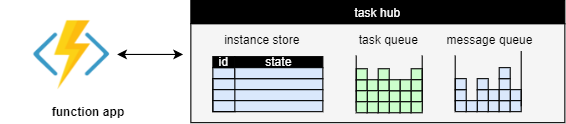

Conceptually, a task hub stores the following information:

* The **instance states** of all orchestration and entity instances.
* The messages to be processed, including
  * any **activity messages** that represent activities waiting to be run.
  * any **instance messages** that are waiting to be delivered to instances.

The difference between activity and instance messages is that activity messages are stateless, and can thus be processed anywhere, while instance messages need to be delivered to a particular stateful instance (orchestration or entity), identified by its instance ID.

Internally, each storage provider may use a different organization to represent instance states and messages. For example, messages are stored in Azure Storage Queues by the Azure Storage provider, but in relational tables by the MSSQL provider. These differences don't matter as far as the design of the application is concerned, but some of them may influence the performance characteristics. We discuss them in the section [Representation in storage](durable-functions-task-hubs.md#representation-in-storage) below.

## Work items

The activity messages and instance messages in the task hub represent the work that the function app needs to process. While the function app is running, it continuously fetches *work items* from the task hub. Each work item is processing one or more messages. We distinguish two types of work items:

* **Activity work items**: Run an activity function to process an activity message.
* **Orchestrator work item**: Run an orchestrator or entity function to process one or more instance messages.

Workers can process multiple work items at the same time, subject to the [configured per-worker concurrency limits](durable-functions-perf-and-scale.md#concurrency-throttles).

Once a worker completes a work item, it commits the effects back to the task hub. These effects vary by the type of function that was executed:

* A completed activity function creates an instance message containing the result, addressed to the parent orchestrator instance.
* A completed orchestrator function updates the orchestration state and history, and may create new messages.
* A completed entity function updates the entity state, and may also create new instance messages.

For orchestrations, each work item represents one **episode** of that orchestration's execution. An episode starts when there are new messages for the orchestrator to process. Such a message may indicate that the orchestration should start; or it may indicate that an activity, entity call, timer, or suborchestration has completed; or it can represent an external event. The message triggers a work item that allows the orchestrator to process the result and to continue with the next episode. That episode ends when the orchestrator either completes, or reaches a point where it must wait for new messages.

### Execution example

Consider a fan-out-fan-in orchestration that starts two activities in parallel, and waits for both of them to complete:

# [C#](#tab/csharp)

```csharp
[FunctionName("Example")]
public static async Task Run([OrchestrationTrigger] IDurableOrchestrationContext context)
{
    Task t1 = context.CallActivityAsync<int>("MyActivity", 1);
    Task t2 = context.CallActivityAsync<int>("MyActivity", 2);
    await Task.WhenAll(t1, t2);
}
```

# [JavaScript](#tab/javascript)

```JavaScript
module.exports = df.orchestrator(function*(context){
    const tasks = [];
    tasks.push(context.df.callActivity("MyActivity", 1));
    tasks.push(context.df.callActivity("MyActivity", 2));
    yield context.df.Task.all(tasks);
});
```

# [Python](#tab/python)

```python
def orchestrator_function(context: df.DurableOrchestrationContext):
    tasks = []
    tasks.append(context.call_activity("MyActivity", 1))
    tasks.append(context.call_activity("MyActivity", 2))
    yield context.task_all(tasks)
```

# [PowerShell](#tab/powershell)

```powershell
param($Context)

$Tasks = @()

$Tasks += Invoke-DurableActivity -FunctionName 'MyActivity' -Input 1 -NoWait
$Tasks += Invoke-DurableActivity -FunctionName 'MyActivity' -Input 2 -NoWait

Wait-DurableTask -Task $Tasks
```

# [Java](#tab/java)

```java
@FunctionName("Example")
public void exampleOrchestrator(
        @DurableOrchestrationTrigger(name = "ctx") TaskOrchestrationContext ctx) {
    Task<Void> t1 = ctx.callActivity("MyActivity", 1);
    Task<Void> t2 = ctx.callActivity("MyActivity", 2);
    ctx.allOf(List.of(t1, t2)).await();
}
```

---

After this orchestration is initiated by a client it's processed by the function app as a sequence of work items. Each completed work item updates the task hub state when it commits. These are the steps:

1. A client requests to start a new orchestration with instance-id "123". After the client completes this request, the task hub contains a placeholder for the orchestration state and an instance message:

   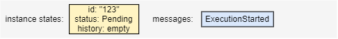

   The label `ExecutionStarted` is one of many [history event types](https://github.com/Azure/durabletask/tree/main/src/DurableTask.Core/History#readme) that identify the various types of messages and events participating in an orchestration's history.

2. A worker executes an *orchestrator work item* to process the `ExecutionStarted` message. It calls the orchestrator function which starts executing the orchestration code. This code schedules two activities and then stops executing when it is waiting for the results. After the worker commits this work item, the task hub contains

   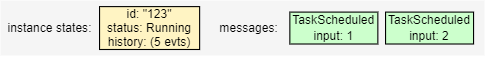

   The runtime state is now `Running`, two new `TaskScheduled` messages were added, and the history now contains the five events `OrchestratorStarted`, `ExecutionStarted`, `TaskScheduled`, `TaskScheduled`, `OrchestratorCompleted`. These events represent the first episode of this orchestration's execution.

3. A worker executes an *activity work item* to process one of the `TaskScheduled` messages. It calls the activity function with input "2". When the activity function completes, it creates a `TaskCompleted` message containing the result. After the worker commits this work item, the task hub contains

   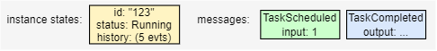

4. A worker executes an *orchestrator work item* to process the `TaskCompleted` message. If the orchestration is still cached in memory, it can just resume execution. Otherwise, the worker first [replays the history to recover the current state of the orchestration](durable-functions-orchestrations.md#reliability). Then it continues the orchestration,  delivering the result of the activity. After receiving this result, the orchestration is still waiting for the result of the other activity, so it once more stops executing. After the worker commits this work item, the task hub contains

   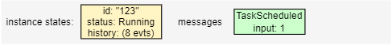

   The orchestration history now contains three more events `OrchestratorStarted`, `TaskCompleted`, `OrchestratorCompleted`. These  events represent the second episode of this orchestration's execution.

5. A worker executes an *activity work item* to process the remaining `TaskScheduled` message. It calls the activity function with input "1". After the worker commits this work item, the task hub contains

   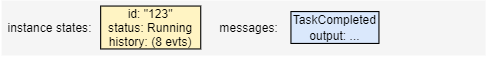

6. A worker executes another *orchestrator work item* to process the `TaskCompleted` message. After receiving this second result, the orchestration completes. After the worker commits this work item, the task hub contains

   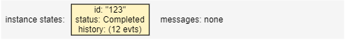

   The runtime state is now `Completed`, and the orchestration history now contains four more events `OrchestratorStarted`, `TaskCompleted`, `ExecutionCompleted`, `OrchestratorCompleted`. These events represent the third and final episode of this orchestration's execution.

The final history for this orchestration's execution then contains the 12 events `OrchestratorStarted`, `ExecutionStarted`, `TaskScheduled`, `TaskScheduled`, `OrchestratorCompleted`, `OrchestratorStarted`, `TaskCompleted`, `OrchestratorCompleted`, `OrchestratorStarted`, `TaskCompleted`, `ExecutionCompleted`, `OrchestratorCompleted`.

> [!NOTE]
> The schedule shown isn't the only one: there are many slightly different possible schedules. For example, if the second activity completes earlier, both `TaskCompleted` instance messages may be processed by a single work item. In that case, the execution history is a bit shorter, because there are only two episodes, and it contains the following 10 events: `OrchestratorStarted`, `ExecutionStarted`, `TaskScheduled`, `TaskScheduled`, `OrchestratorCompleted`, `OrchestratorStarted`, `TaskCompleted`, `TaskCompleted`, `ExecutionCompleted`, `OrchestratorCompleted`.

## Task hub management

Next, let's take a closer look at how task hubs are created or deleted, how to use task hubs correctly when running multiple function apps, and how the content of task hubs can be inspected.

### Creation and deletion

An empty task hub with all the required resources is automatically created in storage when a function app is started the first time.

If using the default Azure Storage provider, no extra configuration is required. Otherwise, follow the [instructions for configuring storage providers](durable-functions-storage-providers.md#configuring-alternate-storage-providers) to ensure that the storage provider can properly provision and access the storage resources required for the task hub.

> [!NOTE]
> The task hub is *not* automatically deleted when you stop or delete the function app. You must delete the task hub, its contents, or the containing storage account manually if you no longer want to keep that data.

> [!TIP]
> In a development scenario, you may need to restart from a clean state often. To do so quickly, you can just [change the configured task hub name](durable-functions-task-hubs.md#task-hub-names). This will force the creation of a new, empty task hub when you restart the application. Be aware that the old data is not deleted in this case.

### Multiple function apps

If multiple function apps share a storage account, each function app *must* be configured with a separate [task hub name](durable-functions-task-hubs.md#task-hub-names). This requirement also applies to staging slots: each staging slot must be configured with a unique task hub name. A single storage account can contain multiple task hubs. This restriction generally applies to other storage providers as well.

The following diagram illustrates one task hub per function app in shared and dedicated Azure Storage accounts.

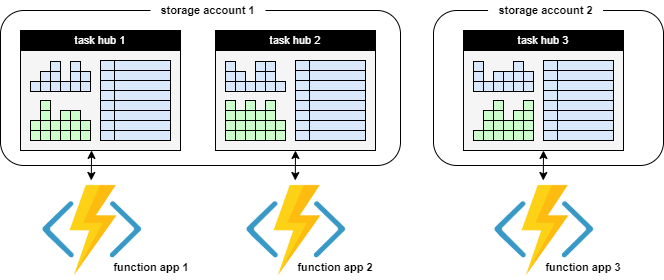

> [!NOTE]
> The exception to the task hub sharing rule is if you are configuring your app for regional disaster recovery. See the [disaster recovery and geo-distribution](durable-functions-disaster-recovery-geo-distribution.md) article for more information.

### Content inspection

There are several common ways to inspect the contents of a task hub:

1. Within a function app, the client object provides methods to query the instance store. To learn more about what types of queries are supported, see the [Instance Management](durable-functions-instance-management.md) article.
2. Similarly, The [HTTP API](durable-functions-http-features.md) offers REST requests to query the state of orchestrations and entities. See the [HTTP API Reference](durable-functions-http-api.md) for more details.
3. The [Durable Functions Monitor](https://github.com/microsoft/DurableFunctionsMonitor) tool can inspect task hubs and offers various options for visual display.

For some of the storage providers, it is also possible to inspect the task hub by going directly to the underlying storage:

* If using the Azure Storage provider, the instance states are stored in the [Instance Table](durable-functions-azure-storage-provider.md#instances-table) and the [History Table](durable-functions-azure-storage-provider.md#history-table) that can be inspected using tools such as Azure Storage Explorer.
* If using the MSSQL storage provider, SQL queries and tools can be used to inspect the task hub contents inside the database.

## Representation in storage

Each storage provider uses a different internal organization to represent task hubs in storage. Understanding this organization, while not required, can be helpful when troubleshooting a function app or when trying to ensure performance, scalability, or cost targets. We thus briefly explain, for each storage provider, how the data is organized in storage. For more information on the various storage provider options and how they compare, see the [Durable Functions storage providers](durable-functions-storage-providers.md).

### Azure Storage provider

The Azure Storage provider represents the task hub in storage using the following components:

* Two Azure Tables store the instance states.
* One Azure Queue stores the activity messages.
* One or more Azure Queues store the instance messages. Each of these so-called *control queues* represents a [partition](durable-functions-perf-and-scale.md#partition-count) that is assigned a subset of all instance messages, based on the hash of the instance ID.
* A few extra blob containers used for lease blobs and/or large messages.

For example, a task hub named `xyz` with `PartitionCount = 4` contains the following queues and tables:

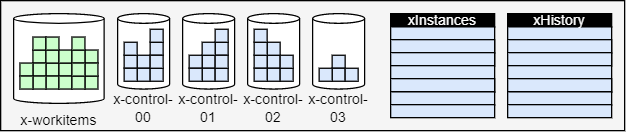

Next, we describe these components and the role they play in more detail.

For more information how task hubs are represented by the Azure Storage provider, see the [Azure Storage provider](durable-functions-azure-storage-provider.md) documentation.

### Netherite storage provider

Netherite partitions all of the task hub state into a specified number of partitions.
In storage, the following resources are used:

* One Azure Storage blob container that contains all the blobs, grouped by partition.
* One Azure Table that contains published metrics about the partitions.
* An Azure Event Hubs namespace for delivering messages between partitions.

For example, a task hub named `mytaskhub` with `PartitionCount = 32` is represented in storage as follows:

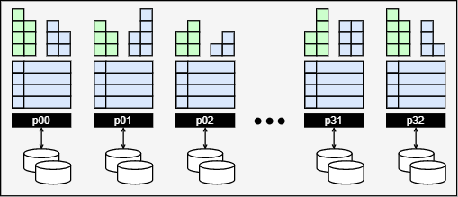

> [!NOTE]
> All of the task hub state is stored inside the `x-storage` blob container. The `DurableTaskPartitions` table and the EventHubs namespace contain redundant data: if their contents are lost, they can be automatically recovered. Therefore it is not necessary to configure the Azure Event Hubs namespace to retain messages past the default expiration time.

Netherite uses an event-sourcing mechanism, based on a log and checkpoints, to represent the current state of a partition. Both block blobs and page blobs are used. It is not possible to read this format from storage directly, so the function app has to be running when querying the instance store.

For more information on task hubs for the Netherite storage provider, see [Task Hub information for the Netherite storage provider](https://microsoft.github.io/durabletask-netherite/#/storage).

### MSSQL storage provider

All task hub data is stored in a single relational database, using several tables:

* The `dt.Instances` and `dt.History` tables store the instance states.
* The `dt.NewEvents` table stores the instance messages.
* The `dt.NewTasks` table stores the activity messages.


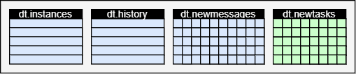

To enable multiple task hubs to coexist independently in the same database, each table includes a `TaskHub` column as part of its primary key. Unlike the other two providers, the MSSQL provider doesn't have a concept of partitions.

For more information on task hubs for the MSSQL storage provider, see [Task Hub information for the Microsoft SQL (MSSQL) storage provider](https://microsoft.github.io/durabletask-mssql/#/taskhubs).

## Task hub names

Task hubs are identified by a name that must conform to these rules:

* Contains only alphanumeric characters
* Starts with a letter
* Has a minimum length of 3 characters, maximum length of 45 characters

The task hub name is declared in the *host.json* file, as shown in the following example:

### host.json (Functions 2.0)

```json
{
  "version": "2.0",
  "extensions": {
    "durableTask": {
      "hubName": "MyTaskHub"
    }
  }
}
```

### host.json (Functions 1.x)

```json
{
  "durableTask": {
    "hubName": "MyTaskHub"
  }
}
```

Task hubs can also be configured using app settings, as shown in the following `host.json` example file:

### host.json (Functions 1.0)

```json
{
  "durableTask": {
    "hubName": "%MyTaskHub%"
  }
}
```

### host.json (Functions 2.0)

```json
{
  "version": "2.0",
  "extensions": {
    "durableTask": {
      "hubName": "%MyTaskHub%"
    }
  }
}
```

The task hub name will be set to the value of the `MyTaskHub` app setting. The following `local.settings.json` demonstrates how to define the `MyTaskHub` setting as `samplehubname`:

```json
{
  "IsEncrypted": false,
  "Values": {
    "MyTaskHub" : "samplehubname"
  }
}
```

> [!NOTE]
> When using deployment slots, it's a best practice to configure the task hub name using app settings. If you want to ensure that a particular slot always uses a particular task hub, use ["slot-sticky" app settings](../functions-deployment-slots.md#create-a-deployment-setting). 

In addition to **host.json**, task hub names can also be configured in [orchestration client binding](durable-functions-bindings.md#orchestration-client) metadata. This is useful if you need to access orchestrations or entities that live in a separate function app. The following code demonstrates how to write a function that uses the [orchestration client binding](durable-functions-bindings.md#orchestration-client) to work with a task hub that is configured as an App Setting:

# [C#](#tab/csharp)

```csharp
[FunctionName("HttpStart")]
public static async Task<HttpResponseMessage> Run(
    [HttpTrigger(AuthorizationLevel.Function, methods: "post", Route = "orchestrators/{functionName}")] HttpRequestMessage req,
    [DurableClient(TaskHub = "%MyTaskHub%")] IDurableOrchestrationClient starter,
    string functionName,
    ILogger log)
{
    // Function input comes from the request content.
    object eventData = await req.Content.ReadAsAsync<object>();
    string instanceId = await starter.StartNewAsync(functionName, eventData);

    log.LogInformation($"Started orchestration with ID = '{instanceId}'.");

    return starter.CreateCheckStatusResponse(req, instanceId);
}
```

> [!NOTE]
> The previous example is for Durable Functions 2.x. For Durable Functions 1.x, you must use `DurableOrchestrationContext` instead of `IDurableOrchestrationContext`. For more information about the differences between versions, see the [Durable Functions versions](durable-functions-versions.md) article.

# [JavaScript](#tab/javascript)

The task hub property in the `function.json` file is set via App Setting:

```json
{
    "name": "input",
    "taskHub": "%MyTaskHub%",
    "type": "durableClient",
    "direction": "in"
}
```

> [!NOTE]
> This example targets Durable Functions version 2.x. In version 1.x, use `orchestrationClient` instead of `durableClient`.

# [Python](#tab/python)

The task hub property in the `function.json` file is set via App Setting:

```json
{
    "name": "input",
    "taskHub": "%MyTaskHub%",
    "type": "durableClient",
    "direction": "in"
}
```

> [!NOTE]
> This example targets Durable Functions version 2.x. In version 1.x, use `orchestrationClient` instead of `durableClient`.

# [PowerShell](#tab/powershell)

The task hub property in the `function.json` file is set via App Setting:

```json
{
    "name": "input",
    "taskHub": "%MyTaskHub%",
    "type": "durableClient",
    "direction": "in"
}
```

> [!NOTE]
> This example targets Durable Functions version 2.x. In version 1.x, use `orchestrationClient` instead of `durableClient`.

# [Java](#tab/java)

```java
@FunctionName("HttpStart")
public HttpResponseMessage httpStart(
        @HttpTrigger(name = "req", route = "orchestrators/{functionName}") HttpRequestMessage<?> req,
        @DurableClientInput(name = "durableContext", taskHub = "%MyTaskHub%") DurableClientContext durableContext,
        @BindingName("functionName") String functionName,
        final ExecutionContext context) {

    DurableTaskClient client = durableContext.getClient();
    String instanceId = client.scheduleNewOrchestrationInstance(functionName);
    context.getLogger().info("Created new Java orchestration with instance ID = " + instanceId);
    return durableContext.createCheckStatusResponse(req, instanceId);
}
```

---

> [!NOTE]
> Configuring task hub names in client binding metadata is only necessary when you use one function app to access orchestrations and entities in another function app. If the client functions are defined in the same function app as the orchestrations and entities, you should avoid specifying task hub names in the binding metadata. By default, all client bindings get their task hub metadata from the **host.json** settings.

Task hub names must start with a letter and consist of only letters and numbers. If not specified, a default task hub name will be used as shown in the following table:

| Durable extension version | Default task hub name |
| - | - |
| 2.x | When deployed in Azure, the task hub name is derived from the name of the *function app*. When running outside of Azure, the default task hub name is `TestHubName`. |
| 1.x | The default task hub name for all environments is `DurableFunctionsHub`. |

For more information about the differences between extension versions, see the [Durable Functions versions](durable-functions-versions.md) article.

> [!NOTE]
> The name is what differentiates one task hub from another when there are multiple task hubs in a shared storage account. If you have multiple function apps sharing a shared storage account, you must explicitly configure different names for each task hub in the *host.json* files. Otherwise the multiple function apps will compete with each other for messages, which could result in undefined behavior, including orchestrations getting unexpectedly "stuck" in the `Pending` or `Running` state.

## Next steps

> [!div class="nextstepaction"]
> [Learn how to handle orchestration versioning](durable-functions-versioning.md)
