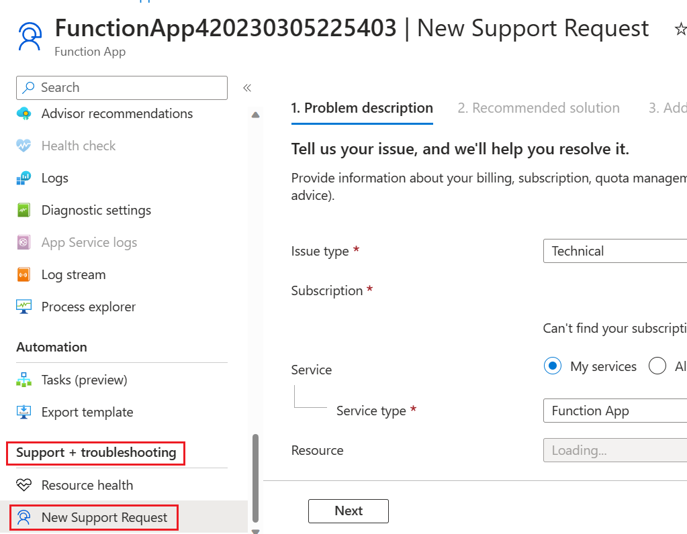

# Durable Functions Troubleshooting Guide
## Introduction

Durable Functions is an extension that customers can install in their function app. For more information on Durable functions, please refer to the official [documentation](./durable-functions-overview.md).

The rest of this section gives an overview of reasons and guides that you could try for certain common troubleshooting. If all of these do not work, please contact the support engineer for help. You can find this under the **Support+troubleshooting** – **New Support request** blade on your function page.

[ 

For any troubleshooting scenario, the **first thing we recommend to do** is to check if you are using the latest Durable Function extension packages.  Old versions might introduce unwanted bugs which are already fixed in the latest version. The latest versions of Durable Functions extension packages could be found [here](https://www.nuget.org/packages/Microsoft.Azure.WebJobs.Extensions.DurableTask). Also, please read this Durable Function Best Practice and Diagnostic Tools for how to upgrade. 

The **Diagnostic and solve problems** tab in Azure Portal is a useful resource to monitor and diagnose potential issues related to your application. It also supplies potential solutions to your problems based on the diagnosis. Please see this [page](./durable-functions-diagnostics.md) for more details. 

If the above two steps could not help solving your problem, please see the following steps according to the scenarios.

## Orchestration does not start (pending)

1. Check the Durable Task Framework traces for warnings or errors for this instance ID. 

2. Check the Azure Storage control queues to see if the message is still in the queue. 

3. Change platform configuration version to “64-Bit” for function applications. 
   Sometimes orchestrations don't start because the app is running out of memory. Switching to 64-bit process can allow the app to allocate more total memory. This only applies to App Service Basic, Standard, Premium, and Elastic Premium plans. Free or Consumption plans **do not** support it. 

## Orchestration starts after a delay

1. This [page](./durable-functions-azure-storage-provider.md) illustrates reasons for orchestrators’ delay start. Please see here for detailed instructions. 

2. The following query could help you check the warning/error message for the orchestrator. You could query it by changing the instance ID.  

## Orchestration starts but then gets stuck in the Running state

1. Try restarting the function app.

2. Check the Azure Storage account control queues to see if any queues are growing but not shrinking.

3. Use the Azure Storage Kusto query to filter on that queue name in the PartitionId column to look for any problems related to that control queue partition. The query is below this page in Azure Storage Message part.

4. Please check if you have followed the **Durable Functions Best Practice and Diagnostic Tools**. Some problems are caused because of inappropriate behavior. So, we suggest you read this article, revise the part that breaks the best practice rules and reset your function.

## Orchestration starts and runs, but runs slowly

1. Check if **extendedSessionsEnabled** is being enabled.  
   Excessive history load can result in extremely slow orchestrator processing. The detailed instruction could be seen [here](./durable-functions-azure-storage-provider.md)

2. Performance Issue.  
   Performance issues can include many aspects. For example, high CPU usage, or large memory consumption, which could result in heavy delay. Here are some suggestions to improve performance: 
   * Scale out and add more workers. Please see this [page](./durable-functions-perf-and-scale.md) for more information.
   
   * We suggest monitoring memory utilization per Function, and ensure it stays at a healthy percentage. The montior guide could be seen [here](./durable-functions-azure-storage-provider.md).

## Azure Storage Message
All Durable Function behavior is driven by Azure Storage queue messages. Also, all state related to an orchestration is stored in Table Storage and blob storage. All Azure Storage interactions are logged to Application Insights, and this data is critically important for debugging execution and performance problems. Starting in v2.3.0, customers can get access to these logs by updating their host.json configuration. See the [Durable Task Framework logging section](./durable-functions-diagnostics.md) for more information. 

To see the Azure Storage query result, please add the following configuration in your host.json file.  

```json
{ 
   "version": "2.0", 
   "logging": { 
     "logLevel": { 
       "DurableTask.AzureStorage": "Information", 
       "DurableTask.Core": "Information" 
     } 
   } 
 } 
```

The following query is for inspecting end-to-end Azure Storage interactions for a specific orchestration instance.  

```kusto
let start = datetime(2017-09-30T04:30:00);  
traces  
| where timestamp > start and timestamp < start + 1h 
| where customDimensions.Category == "DurableTask.AzureStorage" 
| extend eventName = customDimensions["EventName"] 
| extend eventId = customDimensions["EventId"] 
| extend account = customDimensions["prop__Account"] 
| extend details = customDimensions["prop__Details"] 
| extend instanceId = customDimensions["prop__InstanceId"] 
| extend messageId = customDimensions["prop__MessageId"] 
| extend executionId = customDimensions["prop__ExecutionId"] 
| extend age = customDimensions["prop__Age"] 
| extend latencyMs = customDimensions["prop__LatencyMs"] 
| extend dequeuecount = customDimensions["prop__DequeueCount"] 
| extend partitionId = customDimensions["prop__PartitionId"] 
| extend eventCount = customDimensions["prop__TotalEventCount"] 
| extend taskHub = customDimensions["prop__TaskHub"] 
| extend workerName = customDimensions["prop__WorkerName"] 
| where instanceId == "XXXXX" 
| sort by timestamp asc 
```

## Trace Multiple Orchestrators
The following query shows the orchestration instance status for multiple orchestrators run in a specified time range. Edit the **instanceId** to query the multiple orchestration.