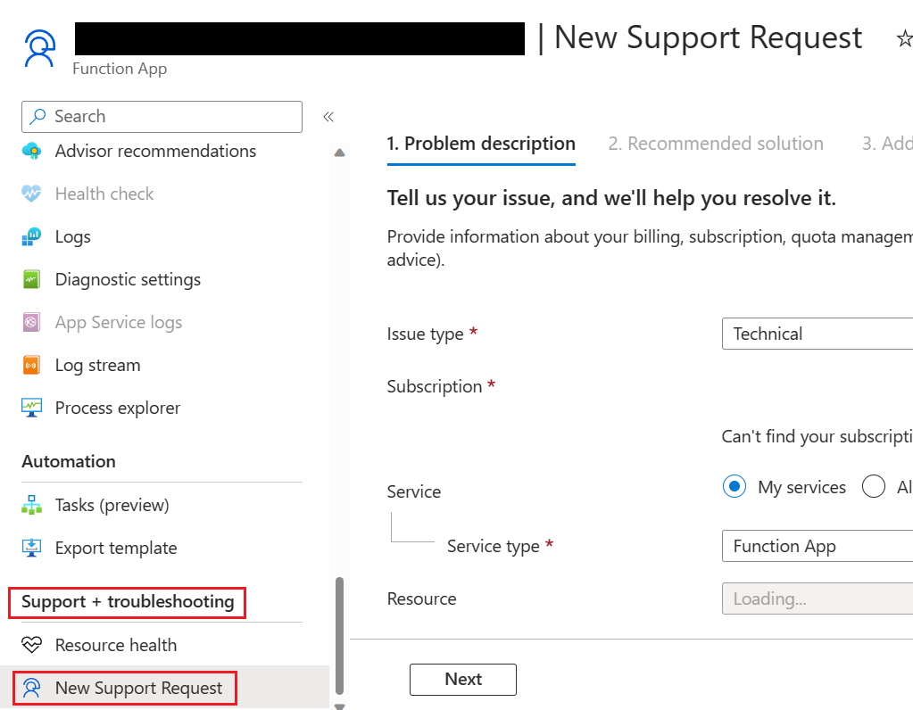

# Durable Functions Troubleshooting Guide

Durable Functions is an extension of [Azure Functions](../functions-overview.md) that lets you build serverless orchestrations using ordinary code. For more information on Durable Functions, see the [Durable Functions overview](./durable-functions-overview.md).

This article provides a guide for troubleshooting common scenarios in Durable Functions apps.

> [!NOTE]
> Microsoft support engineers are available to assist in diagnosing issues with your application. If you're not able to diagnose your problem using this guide, you can file a support ticket by accessing the **New Support request** blade in the **Support + troubleshooting** section of your function app page in the Azure portal.



> [!TIP]
> When debugging and diagnosing issues, it's recommended that you start by ensuring your app is using the latest Durable Functions extension version. Most of the time, using the latest version mitigates known issues already reported by other users. Please read the [Upgrade Durable Functions extension version](./durable-functions-extension-upgrade.md) article for instructions on how to upgrade your extension version. 

The **Diagnose and solve problems** tab in the Azure portal is a useful resource to monitor and diagnose possible issues related to your application. It also supplies potential solutions to your problems based on the diagnosis. See [Azure Function app diagnostics](./function-app-diagnostics.md) for more details. 

If the resources above didn't solve your problem, the following sections provide advice for specific application symptoms:

## Orchestration is stuck in the `Pending` state

When you start an orchestration, a "start" message gets written to an internal queue managed by the Durable extension, and the status of the orchestration gets set to "Pending". After the orchestration message gets picked up and successfully processed by an available app instance, the status will transition to "Running" (or to some other non-"Pending" state).

Use the following steps to troubleshoot orchestration instances that remain stuck indefinitely in the "Pending" state. 

*  Check the Durable Task Framework traces for warnings or errors for the impacted orchestration instance ID. A sample query can be found in the [Trace Errors/Warnings section](#trace-errorswarnings).

*  Check the Azure Storage control queues assigned to the stuck orchestrator to see if its "start message" is still there For more information on control queues, see the [Azure Storage provider control queue documentation](durable-functions-azure-storage-provider.md#control-queues).

*  Change your app's [platform configuration](../../app-service/configure-common.md#configure-general-settings) version to "64 Bit". 
   Sometimes orchestrations don't start because the app is running out of memory. Switching to 64-bit process allows the app to allocate more total memory. This only applies to App Service Basic, Standard, Premium, and Elastic Premium plans. Free or Consumption plans **do not** support 64-bit processes. 

## Orchestration starts after a long delay

Normally, orchestrations start within a few seconds after they're scheduled. However, there are certain cases where orchestrations may take longer to start. Use the following steps to troubleshoot when orchestrations take more than a few seconds to start executing.

*  Refer to the [documentation on delayed orchestrations in Azure Storage](./durable-functions-azure-storage-provider.md#orchestration-start-delays) to check whether the delay may be caused by known limitations.

*  Check the Durable Task Framework traces for warnings or errors with the impacted orchestration instance ID. A sample query can be found in [Trace Errors/Warnings section](#trace-errorswarnings).

## Orchestration doesn't complete / is stuck in the `Running` state

If an orchestration remains in the "Running" state for a long period of time, it usually means that it's waiting for a long-running task that is scheduled to complete. For example, it could be waiting for a durable timer task, an activity task, or an external event task to be completed. However, if you observe that scheduled tasks have completed successfully but the orchestration still isn't making progress, then there might be a problem preventing the orchestration from proceeding to its next task. We often refer to orchestrations in this state as "stuck orchestrations".

Use the following steps to troubleshoot stuck orchestrations:

*  Try restarting the function app. This step can help if the orchestration gets stuck due to a transient bug or deadlock in either the app or the extension code.

*  Check the Azure Storage account control queues to see if any queues are growing continuously. [This Azure Storage messaging KQL query](./durable-functions-troubleshooting-guide.md#azure-storage-messaging) can help identify problems with dequeuing orchestration messages. If the problem impacts only a single control queue, it might indicate a problem that exists only on a specific app instance, in which case scaling up or down to move off the unhealthy VM instance could help.

*  Use the Application Insights query in the [Azure Storage Messaging section](./durable-functions-troubleshooting-guide.md#azure-storage-messaging) to filter on that queue name as the Partition ID and look for any problems related to that control queue partition.

*  Check the guidance in [Durable Functions Best Practice and Diagnostic Tools](./durable-functions-best-practice-reference.md). Some problems may be caused by known Durable Functions anti-patterns.

*  Check the [Durable Functions Versioning documentation](durable-functions-versioning.md). Some problems may be caused by breaking changes to in-flight orchestration instances.

## Orchestration runs slowly

Heavy data processing, internal errors, and insufficient compute resources can cause orchestrations to execute slower than normal. Use the following steps to troubleshoot orchestrations that are taking longer than expected to execute:

*  Check the Durable Task Framework traces for warnings or errors for the impacted orchestration instance ID. A sample query can be found in the [Trace Errors/Warnings section](#trace-errorswarnings).

*  If your app utilizes the .NET in-process model, consider enabling [extended sessions](./durable-functions-azure-storage-provider.md#extended-sessions). 
   Extended sessions can minimize history loads, which can slow down processing.

*  Check for performance and scalability bottlenecks. 
   Application performance depends on many factors. For example, high CPU usage, or large memory consumption can result in delays. Read [Performance and scale in Durable Functions](./durable-functions-perf-and-scale.md) for detailed guidance.

## Sample Queries

This section shows how to troubleshoot issues by writing custom [KQL queries](/azure/data-explorer/kusto/query/) in the Azure Application Insights instance configured for your Azure Functions app.

### Azure Storage Messaging

When using the default Azure Storage provider, all Durable Functions behavior is driven by Azure Storage queue messages and all state related to an orchestration is stored in table storage and blob storage. When Durable Task Framework tracing is enabled, all Azure Storage interactions are logged to Application Insights, and this data is critically important for debugging execution and performance problems.

Starting in v2.3.0 of the Durable Functions extension, you can have these Durable Task Framework logs published to your Application Insights instance by updating your logging configuration in the host.json file. See the [Durable Task Framework logging article](./durable-functions-diagnostics.md) for information and instructions on how to do this.

The following query is for inspecting end-to-end Azure Storage interactions for a specific orchestration instance. Edit `start` and `orchestrationInstanceID` to filter by time range and instance ID.

```kusto
let start = datetime(XXXX-XX-XXTXX:XX:XX); // edit this 
let orchestrationInstanceID = "XXXXXXX"; //edit this
traces  
| where timestamp > start and timestamp < start + 1h 
| where customDimensions.Category == "DurableTask.AzureStorage" 
| extend taskName = customDimensions["EventName"]
| extend eventType = customDimensions["prop__EventType"] 
| extend extendedSession = customDimensions["prop__IsExtendedSession"]
| extend account = customDimensions["prop__Account"] 
| extend details = customDimensions["prop__Details"] 
| extend instanceId = customDimensions["prop__InstanceId"] 
| extend messageId = customDimensions["prop__MessageId"] 
| extend executionId = customDimensions["prop__ExecutionId"] 
| extend age = customDimensions["prop__Age"] 
| extend latencyMs = customDimensions["prop__LatencyMs"] 
| extend dequeueCount = customDimensions["prop__DequeueCount"] 
| extend partitionId = customDimensions["prop__PartitionId"] 
| extend eventCount = customDimensions["prop__TotalEventCount"] 
| extend taskHub = customDimensions["prop__TaskHub"] 
| extend pid = customDimensions["ProcessId"]
| extend appName = cloud_RoleName
| extend newEvents = customDimensions["prop__NewEvents"]
| where instanceId == orchestrationInstanceID
| sort by timestamp asc
| project timestamp, appName, severityLevel, pid, taskName, eventType, message, details, messageId, partitionId, instanceId, executionId, age, latencyMs, dequeueCount, eventCount, newEvents, taskHub, account, extendedSession, sdkVersion
```

### Trace Errors/Warnings

The following query searches for errors and warnings for a given orchestration instance. You'll need to provide a value for `orchestrationInstanceID`.

```kusto
let orchestrationInstanceID = "XXXXXX"; // edit this
let start = datetime(XXXX-XX-XXTXX:XX:XX); 
traces  
| where timestamp > start and timestamp < start + 1h
| extend instanceId = iif(isnull(customDimensions["prop__InstanceId"] ) , customDimensions["prop__instanceId"], customDimensions["prop__InstanceId"] ) 
| extend logLevel = customDimensions["LogLevel"]
| extend functionName = customDimensions["prop__functionName"]
| extend status = customDimensions["prop__status"]
| extend details = customDimensions["prop__Details"] 
| extend reason = customDimensions["prop__reason"]
| where severityLevel > 1 // to see all logs of  severity level "Information" or greater.
| where instanceId == orchestrationInstanceID
| sort by timestamp asc 
```

### Control queue / Partition ID logs

The following query searches for all activity associated with an instanceId's control queue. You'll need to provide the value for the instanceID in `orchestrationInstanceID` and the query's start time in `start`.

```kusto
let orchestrationInstanceID = "XXXXXX"; // edit this
let start = datetime(XXXX-XX-XXTXX:XX:XX); // edit this
traces  // determine control queue for this orchestrator
| where timestamp > start and timestamp < start + 1h 
| extend instanceId = customDimensions["prop__TargetInstanceId"] 
| extend partitionId = tostring(customDimensions["prop__PartitionId"])
| where partitionId contains "control" 
| where instanceId == orchestrationInstanceID
| join kind = rightsemi(
traces  
| where timestamp > start and timestamp < start + 1h 
| where customDimensions.Category == "DurableTask.AzureStorage" 
| extend taskName = customDimensions["EventName"]
| extend eventType = customDimensions["prop__EventType"] 
| extend extendedSession = customDimensions["prop__IsExtendedSession"]
| extend account = customDimensions["prop__Account"] 
| extend details = customDimensions["prop__Details"] 
| extend instanceId = customDimensions["prop__InstanceId"] 
| extend messageId = customDimensions["prop__MessageId"] 
| extend executionId = customDimensions["prop__ExecutionId"] 
| extend age = customDimensions["prop__Age"] 
| extend latencyMs = customDimensions["prop__LatencyMs"] 
| extend dequeueCount = customDimensions["prop__DequeueCount"] 
| extend partitionId = tostring(customDimensions["prop__PartitionId"])
| extend eventCount = customDimensions["prop__TotalEventCount"] 
| extend taskHub = customDimensions["prop__TaskHub"] 
| extend pid = customDimensions["ProcessId"]
| extend appName = cloud_RoleName
| extend newEvents = customDimensions["prop__NewEvents"]
) on partitionId
| sort by timestamp asc
| project timestamp, appName, severityLevel, pid, taskName, eventType, message, details, messageId, partitionId, instanceId, executionId, age, latencyMs, dequeueCount, eventCount, newEvents, taskHub, account, extendedSession, sdkVersion
```

### Application Insights column reference

Below is a list of the columns projected by the queries above and their respective descriptions.

|Column |Description |
|-------|------------|
|pid|Process ID of the function app instance. This is useful for determining if the process was recycled while an orchestration was executing.|
|taskName|The name of the event being logged.|
|eventType|The type of message, which usually represents work done by an orchestrator. A full list of its possible values, and their descriptions, is [here](https://github.com/Azure/durabletask/blob/main/src/DurableTask.Core/History/EventType.cs)|
|extendedSession|Boolean value indicating whether [extended sessions](durable-functions-azure-storage-provider.md#extended-sessions) is enabled.|
|account|The storage account used by the app.|
|details|Additional information about a particular event, if available.|
|instanceId|The ID for a given orchestration or entity instance.|
|messageId|The unique Azure Storage ID for a given queue message. This value most commonly appears in ReceivedMessage, ProcessingMessage, and DeletingMessage trace events. Note that it's NOT present in SendingMessage events because the message ID is generated by Azure Storage _after_ we send the message.|
|executionId|The ID of the orchestrator execution, which changes whenever `continue-as-new` is invoked.|
|age|The number of milliseconds since a message was enqueued. Large numbers often indicate performance problems. An exception is the TimerFired message type, which may have a large Age value depending on timer's duration.|
|latencyMs|The number of milliseconds taken by some storage operation.|
|dequeueCount|The number of times a message has been dequeued. Under normal circumstances, this value is always 1. If it's more than one, then there might be a problem.|
|partitionId|The name of the queue associated with this log.|
|totalEventCount|The number of history events involved in the current action.|
|taskHub|The name of your [task hub](./durable-functions-task-hubs.md).|
|newEvents|A comma-separated list of history events that are being written to the History table in storage.|
