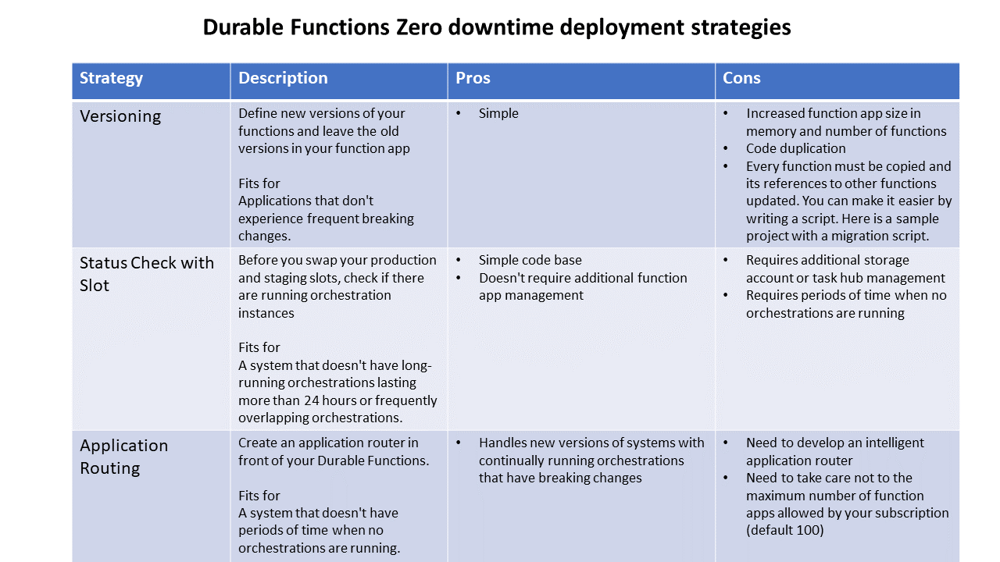

# Zero downtime deployment for Durable Functions
If you want to deploy Durable Functions with zero downtime, you need to consider your deployment strategy. This document is going to explain how to do it.

# Zero downtime requirements
If you perform a deployment containing certain changes to your orchestrators logic or your activity interfaces, running orchestrations will fail.

This is especially a problem for long running orchestrations. To prevent this behavior, you need to delay your deployment until all orchestrations have been completed or keep running orchestrations with the functions of the previous version. To achieve this goal, we introduce three strategies to enable this. 

For more details about versioning, you can refer [Versioning in Durable Functions - Azure](durable-functions-versioning.md).

# Three Strategies
There are three main strategies for zero downtime deployment for Durable Functions: 

* [Versioning strategy](#Versioning-Strategy)
* [Status check with slot](#Status-check-with-slot)
* [Application routing](#Application-routing)

>[!NOTE]
>All the strategies described in this article use Deployment slots. For more detailed information about how to create and use new deployment slots refer to [Deployment technologies in Azure Functions](../functions-deployment-technologies#deployment-slots)

# Versioning Strategy
Add new versions of your Durable Functions and leave the old versions in your function app. As you can see on the diagram, the functions of the previous versions are preserved, and a new version resides in the same function app. 


## Use case
Applications that don't experience frequent breaking changes. 

## Pros
* Simple
## Cons
* Increased function app size
* Code duplication
* Need to copy every function. You can make it easier by writing a script. Here is a [sample project](https://github.com/TsuyoshiUshio/DurableVersioning) with a migration script.

# Status Check with Slot
Before you deploy a new version, check if there are running orchestrations. If all orchestrations are completed, you can deploy. This strategy works when you don't have long-running or frequently overlaping orchestrations.  

## Function App Configration
We can configure your Function App with Deployment Slot. Configure the Storage Account for each slot. However, share the Storage Account for management. The storage account store the function keys for each slot. 


For changing Storage Account, you can configure `azureStorageConnectionStringName` to host.json and change the value of each slots. For more details, [host.json settings](durable-functions-bindings.md#host-json). Also, keep the same storage account for `AzureWebJobsStorage` for stagin/production slots. It manages the function key. For more details, [App settings reference for Azure Functions](../functions-app-settings.md#azurewebjobsstorage)

## CI/CD pipeline configuration
Make sure that there is no running orchestration. If you use Azure DevOps, you can create a function for status checking on your App.

```csharp
[FunctionName("StatusCheck")]
public static async Task<IActionResult> StatusCheck(    [HttpTrigger(AuthorizationLevel.Function, "get", "post")]
HttpRequestMessage req,
[OrchestrationClient] DurableOrchestrationClient client,
ILogger log)
{
    var runtimeStatus = new List<OrchestrationRuntimeStatus>();

    runtimeStatus.Add(OrchestrationRuntimeStatus.Pending);
    runtimeStatus.Add(OrchestrationRuntimeStatus.Running);

    var status = await client.GetStatusAsync(new DateTime(2015,10,10), null, runtimeStatus);
    return (ActionResult) new OkObjectResult(new Status() {HasRunning = (status.Count != 0)});
}
```

Then configure the staging gate for waiting for the no orchestration is running.  


You will see Azure DevOps check the status before your deployment start.


Now Version.3 is deployed to the deployment slot. 


Then swap slot.  Even if there is running orchestrations on Production slot with Ver.2, it was swap out to the Staging Slot. The function app swaps the Storage Account A/B as well. After the swap happens, Ver.2. Orchestration keeps on working and referring the same storage account. 


If you want to use the same storage account for both slots, you can change the name of TaskHubs. In this case, you need to manage the state of the Slot and TaskHubName.
For more details, [Task hubs in Durable Functions (Azure Functions)](durable-functions-task-hubs.md) 

## Usage 
A system that doesn't have a long-running orchestration last more than 24 hours nor frequently overlaping orchestrations.

## Pros
* Simple code base
* Doesn't require additional FunctionApp management
## Cons
* Additional Storage Account or requires TaskHubName management
* Not suitable for long-running orchestration.

# Application Routing
This strategy is the most complex strategy; however, some customer can't stop the ongoing long-running orchestration. In this case, you can use this strategy.  Let's see how it works. 
This strategy creates an application router in front of your Durable Functions. You can implement it with Durable Functions. The routers responsibility is listed below.

* Deploy Function App
* Manage version of the Durable Functions 
* Routing the orchestration request

If you get the request for the first time, the application router creates a new Function App in Azure then deploy Durable Functions app on the Function App. Then send orchestration request to the Durable Functions.  The router manages the state which version is deployed to which function app.


Then you deploy the new app without breaking change, you can update the patch of the semantic versioning. It means no breaking change, so it deploys to the same Function App. Also, the request is routed to the same function app.


When you deploy a new app with breaking change, you can update the revision. Then the application router creates a new function app in Azure and deploys to it. The request of the orchestration is never going to the function app with version 1.0.1.  However, running orchestration of the version 1.0.1 is keep on working on it. 


You can observe the orchestration status on the function apps which is no longer routed. Once all orchestration has been finished, the application router removes the function app. 

Here is a [sample project](https://github.com/TsuyoshiUshio/FunctionAppController) with a migration script.

## Tracking store settings

For this strategy, you can use Tracking Store settings. In case you want to separete queues for each FunctionApp, however you want to query the instance tables and share the instance/history table, you can use Tracking Store settings. You can configure `trackingStoreConnectionStringName` and `trackingStoreNamePrefix` on your host.json. Then you can share the instance/history table among the function app. In this case, change the TaskHubName for each function app. You can query all function apps status in one place with TaskHubName. For more details, [host.json settings](durable-functions-bindings.md#host-json) and [Manage instances in Durable Functions in Azure](durable-functions-instance-management.md).


## Usage 
A system that you have long running orchestration. You can't terminate it. 

## Pros
It is enabling long-running orchestration with a new version that has a breaking change.

## Cons
You need to develop an intelligent application router. Need to care the maximum number of the Function App of your subscription. It is 100 by default. 

# Summary


## Next steps

> [!div class="nextstepaction"]
> [Versioning in Durable Functions - Azure](durable-functions-versioning.md)
