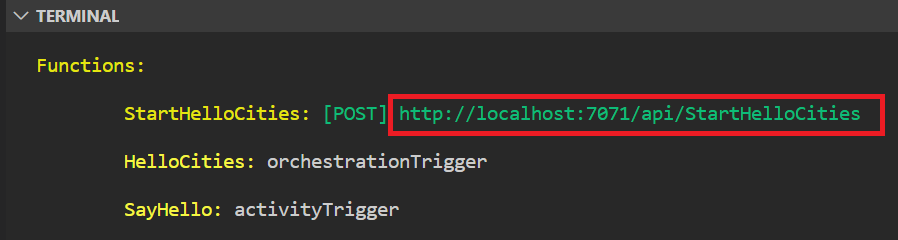

# Create your first durable function in Java (Preview)

_Durable Functions_ is an extension of [Azure Functions](../functions-overview.md) that lets you write stateful functions in a serverless environment. The extension manages state, checkpoints, and restarts for you.

In this article, you learn how to create and test a "hello world" durable function in your Java project. This function will orchestrate and chain together calls to other functions.

## Prerequisites

To complete this tutorial, you need:

- The [Java Developer Kit](/azure/developer/java/fundamentals/java-support-on-azure), version 11 or 8.

- [Apache Maven](https://maven.apache.org), version 3.0 or above.

- Latest version of the [Azure Functions Core Tools](../functions-run-local.md).
  - For Azure Functions 4.x, Core Tools **v4.0.4590** or newer is required.

- An Azure Storage account, which requires that you have an Azure subscription.

[!INCLUDE [quickstarts-free-trial-note](../../../includes/quickstarts-free-trial-note.md)]

## Add required dependencies and plugins

Add the following to your `pom.xml`:

```xml
<properties>
  <azure.functions.maven.plugin.version>1.18.0</azure.functions.maven.plugin.version>
  <azure.functions.java.library.version>2.0.1</azure.functions.java.library.version>
  <durabletask.azure.functions>1.0.0-beta.1</durabletask.azure.functions>
  <functionAppName>your-unique-app-name</functionAppName>
</properties>

<dependencies>
  <dependency>
    <groupId>com.microsoft.azure.functions</groupId>
    <artifactId>azure-functions-java-library</artifactId>
    <version>${azure.functions.java.library.version}</version>
  </dependency>
  <dependency>
    <groupId>com.microsoft</groupId>
    <artifactId>durabletask-azure-functions</artifactId>
    <version>${durabletask.azure.functions}</version>
  </dependency>
</dependencies>

<build>
  <plugins>
    <plugin>
      <groupId>org.apache.maven.plugins</groupId>
      <artifactId>maven-compiler-plugin</artifactId>
      <version>3.8.1</version>
    </plugin>
    <plugin>
      <groupId>com.microsoft.azure</groupId>
      <artifactId>azure-functions-maven-plugin</artifactId>
      <version>${azure.functions.maven.plugin.version}</version>
      <configuration>
        <appName>${functionAppName}</appName>
        <resourceGroup>java-functions-group</resourceGroup>
        <appServicePlanName>java-functions-app-service-plan</appServicePlanName>
        <region>westus</region>
        <runtime>
          <os>windows</os>
          <javaVersion>11</javaVersion>
        </runtime>
        <appSettings>
          <property>
            <name>FUNCTIONS_EXTENSION_VERSION</name>
            <value>~4</value>
          </property>
        </appSettings>
      </configuration>
      <executions>
        <execution>
          <id>package-functions</id>
          <goals>
            <goal>package</goal>
          </goals>
        </execution>
      </executions>
    </plugin>
    <plugin>
      <artifactId>maven-clean-plugin</artifactId>
      <version>3.1.0</version>
    </plugin>
  </plugins>
</build>
```

## Add required JSON files

Add a `host.json` file to your project directory. It should look similar to the following:

```json
{
  "version": "2.0",
  "logging": {
    "logLevel": {
      "DurableTask.AzureStorage": "Warning",
      "DurableTask.Core": "Warning"
    }
  },
  "extensions": {
    "durableTask": {
      "hubName": "JavaTestHub"
    }
  },
  "extensionBundle": {
    "id": "Microsoft.Azure.Functions.ExtensionBundle.Preview",
    "version": "[4.*, 5.0.0)"
  }
}
```

It's important to note that only the Azure Functions v4 _Preview_ bundle currently has the necessary support for Durable Functions for Java.

> [!WARNING]
> Be aware that the Azure Functions v4 preview bundles do not yet support Azure Cosmos DB bindings for Java function apps. For more information, see [Azure Cosmos DB trigger and bindings reference documentation](../functions-bindings-cosmosdb-v2.md?tabs=in-process%2Cextensionv4&pivots=programming-language-java#install-bundle).

Add a `local.settings.json` file to your project directory. You should have the connection string of your Azure Storage account configured for `AzureWebJobsStorage`:

```json
{
  "IsEncrypted": false,
  "Values": {
    "AzureWebJobsStorage": "<your storage account connection string>",
    "FUNCTIONS_WORKER_RUNTIME": "java"
  }
}
```

## Creating your functions

The most basic Durable Functions app contains three functions:

- _Orchestrator function_ - describes a workflow that orchestrates other functions.
- _Activity function_ - called by the orchestrator function, performs work, and optionally returns a value.
- _Client function_ - a regular Azure Function that starts an orchestrator function. This example uses an HTTP triggered function.

The sample code below shows a simple example of each:

```java
import java.util.Optional;

import com.microsoft.azure.functions.*;
import com.microsoft.azure.functions.annotation.*;

import com.microsoft.durabletask.*;
import com.microsoft.durabletask.azurefunctions.*;

public class DurableFunctionsSample {
    /**
     * This HTTP-triggered function starts the orchestration.
     */
    @FunctionName("StartHelloCities")
    public HttpResponseMessage startHelloCities(
            @HttpTrigger(name = "req", methods = {HttpMethod.POST}) HttpRequestMessage<Optional<String>> req,
            @DurableClientInput(name = "durableContext") DurableClientContext durableContext,
            final ExecutionContext context) {

        DurableTaskClient client = durableContext.getClient();
        String instanceId = client.scheduleNewOrchestrationInstance("HelloCities");
        context.getLogger().info("Created new Java orchestration with instance ID = " + instanceId);
        return durableContext.createCheckStatusResponse(req, instanceId);
    }

    /**
     * This is the orchestrator function, which can schedule activity functions, create durable timers,
     * or wait for external events in a way that's completely fault-tolerant. The OrchestrationRunner.loadAndRun()
     * static method is used to take the function input and execute the orchestrator logic.
     */
    @FunctionName("HelloCities")
    public String helloCitiesOrchestrator(@DurableOrchestrationTrigger(name = "runtimeState") String runtimeState) {
        return OrchestrationRunner.loadAndRun(runtimeState, ctx -> {
            String result = "";
            result += ctx.callActivity("SayHello", "Tokyo", String.class).await() + ", ";
            result += ctx.callActivity("SayHello", "London", String.class).await() + ", ";
            result += ctx.callActivity("SayHello", "Seattle", String.class).await();
            return result;
        });
    }

    /**
     * This is the activity function that gets invoked by the orchestrator function.
     */
    @FunctionName("SayHello")
    public String sayHello(@DurableActivityTrigger(name = "name") String name) {
        return String.format("Hello %s!", name);
    }
}
```

## Test the function locally

Azure Functions Core Tools lets you run an Azure Functions project on your local development computer.

1. If you are using Visual Studio Code, open a new terminal window and run the following commands to build the project:

    ```bash
    mvn clean package
    ```
    
    Then run the durable function:
    
    ```bash
    mvn azure-functions:run
    ```

2. In the Terminal panel, copy the URL endpoint of your HTTP-triggered function.

   

3. Using a tool like [Postman](https://www.getpostman.com/) or [cURL](https://curl.haxx.se/), send an HTTP POST request to the URL endpoint. You should get a response similar to the following:

    ```json
    {
        "id": "d1b33a60-333f-4d6e-9ade-17a7020562a9",
        "purgeHistoryDeleteUri": "http://localhost:7071/runtime/webhooks/durabletask/instances/d1b33a60-333f-4d6e-9ade-17a7020562a9?code=ACCupah_QfGKoFXydcOHH9ffcnYPqjkddSawzRjpp1PQAzFueJ2tDw==",
        "sendEventPostUri": "http://localhost:7071/runtime/webhooks/durabletask/instances/d1b33a60-333f-4d6e-9ade-17a7020562a9/raiseEvent/{eventName}?code=ACCupah_QfGKoFXydcOHH9ffcnYPqjkddSawzRjpp1PQAzFueJ2tDw==",
        "statusQueryGetUri": "http://localhost:7071/runtime/webhooks/durabletask/instances/d1b33a60-333f-4d6e-9ade-17a7020562a9?code=ACCupah_QfGKoFXydcOHH9ffcnYPqjkddSawzRjpp1PQAzFueJ2tDw==",
        "terminatePostUri": "http://localhost:7071/runtime/webhooks/durabletask/instances/d1b33a60-333f-4d6e-9ade-17a7020562a9/terminate?reason={text}&code=ACCupah_QfGKoFXydcOHH9ffcnYPqjkddSawzRjpp1PQAzFueJ2tDw=="
    }
    ```
    
    The response is the initial result from the HTTP function letting you know the durable orchestration has started successfully. It is not yet the end result of the orchestration. The response includes a few useful URLs. For now, let's query the status of the orchestration.

4. Copy the URL value for `statusQueryGetUri` and paste it in the browser's address bar and execute the request. Alternatively you can also continue to use Postman or cURL to issue the GET request.

    The request will query the orchestration instance for the status. You should get an eventual response, which shows us the instance has completed, and includes the outputs or results of the durable function. It looks like:

    ```json
    {
        "name": "HelloCities",
        "instanceId": "d1b33a60-333f-4d6e-9ade-17a7020562a9",
        "runtimeStatus": "Completed",
        "input": null,
        "customStatus": "",
        "output": "Hello Tokyo!, Hello London!, Hello Seattle!",
        "createdTime": "2022-06-15T05:00:02Z",
        "lastUpdatedTime": "2022-06-15T05:00:06Z"
    }
    ```
