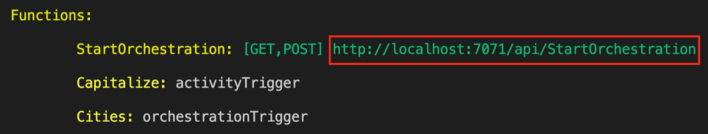

# Create your first durable function in Java 

_Durable Functions_ is an extension of [Azure Functions](../functions-overview.md) that lets you write stateful functions in a serverless environment. The extension manages state, checkpoints, and restarts for you.

In this quickstart, you'll learn how to create and test a "Hello World" Durable Functions app in Java. The most basic Durable Functions app contains the following three functions:  

- _Orchestrator function_ - describes a workflow that orchestrates other functions.
- _Activity function_ - called by the orchestrator function, performs work, and optionally returns a value.
- _Client function_ - a regular Azure Function that starts an orchestrator function. This example uses an HTTP triggered function.

This quickstart will show you how to create this "Hello World" app, which you can do in different ways. Use the selector above to choose your preferred approach. 

## Prerequisites

To complete this tutorial, you need:

- The [Java Developer Kit](/azure/developer/java/fundamentals/java-support-on-azure), version 8 or newer.

- [Apache Maven](https://maven.apache.org), version 3.0 or newer.

- Latest version of the [Azure Functions Core Tools](../functions-run-local.md).
  - For Azure Functions 4.x, Core Tools **v4.0.4915** or newer is required.

- An Azure Storage account, which requires that you have an Azure subscription.

[!INCLUDE [quickstarts-free-trial-note](../../../includes/quickstarts-free-trial-note.md)]

::: zone pivot="create-option-manual-setup" 

## Add required dependencies and plugins to your project

Add the following to your `pom.xml`:

```xml
<properties>
  <azure.functions.maven.plugin.version>1.18.0</azure.functions.maven.plugin.version>
  <azure.functions.java.library.version>3.0.0</azure.functions.java.library.version>
  <durabletask.azure.functions>1.0.0</durabletask.azure.functions>
  <functionAppName>your-unique-app-name</functionAppName>
</properties>

<dependencies>
  <dependency>
    <groupId>com.microsoft.azure.functions</groupId>
    <artifactId>azure-functions-java-library</artifactId>
    <version>${azure.functions.java.library.version}</version>
  </dependency>
  <dependency>
    <groupId>com.microsoft</groupId>
    <artifactId>durabletask-azure-functions</artifactId>
    <version>${durabletask.azure.functions}</version>
  </dependency>
</dependencies>

<build>
  <plugins>
    <plugin>
      <groupId>org.apache.maven.plugins</groupId>
      <artifactId>maven-compiler-plugin</artifactId>
      <version>3.8.1</version>
    </plugin>
    <plugin>
      <groupId>com.microsoft.azure</groupId>
      <artifactId>azure-functions-maven-plugin</artifactId>
      <version>${azure.functions.maven.plugin.version}</version>
      <configuration>
        <appName>${functionAppName}</appName>
        <resourceGroup>java-functions-group</resourceGroup>
        <appServicePlanName>java-functions-app-service-plan</appServicePlanName>
        <region>westus</region>
        <runtime>
          <os>windows</os>
          <javaVersion>11</javaVersion>
        </runtime>
        <appSettings>
          <property>
            <name>FUNCTIONS_EXTENSION_VERSION</name>
            <value>~4</value>
          </property>
        </appSettings>
      </configuration>
      <executions>
        <execution>
          <id>package-functions</id>
          <goals>
            <goal>package</goal>
          </goals>
        </execution>
      </executions>
    </plugin>
    <plugin>
      <artifactId>maven-clean-plugin</artifactId>
      <version>3.1.0</version>
    </plugin>
  </plugins>
</build>
```

## Add required JSON files

Add a `host.json` file to your project directory. It should look similar to the following:

```json
{
  "version": "2.0",
  "logging": {
    "logLevel": {
      "DurableTask.AzureStorage": "Warning",
      "DurableTask.Core": "Warning"
    }
  },
  "extensions": {
    "durableTask": {
      "hubName": "JavaTestHub"
    }
  },
  "extensionBundle": {
    "id": "Microsoft.Azure.Functions.ExtensionBundle",
    "version": "[4.*, 5.0.0)"
  }
}
```
> [!NOTE]
> It's important to note that only the Azure Functions v4 extension bundle currently has the necessary support for Durable Functions for Java. Durable Functions for Java is _not_ supported in v3 and early extension bundles. For more information on extension bundles, see the [extension bundles documentation](../functions-bindings-register.md#extension-bundles).

Durable Functions needs a storage provider to store runtime state. Add a `local.settings.json` file to your project directory to configure the storage provider. To use Azure Storage as the provider, set the value of `AzureWebJobsStorage` to the connection string of your Azure Storage account:

```json
{
  "IsEncrypted": false,
  "Values": {
    "AzureWebJobsStorage": "<your storage account connection string>",
    "FUNCTIONS_WORKER_RUNTIME": "java"
  }
}
```

## Create your functions

The sample code below shows a simple example of each:

```java
import com.microsoft.azure.functions.annotation.*;
import com.microsoft.azure.functions.*;
import java.util.*;

import com.microsoft.durabletask.*;
import com.microsoft.durabletask.azurefunctions.DurableActivityTrigger;
import com.microsoft.durabletask.azurefunctions.DurableClientContext;
import com.microsoft.durabletask.azurefunctions.DurableClientInput;
import com.microsoft.durabletask.azurefunctions.DurableOrchestrationTrigger;

public class DurableFunctionsSample {
    /**
     * This HTTP-triggered function starts the orchestration.
     */
    @FunctionName("StartOrchestration")
    public HttpResponseMessage startOrchestration(
            @HttpTrigger(name = "req", methods = {HttpMethod.GET, HttpMethod.POST}, authLevel = AuthorizationLevel.ANONYMOUS) HttpRequestMessage<Optional<String>> request,
            @DurableClientInput(name = "durableContext") DurableClientContext durableContext,
            final ExecutionContext context) {
        context.getLogger().info("Java HTTP trigger processed a request.");

        DurableTaskClient client = durableContext.getClient();
        String instanceId = client.scheduleNewOrchestrationInstance("Cities");
        context.getLogger().info("Created new Java orchestration with instance ID = " + instanceId);
        return durableContext.createCheckStatusResponse(request, instanceId);
    }

    /**
     * This is the orchestrator function, which can schedule activity functions, create durable timers,
     * or wait for external events in a way that's completely fault-tolerant.
     */
    @FunctionName("Cities")
    public String citiesOrchestrator(
            @DurableOrchestrationTrigger(name = "taskOrchestrationContext") TaskOrchestrationContext ctx) {
        String result = "";
        result += ctx.callActivity("Capitalize", "Tokyo", String.class).await() + ", ";
        result += ctx.callActivity("Capitalize", "London", String.class).await() + ", ";
        result += ctx.callActivity("Capitalize", "Seattle", String.class).await() + ", ";
        result += ctx.callActivity("Capitalize", "Austin", String.class).await();
        return result;
    }

    /**
     * This is the activity function that gets invoked by the orchestrator function.
     */
    @FunctionName("Capitalize")
    public String capitalize(@DurableActivityTrigger(name = "name") String name, final ExecutionContext context) {
        context.getLogger().info("Capitalizing: " + name);
        return name.toUpperCase();
    }
}

```
::: zone-end

::: zone pivot="create-option-maven-command"

## Create a local project with Maven command 

1. Run the following command to generate a project with the basic functions of a Durable Functions app: 

# [Bash](#tab/bash)
```bash
mvn archetype:generate -DarchetypeGroupId=com.microsoft.azure -DarchetypeArtifactId=azure-functions-archetype -DarchetypeVersion=1.51 -Dtrigger=durablefunctions
```

# [PowerShell](#tab/powershell)
```powershell 
mvn archetype:generate "-DarchetypeGroupId=com.microsoft.azure" "-DarchetypeArtifactId=azure-functions-archetype" "-DarchetypeVersion=1.51" "-Dtrigger=durablefunctions"
```

# [Cmd](#tab/cmd)
```cmd 
mvn archetype:generate "-DarchetypeGroupId=com.microsoft.azure" "-DarchetypeArtifactId=azure-functions-archetype" "-DarchetypeVersion=1.51" "-Dtrigger=durablefunctions"
```
---

2. Follow the prompts and provide the following information:

  | Prompt | Value | 
  | ------ | ----- | 
  | **groupId** | `com.function` |
  | **artifactId** | `myDurableFunction` |
  | **version** | `1.0-SNAPSHOT` |
  | **package** | `com.function` |
  | **Y** | Hit _enter_ to confirm |

Now you have a local project generated with the three functions that are needed for a basic Durable Functions app. 

Please check to ensure you have `com.microsoft:durabletask-azure-functions` as a dependency in your `pom.xml`.  

## Configure backend storage provider 

Durable Functions needs a storage provider to store runtime state. You can configure to use Azure Storage as the storage provider in `local.settings.json` by providing the connection string of your Azure Storage account as the value to `AzureWebJobsStorage`:

```json
{
  "IsEncrypted": false,
  "Values": {
    "AzureWebJobsStorage": "<your storage account connection string>",
    "FUNCTIONS_WORKER_RUNTIME": "java"
  }
}
``` 
::: zone-end

::: zone pivot="create-option-vscode"
## Create your local project 

1. In Visual Studio Code, press F1 (or Ctrl/Cmd+Shift+P) to open the command palette. In the command palette, search for and select `Azure Functions: Create New Project...`.

    

2. Choose an empty folder location for your project and choose **Select**.

3. Follow the prompts and provide the following information:

    |Prompt|Value|
    |--|--|
    |**Select a language**| Choose `Java`.|    
    |**Select a version of Java**| Choose `Java 8` or newer, the Java version on which your functions run in Azure. Choose a Java version that you've verified locally. |
    | **Provide a group ID** | `com.function`. |
    | **Provide an artifact ID** | `myDurableFunction`. |
    | **Provide a version** | `1.0-SNAPSHOT`. |
    | **Provide a package name** | `com.function`. |
    | **Provide an app name** | `myDurableFunction`. |
    | **Select the build tool for Java project** | Choose `Maven`.|
    |**Select how you would like to open your project**| Choose `Open in new window`.|

You now have a project with an example HTTP function. You can remove this function if you'd like because we'll be adding the basic functions of a Durable Functions app in the next step.  

## Add functions to the project

1. In the command palette, search for and select `Azure Functions: Create Function...`.

2. Select `Change template filter` to `All`. 

3. Follow the prompts and provide the following information:

    | Prompt | Value | 
    | ------ | ----- | 
    | **Select a template for your function**| DurableFunctionsOrchestration | 
    | **Provide a package name** | `com.function`
    | **Provide a function name** | `DurableFunctionsOrchestrator` | 
  
4. Choose `Select storage account` on the pop-up window asking to set up storage account information and follow the prompts. 

You should now have the three basic functions for a Durable Functions app generated. 

## Configure pom.xml and host.json

Add the following dependency to your `pom.xml`:

```xml
<dependency>
  <groupId>com.microsoft</groupId>
  <artifactId>durabletask-azure-functions</artifactId>
  <version>1.0.0</version>
</dependency>
```

Add the `extensions` property to your `host.json`:

```json
"extensions": { "durableTask": { "hubName": "JavaTestHub" }}
```
::: zone-end


## Test the function locally

Azure Functions Core Tools lets you run an Azure Functions project on your local development computer.

> [!NOTE]
> Durable Functions for Java requires Azure Functions Core Tools v4.0.4915 or newer. You can see which version is installed by running the `func --version` command from the terminal.

1. If you are using Visual Studio Code, open a new terminal window and run the following commands to build the project:

    ```bash
    mvn clean package
    ```
    
    Then run the durable function:
    
    ```bash
    mvn azure-functions:run
    ```

2. In the Terminal panel, copy the URL endpoint of your HTTP-triggered function.

   

3. Using a tool like [Postman](https://www.getpostman.com/) or [cURL](https://curl.haxx.se/), send an HTTP POST request to the URL endpoint. You should get a response similar to the following:

    ```json
    {
        "id": "d1b33a60-333f-4d6e-9ade-17a7020562a9",
        "purgeHistoryDeleteUri": "http://localhost:7071/runtime/webhooks/durabletask/instances/d1b33a60-333f-4d6e-9ade-17a7020562a9?code=ACCupah_QfGKoFXydcOHH9ffcnYPqjkddSawzRjpp1PQAzFueJ2tDw==",
        "sendEventPostUri": "http://localhost:7071/runtime/webhooks/durabletask/instances/d1b33a60-333f-4d6e-9ade-17a7020562a9/raiseEvent/{eventName}?code=ACCupah_QfGKoFXydcOHH9ffcnYPqjkddSawzRjpp1PQAzFueJ2tDw==",
        "statusQueryGetUri": "http://localhost:7071/runtime/webhooks/durabletask/instances/d1b33a60-333f-4d6e-9ade-17a7020562a9?code=ACCupah_QfGKoFXydcOHH9ffcnYPqjkddSawzRjpp1PQAzFueJ2tDw==",
        "terminatePostUri": "http://localhost:7071/runtime/webhooks/durabletask/instances/d1b33a60-333f-4d6e-9ade-17a7020562a9/terminate?reason={text}&code=ACCupah_QfGKoFXydcOHH9ffcnYPqjkddSawzRjpp1PQAzFueJ2tDw=="
    }
    ```
    
    The response is the initial result from the HTTP function letting you know the durable orchestration has started successfully. It is not yet the end result of the orchestration. The response includes a few useful URLs. For now, let's query the status of the orchestration.

4. Copy the URL value for `statusQueryGetUri` and paste it in the browser's address bar and execute the request. Alternatively you can also continue to use Postman or cURL to issue the GET request.

    The request will query the orchestration instance for the status. You should get an eventual response, which shows us the instance has completed, and includes the outputs or results of the durable function. It looks like:

    ```json
    {
        "name": "Cities",
        "instanceId": "d1b33a60-333f-4d6e-9ade-17a7020562a9",
        "runtimeStatus": "Completed",
        "input": null,
        "customStatus": "",
        "output":"TOKYO, LONDON, SEATTLE, AUSTIN",
        "createdTime": "2022-12-12T05:00:02Z",
        "lastUpdatedTime": "2022-12-12T05:00:06Z"
    }
    ```
