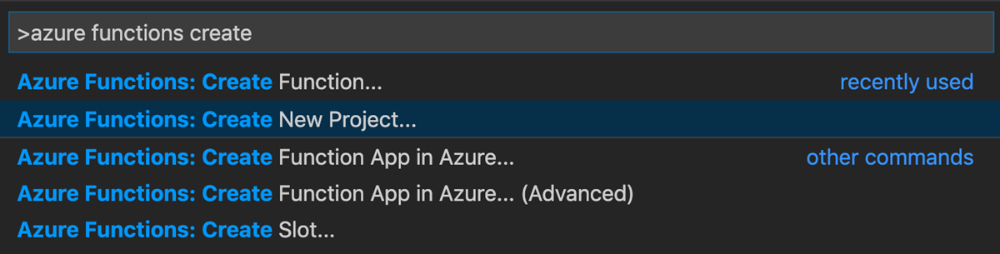

# Create your first durable function in JavaScript

*Durable Functions* is an extension of [Azure Functions](../functions-overview.md) that lets you write stateful functions in a serverless environment. The extension manages state, checkpoints, and restarts for you.

In this article, you learn how to use the Visual Studio Code Azure Functions extension to locally create and test a "hello world" durable function.  This function will orchestrate and chain together calls to other functions. You then publish the function code to Azure.

[!INCLUDE [functions-nodejs-model-pivot-description](../../../includes/functions-nodejs-model-pivot-description.md)]


## Prerequisites

To complete this tutorial:

* Install [Visual Studio Code](https://code.visualstudio.com/download).

::: zone pivot="nodejs-model-v3"
* Install the [Azure Functions](https://marketplace.visualstudio.com/items?itemName=ms-azuretools.vscode-azurefunctions) VS Code extension
::: zone-end
::: zone pivot="nodejs-model-v4"
* Install the [Azure Functions](https://marketplace.visualstudio.com/items?itemName=ms-azuretools.vscode-azurefunctions) VS Code extension version `1.10.4` or above.
::: zone-end

::: zone pivot="nodejs-model-v3"
* Make sure you have the latest version of the [Azure Functions Core Tools](../functions-run-local.md).
::: zone-end
::: zone pivot="nodejs-model-v4"
* Make sure you have [Azure Functions Core Tools](../functions-run-local.md) version `v4.0.5095` or above.
::: zone-end

* Durable Functions require an Azure storage account. You need an Azure subscription.

::: zone pivot="nodejs-model-v3"
* Make sure that you have version 16.x+ of [Node.js](https://nodejs.org/) installed.
::: zone-end
::: zone pivot="nodejs-model-v4" 
* Make sure that you have version 18.x+ of [Node.js](https://nodejs.org/) installed.
::: zone-end

[!INCLUDE [quickstarts-free-trial-note](../../../includes/quickstarts-free-trial-note.md)]

## <a name="create-an-azure-functions-project"></a>Create your local project 

In this section, you use Visual Studio Code to create a local Azure Functions project. 

1. In Visual Studio Code, press <kbd>F1</kbd> (or <kbd>Ctrl/Cmd+Shift+P</kbd>) to open the command palette. In the command palette, search for and select `Azure Functions: Create New Project...`.

    

2. Choose an empty folder location for your project and choose **Select**.

::: zone pivot="nodejs-model-v3"
3. Following the prompts, provide the following information:

    | Prompt | Value | Description |
    | ------ | ----- | ----------- |
    | Select a language for your function app project | JavaScript | Create a local Node.js Functions project. |
    | Select a JavaScript programming model | Model V3 | Choose the V3 programming model. |
    | Select a version | Azure Functions v4 | You only see this option when the Core Tools aren't already installed. In this case, Core Tools are installed the first time you run the app. |
    | Select a template for your project's first function | Skip for now | |
    | Select how you would like to open your project | Open in current window | Reopens VS Code in the folder you selected. |

::: zone-end
::: zone pivot="nodejs-model-v4"
3. Following the prompts, provide the following information:

    | Prompt | Value | Description |
    | ------ | ----- | ----------- |
    | Select a language for your function app project | JavaScript | Create a local Node.js Functions project. |
    | Select a JavaScript programming model | Model V4 (Preview) | Choose the V4 programming model (in preview). |
    | Select a version | Azure Functions v4 | You only see this option when the Core Tools aren't already installed. In this case, Core Tools are installed the first time you run the app. |
    | Select a template for your project's first function | Skip for now | |
    | Select how you would like to open your project | Open in current window | Reopens VS Code in the folder you selected. |

::: zone-end

Visual Studio Code installs the Azure Functions Core Tools, if needed. It also creates a function app project in a folder. This project contains the [host.json](../functions-host-json.md) and [local.settings.json](../functions-develop-local.md#local-settings-file) configuration files.

A `package.json` file is also created in the root folder.

## Install the Durable Functions npm package

To work with Durable Functions in a Node.js function app, you use a library called `durable-functions`.
::: zone pivot="nodejs-model-v4"
To use the V4 programming model, you need to install the preview `v3.x` version of `durable-functions`.
::: zone-end

1. Use the *View* menu or <kbd>Ctrl + Shift + `</kbd> to open a new terminal in VS Code.

::: zone pivot="nodejs-model-v3"
2. Install the `durable-functions` npm package by running `npm install durable-functions` in the root directory of the function app.
::: zone-end
::: zone pivot="nodejs-model-v4"
2. Install the `durable-functions` npm package preview version by running `npm install durable-functions@preview` in the root directory of the function app.
::: zone-end

## Creating your functions

The most basic Durable Functions app contains three functions:

* *Orchestrator function* - describes a workflow that orchestrates other functions.
* *Activity function* - called by the orchestrator function, performs work, and optionally returns a value.
* *Client function* - a regular Azure Function that starts an orchestrator function. This example uses an HTTP triggered function.

::: zone pivot="nodejs-model-v3"

### Orchestrator function

You use a template to create the durable function code in your project.

1. In the command palette, search for and select `Azure Functions: Create Function...`.

1. Following the prompts, provide the following information:

    | Prompt | Value | Description |
    | ------ | ----- | ----------- |
    | Select a template for your function | Durable Functions orchestrator | Create a Durable Functions orchestration |
    | Choose a durable storage type. | Azure Storage (Default) | Select the storage backend used for Durable Functions. |
    | Provide a function name | HelloOrchestrator | Name of your durable function |

You've added an orchestrator to coordinate activity functions. Open *HelloOrchestrator/index.js* to see the orchestrator function. Each call to `context.df.callActivity` invokes an activity function named `Hello`.

Next, you'll add the referenced `Hello` activity function.

### Activity function

1. In the command palette, search for and select `Azure Functions: Create Function...`.

1. Following the prompts, provide the following information:

    | Prompt | Value | Description |
    | ------ | ----- | ----------- |
    | Select a template for your function | Durable Functions activity | Create an activity function |
    | Provide a function name | Hello | Name of your activity function |

You've added the `Hello` activity function that is invoked by the orchestrator. Open *Hello/index.js* to see that it's taking a name as input and returning a greeting. An activity function is where you perform "the real work" in your workflow: work such as making a database call or performing some non-deterministic computation.

Finally, you'll add an HTTP triggered function that starts the orchestration.

### Client function (HTTP starter)

1. In the command palette, search for and select `Azure Functions: Create Function...`.

1. Following the prompts, provide the following information:

    | Prompt | Value | Description |
    | ------ | ----- | ----------- |
    | Select a template for your function | Durable Functions HTTP starter | Create an HTTP starter function |
    | Provide a function name | DurableFunctionsHttpStart | Name of your activity function |
    | Authorization level | Anonymous | For demo purposes, allow the function to be called without authentication |

You've added an HTTP triggered function that starts an orchestration. Open *DurableFunctionsHttpStart/index.js* to see that it uses `client.startNew` to start a new orchestration. Then it uses `client.createCheckStatusResponse` to return an HTTP response containing URLs that can be used to monitor and manage the new orchestration.

You now have a Durable Functions app that can be run locally and deployed to Azure.
::: zone-end
::: zone pivot="nodejs-model-v4"

One of the benefits of the V4 Programming Model is the flexibility of where you write your functions.
In the V4 Model, you can use a single template to create all three functions in one file in your project.

1. In the command palette, search for and select `Azure Functions: Create Function...`.

1. Following the prompts, provide the following information:

    | Prompt | Value | Description |
    | ------ | ----- | ----------- |
    | Select a template for your function | Durable Functions orchestrator | Create a file with a Durable Functions orchestration, an Activity function, and a Durable Client starter function. |
    | Choose a durable storage type | Azure Storage (Default) | Select the storage backend used for Durable Functions. |
    | Provide a function name | hello | Name used for your durable functions |

Open *src/functions/hello.js* to view the functions you created.

You've created an orchestrator called `helloOrchestrator` to coordinate activity functions. Each call to `context.df.callActivity` invokes an activity function called `hello`.

You've also added the `hello` activity function that is invoked by the orchestrator. In the same file, you can see that it's taking a name as input and returning a greeting. An activity function is where you perform "the real work" in your workflow: work such as making a database call or performing some non-deterministic computation.

Lastly, you've also added an HTTP triggered function that starts an orchestration. In the same file, you can see that it uses `client.startNew` to start a new orchestration. Then it uses `client.createCheckStatusResponse` to return an HTTP response containing URLs that can be used to monitor and manage the new orchestration.

You now have a Durable Functions app that can be run locally and deployed to Azure.
::: zone-end

## Test the function locally

::: zone pivot="nodejs-model-v4"

> [!NOTE]
> To run the V4 programming model, your app needs to have the `EnableWorkerIndexing` feature flag set. When running locally, you need to set `AzureWebJobsFeaturesFlags` to value of `EnableWorkerIndexing` in your `local.settings.json` file. This should already be set when creating your project.  To verify, check the following line exists in your `local.settings.json` file, and add it if it doesn't.
>
> ```json
> "AzureWebJobsFeatureFlags": "EnableWorkerIndexing"
> ```

::: zone-end

Azure Functions Core Tools lets you run an Azure Functions project on your local development computer. You're prompted to install these tools the first time you start a function from Visual Studio Code.

::: zone pivot="nodejs-model-v3"
1. To test your function, set a breakpoint in the `Hello` activity function code (*Hello/index.js*). Press F5 or select `Debug: Start Debugging` from the command palette to start the function app project. Output from Core Tools is displayed in the **Terminal** panel.
::: zone-end
::: zone pivot="nodejs-model-v4"
1. To test your function, set a breakpoint in the `hello` activity function code (*src/functions/hello.js*). Press F5 or select `Debug: Start Debugging` from the command palette to start the function app project. Output from Core Tools is displayed in the **Terminal** panel.
::: zone-end

 > [!NOTE]
 > Refer to the [Durable Functions Diagnostics](durable-functions-diagnostics.md#debugging) for more information on debugging.

2. Durable Functions requires an Azure Storage account to run. When VS Code prompts you to select a storage account, choose **Select storage account**.

    

3. Following the prompts, provide the following information to create a new storage account in Azure.

    | Prompt | Value | Description |
    | ------ | ----- | ----------- |
    | Select subscription | *name of your subscription* | Select your Azure subscription |
    | Select a storage account | Create a new storage account |  |
    | Enter the name of the new storage account | *unique name* | Name of the storage account to create |
    | Select a resource group | *unique name* | Name of the resource group to create |
    | Select a location | *region* | Select a region close to you |

4. In the **Terminal** panel, copy the URL endpoint of your HTTP-triggered function.

    

::: zone pivot="nodejs-model-v3"
5. Using your browser, or a tool like [Postman](https://www.getpostman.com/) or [cURL](https://curl.haxx.se/), send an HTTP POST request to the URL endpoint. Replace the last segment with the name of the orchestrator function (`HelloOrchestrator`). The URL should be similar to `http://localhost:7071/api/orchestrators/HelloOrchestrator`.
::: zone-end
::: zone pivot="nodejs-model-v4"
5. Using your browser, or a tool like [Postman](https://www.getpostman.com/) or [cURL](https://curl.haxx.se/), send an HTTP POST request to the URL endpoint. Replace the last segment with the name of the orchestrator function (`helloOrchestrator`). The URL should be similar to `http://localhost:7071/api/orchestrators/helloOrchestrator`.
::: zone-end

   The response is the initial result from the HTTP function letting you know the durable orchestration has started successfully. It is not yet the end result of the orchestration. The response includes a few useful URLs. For now, let's query the status of the orchestration.

6. Copy the URL value for `statusQueryGetUri` and paste it in the browser's address bar and execute the request. Alternatively you can also continue to use Postman to issue the GET request.

   The request queries the orchestration instance for the status. You should get an eventual response, which shows us the instance has completed, and includes the outputs or results of the durable function. It looks like: 

    ::: zone pivot="nodejs-model-v3"
    ```json
    {
        "name": "HelloOrchestrator",
        "instanceId": "9a528a9e926f4b46b7d3deaa134b7e8a",
        "runtimeStatus": "Completed",
        "input": null,
        "customStatus": null,
        "output": [
            "Hello Tokyo!",
            "Hello Seattle!",
            "Hello London!"
        ],
        "createdTime": "2020-03-18T21:54:49Z",
        "lastUpdatedTime": "2020-03-18T21:54:54Z"
    }
    ```
    ::: zone-end
    ::: zone pivot="nodejs-model-v4"
    ```json
    {
        "name": "helloOrchestrator",
        "instanceId": "6ba3f77933b1461ea1a3828c013c9d56",
        "runtimeStatus": "Completed",
        "input": "",
        "customStatus": null,
        "output": [
            "Hello, Tokyo",
            "Hello, Seattle",
            "Hello, Cairo"
        ],
        "createdTime": "2023-02-13T23:02:21Z",
        "lastUpdatedTime": "2023-02-13T23:02:25Z"
    }
    ```
    ::: zone-end

7. To stop debugging, press **Shift + F5** in VS Code.

After you've verified that the function runs correctly on your local computer, it's time to publish the project to Azure.

[!INCLUDE [functions-create-function-app-vs-code](../../../includes/functions-sign-in-vs-code.md)]

[!INCLUDE [functions-publish-project-vscode](../../../includes/functions-publish-project-vscode.md)]

::: zone pivot="nodejs-model-v4"

## Update app settings

To enable your V4 programming model app to run in Azure, you need to add the `EnableWorkerIndexing` flag under the `AzureWebJobsFeatureFlags` app setting.

1. In Visual Studio Code, press <kbd>F1</kbd> to open the command palette. In the command palette, search for and select `Azure Functions: Add New Setting...`.
2. Choose your new function app, then type `AzureWebJobsFeatureFlags` for the new app setting name, and press <kbd>Enter</kbd>.
3. For the value, type `EnableWorkerIndexing` and press <kbd>Enter</kbd>.

::: zone-end

## Test your function in Azure

::: zone pivot="nodejs-model-v4"
> [!NOTE]
> To use the V4 node programming model, make sure your app is running on at least version 4.16.5 of the Azure Functions runtime.
::: zone-end

::: zone pivot="nodejs-model-v3"
1. Copy the URL of the HTTP trigger from the **Output** panel. The URL that calls your HTTP-triggered function should be in this format: `http://<functionappname>.azurewebsites.net/api/orchestrators/HelloOrchestrator`
::: zone-end
::: zone pivot="nodejs-model-v4"
1. Copy the URL of the HTTP trigger from the **Output** panel. The URL that calls your HTTP-triggered function should be in this format: `http://<functionappname>.azurewebsites.net/api/orchestrators/helloOrchestrator`
::: zone-end

2. Paste this new URL for the HTTP request into your browser's address bar. You should get the same status response as before when using the published app.

## Next steps

You have used Visual Studio Code to create and publish a JavaScript durable function app.

> [!div class="nextstepaction"]
> [Learn about common durable function patterns](durable-functions-overview.md#application-patterns)
