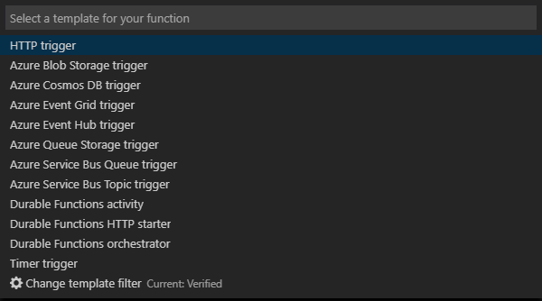
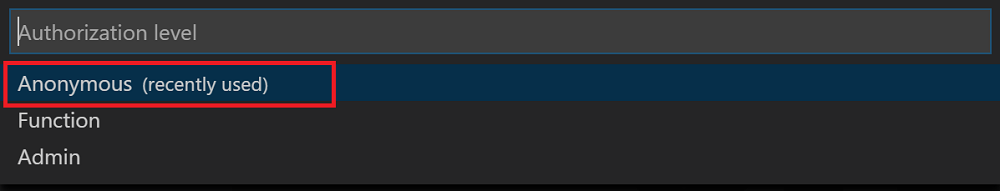

# Create your first durable function in JavaScript

*Durable Functions* is an extension of [Azure Functions](../functions-overview.md) that lets you write stateful functions in a serverless environment. The extension manages state, checkpoints, and restarts for you.

In this article, you learn how to use the Visual Studio Code Azure Functions extension to locally create and test a "hello world" durable function.  This function will orchestrate and chain together calls to other functions. You then publish the function code to Azure.


## Prerequisites

To complete this tutorial:

* Install [Visual Studio Code](https://code.visualstudio.com/download).

* Make sure you have the [latest Azure Functions tools](../functions-develop-vs.md#check-your-tools-version).

* On a Windows computer, verify you have the [Azure Storage Emulator](../../storage/common/storage-use-emulator.md) installed and running. On a Mac or Linux computer, you must use an actual Azure storage account.

* Make sure that you have version 8.0 or a later version of [Node.js](https://nodejs.org/) installed.

[!INCLUDE [quickstarts-free-trial-note](../../../includes/quickstarts-free-trial-note.md)]

[!INCLUDE [functions-install-vs-code-extension](../../../includes/functions-install-vs-code-extension.md)]

[!INCLUDE [functions-create-function-app-vs-code](../../../includes/functions-create-function-app-vs-code.md)]

## Install the Durable Functions npm package

1. Install the `durable-functions` npm package by running `npm install durable-functions` in the root directory of the function app.

## Create a Starter Function

First, create an HTTP triggered function that starts a durable function orchestration.

1. From **Azure: Functions**, choose the Create Function icon.

    

2. Select the folder with your function app project and select the **HTTP trigger** function template.

    

3. Type `HttpStart` for the function name and press Enter, then select **Anonymous** authentication.

    

    A function is created in your chosen language using the template for an HTTP-triggered function.

4. Replace index.js with the below JavaScript:

    [!code-javascript[Main](~/samples-durable-functions/samples/javascript/HttpStart/index.js)]

5. Replace function.json with the below JSON:

    [!code-json[Main](~/samples-durable-functions/samples/javascript/HttpStart/function.json)]

We've now created an entry-point into our Durable Function. Let's add an orchestrator.

## Create an Orchestrator Function

Next, you create another function to be the orchestrator. We use the HTTP trigger function template for convenience. The function code itself is replaced by the orchestrator code.

1. Repeat the steps from the previous section to create a second function using the HTTP trigger template. This time name the function `OrchestratorFunction`.

2. Open the index.js file for the new function and replace the contents with the following code:

    [!code-json[Main](~/samples-durable-functions/samples/javascript/E1_HelloSequence/index.js)]

3. Open the function.json file and replace it with the following JSON:

    [!code-json[Main](~/samples-durable-functions/samples/javascript/E1_HelloSequence/function.json)]

We've added an orchestrator to coordinate activity functions. Let's now add the referenced activity function.

## Create an Activity Function

1. Repeat the steps from the previous sections to create a third function using the HTTP trigger template. But this time name the function  `E1_SayHello`.

2. Open the index.js file for the new function and replace the contents with the following code:

    [!code-javascript[Main](~/samples-durable-functions/samples/javascript/E1_SayHello/index.js)]

3. Replace function.json with the below JSON:

    [!code-json[Main](~/samples-durable-functions/samples/csx/E1_SayHello/function.json)]

We've now added all components needed to start off an orchestration and chain together activity functions.

## Test the function locally

Azure Functions Core Tools lets you run an Azure Functions project on your local development computer. You're prompted to install these tools the first time you start a function from Visual Studio Code.  

1. On a Windows computer, start the Azure Storage Emulator and make sure that the **AzureWebJobsStorage** property of local.settings.json is set to `UseDevelopmentStorage=true`. 

    For Storage Emulator 5.8 make sure that the **AzureWebJobsSecretStorageType** property of local.settings.json is set to `files`. On     a Mac or Linux computer, you must set the **AzureWebJobsStorage** property to the connection string of an existing Azure storage         account. You create a storage account later in this article.

2. To test your function, set a breakpoint in the function code and press F5 to start the function app project. Output from Core Tools is displayed in the **Terminal** panel. If this is your first time using Durable Functions, the Durable Functions extension is installed and the build might take a few seconds.

    > [!NOTE]
    > JavaScript Durable Functions require version **1.7.0** or greater of the **Microsoft.Azure.WebJobs.Extensions.DurableTask** extension. Run the following command from the root folder of your Azure Functions app to install the Durable Functions extension `func extensions install -p Microsoft.Azure.WebJobs.Extensions.DurableTask -v 1.7.0`

3. In the **Terminal** panel, copy the URL endpoint of your HTTP-triggered function.

    

4. Replace `{functionName}` with `OrchestratorFunction`.

5. Using a tool like [Postman](https://www.getpostman.com/) or [cURL](https://curl.haxx.se/), send a HTTP POST request to the URL endpoint.

   The response is the initial result from the HTTP function letting us know the durable orchestration has started successfully. It is not yet the end result of the orchestration. The response includes a few useful URLs. For now, let's query the status of the orchestration.

6. Copy the URL value for `statusQueryGetUri` and paste it in the browser's address bar and execute the request. Alternatively you can also continue to use Postman to issue the GET request.

   The request will query the orchestration instance for the status. You should get an eventual response which shows us the instance has completed, and includes the outputs or results of the durable function. It looks like: 

    ```json
    {
        "instanceId": "d495cb0ac10d4e13b22729c37e335190",
        "runtimeStatus": "Completed",
        "input": null,
        "customStatus": null,
        "output": [
            "Hello Tokyo!",
            "Hello Seattle!",
            "Hello London!"
        ],
        "createdTime": "2018-11-08T07:07:40Z",
        "lastUpdatedTime": "2018-11-08T07:07:52Z"
    }
    ```

7. To stop debugging, press **Shift + F5** in VS Code.

After you've verified that the function runs correctly on your local computer, it's time to publish the project to Azure.

[!INCLUDE [functions-create-function-app-vs-code](../../../includes/functions-sign-in-vs-code.md)]

[!INCLUDE [functions-publish-project-vscode](../../../includes/functions-publish-project-vscode.md)]

## Test your function in Azure

1. Copy the URL of the HTTP trigger from the **Output** panel. The URL that calls your HTTP-triggered function should be in the following format:

        http://<functionappname>.azurewebsites.net/orchestrators/<functionname>

2. Paste this new URL for the HTTP request into your browser's address bar. You should get the same status response as before when using the published app.

## Next steps

You have used Visual Studio Code to create and publish a JavaScript durable function app.

> [!div class="nextstepaction"]
> [Learn about common durable function patterns](durable-functions-concepts.md)
