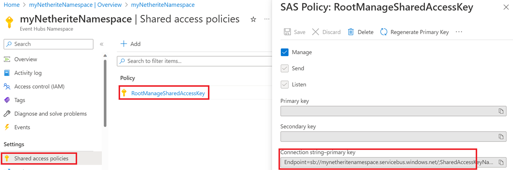
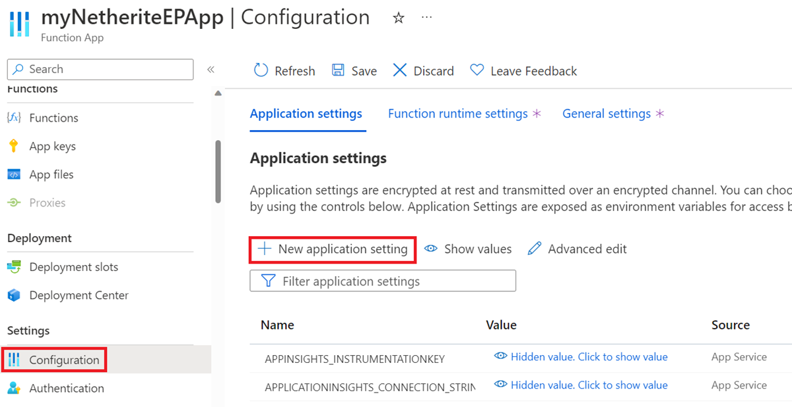

# Configure Durable Functions with the Netherite storage provider

Durable Functions offers several [storage providers](durable-functions-storage-providers.md), also called "backends", for storing orchestration and entity runtime state. By default, new projects are configured to use the [Azure Storage provider](durable-functions-storage-providers.md#azure-storage). In this article, we walk through how to configure a Durable Functions app to utilize the [Netherite storage provider](durable-functions-storage-providers.md#netherite).

> [!NOTE]
> Netherite was designed and developed by [Microsoft Research](https://www.microsoft.com/research) for [high throughput](https://microsoft.github.io/durabletask-netherite/#/scenarios) scenarios. In some [benchmarks](https://microsoft.github.io/durabletask-netherite/#/throughput?id=multi-node-throughput), throughput increased by over an order of magnitude compared to the default Azure Storage provider. To learn more about when to use the Netherite storage provider, see the [storage providers](durable-functions-storage-providers.md) documentation.

## Note on data migration

Migration of [Task Hub data](durable-functions-task-hubs.md) across storage providers isn't currently supported. Function apps with existing runtime data will start with a fresh, empty task hub after switching to the Netherite backend. Similarly, the task hub contents created with Netherite can't be preserved when switching to a different storage provider.

## Prerequisites

The following steps assume that you are starting with an existing Durable Functions app and are familiar with how to operate it.

In particular, this quickstart assumes that you have already:
1. Created an Azure Functions project on your local machine.
2. Added Durable Functions to your project with an [orchestrator function](durable-functions-bindings.md#orchestration-trigger) and a [client function](durable-functions-bindings.md#orchestration-client) that triggers it.
3. Configured the project for local debugging.
4. Learned how to deploy an Azure Functions project to Azure.

If this isn't the case, we suggest you start with one of the following articles, which provides detailed instructions on how to achieve all the requirements above:

- [Create your first durable function - C#](durable-functions-create-first-csharp.md)
- [Create your first durable function - JavaScript](quickstart-js-vscode.md)
- [Create your first durable function - Python](quickstart-python-vscode.md)
- [Create your first durable function - PowerShell](quickstart-powershell-vscode.md)
- [Create your first durable function - Java](quickstart-java.md)

## Add the Netherite extension (.NET only)

> [!NOTE]
> If your app uses [Extension Bundles](../functions-bindings-register.md#extension-bundles), you should ignore this section as Extension Bundles removes the need for manual Extension management.

You'll need to install the latest version of the Netherite Extension on NuGet. This usually means including a reference to it in your `.csproj` file and building the project.

The Extension package to install depends on the .NET worker you are using:
- For the _in-process_ .NET worker, install [`Microsoft.Azure.DurableTask.Netherite.AzureFunctions`](https://www.nuget.org/packages/Microsoft.Azure.DurableTask.Netherite.AzureFunctions).
- For the _isolated_ .NET worker, install [`Microsoft.Azure.Functions.Worker.Extensions.DurableTask.Netherite`](https://www.nuget.org/packages/Microsoft.Azure.Functions.Worker.Extensions.DurableTask.Netherite).

You can install the Extension using the following [Azure Functions Core Tools CLI](../functions-run-local.md#install-the-azure-functions-core-tools) command

```cmd
func extensions install --package <package name depending on your worker model> --version <latest version>
```

For more information on installing Azure Functions Extensions via the Core Tools CLI, see [func extensions install](../functions-core-tools-reference.md#func-extensions-install).

## Configure local.settings.json for local development

The Netherite backend requires a connection string to [Event Hubs](https://azure.microsoft.com/products/event-hubs/) to run on Azure. However, for local development, providing the string `"SingleHost"` bypasses the need for Event Hubs.

In `local.settings.json`, set the value of `EventHubsConnection` to `SingleHost` as shown below:

```json
{
  "IsEncrypted": false,
  "Values": {
    "AzureWebJobsStorage": "UseDevelopmentStorage=true",
    "EventHubsConnection": "SingleHost",
    "FUNCTIONS_WORKER_RUNTIME": "<dependent on your programming language>"
  }
}
```

> [!NOTE]
> The value of `FUNCTIONS_WORKER_RUNTIME` is dependent on your programming language of choice. For more information, please see its [reference docs](../functions-app-settings.md#functions_worker_runtime).

## Update host.json

Edit the storage provider section of the `host.json` file so it sets the `type` to `Netherite`.

```json
{
  "version": "2.0",
  "extensions": {
    "durableTask": {
      "storageProvider": {
        "type": "Netherite"
        }
    }
  }
}
```

The snippet above is just a *minimal* configuration. Later, you may want to consider [additional parameters](https://microsoft.github.io/durabletask-netherite/#/settings?id=typical-configuration).


## Test locally

Your app is now ready for local development: You can start the Function app to test it. One way to do this is to run `func host start` on your application's root and executing a simple orchestrator Function.

While the function app is running, Netherite will publish load information about its active partitions to an Azure Storage table named "DurableTaskPartitions". You can use [Azure Storage Explorer](../../vs-azure-tools-storage-manage-with-storage-explorer.md) to check that it's working as expected. If Netherite is running correctly, the table won't be empty; see the example below.


> [!NOTE]
> For more information on the contents of this table, see the [Partition Table](https://microsoft.github.io/durabletask-netherite/#/ptable) article.

## Run your app on Azure

You need to create an Azure Functions app on Azure. To do this, follow the instructions in the **Create a function app** section of [these instructions](../functions-create-function-app-portal.md).

### Set up Event Hubs

You will need to set up an Event Hubs namespace to run Netherite on Azure. You can also set it up if you prefer to use Event Hubs during local development.

> [!NOTE]
> An Event Hubs namespace incurs an ongoing cost, whether or not it is being used by Durable Functions. Microsoft offers a [12-month free Azure subscription account](https://azure.microsoft.com/free/) if you’re exploring Azure for the first time.

#### Create an Event Hubs namespace

Follow [these steps](../../event-hubs/event-hubs-create.md#create-an-event-hubs-namespace) to create an Event Hubs namespace on the Azure portal. When creating the namespace, you may be prompted to:

1. Choose a *resource group*: Use the same resource group as the Function app.
2. Choose a *plan* and provision *throughput units*. Select the defaults, this setting can be changed later.
3. Choose the *retention* time: Select the default, this setting has no effect on Netherite.

#### Obtain the Event Hubs connection string

To obtain the connection string for your Event Hubs namespace, go to your Event Hubs namespace in the Azure portal, select **Shared access policies**, and then select **RootManagedSharedAccessKey**. This should reveal a field named **Connection string-primary key** and that field's value is the connection string.

Below are guiding screenshots on how to find this data in the portal:



### Add connection string as an application setting

You need to add your connection string as an application setting in your function app. To do this through the Azure portal, go to your function app view, select **Configuration**, and then select **New application setting**. This is where you can assign `EventHubsConnection` to map to your connection string. Below are some guiding images.




### Enable runtime scaling (Elastic Premium only)

> [!NOTE]
> Skip this section if your app is not in the Elastic Premium plan.

If your app is running on the Elastic Premium Plan, it is recommended that you enable runtime scale monitoring for better scaling. To do this, go to **Configuration**, select **Function runtime settings** and toggle **Runtime Scale Monitoring** to On.


### Ensure your app is using a 64-bit architecture (Windows only)

> [!NOTE]
> Skip this section if your app is running on Linux.

Netherite requires a 64-bit architecture to work. Starting on Functions V4, this should be the default. You can usually validate this in the portal: under **Configuration**, select **General Settings** and then ensure the **Platform** field is set to **64 Bit**. If you don't see this option in the portal, then it's possible you're already running on a 64-bit platform. For example, Linux apps won't show this setting because they only support 64-bit.


## Deploy

You can now deploy your code to the cloud and run your tests or workload on it. To validate that Netherite is correctly configured, you can review the metrics for Event Hubs in the portal to ensure that there's activity.

> [!NOTE]
> For guidance on deploying your project to Azure, review the deployment instructions in the article for your programming language of choice in the [prerequisites section](#prerequisites).

For more information about the Netherite architecture, configuration, and workload behavior, including performance benchmarks, we recommend you take a look at the [Netherite documentation](https://microsoft.github.io/durabletask-netherite/#/).
