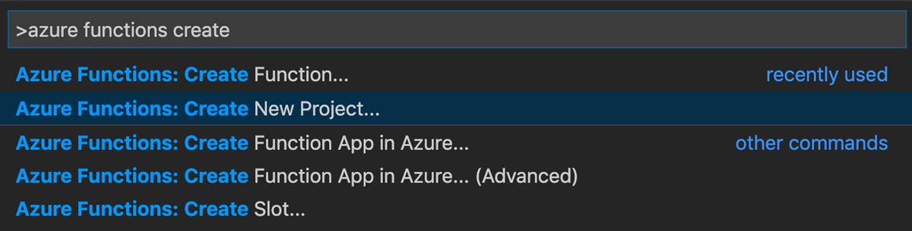

# Create your first durable function in PowerShell

*Durable Functions* is an extension of [Azure Functions](../functions-overview.md) that lets you write stateful functions in a serverless environment. The extension manages state, checkpoints, and restarts for you.

In this article, you learn how to use the Visual Studio Code Azure Functions extension to locally create and test a "hello world" durable function.  This function will orchestrate and chain together calls to other functions. You then publish the function code to Azure.


## Prerequisites

To complete this tutorial:

* Install [Visual Studio Code](https://code.visualstudio.com/download).

* Install the [Azure Functions](https://marketplace.visualstudio.com/items?itemName=ms-azuretools.vscode-azurefunctions) VS Code extension

* Make sure you have the latest version of the [Azure Functions Core Tools](../functions-run-local.md).

* Durable Functions require an Azure storage account. You need an Azure subscription.

[!INCLUDE [quickstarts-free-trial-note](../../../includes/quickstarts-free-trial-note.md)]

## <a name="create-an-azure-functions-project"></a>Create your local project 

In this section, you use Visual Studio Code to create a local Azure Functions project. 

1. In Visual Studio Code, press F1 (or Ctrl/Cmd+Shift+P) to open the command palette. In the command palette, search for and select `Azure Functions: Create New Project...`.

    

1. Choose an empty folder location for your project and choose **Select**.

1. Following the prompts, provide the following information:

    | Prompt | Value | Description |
    | ------ | ----- | ----------- |
    | Select a language for your function app project | PowerShell | Create a local PowerShell Functions project. |
    | Select a version | Azure Functions v3 | You only see this option when the Core Tools aren't already installed. In this case, Core Tools are installed the first time you run the app. |
    | Select a template for your project's first function | Skip for now | |
    | Select how you would like to open your project | Open in current window | Reopens VS Code in the folder you selected. |

Visual Studio Code installs the Azure Functions Core Tools, if needed. It also creates a function app project in a folder. This project contains the [host.json](../functions-host-json.md) and [local.settings.json](../functions-develop-local.md#local-settings-file) configuration files.

A package.json file is also created in the root folder.

### Configure function app to use PowerShell 7

Open the *local.settings.json* file and confirm that a setting named `FUNCTIONS_WORKER_RUNTIME_VERSION` is set to `~7`. If it is missing or set to another value, update the contents of the file.

```json
{
  "IsEncrypted": false,
  "Values": {
    "AzureWebJobsStorage": "",
    "FUNCTIONS_WORKER_RUNTIME": "powershell",
    "FUNCTIONS_WORKER_RUNTIME_VERSION" : "~7"
  }
}
```

## Create your functions

The most basic Durable Functions app contains three functions:

* *Orchestrator function* - describes a workflow that orchestrates other functions.
* *Activity function* - called by the orchestrator function, performs work, and optionally returns a value.
* *Client function* - a regular Azure Function that starts an orchestrator function. This example uses an HTTP triggered function.

### Orchestrator function

You use a template to create the durable function code in your project.

1. In the command palette, search for and select `Azure Functions: Create Function...`.

1. Following the prompts, provide the following information:

    | Prompt | Value | Description |
    | ------ | ----- | ----------- |
    | Select a template for your function | Durable Functions orchestrator | Create a Durable Functions orchestration |
    | Provide a function name | HelloOrchestrator | Name of your durable function |

You've added an orchestrator to coordinate activity functions. Open *HelloOrchestrator/run.ps1* to see the orchestrator function. Each call to the `Invoke-ActivityFunction` cmdlet invokes an activity function named `Hello`.

Next, you'll add the referenced `Hello` activity function.

### Activity function

1. In the command palette, search for and select `Azure Functions: Create Function...`.

1. Following the prompts, provide the following information:

    | Prompt | Value | Description |
    | ------ | ----- | ----------- |
    | Select a template for your function | Durable Functions activity | Create an activity function |
    | Provide a function name | Hello | Name of your activity function |

You've added the `Hello` activity function that is invoked by the orchestrator. Open *Hello/run.ps1* to see that it's taking a name as input and returning a greeting. An activity function is where you'll perform actions such as making a database call or performing a computation.

Finally, you'll add an HTTP triggered function that starts the orchestration.

### Client function (HTTP starter)

1. In the command palette, search for and select `Azure Functions: Create Function...`.

1. Following the prompts, provide the following information:

    | Prompt | Value | Description |
    | ------ | ----- | ----------- |
    | Select a template for your function | Durable Functions HTTP starter | Create an HTTP starter function |
    | Provide a function name | HttpStart | Name of your activity function |
    | Authorization level | Anonymous | For demo purposes, allow the function to be called without authentication |

You've added an HTTP triggered function that starts an orchestration. Open *HttpStart/run.ps1* to see that it uses the `Start-NewOrchestration` cmdlet to start a new orchestration. Then it uses the `New-OrchestrationCheckStatusResponse` cmdlet to return an HTTP response containing URLs that can be used to monitor and manage the new orchestration.

You now have a Durable Functions app that can be run locally and deployed to Azure.

## Test the function locally

Azure Functions Core Tools lets you run an Azure Functions project on your local development computer. You're prompted to install these tools the first time you start a function app from Visual Studio Code.

1. To test your function, set a breakpoint in the `Hello` activity function code (*Hello/run.ps1*). Press F5 or select `Debug: Start Debugging` from the command palette to start the function app project. Output from Core Tools is displayed in the **Terminal** panel.

    > [!NOTE]
    > Refer to the [Durable Functions Diagnostics](durable-functions-diagnostics.md#debugging) for more information on debugging.

1. Durable Functions requires an Azure Storage account to run. When VS Code prompts you to select a storage account, choose **Select storage account**.

    

1. Following the prompts, provide the following information to create a new storage account in Azure.

    | Prompt | Value | Description |
    | ------ | ----- | ----------- |
    | Select subscription | *name of your subscription* | Select your Azure subscription |
    | Select a storage account | Create a new storage account |  |
    | Enter the name of the new storage account | *unique name* | Name of the storage account to create |
    | Select a resource group | *unique name* | Name of the resource group to create |
    | Select a location | *region* | Select a region close to you |

1. In the **Terminal** panel, copy the URL endpoint of your HTTP-triggered function.

    

1. Using your browser, or a tool like [Postman](https://www.getpostman.com/) or [cURL](https://curl.haxx.se/), send an HTTP POST request to the URL endpoint. Replace the last segment with the name of the orchestrator function (`HelloOrchestrator`). The URL should be similar to `http://localhost:7071/api/orchestrators/HelloOrchestrator`.

   The response is the initial result from the HTTP function letting you know the durable orchestration has started successfully. It is not yet the end result of the orchestration. The response includes a few useful URLs. For now, let's query the status of the orchestration.

1. Copy the URL value for `statusQueryGetUri` and paste it in the browser's address bar and execute the request. Alternatively you can also continue to use Postman to issue the GET request.

   The request will query the orchestration instance for the status. You should get an eventual response, which shows us the instance has completed, and includes the outputs or results of the durable function. It looks like: 

    ```json
    {
        "name": "HelloOrchestrator",
        "instanceId": "9a528a9e926f4b46b7d3deaa134b7e8a",
        "runtimeStatus": "Completed",
        "input": null,
        "customStatus": null,
        "output": [
            "Hello Tokyo!",
            "Hello Seattle!",
            "Hello London!"
        ],
        "createdTime": "2020-03-18T21:54:49Z",
        "lastUpdatedTime": "2020-03-18T21:54:54Z"
    }
    ```

1. To stop debugging, press **Shift + F5** in VS Code.

After you've verified that the function runs correctly on your local computer, it's time to publish the project to Azure.

[!INCLUDE [functions-create-function-app-vs-code](../../../includes/functions-sign-in-vs-code.md)]

## Publish the project to Azure

In this section, you create a function app and related resources in your Azure subscription and then deploy your code. 

> [!IMPORTANT]
> Publishing to an existing function app overwrites the content of that app in Azure. 


1. Choose the Azure icon in the Activity bar, then in the **Azure: Functions** area, choose the **Deploy to function app...** button.

    

1. Provide the following information at the prompts:

    + **Select folder**: Choose a folder from your workspace or browse to one that contains your function app. You won't see this if you already have a valid function app opened.

    + **Select subscription**: Choose the subscription to use. You won't see this if you only have one subscription.

    + **Select Function App in Azure**: Choose `+ Create new Function App`. (Don't choose the `Advanced` option, which isn't covered in this article.)
      
    + **Enter a globally unique name for the function app**: Type a name that is valid in a URL path. The name you type is validated to make sure that it's unique in Azure Functions. 

    + **Select a runtime**: Choose the version of PowerShell you've been running on locally. You can use the `pwsh -version` command to check your version.

        > [!NOTE]
        > The Azure Functions VS Code extension may not support PowerShell 7 yet. If PowerShell 7 is not available as an option, select PowerShell 6.x for now and [update the version manually](#update-function-app-ps7) after the function app has been created.

    + **Select a location for new resources**:  For better performance, choose a [region](https://azure.microsoft.com/regions/) near you. 
    
1.  When completed, the following Azure resources are created in your subscription, using names based on your function app name:
    
    + A resource group, which is a logical container for related resources.
    + A standard Azure Storage account, which maintains state and other information about your projects.
    + A consumption plan, which defines the underlying host for your serverless function app. 
    + A function app, which provides the environment for executing your function code. A function app lets you group functions as a logical unit for easier management, deployment, and sharing of resources within the same hosting plan.
    + An Application Insights instance connected to the function app, which tracks usage of your serverless function.

    A notification is displayed after your function app is created and the deployment package is applied.

1. <a name="update-function-app-ps7"></a>If you were unable to select *PowerShell 7* earlier when creating the function app, press F1 (or Ctrl/Cmd+Shift+P) to open the command palette. In the command palette, search for and select `Azure Functions: Upload Local Settings...`. Follow the prompts to select the function app you created. If prompted to overwrite existing settings, select *No to all*.
    
1. Select **View Output** in this notification to view the creation and deployment results, including the Azure resources that you created. If you miss the notification, select the bell icon in the lower right corner to see it again.

    


## Test your function in Azure

1. Copy the URL of the HTTP trigger from the **Output** panel. The URL that calls your HTTP-triggered function should be in this format: `http://<functionappname>.azurewebsites.net/api/orchestrators/HelloOrchestrator`

2. Paste this new URL for the HTTP request into your browser's address bar. You should get the same status response as before when using the published app.

## Next steps

You have used Visual Studio Code to create and publish a PowerShell durable function app.

> [!div class="nextstepaction"]
> [Learn about common durable function patterns](durable-functions-overview.md#application-patterns)
