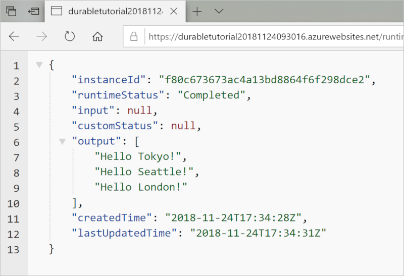
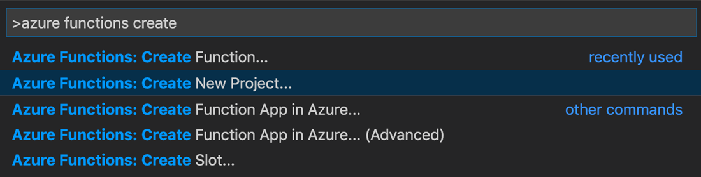
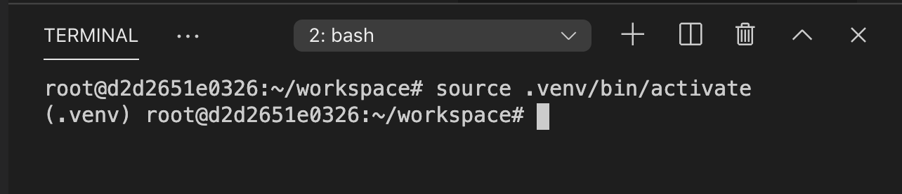
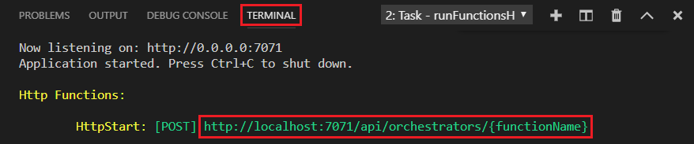

# Create your first durable function in Python

*Durable Functions* is an extension of [Azure Functions](../functions-overview.md) that lets you write stateful functions in a serverless environment. The extension manages state, checkpoints, and restarts for you.

In this article, you learn how to use the Visual Studio Code Azure Functions extension to locally create and test a "hello world" durable function.  This function will orchestrate and chain together calls to other functions. You then publish the function code to Azure.



## Prerequisites

To complete this tutorial:

* Install [Visual Studio Code](https://code.visualstudio.com/download).

* Install the [Azure Functions](https://marketplace.visualstudio.com/items?itemName=ms-azuretools.vscode-azurefunctions) VS Code extension.

* Make sure you have the latest version of the [Azure Functions Core Tools](../functions-run-local.md).

* Durable Functions require an Azure storage account. You need an Azure subscription.

* Make sure that you have version 3.6, 3.7, or 3.8 of [Python](https://www.python.org/) installed.

[!INCLUDE [quickstarts-free-trial-note](../../../includes/quickstarts-free-trial-note.md)]

## <a name="create-an-azure-functions-project"></a>Create your local project 

In this section, you use Visual Studio Code to create a local Azure Functions project. 

1. In Visual Studio Code, press F1 (or <kbd>Ctrl/Cmd+Shift+P</kbd>) to open the command palette. In the command palette, search for and select `Azure Functions: Create New Project...`.

    

1. Choose an empty folder location for your project and choose **Select**.

1. Following the prompts, provide the following information:

    | Prompt | Value | Description |
    | ------ | ----- | ----------- |
    | Select a language for your function app project | Python | Create a local Python Functions project. |
    | Select a version | Azure Functions v3 | You only see this option when the Core Tools aren't already installed. In this case, Core Tools are installed the first time you run the app. |
    | Python version | Python 3.6, 3.7, or 3.8 | VS Code will create a virtual environment with the version you select. |
    | Select a template for your project's first function | Skip for now | |
    | Select how you would like to open your project | Open in current window | Reopens VS Code in the folder you selected. |

Visual Studio Code installs the Azure Functions Core Tools, if needed. It also creates a function app project in a folder. This project contains the [host.json](../functions-host-json.md) and [local.settings.json](../functions-develop-local.md#local-settings-file) configuration files.

A *requirements.txt* file is also created in the root folder. It specifies the Python packages needed to run your function app.

## Install azure-functions-durable from PyPI

When you created the project, the Azure Functions VS Code extension automatically created a virtual environment with your selected Python version. You will activate the virtual environment in a terminal and install some dependencies required by Azure Functions and Durable Functions.

1. Open *requirements.txt* in the editor and change its content to the following:

    ```
    azure-functions
    azure-functions-durable
    ```

1. Open the editor's integrated terminal in the current folder (<kbd>Ctrl+Shift+`</kbd>).

1. In the integrated terminal, activate the virtual environment in the current folder:

    **Linux or macOS**

    ```bash
    source .venv/bin/activate
    ```

    **Windows**

    ```powershell
    .venv\scripts\activate
    ```

    

1. In the integrated terminal where the virtual environment is activated, use pip to install the packages you just defined:

    ```bash
    python -m pip install -r requirements.txt
    ```

## Create your functions

A basic Durable Functions app contains three functions:

* *Orchestrator function* - describes a workflow that orchestrates other functions.
* *Activity function* - called by the orchestrator function, performs work, and optionally returns a value.
* *Client function* - a regular Azure Function that starts an orchestrator function. This example uses an HTTP triggered function.

### Orchestrator function

You use a template to create the durable function code in your project.

1. In the command palette, search for and select `Azure Functions: Create Function...`.

1. Following the prompts, provide the following information:

    | Prompt | Value | Description |
    | ------ | ----- | ----------- |
    | Select a template for your function | Durable Functions orchestrator | Create a Durable Functions orchestration |
    | Provide a function name | HelloOrchestrator | Name of your durable function |

You've added an orchestrator to coordinate activity functions. Open *HelloOrchestrator/\_\_init__.py* to see the orchestrator function. Each call to `context.call_activity` invokes an activity function named `Hello`.

Next, you'll add the referenced `Hello` activity function.

### Activity function

1. In the command palette, search for and select `Azure Functions: Create Function...`.

1. Following the prompts, provide the following information:

    | Prompt | Value | Description |
    | ------ | ----- | ----------- |
    | Select a template for your function | Durable Functions activity | Create an activity function |
    | Provide a function name | Hello | Name of your activity function |

You've added the `Hello` activity function that is invoked by the orchestrator. Open *Hello/\_\_init__.py* to see that it takes a name as input and returns a greeting. An activity function is where you'll perform actions such as making a database call or performing a computation.

Finally, you'll add an HTTP triggered function that starts the orchestration.

### Client function (HTTP starter)

1. In the command palette, search for and select `Azure Functions: Create Function...`.

1. Following the prompts, provide the following information:

    | Prompt | Value | Description |
    | ------ | ----- | ----------- |
    | Select a template for your function | Durable Functions HTTP starter | Create an HTTP starter function |
    | Provide a function name | DurableFunctionsHttpStart | Name of your activity function |
    | Authorization level | Anonymous | For demo purposes, allow the function to be called without authentication |

You've added an HTTP triggered function that starts an orchestration. Open *DurableFunctionsHttpStart/\_\_init__.py* to see that it uses `client.start_new` to start a new orchestration. Then it uses `client.create_check_status_response` to return an HTTP response containing URLs that can be used to monitor and manage the new orchestration.

You now have a Durable Functions app that can be run locally and deployed to Azure.

## Test the function locally

Azure Functions Core Tools lets you run an Azure Functions project on your local development computer. If you don't have it installed, you're prompted to install these tools the first time you start a function from Visual Studio Code.

1. To test your function, set a breakpoint in the `Hello` activity function code (*Hello/\_\_init__.py*). Press F5 or select `Debug: Start Debugging` from the command palette to start the function app project. Output from Core Tools is displayed in the **Terminal** panel.

    > [!NOTE]
    > Refer to the [Durable Functions Diagnostics](durable-functions-diagnostics.md#debugging) for more information on debugging.

1. Durable Functions requires an Azure Storage account to run. When VS Code prompts you to select a storage account, choose **Select storage account**.

    

1. Following the prompts, provide the following information to create a new storage account in Azure.

    | Prompt | Value | Description |
    | ------ | ----- | ----------- |
    | Select subscription | *name of your subscription* | Select your Azure subscription |
    | Select a storage account | Create a new storage account |  |
    | Enter the name of the new storage account | *unique name* | Name of the storage account to create |
    | Select a resource group | *unique name* | Name of the resource group to create |
    | Select a location | *region* | Select a region close to you |

1. In the **Terminal** panel, copy the URL endpoint of your HTTP-triggered function.

    

1. Using your browser, or a tool like [Postman](https://www.getpostman.com/) or [cURL](https://curl.haxx.se/), send an HTTP request to the URL endpoint. Replace the last segment with the name of the orchestrator function (`HelloOrchestrator`). The URL should be similar to `http://localhost:7071/api/orchestrators/HelloOrchestrator`.

   The response is the initial result from the HTTP function letting you know the durable orchestration has started successfully. It is not yet the end result of the orchestration. The response includes a few useful URLs. For now, let's query the status of the orchestration.

1. Copy the URL value for `statusQueryGetUri` and paste it in the browser's address bar and execute the request. Alternatively you can also continue to use Postman to issue the GET request.

   The request will query the orchestration instance for the status. You should get an eventual response, which shows the instance has completed, and includes the outputs or results of the durable function. It looks like: 

    ```json
    {
        "name": "HelloOrchestrator",
        "instanceId": "9a528a9e926f4b46b7d3deaa134b7e8a",
        "runtimeStatus": "Completed",
        "input": null,
        "customStatus": null,
        "output": [
            "Hello Tokyo!",
            "Hello Seattle!",
            "Hello London!"
        ],
        "createdTime": "2020-03-18T21:54:49Z",
        "lastUpdatedTime": "2020-03-18T21:54:54Z"
    }
    ```

1. To stop debugging, press <kbd>Shift+F5</kbd> in VS Code.

After you've verified that the function runs correctly on your local computer, it's time to publish the project to Azure.

[!INCLUDE [functions-create-function-app-vs-code](../../../includes/functions-sign-in-vs-code.md)]

[!INCLUDE [functions-publish-project-vscode](../../../includes/functions-publish-project-vscode.md)]

## Test your function in Azure

1. Copy the URL of the HTTP trigger from the **Output** panel. The URL that calls your HTTP-triggered function should be in this format: `http://<functionappname>.azurewebsites.net/api/orchestrators/HelloOrchestrator`

2. Paste this new URL for the HTTP request into your browser's address bar. You should get the same status response as before when using the published app.

## Next steps

You have used Visual Studio Code to create and publish a Python durable function app.

> [!div class="nextstepaction"]
> [Learn about common durable function patterns](durable-functions-overview.md#application-patterns)
