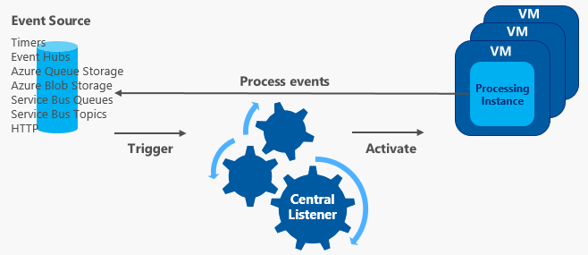

# Event-driven scaling in Azure Functions

In the Consumption, Flex Consumption, and Premium plans, Azure Functions scales resources by adding more instances based on the number of events that trigger a function. 

[!INCLUDE [functions-flex-preview-note](../../includes/functions-flex-preview-note.md)]

The way in which your function app scales depends on the hosting plan: 

+ **Consumption plan:** Each instance of the Functions host in the Consumption plan is limited, typically to 1.5 GB of memory and one CPU. An instance of the host supports the entire function app. As such, all functions within a function app share resource in an instance are scaled at the same time. When function apps share the same Consumption plan, they're still scaled independently. 

+ **Flex Consumption plan:** The plan uses a deterministic per-function scaling strategy, where each function is scaled independently, except for HTTP, Blob, and Durable Functions triggered functions which scale in their own groups. For more information, see [Per-function scaling](#per-function-scaling). These instances are then scaled based on the concurrency of your requests.

+ **Premium plan:** The specific size of the Premium plan determines the available memory and CPU for all apps in that plan on that instance. The plan scales out its instances based on the scaling needs of the apps in the plan, and the apps scale within the plan as needed.

Function code files are stored on Azure Files shares on the function's main storage account. When you delete the main storage account of the function app, the function code files are deleted and can't be recovered.

## Runtime scaling

Azure Functions uses a component called the *scale controller* to monitor the rate of events and determine whether to scale out or scale in. The scale controller uses heuristics for each trigger type. For example, when you're using an Azure Queue storage trigger, it uses [target-based scaling](functions-target-based-scaling.md).

The unit of scale for Azure Functions is the function app. When the function app is scaled out, more resources are allocated to run multiple instances of the Azure Functions host. Conversely, as compute demand is reduced, the scale controller removes function host instances. The number of instances is eventually "scaled in" when no functions are running within a function app.



## Cold Start

Should your function app become idle for a few minutes, the platform might decide to scale the number of instances on which your app runs down to zero. The next request has the added latency of scaling from zero to one. This latency is referred to as a _cold start_. The number of dependencies required by your function app can affect the cold start time. Cold start is more of an issue for synchronous operations, such as HTTP triggers that must return a response. If cold starts are impacting your functions, consider using a plan other than the Consumption. The other plans offer these strategies to mitigate or eliminate cold starts:

+ [Premium plan](functions-premium-plan.md#eliminate-cold-starts): supports both prewarmed instances and always ready instances, with a minimum of one instance. 

+ [Flex Consumption plan](flex-consumption-plan.md#always-ready-instances): supports an optional number of always ready instances, which can be defined on a per instance scaling basis. 

+ [Dedicated plan](./dedicated-plan.md#always-on): the plan itself doesn't scale dynamically, but you can run your app continuously with the **Always on** setting is enabled.

## Understanding scaling behaviors

Scaling can vary based on several factors, and apps scale differently based on the triggers and language selected. There are a few intricacies of scaling behaviors to be aware of:

* **Maximum instances:** A single function app only scales out to a [maximum allowed by the plan](functions-scale.md#scale). However, a single instance [can process more than one message or request at a time](functions-concurrency.md#concurrency-in-azure-functions). You can [specify a lower maximum](#limit-scale-out) to throttle scale as required.
* **New instance rate:** For HTTP triggers, new instances are allocated, at most, once per second. For non-HTTP triggers, new instances are allocated, at most, once every 30 seconds. Scaling is faster when running in a [Premium plan](functions-premium-plan.md).
* **Target-based scaling:** Target-based scaling provides a fast and intuitive scaling model for customers and is currently supported for Service Bus queues and topics, Storage queues, Event Hubs, Apache Kafka, and Azure Cosmos DB extensions. Make sure to review [target-based scaling](./functions-target-based-scaling.md) to understand their scaling behavior.
* **Per-function scaling:** With some notable exceptions, functions running in the Flex Consumption plan scale on independent instances. The exceptions include HTTP triggers and Blob storage (Event Grid) triggers. Each of these trigger types scale together as a group on the same instances. Likewise, all Durable Functions triggers also share instances and scale together. For more information, see [per-function scaling](#per-function-scaling). 

## Limit scale-out

You might decide to restrict the maximum number of instances an app can use for scale-out. This is most common for cases where a downstream component like a database has limited throughput. For the maximum scale limits when running the various hosting plans, see [Scale limits](functions-scale.md#scale). 

### Flex Consumption plan 

By default, apps running in a Flex Consumption plan have limit of `100` overall instances. Currently the lowest maximum instance count value is `40`, and the highest supported maximum instance count value is `1000`. When you use the [`az functionapp create`](/cli/azure/functionapp#az-functionapp-create) command to create a function app in the Flex Consumption plan, use the `--maximum-instance-count` parameter to set this maximum instance count for of your app. This example creates an app with a maximum instance count of `200`:

```azurecli
az functionapp create --resource-group <RESOURCE_GROUP> --name <APP_NAME> --storage <STORAGE_ACCOUNT_NAME> --runtime <LANGUAGE_RUNTIME> --runtime-version <RUNTIME_VERSION> --flexconsumption-location <REGION> --maximum-instance-count 200
```

This example uses the [`az functionapp scale config set`](/cli/azure/functionapp/scale/config#az-functionapp-scale-config-set) command to change the maximum instance count for an existing app to `150`:

```azurecli
az functionapp scale config set --resource-group <RESOURCE_GROUP> --name <APP_NAME> --maximum-instance-count 150
```

### Consumption/Premium plans 

In a Consumption or Elastic Premium plan, you can specify a lower maximum limit for your app by modifying the value of the `functionAppScaleLimit` site configuration setting. The `functionAppScaleLimit` can be set to `0` or `null` for unrestricted, or a valid value between `1` and the app maximum.

#### [Azure CLI](#tab/azure-cli)

```azurecli
az resource update --resource-type Microsoft.Web/sites -g <RESOURCE_GROUP> -n <FUNCTION_APP-NAME>/config/web --set properties.functionAppScaleLimit=<SCALE_LIMIT>
```

#### [Azure PowerShell](#tab/azure-powershell)

```azurepowershell
$resource = Get-AzResource -ResourceType Microsoft.Web/sites -ResourceGroupName <RESOURCE_GROUP> -Name <FUNCTION_APP-NAME>/config/web
$resource.Properties.functionAppScaleLimit = <SCALE_LIMIT>
$resource | Set-AzResource -Force
```

---

## Scale-in behaviors

Event-driven scaling automatically reduces capacity when demand for your functions is reduced. It does this by draining instances of their current function executions and then removes those instances. This behavior is logged as drain mode. The grace period for functions that are currently executing can extend up to 10 minutes for Consumption plan apps and up to 60 minutes for Premium plan apps. Event-driven scaling and this behavior don't apply to Dedicated plan apps. 

The following considerations apply for scale-in behaviors: 

* For app running on Windows in a Consumption plan, only apps created after May 2021 have drain mode behaviors enabled by default.
* To enable graceful shutdown for functions using the Service Bus trigger, use version 4.2.0 or a later version of the [Service Bus Extension](functions-bindings-service-bus.md).

## Per-function scaling

_Applies only to the Flex Consumption plan (preview)_.

The [Flex Consumption plan] is unique in that it implements a _per-function scaling_ behavior. In per-function scaling, except for HTTP triggers, Blob (Event Grid) triggers, and Durable Functions, all other function trigger types in your app scale on independent instances. HTTP triggers in your app all scale together as a group on the same instances, as do all Blob (Event Grid), and all Durable Functions triggers, which have their own shared instances.

Consider a function app hosted a Flex Consumption plan that has these function:

| function1 | function2 | function3 | function4 | function5 | function6 | function7 |
| :---: | :---: | :---: | :---: | :---: | :---: | :---: | 
| HTTP trigger | HTTP trigger | Orchestration trigger (Durable) | Activity trigger (Durable) | Service Bus trigger | Service Bus trigger | Event Hubs trigger |

In this example:

+ The two HTTP triggered functions (`function1` and `function2`) both run together on their own instances and scale together according to [HTTP concurrency settings](flex-consumption-how-to.md#set-http-concurrency-limits).
+ The two Durable functions (`function3` and `function4`) both run together on their own instances and scale together based on [configured concurrency throttles](./durable/durable-functions-perf-and-scale.md#concurrency-throttles).
+ The Service bus triggered function `function5` runs in its own and is scaled independently according to the [target-based scaling rules for Service Bus queues and topics](functions-target-based-scaling.md#service-bus-queues-and-topics).
+ The Service bus triggered function `function6` runs in its own and is scaled independently according to the [target-based scaling rules for Service Bus queues and topics](functions-target-based-scaling.md#service-bus-queues-and-topics).
+ The Event Hubs trigger (`function7`) runs in its own instances and is scaled independently according to the [target-based scaling rules for Event Hubs](functions-target-based-scaling.md#event-hubs).

## Best practices and patterns for scalable apps

There are many aspects of a function app that impacts how it scales, including host configuration, runtime footprint, and resource efficiency. For more information, see the [scalability section of the performance considerations article](performance-reliability.md#scalability-best-practices). You should also be aware of how connections behave as your function app scales. For more information, see [How to manage connections in Azure Functions](manage-connections.md).

For more information on scaling in Python and Node.js, see [Azure Functions Python developer guide - Scaling and concurrency](functions-reference-python.md#scaling-and-performance) and [Azure Functions Node.js developer guide - Scaling and concurrency](functions-reference-node.md#scaling-and-concurrency).

## Next steps

To learn more, see the following articles:

+ [Improve the performance and reliability of Azure Functions](./performance-reliability.md)
+ [Azure Functions reliable event processing](./functions-reliable-event-processing.md)
+ [Azure Functions hosting options](functions-scale.md)

[Flex Consumption plan]: flex-consumption-plan.md
[Consumption plan]: consumption-plan.md
[Premium plan]: functions-premium-plan.md
[Azure Functions pricing page]: https://azure.microsoft.com/pricing/details/functions
