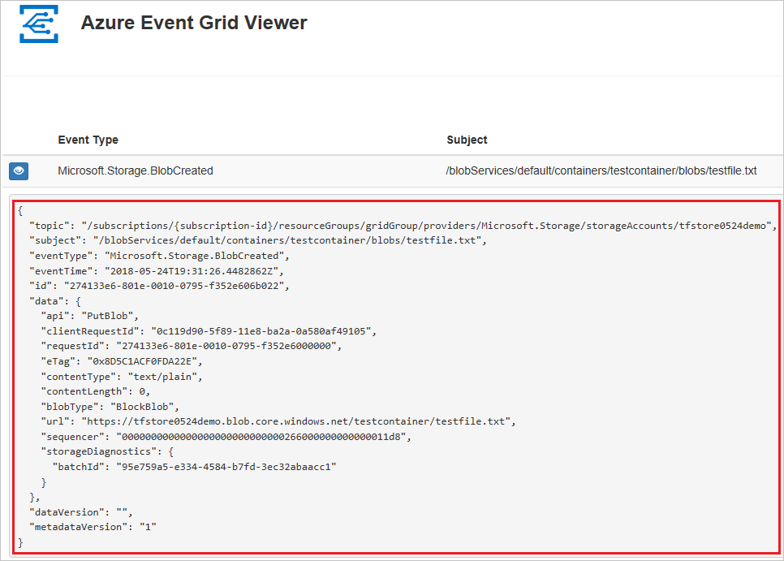
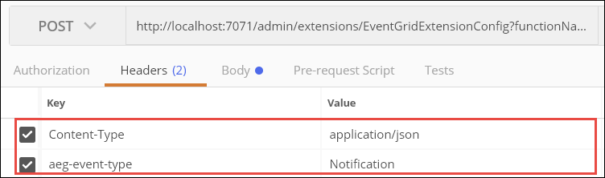
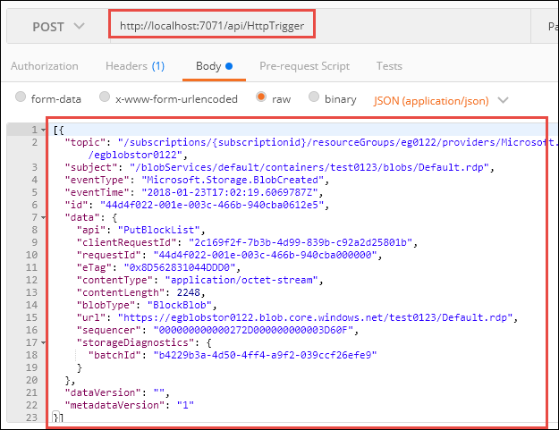
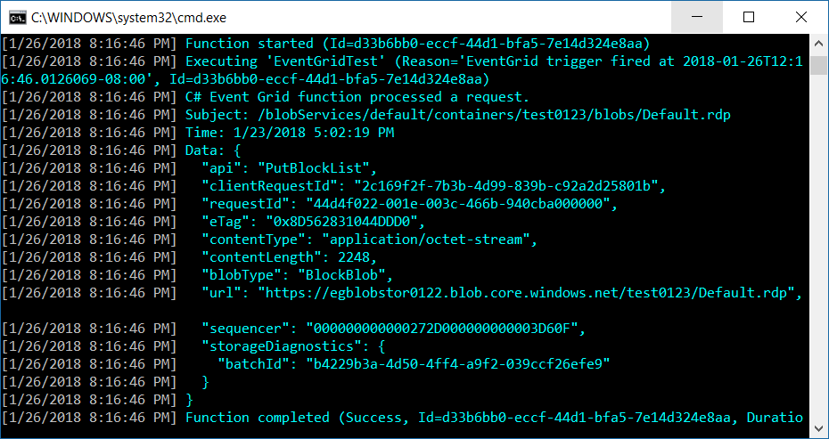

# How to work with Event Grid triggers and bindings in Azure Functions

Azure Functions provides built-in integration with Azure Event Grid by using [triggers and bindings](functions-triggers-bindings.md). This article shows you how to configure and locally evaluate your Event Grid trigger and bindings. For more information about Event Grid trigger and output binding definitions and examples, see one of the following reference articles:

+ [Azure Event Grid bindings Overview](functions-bindings-event-grid.md)
+ [Azure Event Grid trigger for Azure Functions](functions-bindings-event-grid-trigger.md) 
+ [Azure Event Grid output binding for Azure Functions](functions-bindings-event-grid-output.md)  

## Event subscriptions

To start receiving Event Grid HTTP requests, you need a subscription to events raised by Event Grid. Event subscriptions specify the endpoint URL that invokes the function. When you create an event subscription from your function's **Integration** tab in the [Azure portal](https://portal.azure.com), the URL is supplied for you. When you programmatically create an event subscription or when you create the event subscription from Event Grid, you'll need to provide the endpoint. The endpoint URL contains a system key, which you must obtain from Functions administrator REST APIs. 

### Webhook endpoint URL

The URL endpoint for your Event Grid triggered function depends on the version of the Functions runtime. The following example shows the version-specific URL pattern:

# [v2.x+](#tab/v2)

```http
https://{functionappname}.azurewebsites.net/runtime/webhooks/eventgrid?functionName={functionname}&code={systemkey}
```

# [v1.x](#tab/v1) 

```http
https://{functionappname}.azurewebsites.net/admin/extensions/EventGridExtensionConfig?functionName={functionname}&code={systemkey}
```
---

>[!NOTE]  
>There is a version of the Blob storage trigger that also uses event subscriptions. The endpoint URL for this kind of Blob storage trigger has a path of `/runtime/webhooks/blobs`, whereas the path for an Event Grid trigger would be `/runtime/webhooks/EventGrid`. For a comparison of options for processing blobs, see [Trigger on a blob container](storage-considerations.md#trigger-on-a-blob-container).

### System key

The URL endpoint you construct includes the system key value. The system key is an authorization key that has to be included in the endpoint URL for an Event Grid trigger. The following section explains how to get the system key.

You can get the system key by using the following API (HTTP GET):

# [v2.x+](#tab/v2)

```
http://{functionappname}.azurewebsites.net/admin/host/systemkeys/eventgrid_extension?code={masterkey}
```

# [v1.x](#tab/v1) 

```
http://{functionappname}.azurewebsites.net/admin/host/systemkeys/eventgridextensionconfig_extension?code={masterkey}
```

---

This REST API is an administrator API, so it requires your function app [master key](functions-bindings-http-webhook-trigger.md#authorization-keys). Don't confuse the system key (for invoking an Event Grid trigger function) with the master key (for performing administrative tasks on the function app). When you subscribe to an Event Grid topic, be sure to use the system key.

Here's an example of the response that provides the system key:

```
{
  "name": "eventgridextensionconfig_extension",
  "value": "{the system key for the function}",
  "links": [
    {
      "rel": "self",
      "href": "{the URL for the function, without the system key}"
    }
  ]
}
```

You can get the master key for your function app from the **Function app settings** tab in the portal.

> [!IMPORTANT]
> The master key provides administrator access to your function app. Don't share this key with third parties or distribute it in native client applications.

For more information, see [Authorization keys](functions-bindings-http-webhook-trigger.md#authorization-keys) in the HTTP trigger reference article.

### <a name="create-a-subscription"></a>Create an event subscription

You can create an event subscription either from the [Azure portal](https://portal.azure.com) or by using the Azure CLI. 

# [Portal](#tab/portal)

For functions that you develop in the Azure portal with the Event Grid trigger, select **Integration** then choose the **Event Grid Trigger** and select **Create Event Grid subscription**.

:::image type="content" source="media/functions-bindings-event-grid/portal-sub-create.png" alt-text="Screenshot of connecting to a new event subscription to trigger in the portal.":::

When you select this link, the portal opens the **Create Event Subscription** page with the current trigger endpoint already defined.

:::image type="content" source="media/functions-bindings-event-grid/endpoint-url.png" alt-text="Screenshot of creating an event subscription with the function endpoint already defined." :::

For more information about how to create subscriptions by using the Azure portal, see [Create custom event - Azure portal](../event-grid/custom-event-quickstart-portal.md) in the Event Grid documentation.

# [Azure CLI](#tab/azure-cli)

To create a subscription by using [the Azure CLI](/cli/azure/get-started-with-azure-cli), use the [`az eventgrid event-subscription create`](/cli/azure/eventgrid/event-subscription#az-eventgrid-event-subscription-create) command. Examples use the v2.x+ version of the URL and are written to run in [Azure Cloud Shell](../cloud-shell/overview.md). You'll need to modify the examples to run from a Windows command prompt.

This example creates a subscription to a blob storage account, with a placeholder for the [system key](#system-key):

```azurecli-interactive
az eventgrid resource event-subscription create -g myResourceGroup \
    --provider-namespace Microsoft.Storage --resource-type storageAccounts \
    --resource-name myblobstorage12345 --name myFuncSub \
    --included-event-types Microsoft.Storage.BlobCreated \
    --subject-begins-with /blobServices/default/containers/images/blobs/ \
    --endpoint https://mystoragetriggeredfunction.azurewebsites.net/runtime/webhooks/eventgrid?functionName=imageresizefunc&code=<key>
```

---

For more information about how to create a subscription, see [the blob storage quickstart](../storage/blobs/storage-blob-event-quickstart.md#subscribe-to-your-storage-account) or the other Event Grid quickstarts.

## Local testing with viewer web app

To test an Event Grid trigger locally, you have to get Event Grid HTTP requests delivered from their origin in the cloud to your local machine. One way to do that is by capturing requests online and manually resending them on your local machine:

1. [Create a viewer web app](#create-a-viewer-web-app) that captures event messages.
1. [Create an Event Grid subscription](#create-an-event-grid-subscription) that sends events to the viewer app.
1. [Generate a request](#generate-a-request) and copy the request body from the viewer app.
1. [Manually post the request](#manually-post-the-request) to the localhost URL of your Event Grid trigger function.

When you're done testing, you can use the same subscription for production by updating the endpoint. Use the [`az eventgrid event-subscription update`](/cli/azure/eventgrid/event-subscription#az-eventgrid-event-subscription-update) Azure CLI command.

You can also use the *ngrok* utility to forward remote requests to your locally running functions. For more information, see [this tutorial](./functions-event-grid-blob-trigger.md#start-local-debugging).

### Create a viewer web app

To simplify capturing event messages, you can deploy a [pre-built web app](https://github.com/Azure-Samples/azure-event-grid-viewer) that displays the event messages. The deployed solution includes an App Service plan, an App Service web app, and source code from GitHub.

Select **Deploy to Azure** to deploy the solution to your subscription. In the Azure portal, provide values for the parameters.

:::image type="content" source="~/reusable-content/ce-skilling/azure/media/template-deployments/deploy-to-azure-button.svg" alt-text="Button to deploy the Resource Manager template to Azure." border="false" link="https://portal.azure.com/#create/Microsoft.Template/uri/https%3A%2F%2Fraw.githubusercontent.com%2FAzure-Samples%2Fazure-event-grid-viewer%2Fmaster%2Fazuredeploy.json":::

The deployment may take a few minutes to complete. After the deployment has succeeded, view your web app to make sure it's running. In a web browser, navigate to:
`https://<your-site-name>.azurewebsites.net`

You see the site but no events have been posted to it yet.


### Create an Event Grid subscription

Create an Event Grid subscription of the type you want to test, and give it the URL from your web app as the endpoint for event notification. The endpoint for your web app must include the suffix `/api/updates/`. So, the full URL is `https://<your-site-name>.azurewebsites.net/api/updates`

For information about how to create subscriptions by using the Azure portal, see [Create custom event - Azure portal](../event-grid/custom-event-quickstart-portal.md) in the Event Grid documentation.

### Generate a request

Trigger an event that will generate HTTP traffic to your web app endpoint.  For example, if you created a blob storage subscription, upload or delete a blob. When a request shows up in your web app, copy the request body.

The subscription validation request will be received first; ignore any validation requests, and copy the event request.



### Manually post the request

Run your Event Grid function locally. The `Content-Type` and `aeg-event-type` headers are required to be manually set, while and all other values can be left as default.

Use a tool such as [Postman](https://www.getpostman.com/) or [curl](https://curl.haxx.se/docs/httpscripting.html) to create an HTTP POST request:

* Set a `Content-Type: application/json` header.
* Set an `aeg-event-type: Notification` header.
* Paste the RequestBin data into the request body.
* Post to the URL of your Event Grid trigger function.
  
    # [v2.x+](#tab/v2)

    ```
    http://localhost:7071/runtime/webhooks/eventgrid?functionName={FUNCTION_NAME}
    ```

    # [v1.x](#tab/v1)
  
    ```
    http://localhost:7071/admin/extensions/EventGridExtensionConfig?functionName={FUNCTION_NAME}
    ```

    ---

The `functionName` parameter must be the name specified in the `FunctionName` attribute.

The following screenshots show the headers and request body in Postman:





The Event Grid trigger function executes and shows logs similar to the following example:



## Next steps

To learn more about Event Grid with Functions, see the following articles:

+ [Azure Event Grid bindings for Azure Functions](functions-bindings-event-grid.md)
+ [Tutorial: Automate resizing uploaded images using Event Grid](../event-grid/resize-images-on-storage-blob-upload-event.md?toc=%2fazure%2fazure-functions%2ftoc.json)