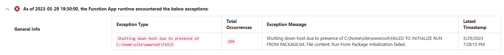
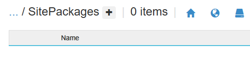
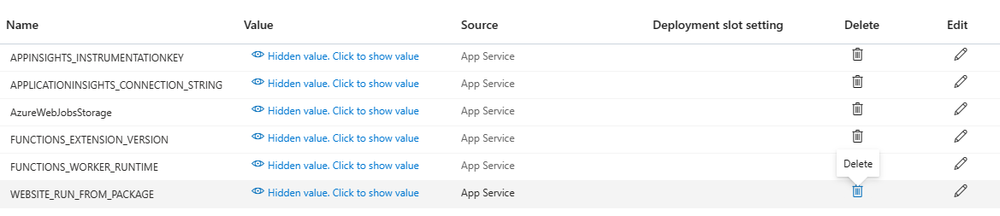
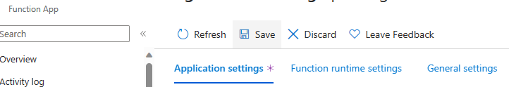

# Troubleshoot error: "Failed To Initialize Run From Package"

The Azure Functions Runtime is Unreachable, is an error which has many causes. The most common reason is that the function app has lost access to its storage account, but there are many other causes. For more information see, [Troubleshoot error: "Azure Functions Runtime is unreachable"](azure-functions-runtime-is-unreachable-overview.md)

In this article, we will help you troubleshoot an Azure Functions Runtime is Unreachable scenario due to failing to initialize run from package, including how to identify and resolve the issue.

A Function App in this state is likely caused:
* When first creating a Function App using ARM or Bicep template which sets the app setting. 
* An existing Function App was configured to with the WEBSITE_RUN_FROM_PACKAGE app setting:
  * Some deployment method will add the app setting "WEBSITE_RUN_FROM_PACKAGE" and if it failed to deploy the zip package successfully, you can run into this issue. 
  * A user has added the app setting by mistake. 

For more information on using the WEBSITE_RUN_FROM_PACKAGE, see [Run your functions from a package file in Azure](run-functions-from-deployment-package.md#using-website_run_from_package--1)

## Investigation Steps:

### Method 1:

To confirm if the issue is caused by failing to initialize run from package, we can check the following:

From the Azure Portal -> Function App -> Configuration blade, confirm if the app setting "WEBSITE_RUN_FROM_PACKAGE" is set with the value of 1.

Once confirmed, we can check the Diagnose and Solve Problems blade and we will search for the "Functions that are not triggering" detector.

If the detector shows the Exception Message "Shutting down host due to presence of C:\home\site\wwwroot\FAILED TO INITIALIZE RUN FROM PACKAGE.txt. File content: Run From Package Initialization failed." the issue is likely caused by the WEBSITE_RUN_FROM_PACKAGE app setting being used without a successful deployment.

### Method 2

Alternatively, you can check by going to the Azure Portal -> Function App -> Advanced Tools blade and clicking on Go -> which will open the Kudu (SCM) site. 

From the Kudu site, click on Debug Console in the top menu and select CMD or PowerShell.

There are 2 paths to check. The first is going to be /data/SitePackages to confirm if the directory contains the zip package and the packagename.txt file or not. 

If the site shows no files like below, then the issue is caused by the WEBSITE_RUN_FROM_PACKAGE app setting being utilized without a successful deployment.

The expected result should at least be one zip package named using the exact Year Month Day Hour Minute Second of the deployment, along with a text file named packagename.txt. There may be more than 1 zip package in the directory. 

The packagename.txt file will contain the name of the zip package to use. 

If the SitePackages directory was empty, you can click on the 3 dots next to /SitePackages twice to navigate back to the /home directory. 
We can confirm that the failure was due to "Failed to initialize run from package", by navigating to the site/wwwroot and noticing if the "FAILED TO INITIALIZE RUN FROM PACKAGE.txt" file was present:

## Resolution:

In order to get the app in a normal running state and be able to deploy code, we need to remove the app settings "WEBSITE_RUN_FROM_PACKAGE" from the Portal -> Function App -> Configuration blade and click on the trash can icon to the right of the app setting.

Don't forget to click the "Save" button at the top afterwards to Save make the changes.

Once the App Setting "WEBSITE_RUN_FROM_PACKAGE" has been deleted, the function app will restart automatically due to the App Configuration change, and the function app will start up as expected. 
