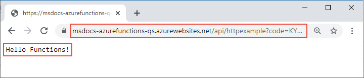
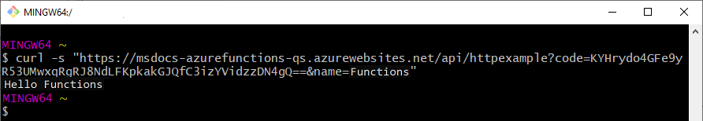

# Connect Azure Functions to Azure Storage using command line tools

In this article, you integrate an Azure Storage queue with the function and storage account you created in [the previous quickstart](functions-create-first-azure-function-azure-cli.md). You achieve this integration by using an *output binding* that writes data from an HTTP request to a message in the queue. Completing this article incurs no additional costs beyond the few USD cents of the previous quickstart. To learn more about bindings, see [Azure Functions triggers and bindings concepts](functions-triggers-bindings.md).

## Configure your local environment

Before you begin, you must complete the article, [Quickstart: Create an Azure Functions project from the command line](functions-create-first-azure-function-azure-cli.md). If you already cleaned up resources at the end of that article, go through the steps again to recreate the function app and related resources in Azure.

[!INCLUDE [functions-cli-get-storage-connection](../../includes/functions-cli-get-storage-connection.md)]

[!INCLUDE [functions-register-storage-binding-extension-csharp](../../includes/functions-register-storage-binding-extension-csharp.md)]

[!INCLUDE [functions-add-output-binding-cli](../../includes/functions-add-output-binding-cli.md)]

::: zone pivot="programming-language-csharp"  
[!INCLUDE [functions-add-storage-binding-csharp-library](../../includes/functions-add-storage-binding-csharp-library.md)]  
::: zone-end  
::: zone pivot="programming-language-java" 
[!INCLUDE [functions-add-output-binding-java-cli](../../includes/functions-add-output-binding-java-cli.md)]
::: zone-end   

For more information on the details of bindings, see [Azure Functions triggers and bindings concepts](functions-triggers-bindings.md) and [queue output configuration](functions-bindings-storage-queue-output.md#configuration).

## Add code to use the output binding

With the queue binding defined, you can now update your function to receive the `msg` output parameter and write messages to the queue.

::: zone pivot="programming-language-python"     
[!INCLUDE [functions-add-output-binding-python](../../includes/functions-add-output-binding-python.md)]
::: zone-end  

::: zone pivot="programming-language-javascript"  
[!INCLUDE [functions-add-output-binding-js](../../includes/functions-add-output-binding-js.md)]
::: zone-end  

::: zone pivot="programming-language-typescript"  
[!INCLUDE [functions-add-output-binding-ts](../../includes/functions-add-output-binding-ts.md)]
::: zone-end  

::: zone pivot="programming-language-powershell"  
[!INCLUDE [functions-add-output-binding-powershell](../../includes/functions-add-output-binding-powershell.md)]  
::: zone-end

::: zone pivot="programming-language-csharp"  
[!INCLUDE [functions-add-storage-binding-csharp-library-code](../../includes/functions-add-storage-binding-csharp-library-code.md)]
::: zone-end 

::: zone pivot="programming-language-java"
[!INCLUDE [functions-add-output-binding-java-code](../../includes/functions-add-output-binding-java-code.md)]

[!INCLUDE [functions-add-output-binding-java-test-cli](../../includes/functions-add-output-binding-java-test-cli.md)]
::: zone-end

Observe that you *don't* need to write any code for authentication, getting a queue reference, or writing data. All these integration tasks are conveniently handled in the Azure Functions runtime and queue output binding.

[!INCLUDE [functions-run-function-test-local-cli](../../includes/functions-run-function-test-local-cli.md)]

[!INCLUDE [functions-extension-bundles-info](../../includes/functions-extension-bundles-info.md)]

## View the message in the Azure Storage queue

[!INCLUDE [functions-add-output-binding-view-queue-cli](../../includes/functions-add-output-binding-view-queue-cli.md)]

## Redeploy the project to Azure

Now that you've verified locally that the function wrote a message to the Azure Storage queue, you can redeploy your project to update the endpoint running on Azure.

::: zone pivot="programming-language-javascript,programming-language-typescript,programming-language-python,programming-language-powershell,programming-language-csharp" 
In the *LocalFunctionsProj* folder, use the [`func azure functionapp publish`](functions-run-local.md#project-file-deployment) command to redeploy the project, replacing`<APP_NAME>` with the name of your app.

```
func azure functionapp publish <APP_NAME>
```
::: zone-end  

::: zone pivot="programming-language-java" 

In the local project folder, use the following Maven command to republish your project:
```
mvn azure-functions:deploy
```
::: zone-end

## Verify in Azure

1. As in the previous quickstart, use a browser or CURL to test the redeployed function.

    # [Browser](#tab/browser)
    
    Copy the complete **Invoke URL** shown in the output of the publish command into a browser address bar, appending the query parameter `&name=Functions`. The browser should display similar output as when you ran the function locally.

    

    # [curl](#tab/curl)
    
    Run [`curl`](https://curl.haxx.se/) with the **Invoke URL**, appending the parameter `&name=Functions`. The output of the command should be the text, "Hello Functions."
    
    

    --- 

1. Examine the Storage queue again, as described in the previous section, to verify that it contains the new message written to the queue.

## Clean up resources

After you've finished, use the following command to delete the resource group and all its contained resources to avoid incurring further costs.

```azurecli
az group delete --name AzureFunctionsQuickstart-rg
```

## Next steps

You've updated your HTTP triggered function to write data to a Storage queue. Now you can learn more about developing Functions from the command line using Core Tools and Azure CLI:

+ [Work with Azure Functions Core Tools](functions-run-local.md)  

::: zone pivot="programming-language-csharp"  
+ [Examples of complete Function projects in C#](/samples/browse/?products=azure-functions&languages=csharp).

+ [Azure Functions C# developer reference](functions-dotnet-class-library.md)  
::: zone-end 
::: zone pivot="programming-language-javascript"  
+ [Examples of complete Function projects in JavaScript](/samples/browse/?products=azure-functions&languages=javascript).

+ [Azure Functions JavaScript developer guide](functions-reference-node.md)  
::: zone-end  
::: zone pivot="programming-language-typescript"  
+ [Examples of complete Function projects in TypeScript](/samples/browse/?products=azure-functions&languages=typescript).

+ [Azure Functions TypeScript developer guide](functions-reference-node.md#typescript)  
::: zone-end  
::: zone pivot="programming-language-python"  
+ [Examples of complete Function projects in Python](/samples/browse/?products=azure-functions&languages=python).

+ [Azure Functions Python developer guide](functions-reference-python.md)  
::: zone-end  
::: zone pivot="programming-language-powershell"  
+ [Examples of complete Function projects in PowerShell](/samples/browse/?products=azure-functions&languages=azurepowershell).

+ [Azure Functions PowerShell developer guide](functions-reference-powershell.md) 
::: zone-end
+ [Azure Functions triggers and bindings](functions-triggers-bindings.md)

+ [Functions pricing page](https://azure.microsoft.com/pricing/details/functions/)

+ [Estimating Consumption plan costs](functions-consumption-costs.md) 
