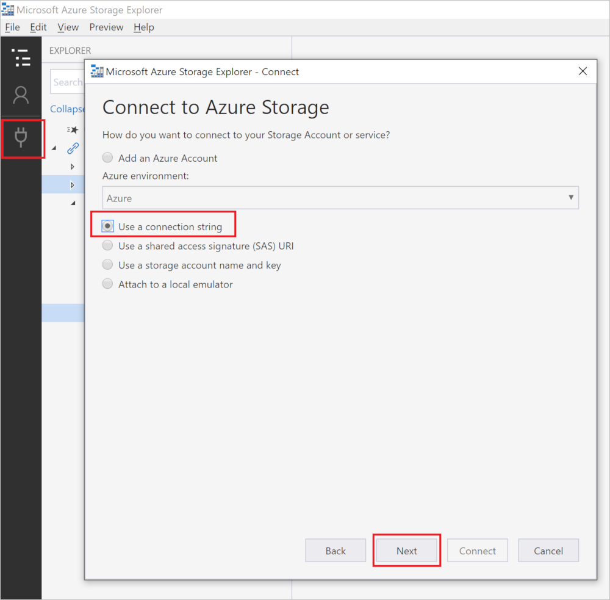
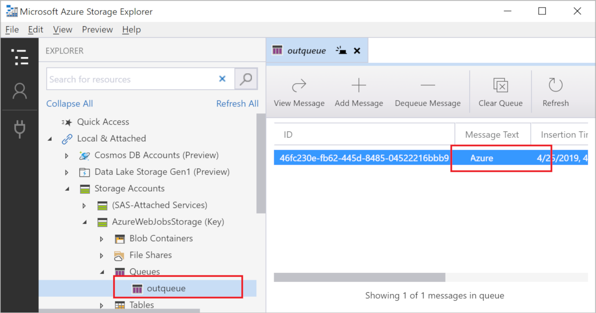

# Add an Azure Storage queue binding to your function

Azure Functions lets you connect Azure services and other resources to functions without having to write your own integration code. These *bindings* are declared within the function definition and can represent input, output, or both. Data from bindings is provided to the function as parameters. A trigger is a special kind of input binding. To learn more, see [Azure Functions triggers and bindings concepts](functions-triggers-bindings.md).

This article shows you how to integrate the function you created in the [previous quickstart article](functions-create-first-function-python.md) with an Azure Storage queue. The output binding that you add to this function writes the HTTP request data to a message in the queue. To make it easier, you use the Storage account that you created with your function app. The connection to this account is stored in an app setting named `AzureWebJobsStorage`.  

## Prerequisites

To complete this article:

* Complete the [part 1 of the Python quickstart](functions-create-first-function-python.md).
* Install [Microsoft Azure Storage Explorer](https://storageexplorer.com/). This is a tool you'll use to examine queue messages generated by your output binding. Storage Explorer is supported on macOS, Windows, and Linux-based operating systems.

## Download the function app settings

In the previous quickstart article, you created a function app in Azure along with a Storage account. The connection string for this account is stored securely in app settings in Azure. In this article, you write messages to a Storage queue in the same account. To be able to test the function locally, you need to download settings to the local.settings.json file. Run the following the Azure Functions Core Tools command to download settings to local.settings.json, replacing `<APP_NAME>` with the name of your function app from the previous article:

```bash
func azure functionapp fetch-app-settings <APP_NAME>
```

You may be required to sign in to your Azure account.

> [!NOTE]
> Because it contains secrets, the local.settings.json file never gets published, and it should be excluded from source control.

You need the value `AzureWebJobsStorage`, which is the Storage account connection string. You use this connection to verify that the output binding works as expected.

## Add an output binding

In Functions, each type of binding requires a `direction`, `type` and a unique `name` to be defined in the function.json file. Depending on the binding type, additional properties may be required. The [queue output configuration](functions-bindings-storage-queue.md#output---configuration) describes the fields required for an Azure Storage queue binding.

To create a binding you just add a binding configuration object to the `function.json` file. Edit the function.json file in your HttpTrigger folder to add an object to the `bindings` array that has the following properties:

| Property | Value | Description |
| -------- | ----- | ----------- |
| **`name`** | `msg` | Name that identifies the binding parameter referenced in your code. |
| **`type`** | `queue` | The binding is an Azure Storage queue binding. |
| **`direction`** | `out` | The binding is an output binding. |
| **`queueName`** | `outqueue` | The name of the queue that the binding writes to. When the *queueName* doesn't exist, the binding creates it on first use. |
| **`connection`** | `AzureWebJobsStorage` | The name of a app setting that contains the connection string for the Storage account. The `AzureWebJobsStorage` setting contains the connection string for the Storage account you created with the function app. |

Your function.json file should now look like the following example:

```json
{
  "scriptFile": "__init__.py",
  "bindings": [
    {
      "authLevel": "function",
      "type": "httpTrigger",
      "direction": "in",
      "name": "req",
      "methods": [
        "get",
        "post"
      ]
    },
    {
      "type": "http",
      "direction": "out",
      "name": "$return"
    },
  {
      "type": "queue",
      "direction": "out",
      "name": "msg",
      "queueName": "outqueue",
      "connection": "AzureWebJobsStorage"
    }
  ]
}
```

## Add code that uses the output binding

Once its configured, you can start using the `name` of the binding to access it as a method attribute in the function signature. In the following example, `msg` is an instance of the [`azure.functions.InputStream class`](/python/api/azure-functions/azure.functions.httprequest).

```python
import logging

import azure.functions as func


def main(req: func.HttpRequest, msg: func.Out[func.QueueMessage]) -> str:

    name = req.params.get('name')
    if not name:
        try:
            req_body = req.get_json()
        except ValueError:
            pass
        else:
            name = req_body.get('name')

    if name:
        msg.set(name)
        return func.HttpResponse(f"Hello {name}!")
    else:
        return func.HttpResponse(
             "Please pass a name on the query string or in the request body",
             status_code=400
        )
```

By using an output binding, you don't have to write code for tasks such as authenticating to your storage account, getting a reference to the queue, or using the SDK methods to write to it. The Azure Functions runtime and queue output binding do those tasks for you.

## Run the function locally

As before, use the following command to start the Functions runtime locally:

```bash
func host start
```

Copy the URL of your `HttpTrigger` function from the runtime output and paste it into your browser's address bar. Append the query string `?name=<yourname>` to this URL and execute the request. You should see the same response in the browser as you did in the previous article.

This time, the output binding also creates a queue named **outqueue** in your Storage account and adds a message with this same string. You you can use the [Microsoft Azure Storage Explorer][Azure Storage Explorer] to view the new queue and verify that a message was added.

### Connect Azure Storage Explorer to your Storage account

Use the following steps to connect to your Storage account.

1. Open the local.settings.json file and copy the value of `AzureWebJobsStorage`, which is the Storage account connection string.
 
1. Run the [Azure Storage Explorer] tool, select the connect icon on the left, choose **Use a connection string**, and select **Next**.

    

1. Type `AzureWebJobsStorage` as the **Display name**, then paste the copied string into the **Connection string:** field and select **Next > Connect**.

### Examine the Storage queue message

1. In Azure Storage Explorer, expand **Local & attached** > **Storage Accounts** > **AzureWebJobsStorage (Key)**.

1. Expand the **Queues** node, and then select the queue named **outqueue**.

    

   The queue contains the message that the queue output binding created when you ran the HTTP-triggered function.

1. Call the HTTP endpoint again, and you'll see a new message appear in the queue.  

Now, it's time to republish the updated function app to Azure.

[!INCLUDE [functions-publish-project](../../includes/functions-publish-project.md)]

Again, you can use cURL or a browser to test the deployed function. As before append the query string `&name=<yourname>` to the URL, as in the following example:

```bash
curl https://myfunctionapp.azurewebsites.net/api/httptrigger?code=cCr8sAxfBiow548FBDLS1....&name=<yourname>
```

You can [Examine the Storage queue message](#examine-the-storage-queue-message) to verify that the output binding again generates a new message in the queue.

[!INCLUDE [functions-cleanup-resources](../../includes/functions-cleanup-resources.md)]

## Next steps

You've added an Azure Storage queue output binding to your HTTP triggered function, deployed your changes to Azure and verified the results of a sample execution. To learn more about developing Azure Functions using Python, see the [Azure Functions Python developer guide](functions-reference-python.md) and [Azure Functions triggers and bindings](functions-triggers-bindings.md).

We recommend that you enable Application Insights monitoring for your function app:

> [!div class="nextstepaction"]
> [Enable Application Insights integration](functions-monitoring.md#manually-connect-an-app-insights-resource)

[Azure Storage Explorer]: https://storageexplorer.com/