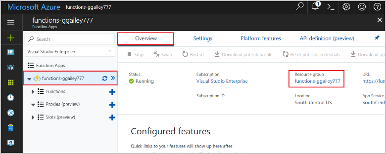

# Connect functions to Azure Storage using Visual Studio Code

Azure Functions lets you connect functions to Azure services and other resources without having to write your own integration code. These *bindings*, which represent both input and output, are declared within the function definition. Data from bindings is provided to the function as parameters. A trigger is a special type of input binding. While a function has only one trigger, it can have multiple input and output bindings. To learn more, see [Azure Functions triggers and bindings concepts](functions-triggers-bindings.md).

This article shows you how to use Visual Studio Code to connect the function you created in the [previous quickstart article](functions-create-first-function-vs-code.md) to Azure Storage. The output binding that you add to this function writes data from the HTTP request to a message in an Azure Queue storage queue. 

Most bindings require a stored connection string that Functions uses to access the bound service. To make it easier, you use the Storage account that you created with your function app. The connection to this account is already stored in an app setting named `AzureWebJobsStorage`.  

## Prerequisites

Before you start this article, you must meet the following requirements:

* Install the [Azure Storage extension for Visual Studio Code](https://marketplace.visualstudio.com/items?itemName=ms-azuretools.vscode-azurestorage).
* Install [Azure Storage Explorer](https://storageexplorer.com/). Storage Explorer is a tool you'll use to examine queue messages generated by your output binding. Storage Explorer is supported on macOS, Windows, and Linux-based operating systems.
* Install [.NET Core CLI tools](https://docs.microsoft.com/dotnet/core/tools/?tabs=netcore2x) (C# projects only).
* Complete the steps in [part 1 of the Visual Studio Code quickstart](functions-create-first-function-vs-code.md). 

This article assumes that you are already signed in to your Azure subscription from Visual Studio Code. You can sign in by running `Azure: Sign In` from the command palette. 

## Download the function app settings

In the [previous quickstart article](functions-create-first-function-vs-code.md), you created a function app in Azure along with the required Storage account. The connection string for this account is stored securely in app settings in Azure. In this article, you write messages to a Storage queue in the same account. To connect to your Storage account when running the function locally, you must download app settings to the local.settings.json file. 

1. Press the F1 key to open the command palette, then search for and run the command `Azure Functions: Download Remote Settings....`. 

1. Choose the function app you created in the previous article. Select **Yes to all** to overwrite the existing local settings. 

    > [!IMPORTANT]  
    > Because it contains secrets, the local.settings.json file never gets published, and is excluded from source control.

1. Copy the value `AzureWebJobsStorage`, which is the key for the Storage account connection string value. You use this connection to verify that the output binding works as expected.

## Register binding extensions

Because you are using a Queue storage output binding, you must have the Storage bindings extension installed before you run the project. 

### JavaScript

[!INCLUDE [functions-extension-bundles](../../includes/functions-extension-bundles.md)]

### C\# class library

With the exception of HTTP and timer triggers, bindings are implemented as extension packages. Run the following [dotnet add package](/dotnet/core/tools/dotnet-add-package) command in the Terminal window to add the Storage extension package to your project.

```bash
dotnet add package Microsoft.Azure.WebJobs.Extensions.Storage --version 3.0.4
```

Now, you can add the storage output binding to your project.

## Add an output binding

In Functions, each type of binding requires a `direction`, `type`, and a unique `name` to be defined in the function.json file. The way you define these attributes depends on the language of your function app.

### JavaScript

Binding attributes are defined directly in the function.json file. Depending on the binding type, additional properties may be required. The [queue output configuration](functions-bindings-storage-queue.md#output---configuration) describes the fields required for an Azure Storage queue binding. The extension makes it easy to add bindings to the function.json file. 

To create a binding, right-click (Ctrl+click on macOS) the `function.json` file in your HttpTrigger folder and choose **Add binding...**. Follow the prompts to define the following binding properties for the new binding:

| Prompt | Value | Description |
| -------- | ----- | ----------- |
| **Select binding direction** | `out` | The binding is an output binding. |
| **Select binding with direction...** | `Azure Queue Storage` | The binding is an Azure Storage queue binding. |
| **The name used to identify this binding in your code** | `msg` | Name that identifies the binding parameter referenced in your code. |
| **The queue to which the message will be sent** | `outqueue` | The name of the queue that the binding writes to. When the *queueName* doesn't exist, the binding creates it on first use. |
| **Select setting from "local.setting.json"** | `AzureWebJobsStorage` | The name of an application setting that contains the connection string for the Storage account. The `AzureWebJobsStorage` setting contains the connection string for the Storage account you created with the function app. |

A binding is added to the `bindings` array in your function.json file, which should now look like the following example:

```json
{
   ...

  "bindings": [
    {
      "authLevel": "function",
      "type": "httpTrigger",
      "direction": "in",
      "name": "req",
      "methods": [
        "get",
        "post"
      ]
    },
    {
      "type": "http",
      "direction": "out",
      "name": "$return"
    },
    {
      "type": "queue",
      "direction": "out",
      "name": "msg",
      "queueName": "outqueue",
      "connection": "AzureWebJobsStorage"
    }
  ]
}
```

### C\# class library

In a C# class library project, the bindings are defined as binding attributes on the function method. The function.json file is then autogenerated based on these attributes.

Open the HttpTrigger.cs project file and add the following `using` statement:

```cs
using Microsoft.Azure.WebJobs.Extensions.Storage;
```

Add the following parameter to the `Run` method definition:

```cs
[Queue("outqueue"),StorageAccount("AzureWebJobsStorage")] ICollector<string> msg
```

The `msg` parameter is an `ICollector<T>` type, which represents a collection of messages that are written to an output binding when the function completes. In this case, the output is a storage queue named `outqueue`. The connection string for the Storage account is set by the `StorageAccountAttribute`. This attribute indicates the setting that contains the Storage account connection string and can be applied at the class, method, or parameter level. In this case, you could omit `StorageAccountAttribute` because you are already using the default storage account.

The Run method definition should now look like the following:  

```cs
[FunctionName("HttpTrigger")]
public static async Task<IActionResult> Run(
    [HttpTrigger(AuthorizationLevel.Function, "get", "post", Route = null)] HttpRequest req, 
    [Queue("outqueue"),StorageAccount("AzureWebJobsStorage")] ICollector<string> msg, ILogger log)
```

## Add code that uses the output binding

After the binding is defined, you can use the `name` of the binding to access it as an attribute in the function signature. By using an output binding, you don't have to use the Azure Storage SDK code for authentication, getting a queue reference, or writing data. The Functions runtime and queue output binding do those tasks for you.

### JavaScript

Add code that uses the `msg` output binding object on `context.bindings` to create a queue message. Add this code before the`context.res` statement.

```javascript
// Add a message to the Storage queue.
context.bindings.msg = "Name passed to the function: " + 
(req.query.name || req.body.name);
```

At this point, your function should look as follows:

```javascript
module.exports = async function (context, req) {
    context.log('JavaScript HTTP trigger function processed a request.');

    if (req.query.name || (req.body && req.body.name)) {
        // Add a message to the Storage queue.
        context.bindings.msg = "Name passed to the function: " + 
        (req.query.name || req.body.name);
        context.res = {
            // status: 200, /* Defaults to 200 */
            body: "Hello " + (req.query.name || req.body.name)
        };
    }
    else {
        context.res = {
            status: 400,
            body: "Please pass a name on the query string or in the request body"
        };
    }
};
```

### C\#

Add code that uses the `msg` output binding object to create a queue message. Add this code before the method returns.

```cs
if (!string.IsNullOrEmpty(name))
{
    // Add a message to the output collection.
    msg.Add(string.Format("Name passed to the function: {0}", name));
}
```

At this point, your function should look as follows:

```cs
[FunctionName("HttpTrigger")]
public static async Task<IActionResult> Run(
    [HttpTrigger(AuthorizationLevel.Function, "get", "post", Route = null)] HttpRequest req, 
    [Queue("outqueue"),StorageAccount("AzureWebJobsStorage")] ICollector<string> msg, ILogger log)
{
    log.LogInformation("C# HTTP trigger function processed a request.");

    string name = req.Query["name"];

    string requestBody = await new StreamReader(req.Body).ReadToEndAsync();
    dynamic data = JsonConvert.DeserializeObject(requestBody);
    name = name ?? data?.name;

    if (!string.IsNullOrEmpty(name))
    {
        // Add a message to the output collection.
        msg.Add(string.Format("Name passed to the function: {0}", name));
    }
    return name != null
        ? (ActionResult)new OkObjectResult($"Hello, {name}")
        : new BadRequestObjectResult("Please pass a name on the query string or in the request body");
}
```

[!INCLUDE [functions-run-function-test-local-vs-code](../../includes/functions-run-function-test-local-vs-code.md)]

A new queue named **outqueue** is created in your Storage account by the Functions runtime when the output binding is first used. You'll use Storage Explorer to verify that the queue was created along with the new message.

### Connect Storage Explorer to your account

Skip this section if you have already installed Azure Storage Explorer and connected it to your Azure account.

1. Run the [Azure Storage Explorer] tool, select the connect icon on the left, and select **Add an account**.

    

1. In the **Connect** dialog, choose **Add an Azure account**, choose your **Azure environment**, and select **Sign in...**. 

    

After you successfully sign in to your account, you see all of the Azure subscriptions associated with your account.

### Examine the output queue

1. In Visual Studio Code, press the F1 key to open the command palette, then search for and run the command `Azure Storage: Open in Storage Explorer` and choose your Storage account name. Your storage account opens in Azure Storage Explorer.  

1. Expand the **Queues** node, and then select the queue named **outqueue**. 

   The queue contains the message that the queue output binding created when you ran the HTTP-triggered function. If you invoked the function with the default `name` value of *Azure*, the queue message is *Name passed to the function: Azure*.

    

1. Run the function again, send another request, and you'll see a new message appear in the queue.  

Now, it's time to republish the updated function app to Azure.

## Redeploy and test the updated app

1. In Visual Studio Code, press F1 to open the command palette. In the command palette, search for and select `Azure Functions: Deploy to function app...`.

1. Choose the function app that you created in the first article. Because you are redeploying your project to the same app, select **Deploy** to dismiss the warning about overwriting files.

1. After deployment completes, you can again use cURL or a browser to test the redeployed function. As before, append the query string `&name=<yourname>` to the URL, as in the following example:

    ```bash
    curl https://myfunctionapp.azurewebsites.net/api/httptrigger?code=cCr8sAxfBiow548FBDLS1....&name=<yourname>
    ```

1. Again [view the message in the storage queue](#examine-the-output-queue) to verify that the output binding again generates a new message in the queue.

## Clean up resources

*Resources* in Azure refers to function apps, functions, storage accounts, and so forth. They are grouped into *resource groups*, and you can delete everything in a group by deleting the group.

You created resources to complete these quickstarts. You may be billed for these resources, depending on your [account status](https://azure.microsoft.com/account/) and [service pricing](https://azure.microsoft.com/pricing/). If you don't need the resources anymore, here's how to delete them:

1. In Visual Studio Code, press F1 to open the command palette. In the command palette, search for and select `Azure Functions: Open in portal`.

1. Choose your function app, and press Enter. The function app page is opened in the [Azure portal](https://portal.azure.com).

1. In the **Overview** tab, select the named link under **Resource group**.

    

1. In the **Resource group** page, review the list of included resources, and verify that they are the ones you want to delete.
 
1. Select **Delete resource group**, and follow the instructions.

   Deletion may take a couple of minutes. When it's done, a notification appears for a few seconds. You can also select the bell icon at the top of the page to view the notification.

## Next steps

You've updated your HTTP triggered function to write data to a Storage queue. To learn more about developing Functions, see [Develop Azure Functions using Visual Studio Code](functions-develop-vs-code.md).

Next, you should enable Application Insights monitoring for your function app:

> [!div class="nextstepaction"]
> [Enable Application Insights integration](functions-monitoring.md#manually-connect-an-app-insights-resource)

[Azure Storage Explorer]: https://storageexplorer.com/
