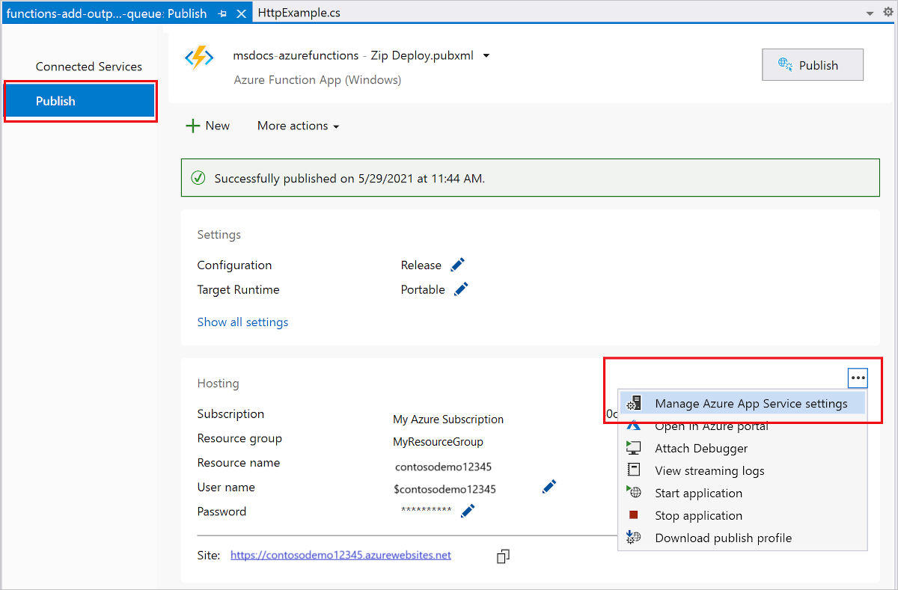

# Connect functions to Azure Storage using Visual Studio

[!INCLUDE [functions-add-storage-binding-intro](../../includes/functions-add-storage-binding-intro.md)]

This article shows you how to use Visual Studio to connect the function you created in the [previous quickstart article] to Azure Storage. The output binding that you add to this function writes data from the HTTP request to a message in an Azure Queue storage queue. 

Most bindings require a stored connection string that Functions uses to access the bound service. To make it easier, you use the Storage account that you created with your function app. The connection to this account is already stored in an app setting named `AzureWebJobsStorage`.  

## Prerequisites

Before you start this article, you must: 

- Complete [part 1 of the Visual Studio quickstart](./functions-create-your-first-function-visual-studio.md). 
- Install [Azure Storage Explorer](https://storageexplorer.com/). Storage Explorer is a tool that you'll use to examine queue messages generated by your output binding. Storage Explorer is supported on macOS, Windows, and Linux-based operating systems. 
- Sign in to your Azure subscription from Visual Studio.

## Download the function app settings

In the [previous quickstart article](./create-first-function-vs-code-csharp.md), you created a function app in Azure along with the required Storage account. The connection string for this account is stored securely in app settings in Azure. In this article, you write messages to a Storage queue in the same account. To connect to your Storage account when running the function locally, you must download app settings to the *local.settings.json* file. 

1. In **Solution Explorer**, right-click the project and select **Publish**. 

1. In the **Publish** tab under **Hosting**, expand the three dots (**...**) and select **Manage Azure App Service settings**. 

    

1. Under **AzureWebJobsStorage**, copy the **Remote** string value to **Local**, and then select **OK**. 

The storage binding, which uses the `AzureWebJobsStorage` setting for the connection, can now connect to your Queue storage when running locally.

## Register binding extensions

Because you're using a Queue storage output binding, you need the Storage bindings extension installed before you run the project. Except for HTTP and timer triggers, bindings are implemented as extension packages. 

1. From the **Tools** menu, select **NuGet Package Manager** > **Package Manager Console**. 

1. In the console, run the following [Install-Package](/nuget/tools/ps-ref-install-package) command to install the Storage extensions:

    # [Isolated worker model](#tab/isolated-process)
    ```bash
    Install-Package /dotnet/api/microsoft.azure.webjobs.blobattribute.Queues -IncludePrerelease
    ```
    # [In-process model](#tab/in-process) 
    ```bash
    Install-Package Microsoft.Azure.WebJobs.Extensions.Storage 
    ```
    ---

Now, you can add the storage output binding to your project.

## Add an output binding

[!INCLUDE [functions-add-storage-binding-csharp-library](../../includes/functions-add-storage-binding-csharp-library.md)]

## Add code that uses the output binding

After the binding is defined, you can use the `name` of the binding to access it as an attribute in the function signature. By using an output binding, you don't have to use the Azure Storage SDK code for authentication, getting a queue reference, or writing data. The Functions runtime and queue output binding do those tasks for you.

[!INCLUDE [functions-add-storage-binding-csharp-library-code](../../includes/functions-add-storage-binding-csharp-library-code.md)]

## Run the function locally

[!INCLUDE [functions-run-function-test-local-vs](../../includes/functions-run-function-test-local-vs.md)]

A new queue named `outqueue` is created in your storage account by the Functions runtime when the output binding is first used. You'll use Storage Explorer to verify that the queue was created along with the new message.

### Connect Storage Explorer to your account

[!INCLUDE [functions-storage-explorer-connect.md](../../includes/functions-storage-explorer-connect.md)]

### Examine the output queue

1. In Storage Explorer, expand the **Queues** node, and then select the queue named **outqueue**.

   The queue contains the message that the queue output binding created when you ran the HTTP-triggered function. If you invoked the function with the default `name` value of *Azure*, the queue message is *Name passed to the function: Azure*.

    :::image type="content" source="./media/functions-add-output-binding-storage-queue-vs-code/function-queue-storage-output-view-queue.png" alt-text="Screenshot of the queue message shown in Azure Storage Explorer.":::

1. Run the function again, send another request, and you see a new message in the queue.  

Now, it's time to republish the updated function app to Azure.

## Redeploy and verify the updated app

1. In **Solution Explorer**, right-click the project and select **Publish**, then choose **Publish** to republish the project to Azure.

1. After deployment completes, you can again use the browser to test the redeployed function. As before, append the query string `&name=<yourname>` to the URL.

1. Again [view the message in the storage queue](#examine-the-output-queue) to verify that the output binding again generates a new message in the queue.

## Clean up resources

[!INCLUDE [Clean-up resources](../../includes/functions-quickstart-cleanup.md)]

## Next steps

You've updated your HTTP triggered function to write data to a Storage queue. To learn more about developing Functions, see [Develop Azure Functions using Visual Studio](functions-develop-vs.md).

Next, you should enable Application Insights monitoring for your function app:

> [!div class="nextstepaction"]
> [Enable Application Insights integration](configure-monitoring.md#add-to-an-existing-function-app)

[Azure Storage Explorer]: https://storageexplorer.com/
[previous quickstart article]: functions-create-your-first-function-visual-studio.md
