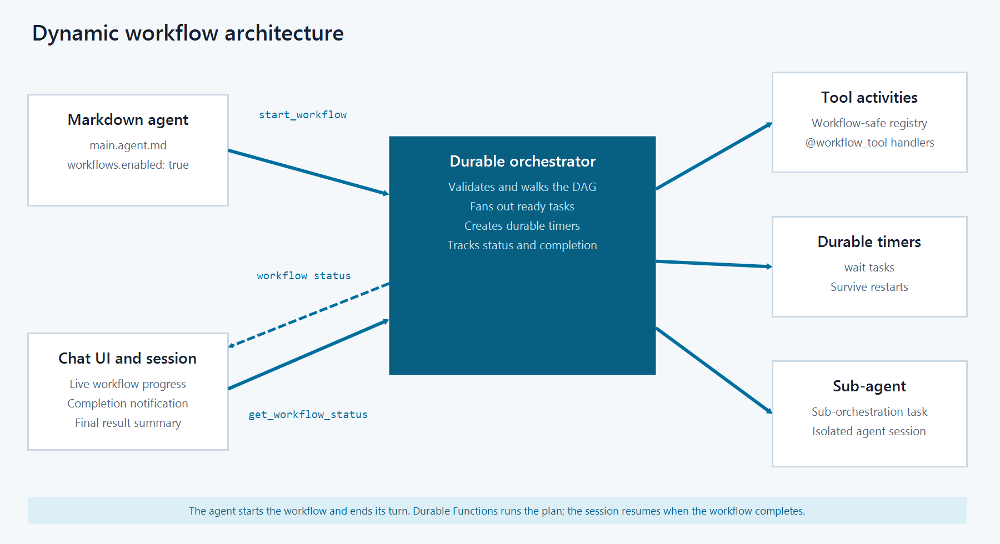

# Run dynamic workflows with Azure Functions serverless agents

Dynamic workflows are an experimental feature of the [Azure Functions serverless agents runtime](functions-serverless-agents-runtime.md). They let a markdown agent start a durable, multi-step workflow of tool calls and waits without you writing Durable Functions orchestration code.

The feature builds on the same idea as programmatic tool calling: instead of calling tools one at a time through the conversation, the model authors a structured plan that calls tools, and the runtime executes the plan. Dynamic workflows extend that pattern with Azure Functions and Durable Functions so the work can fan out, wait, survive restarts, and remain observable while only the final result or summary needs to enter the agent's context.

> [!NOTE]
> Dynamic workflows are in experimental preview. The current v1 surface is intentionally small and can change before general availability. Current support focuses on simple workflow-safe custom tools, wait tasks, fan-out/fan-in, live progress, and completion summaries. Sub-agent tasks and richer orchestration features are planned for future releases.

## Why dynamic workflows

Agents can already complete complex tasks by calling tools directly in the chat loop, but that pattern runs into four common limits:

+ **Token cost.** Every intermediate tool result is added to the model's context. A multi-step plan can spend tokens on raw data that the model only needs to summarize.
+ **Latency.** Each direct tool call is another model round trip. Long or branchy work runs serially through the agent loop instead of running independent work in parallel.
+ **Durability.** Inline work can be lost if the worker restarts, and there's no first-class way to sleep on a timer or wait for a long-running external signal.
+ **Observability.** Operators can't easily list, inspect, or cancel in-flight work without going through the chat session.

Dynamic workflows address those limits by moving plan execution into a durable orchestration. The agent starts the workflow, receives a workflow ID, and can end its turn. The orchestrator runs workflow-safe tools and durable timers. The chat UI and operations surfaces can track the workflow independently, and the agent picks back up when the workflow completes.

## How dynamic workflows relate to programmatic tool calling

Dynamic workflows are similar in shape to Anthropic's [programmatic tool calling pattern](https://platform.claude.com/docs/en/agents-and-tools/tool-use/programmatic-tool-calling). In that pattern, the model creates a structured tool plan and the runtime executes it outside the normal tool-by-tool chat loop. This can reduce token use and latency because intermediate results stay outside the model context and multiple tool calls can be represented by one model-authored plan.

Dynamic workflows apply that pattern to Azure Functions and add a durability and operations layer:

| Capability | Programmatic tool calling pattern | Dynamic workflows |
| --- | --- | --- |
| Plan-shaped tool calls | Yes | Yes |
| Lower token use and latency for multi-tool work | Yes | Yes |
| Durable execution across worker restarts | No | Yes, by using Durable Functions |
| Durable waits and timers | No | Yes |
| Outside-the-loop list, inspect, cancel, and terminate | No | Yes |
| Operator visibility in Durable Task Scheduler | No | Yes, when configured |

## When to use dynamic workflows

Use dynamic workflows when an agent needs to run work that is larger than a single chat turn or direct tool call. Good fits include:

+ Gathering evidence from several independent sources in parallel, such as logs, metrics, and deployment history.
+ Running a multi-step plan where later steps depend on earlier tool results.
+ Waiting for a durable timer without keeping a worker busy.
+ Keeping large intermediate results out of the agent's conversation context until a final result or summary is available.
+ Tracking and controlling long-running work from outside the agent loop.

Dynamic workflows aren't a good fit for work that can finish in one normal tool call, workflows that require an immediate user response at every step, or hand-authored workflow definitions. In the current design, the model authors the workflow plan at run time; you don't write YAML or markdown workflow templates.

## Current v1 scope

The current experimental version supports:

+ Enabling workflows on `main.agent.md`, the interactive session-backed agent.
+ Workflow tasks that call `@workflow_tool` Python functions.
+ Durable `wait` tasks that use ISO 8601 durations, such as `PT30S`.
+ Dependencies between tasks by using `depends_on`.
+ Fan-out and fan-in across independent task branches.
+ Result templating with `${task_id.result}` and dotted paths such as `${task_id.result.field}`.
+ Built-in tools for starting, listing, checking, canceling, and terminating workflows.
+ Live workflow progress in the built-in chat UI.
+ Final result retrieval by using `get_workflow_status`.

Future work is expected to include support for non-`main.agent.md` agents, sub-agent tasks, configurable limits, richer retry and timeout policies, large-output handling, and MCP Tasks integration.

## Enable workflows on an agent

Enable dynamic workflows in the front matter of your interactive agent file:

```markdown
---
name: Incident Triage Assistant
description: Investigates incidents by gathering evidence from multiple sources in parallel, correlating findings, and producing a written report.
builtin_endpoints: true
workflows:
  enabled: true
---

You are an incident-triage assistant. When a user describes a production incident, gather evidence from logs, metrics, and deployment history. When the work involves multiple evidence sources or a settling delay, run it as a workflow and summarize the final result for the user.
```

When `workflows.enabled` is `true`, the runtime adds these workflow-management tools to the agent:

| Tool | Purpose |
| --- | --- |
| `start_workflow` | Starts a validated workflow plan and returns a workflow ID immediately. |
| `get_workflow_status` | Gets the current status and final output for a workflow. |
| `list_workflows` | Lists workflows owned by the current session. |
| `cancel_workflow` | Requests cooperative cancellation. |
| `terminate_workflow` | Terminates the workflow instance abruptly. |

The agent calls these tools. Users don't call them directly in application code.

## Create workflow-safe tools

Workflow tasks can only call tools that you explicitly mark as workflow-safe. Put these tools in the same `tools/` folder that you use for custom Python tools, and decorate them with `@workflow_tool`.

The following example defines three simple workflow-safe tools: two tools gather evidence, and one tool summarizes the gathered evidence.

```python
from typing import Any

from azure_functions_agents import workflow_tool


@workflow_tool(description="Fetch recent log lines for a service.")
def fetch_logs(args: dict[str, Any]) -> dict[str, Any]:
    service = args["service"]
    return {
        "service": service,
        "lines": [
            f"[ERROR] {service}: upstream timeout",
            f"[WARN] {service}: latency above SLO",
        ],
        "errors": 1,
        "warnings": 1,
    }


@workflow_tool(description="Fetch recent service metrics.")
def fetch_metrics(args: dict[str, Any]) -> dict[str, Any]:
    service = args["service"]
    return {
        "service": service,
        "cpu_p99": 86.2,
        "latency_p99_ms": 1420,
        "saturation": "high",
    }


@workflow_tool(description="Summarize logs and metrics into an incident finding.")
def summarize_findings(args: dict[str, Any]) -> dict[str, Any]:
    logs = args["logs"]
    metrics = args["metrics"]
    return {
        "service": logs["service"],
        "likely_cause": "resource pressure is correlated with elevated latency",
        "evidence": [
            f"{logs['errors']} error log entries found",
            f"p99 latency is {metrics['latency_p99_ms']} ms",
        ],
        "recommended_action": "scale out the service and review recent dependency timeouts",
    }
```

In the current v1 surface, workflow-safe handlers must be synchronous, accept a single dictionary argument, and return a JSON-serializable value. Async handlers, duplicate workflow tool names, and reserved workflow-management names aren't valid workflow-node targets.

If you want the same function to be available both as a normal chat tool and as a workflow task, decorate it with both `@tool` and `@workflow_tool`.

## How a workflow runs

The following diagram shows the main components in the current v1 architecture:



The markdown agent authors the task plan and starts the workflow. The Durable orchestrator walks the plan, runs ready tool activities in parallel, and creates durable timers for `wait` tasks. The chat UI tracks the orchestration independently. When the workflow completes, the session is notified and the agent retrieves the final status.

The diagram also shows the intended sub-agent path. Sub-agent tasks aren't implemented in the experimental v1 release. A future release is expected to run them as durable sub-orchestrations with isolated agent sessions.

After workflows are enabled and workflow-safe tools are registered, the conversation flow looks like this:

1. The user asks the agent to investigate work that is workflow-shaped, such as a production incident.
1. The agent calls `start_workflow` with a task plan.
1. The workflow starts as a Durable Functions orchestration, and `start_workflow` returns a workflow ID immediately.
1. The agent tells the user that the workflow started.
1. The built-in chat UI polls workflow status and shows a progress card for the workflow.
1. When the workflow reaches a terminal state, the chat UI notifies the agent.
1. The agent calls `get_workflow_status` once and summarizes the final output.

The agent doesn't need to poll in a loop while the workflow runs. Intermediate task results stay in the workflow store. The agent only sees the workflow ID at start time and the final status envelope when it retrieves the result.

## Example workflow plan

The model authors the plan that gets passed to `start_workflow`. The following simplified plan gathers logs and metrics in parallel, waits 30 seconds, and then summarizes the results.

```json
{
  "tasks": [
    {
      "id": "logs",
      "type": "tool",
      "tool": "fetch_logs",
      "args": {
        "service": "orders-api"
      }
    },
    {
      "id": "metrics",
      "type": "tool",
      "tool": "fetch_metrics",
      "args": {
        "service": "orders-api"
      }
    },
    {
      "id": "settle",
      "type": "wait",
      "duration": "PT30S",
      "depends_on": [
        "logs",
        "metrics"
      ]
    },
    {
      "id": "summary",
      "type": "tool",
      "tool": "summarize_findings",
      "args": {
        "logs": "${logs.result}",
        "metrics": "${metrics.result}"
      },
      "depends_on": [
        "settle"
      ]
    }
  ]
}
```

Use `${task_id.result}` when a downstream task needs the full JSON result from an upstream task. Use `${task_id.result.path.to.field}` only when the downstream task needs a specific field.

## Run locally

Dynamic workflows use Durable Functions orchestration state. For local development, make sure your app has the same basic requirements as other serverless agents apps, plus local storage for Durable Functions:

+ The `azurefunctions-agents-runtime` package in `requirements.txt`.
+ Azure Functions Core Tools.
+ A model provider configured for the serverless agents runtime.
+ `AzureWebJobsStorage` configured in `local.settings.json`.
+ [Azurite](/azure/storage/common/storage-use-azurite) running when you use local emulated storage.

The default Functions extension bundle includes the Durable Task extension used by the workflow runtime. You don't need to add a custom `host.json` extension configuration for the default Azure Storage backend.

For an end-to-end example, see the [workflow incident triage sample](https://github.com/Azure/azure-functions-agents-runtime/tree/main/samples/workflow-incident-triage). The sample demonstrates workflow-safe tools, fan-out/fan-in, a short durable wait, live progress in the chat UI, and final result summarization.

### Optional: run locally with the DTS emulator

You can use the [Durable Task Scheduler emulator](/azure/durable-task/scheduler/develop-with-durable-task-scheduler) to test the recommended DTS backend locally. The emulator runs in Docker and includes a local dashboard.

1. Start the DTS emulator with fixed ports for the scheduler endpoint and dashboard:

    ```bash
    docker run --name dts-emulator -d \
      -p 8080:8080 \
      -p 8082:8082 \
      -e DTS_TASK_HUB_NAMES=default \
      mcr.microsoft.com/dts/dts-emulator:latest
    ```

    The scheduler endpoint is `http://localhost:8080`. Open `http://localhost:8082` to use the dashboard.

1. Add these settings to the `Values` object in `local.settings.json`:

    ```json
    {
      "DURABLE_TASK_SCHEDULER_CONNECTION_STRING": "Endpoint=http://localhost:8080;Authentication=None",
      "TASKHUB_NAME": "default"
    }
    ```

    Keep `AzureWebJobsStorage` configured and keep Azurite running. The Functions host still requires its storage connection even when orchestration state is stored in DTS.

1. Configure the Durable Functions storage provider in `host.json`:

    ```json
    {
      "version": "2.0",
      "extensions": {
        "http": {
          "routePrefix": ""
        },
        "durableTask": {
          "hubName": "%TASKHUB_NAME%",
          "storageProvider": {
            "type": "azureManaged",
            "connectionStringName": "DURABLE_TASK_SCHEDULER_CONNECTION_STRING"
          }
        }
      },
      "extensionBundle": {
        "id": "Microsoft.Azure.Functions.ExtensionBundle",
        "version": "[4.32.0, 5.0.0)"
      }
    }
    ```

    The `azureManaged` provider requires extension bundle version 4.32.0 or later.

1. Start the Functions host as usual:

    ```console
    func start
    ```

Workflows started from the chat UI now use the local DTS emulator. Use the dashboard at `http://localhost:8082` to inspect workflow instances and task progress.

## Use Durable Task Scheduler for production-style runs

Dynamic workflows can run on the default Azure Storage Durable Functions backend or on Durable Task Scheduler (DTS). Use Azure Storage for local development, tests, and simple demos because it requires no extra orchestration infrastructure beyond the storage account that Functions already uses.

For production-style validation and operator-facing demos, DTS is the recommended backend. It provides a dashboard with per-instance task state, retry history, lineage, and controls for in-flight work. Operators can see and steer workflow execution without joining the chat session.

The agent instructions, `@workflow_tool` handlers, and workflow plan shape stay the same when you switch backends. Backend selection is an operational concern configured through Durable Functions settings, such as `host.json` and app settings; the workflow APIs don't change.

## Limitations

The current experimental v1 release has these important limitations:

+ `workflows.enabled: true` is honored only for `main.agent.md`.
+ Workflow node targets must be explicitly registered with `@workflow_tool`.
+ Workflow-safe handlers must be synchronous and JSON serializable.
+ Human-authored workflow templates aren't supported.
+ Sub-agent workflow tasks aren't supported yet.
+ Per-task retry and timeout policies aren't configurable in the workflow plan.
+ Limits such as maximum nodes, maximum parallelism, wait duration, active workflows per session, and list result count use fixed v1 defaults.

## Related content

+ [Serverless agents runtime in Azure Functions](functions-serverless-agents-runtime.md)
+ [Build serverless agents using Azure Functions](scenario-serverless-agents-runtime.md)
+ [Workflow incident triage sample](https://github.com/Azure/azure-functions-agents-runtime/tree/main/samples/workflow-incident-triage)
+ [Durable Functions overview](/azure/azure-functions/durable/durable-functions-overview)
+ [Develop with Durable Task Scheduler](/azure/durable-task/scheduler/develop-with-durable-task-scheduler)
