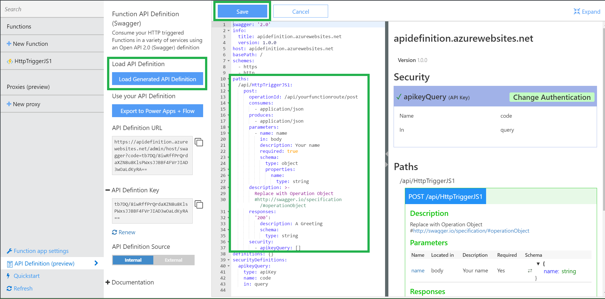
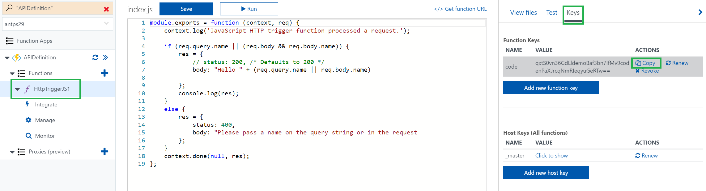
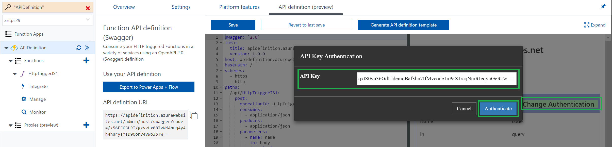
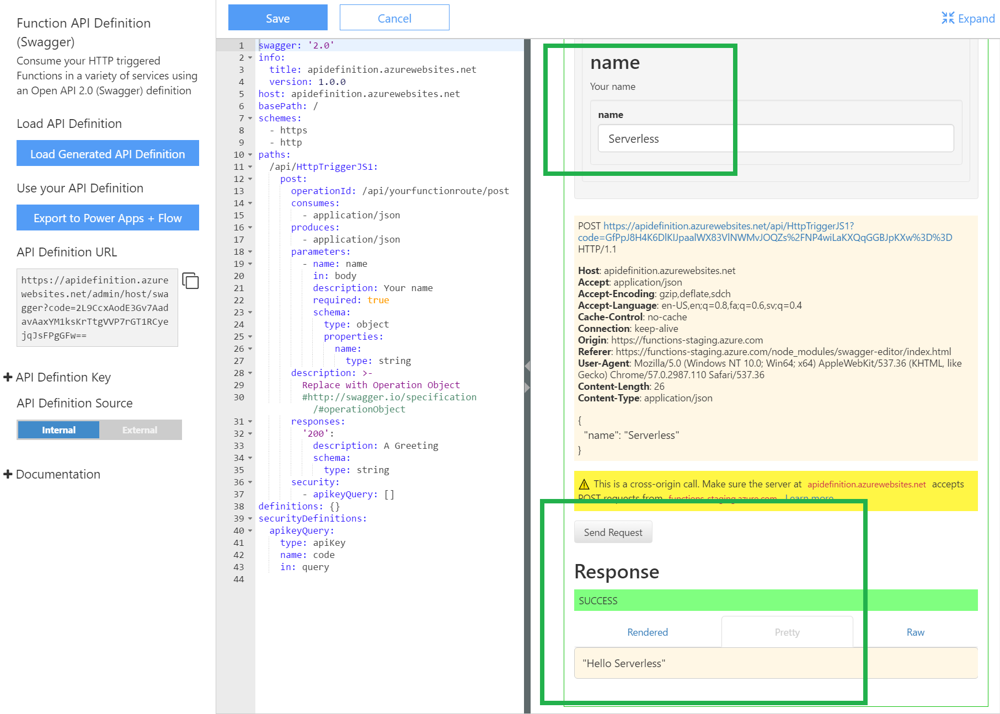

# Creating OpenAPI 2.0 (Swagger) Metadata for a Function App (Preview)

This document guides you through the step by step process of creating an OpenAPI Definition for a simple API hosted on Azure Functions.

[!INCLUDE [intro](../../includes/functions-bindings-intro.md)]

### What is OpenAPI (Swagger)?
[Swagger Metadata](http://swagger.io/) is a file that defines the functionality and operating modes of your API, and allows a function hosting a REST API to be consumed by a wide variety of other software. Microsoft offerings like PowerApps and [API Apps](https://docs.microsoft.com/azure/app-service-api/app-service-api-dotnet-get-started#a-idcodegena-generate-client-code-for-the-data-tier), as well as 3rd party developer tooling like [Postman](https://www.getpostman.com/docs/importing_swagger) and [many more packages](http://swagger.io/tools/) all allow your API to be consumed with a Swagger definition.

## <a name="prepare-function"></a>Creating a Function with a simple API
  To create an OpenAPI definition, we first need to create a Function with a simple API. If you already have an API hosted on a Function App, you can skip straight to the next section
1. Create a new Function App.
  1. [Azure portal](https://portal.azure.com) > `+ New` > Search for "Function App"
1. Create a new HTTP trigger function inside your new Function App
  1. Your function is pre-populated with code defining a very simple REST API.
  1. Any string passed to the Function as a query parameter or in the body is returned as "Hello {input}"
1. Go to the `Integrate` tab of your new HTTP Trigger function
  1. Toggle `Allowed HTTP methods` to `Selected methods`
  1. In `Selected HTTP methods` uncheck every verb except POST.
    
  1. This step will simplify your API definition later on.

## <a name="enable"></a>Enabling API Definition Support
1. Navigate to `your function name` > `API Definition (preview)`
1. Set `API Definition Source` to `Function`
  1. This step enables a suite of OpenAPI options for your Function App, including an endpoint to host an OpenAPI file from your Function App's domain, an inline copy of the [OpenAPI Editor](http://editor.swagger.io), and a quickstart definition generator.


## <a name="create-definition"></a>Creating your API Definition from a template
1. Click `Generate API Definition template`
  1. This step scans your Function App for HTTP Trigger functions and uses the info in functions.json to generate an OpenAPI document.
2. Add an operation object to `paths: /api/yourfunctionroute post:`
  1. The quickstart OpenAPI document is an outline of a full OpenAPI doc. It requires more metadata to be a full OpenAPI definition, such as operation objects and response templates.
  1. The sample operation object below has a filled out produces/consumes section, a parameter object, and a response object.
  
  ```yaml
      post:
        operationId: /api/yourfunctionroute/post
        consumes: [application/json]
        produces: [application/json]
        parameters:
          - name: name
            in: body
            description: Your name
            x-ms-summary: Your name
            required: true
            schema:
              type: object
              properties:
                name:
                  type: string
        description: >-
          Replace with Operation Object
          #http://swagger.io/specification/#operationObject
        responses:
          '200':
            description: A Greeting
            x-ms-summary: Your name
            schema:
              type: string
        security:
          - apikeyQuery: []
  ```

> [!NOTE]
>  x-ms-summary provides a display name in Logic Apps, Flow, and PowerApps.
>
> Check out [customize your Swagger definition for PowerApps](https://powerapps.microsoft.com/tutorials/customapi-how-to-swagger/) to learn more.

3. Click `save` to save your changes


## <a name="use-definition"></a>Using Your API Definition
1. Copy your `API definition URL` and paste it into a new browser tab to view your raw OpenAPI document.
1. You can import your OpenAPI document to any number of tools for testing and integration using that URL.
  1. Many Azure resources are able to automatically import your OpenAPI doc using the API Definition URL that is saved in your Function application settings. As a part of the `Function` API definition source, we update that url for you.


## <a name="test-definition"></a>Using the Swagger UI to test your API definition
There are testing tools built in to the UI view of the imbedded API definition editor. Add your API key, and then use the `Try this operation` button under each method. The tool will use your API Definition to format the requests and successful responses will indicate that your definition is correct.

### Steps:

1. Copy your function API key
  1. The API key can be found in your HTTP Trigger Function under `function name` > `Keys` > `Function Keys`
  
1. Navigate to the `API Definition (preview)` page.
  1. Click `Authenticate` and add your Function API key to the security object at the top.
  
1. select `/api/yourfunctionroute` > `POST`
1. Click `Try it out` and enter a name to test
1. You should see a SUCCESS result under `Pretty`


## Next steps
* [OpenAPI Definition in Functions Overview](functions-api-definition.md)
  * Read the full documentation for more info on OpenAPI support.
* [Azure Functions developer reference](functions-reference.md)  
  * Programmer reference for coding functions and defining triggers and bindings.
* [Azure Functions GitHub repository](https://github.com/Azure/Azure-Functions/)
  * Check out the Functions GitHub to give us feedback on the API definition support preview! Make a GitHub issue for anything you'd like to see updated.
