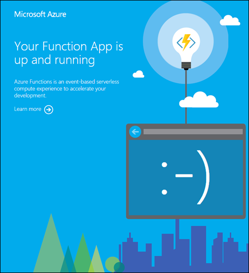

# App settings reference for Azure Functions

App settings in a function app contain global configuration options that affect all functions for that function app. When you run locally, these settings are accessed as local [environment variables](functions-run-local.md#local-settings-file). This article lists the app settings that are available in function apps.

[!INCLUDE [Function app settings](../../includes/functions-app-settings.md)]

There are other global configuration options in the [host.json](functions-host-json.md) file and in the [local.settings.json](functions-run-local.md#local-settings-file) file.

## APPINSIGHTS_INSTRUMENTATIONKEY

The Application Insights instrumentation key if you're using Application Insights. See [Monitor Azure Functions](functions-monitoring.md).

|Key|Sample value|
|---|------------|
|APPINSIGHTS_INSTRUMENTATIONKEY|5dbdd5e9-af77-484b-9032-64f83bb83bb|

## AZURE_FUNCTIONS_ENVIRONMENT

In version 2.x of the Functions runtime, configures app behavior based on the runtime environment. This value is [read during initialization](https://github.com/Azure/azure-functions-host/blob/dev/src/WebJobs.Script.WebHost/Program.cs#L43). You can set `AZURE_FUNCTIONS_ENVIRONMENT` to any value, but [three values](/dotnet/api/microsoft.aspnetcore.hosting.environmentname) are supported: [Development](/dotnet/api/microsoft.aspnetcore.hosting.environmentname.development), [Staging](/dotnet/api/microsoft.aspnetcore.hosting.environmentname.staging), and [Production](/dotnet/api/microsoft.aspnetcore.hosting.environmentname.production). When `AZURE_FUNCTIONS_ENVIRONMENT` isn't set, it defaults to `Production`. This setting should be used instead of `ASPNETCORE_ENVIRONMENT` to set the runtime environment. 

## AzureWebJobsDashboard

Optional storage account connection string for storing logs and displaying them in the **Monitor** tab in the portal. The storage account must be a general-purpose one that supports blobs, queues, and tables. See [Storage account](functions-infrastructure-as-code.md#storage-account) and [Storage account requirements](functions-create-function-app-portal.md#storage-account-requirements).

|Key|Sample value|
|---|------------|
|AzureWebJobsDashboard|DefaultEndpointsProtocol=https;AccountName=[name];AccountKey=[key]|

> [!TIP]
> For performance and experience, it is recommended to use APPINSIGHTS_INSTRUMENTATIONKEY and App Insights for monitoring instead of AzureWebJobsDashboard

## AzureWebJobsDisableHomepage

`true` means disable the default landing page that is shown for the root URL of a function app. Default is `false`.

|Key|Sample value|
|---|------------|
|AzureWebJobsDisableHomepage|true|

When this app setting is omitted or set to `false`, a page similar to the following example is displayed in response to the URL `<functionappname>.azurewebsites.net`.



## AzureWebJobsDotNetReleaseCompilation

`true` means use Release mode when compiling .NET code; `false` means use Debug mode. Default is `true`.

|Key|Sample value|
|---|------------|
|AzureWebJobsDotNetReleaseCompilation|true|

## AzureWebJobsFeatureFlags

A comma-delimited list of beta features to enable. Beta features enabled by these flags are not production ready, but can be enabled for experimental use before they go live.

|Key|Sample value|
|---|------------|
|AzureWebJobsFeatureFlags|feature1,feature2|

## AzureWebJobsSecretStorageType

Specifies the repository or provider to use for key storage. Currently, the supported repositories are blob storage ("Blob") and the local file system ("Files"). The default is blob in version 2 and file system in version 1.

|Key|Sample value|
|---|------------|
|AzureWebJobsSecretStorageType|Files|

## AzureWebJobsStorage

The Azure Functions runtime uses this storage account connection string for all functions except for HTTP triggered functions. The storage account must be a general-purpose one that supports blobs, queues, and tables. See [Storage account](functions-infrastructure-as-code.md#storage-account) and [Storage account requirements](functions-create-function-app-portal.md#storage-account-requirements).

|Key|Sample value|
|---|------------|
|AzureWebJobsStorage|DefaultEndpointsProtocol=https;AccountName=[name];AccountKey=[key]|

## AzureWebJobs_TypeScriptPath

Path to the compiler used for TypeScript. Allows you to override the default if you need to.

|Key|Sample value|
|---|------------|
|AzureWebJobs_TypeScriptPath|%HOME%\typescript|

## FUNCTION\_APP\_EDIT\_MODE

Dictates whether editing in the Azure portal is enabled. Valid values are "readwrite" and "readonly".

|Key|Sample value|
|---|------------|
|FUNCTION\_APP\_EDIT\_MODE|readonly|

## FUNCTIONS\_EXTENSION\_VERSION

The version of the Functions runtime to use in this function app. A tilde with major version means use the latest version of that major version (for example, "~2"). When new versions for the same major version are available, they are automatically installed in the function app. To pin the app to a specific version, use the full version number (for example, "2.0.12345"). Default is "~2". A value of `~1` pins your app to version 1.x of the runtime.

|Key|Sample value|
|---|------------|
|FUNCTIONS\_EXTENSION\_VERSION|~2|

## FUNCTIONS\_WORKER\_RUNTIME

The language worker runtime to load in the function app.  This will correspond to the language being used in your application (for example, "dotnet"). For functions in multiple languages you will need to publish them to multiple apps, each with a corresponding worker runtime value.  Valid values are `dotnet` (C#/F#), `node` (JavaScript/TypeScript), `java` (Java), `powershell` (PowerShell), and `python` (Python).

|Key|Sample value|
|---|------------|
|FUNCTIONS\_WORKER\_RUNTIME|dotnet|

## WEBSITE_CONTENTAZUREFILECONNECTIONSTRING

For consumption plans only. Connection string for storage account where the function app code and configuration are stored. See [Create a function app](functions-infrastructure-as-code.md#create-a-function-app).

|Key|Sample value|
|---|------------|
|WEBSITE_CONTENTAZUREFILECONNECTIONSTRING|DefaultEndpointsProtocol=https;AccountName=[name];AccountKey=[key]|

## WEBSITE\_CONTENTSHARE

For consumption plans only. The file path to the function app code and configuration. Used with WEBSITE_CONTENTAZUREFILECONNECTIONSTRING. Default is a unique string that begins with the function app name. See [Create a function app](functions-infrastructure-as-code.md#create-a-function-app).

|Key|Sample value|
|---|------------|
|WEBSITE_CONTENTSHARE|functionapp091999e2|

## WEBSITE\_MAX\_DYNAMIC\_APPLICATION\_SCALE\_OUT

The maximum number of instances that the function app can scale out to. Default is no limit.

> [!NOTE]
> This setting is a preview feature - and only reliable if set to a value <= 5

|Key|Sample value|
|---|------------|
|WEBSITE\_MAX\_DYNAMIC\_APPLICATION\_SCALE\_OUT|5|

## WEBSITE\_NODE\_DEFAULT_VERSION

Default is "8.11.1".

|Key|Sample value|
|---|------------|
|WEBSITE\_NODE\_DEFAULT_VERSION|8.11.1|

## WEBSITE\_RUN\_FROM\_PACKAGE

Enables your function app to run from a mounted package file.

|Key|Sample value|
|---|------------|
|WEBSITE\_RUN\_FROM\_PACKAGE|1|

Valid values are either a URL that resolves to the location of a deployment package file, or `1`. When set to `1`, the package must be in the `d:\home\data\SitePackages` folder. When using zip deployment with this setting, the package is automatically uploaded to this location. In preview, this setting was named `WEBSITE_RUN_FROM_ZIP`. For more information, see [Run your functions from a package file](run-functions-from-deployment-package.md).

## AZURE_FUNCTION_PROXY_DISABLE_LOCAL_CALL

By default Functions proxies will utilize a shortcut to send API calls from proxies directly to functions in the same Function App, rather than creating a new HTTP request. This setting allows you to disable that behavior.

|Key|Value|Description|
|-|-|-|
|AZURE_FUNCTION_PROXY_DISABLE_LOCAL_CALL|true|Calls with a backend url pointing to a function in the local Function App will no longer be sent directly to the function, and will instead be directed back to the HTTP front end for the Function App|
|AZURE_FUNCTION_PROXY_DISABLE_LOCAL_CALL|false|This is the default value. Calls with a  backend url pointing to a function in the local Function App will be forwarded directly to that Function|


## AZURE_FUNCTION_PROXY_BACKEND_URL_DECODE_SLASHES

This setting controls whether %2F is decoded as slashes in route parameters when they are inserted into the backend URL. 

|Key|Value|Description|
|-|-|-|
|AZURE_FUNCTION_PROXY_BACKEND_URL_DECODE_SLASHES|true|Route parameters with encoded slashes will have them decoded. `example.com/api%2ftest` will become `example.com/api/test`|
|AZURE_FUNCTION_PROXY_BACKEND_URL_DECODE_SLASHES|false|This is the default behavior. All route parameters will be passed along unchanged|

### Example

Here is an example proxies.json in a function app at the URL myfunction.com

```JSON
{
    "$schema": "http://json.schemastore.org/proxies",
    "proxies": {
        "root": {
            "matchCondition": {
                "route": "/{*all}"
            },
            "backendUri": "example.com/{all}"
        }
    }
}
```
|URL Decoding|Input|Output|
|-|-|-|
|true|myfunction.com/test%2fapi|example.com/test/api
|false|myfunction.com/test%2fapi|example.com/test%2fapi|


## Next steps

[Learn how to update app settings](functions-how-to-use-azure-function-app-settings.md#settings)

[See global settings in the host.json file](functions-host-json.md)

[See other app settings for App Service apps](https://github.com/projectkudu/kudu/wiki/Configurable-settings)
