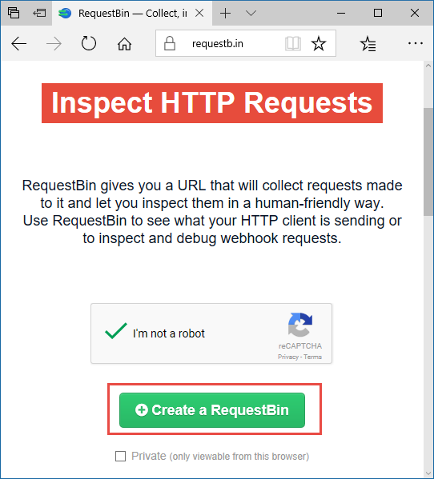
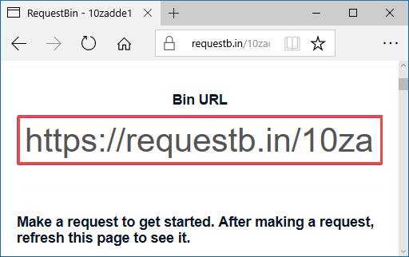

# Event Grid trigger for Azure Functions

This article explains how to handle [Event Grid](../event-grid/overview.md) events in Azure Functions.

Event Grid is an Azure service that sends HTTP requests to notify you about events that happen in *publishers*. A publisher is the service or resource that originates the event. For example, an Azure blob storage account is a publisher, and a blob upload or deletion is an event. Some [Azure services have built-in support for publishing events to Event Grid](../event-grid/overview.md#event-publishers). 

Event *handlers* receive and process events. Azure Functions is one of several [Azure services that have built-in support for handling Event Grid events](../event-grid/overview.md#event-handlers). To handle Event Grid events in a function, you create a subscription that specifies which events you're handling and the endpoint that Event Grid should send them to. This article explains how to use an Event Grid trigger or an HTTP trigger to invoke a function when an event is received from Event Grid. To understand why you might choose to use an HTTP trigger, see [Use an HTTP trigger as an Event Grid trigger](#use-an-http-trigger-as-an-event-grid-trigger) later in this article.

[!INCLUDE [intro](../../includes/functions-bindings-intro.md)]

## Example

See the language-specific example for an Event Grid trigger:

* [C#](#c-example)
* [C# script (.csx)](#c-script-example)
* [JavaScript](#javascript-example)

 For an HTTP trigger example, see [How to use HTTP trigger](#use-an-http-trigger-as-an-event-grid-trigger) later in this article.

### C# example

The following example shows a [C# function](functions-dotnet-class-library.md) that logs some of the fields common to all events and all of the event-specific data.

```cs
[FunctionName("EventGridTest")]
public static void Run([EventGridTrigger] EventGridEvent myEvent, TraceWriter log)
{
    log.Info("C# Event Grid function processed a request.");
    log.Info($"Subject: {myEvent.Subject}");
    log.Info($"Time: {myEvent.EventTime}");
    log.Info($"Data: {myEvent.Data.ToString()}");
}
```

### C# script example

The following example shows a trigger binding in a *function.json* file and a [C# script function](functions-reference-csharp.md) that uses the binding. The function logs some of the fields common to all events and all of the event-specific data.

Here's the binding data in the *function.json* file:

```json
{
  "bindings": [
    {
      "type": "eventGridTrigger",
      "name": "eventGridEvent",
      "direction": "in"
    }
  ],
  "disabled": false
}
```

Here's the C# script code:

```csharp
#r "Newtonsoft.Json"
#r "Microsoft.Azure.WebJobs.Extensions.EventGrid"
using Microsoft.Azure.WebJobs.Extensions.EventGrid;

public static void Run(EventGridEvent eventGridEvent, TraceWriter log)
{
    log.Info("C# Event Grid function processed a request.");
    log.Info($"Subject: {eventGridEvent.Subject}");
    log.Info($"Time: {eventGridEvent.EventTime}");
    log.Info($"Data: {eventGridEvent.Data.ToString()}");
}
```

### JavaScript example

The following example shows a trigger binding in a *function.json* file and a [JavaScript function](functions-reference-node.md) that uses the binding. The function logs some of the fields common to all events and all of the event-specific data.

Here's the binding data in the *function.json* file:

```json
{
  "bindings": [
    {
      "type": "eventGridTrigger",
      "name": "eventGridEvent",
      "direction": "in"
    }
  ],
  "disabled": false
}
```

Here's the JavaScript code:

```javascript
module.exports = function (context, eventGridEvent) {
    context.log("JavaScript Event Grid function processed a request.");
    context.log("Subject: " + eventGridEvent.subject);
    context.log("Time: " + eventGridEvent.eventTime);
    context.log("Data: " + JSON.stringify(eventGridEvent.data));
    context.done();
};
```
     
## Attributes

In [C# class libraries](functions-dotnet-class-library.md), use the [EventGridTrigger](https://github.com/Azure/azure-functions-eventgrid-extension/blob/master/src/EventGridExtension/EventGridTriggerAttribute.cs) attribute, defined in NuGet package [Microsoft.Azure.WebJobs.Extensions.EventGrid](https://www.nuget.org/packages/Microsoft.Azure.WebJobs.Extensions.EventGrid).

Here's an `EventGridTrigger` attribute in a method signature:

```csharp
[FunctionName("EventGridTest")]
public static void Run([EventGridTrigger] EventGridEvent myEvent, TraceWriter log)
{
    ...
}
 ```

For a complete example, see [C# example](#c-example).

## Configuration

The following table explains the binding configuration properties that you set in the *function.json* file. There are no constructor parameters or properties to set in the `EventGridTrigger` attribute.

|function.json property |Description|
|---------|---------|----------------------|
| **type** | Required - must be set to `eventGridTrigger`. |
| **direction** | Required - must be set to `in`. |
| **name** | Required - the variable name used in function code for the parameter that receives the event data. |

## Usage

For C# and F# functions, declare the type of your trigger input to be `EventGridEvent` or a custom type. For a custom type, the Functions runtime tries to parse the event JSON to set the object properties.

For JavaScript functions, the parameter named by the *function.json* `name` property has a reference to the event object.

## Manage subscriptions

To subscribe to an Event Grid topic, you need the endpoint URL that Event Grid should send HTTP requests to.

For functions that use the HTTP trigger to handle the Event Grid events, see the [HTTP trigger binding reference documentation](functions-bindings-http-webhook.md) for information about the URL to use for invoking the function.

### Azure portal - Event Grid trigger

For functions that you develop in the portal with the Event Grid trigger, the portal provides a link to create an Event Grid subscription.


When you select this link, the portal opens the **Create Event Subscription** page with the subscription endpoint URL prefilled.

For more information about how to create subscriptions by using the Azure portal, see [Create custom event - Azure portal](../event-grid/custom-event-quickstart-portal.md) in the Event Grid documentation.

### Azure CLI - Event Grid trigger

IF you use the Azure CLI to create a subscription for an Event Grid trigger, you need to obtain a *system key*. The system key is an authorization key that has to be included in the endpoint URL, as shown here at the end of the URL:

```
https://{functionappname}.azurewebsites.net/admin/extensions/EventGridExtensionConfig?functionName={functionname}&code={systemkey}
```

You can get the system key by using the following API (HTTP GET):

```
http://{functionappname}.azurewebsites.net/admin/host/systemkeys/eventgridextensionconfig_extension?code={youradminkey}
```

The response is JSON:

```
{
  "name":"eventgridextensionconfig_extension",
  "value":"{the system key for the function}",
  "links":
    [{
      "rel":"self",
      "href":"{the URL for the function, without the system key}"
    }]
}
```

Your admin key lets you call this admin API to get the system key. Don't confuse the system key (for invoking an Event Grid trigger function ) with the admin key (for performing administrative tasks on the function app). When you subscribe to an Event Grid topic, be sure to use the system key. For more information about authorization keys, see [Authorization keys](functions-bindings-http-webhook.md#authorization-keys) in the HTTP trigger reference article. 

Alternatively, you can send an HTTP PUT to specify the key value yourself.

### Azure CLI - create subscription

to create a subscription, use the [az eventgrid event-subscription create](https://docs.microsoft.com/cli/azure/eventgrid/event-subscription?view=azure-cli-latest#az_eventgrid_event_subscription_create) command.

Here's an example that subscribes to a blob storage account (with a placeholder for the system key):

```azurecli
az eventgrid resource event-subscription create -g myResourceGroup \
--provider-namespace Microsoft.Storage --resource-type storageAccounts \
--resource-name glengablobstorage --name myFuncSub  \
--included-event-types Microsoft.Storage.BlobCreated \
--subject-begins-with /blobServices/default/containers/images/blobs/ \
--endpoint https://glengastorageevents.azurewebsites.net/admin/extensions/EventGridExtensionConfig?functionName=imageresizefunc&code={systemkey}
```

For more information about how to create a subscription, see [the blob storage quickstart](../storage/blobs/storage-blob-event-quickstart.md#subscribe-to-your-blob-storage-account) or the other Event Grid quickstarts.

You can use the same subscription for testing and production by updating the endpoint. Use the [az eventgrid event-subscription update](https://docs.microsoft.com/cli/azure/eventgrid/event-subscription?view=azure-cli-latest#az_eventgrid_event_subscription_update) command.

## Event schema

Data for an Event Grid event is received as a JSON object in the body of an HTTP request. The JSON looks similar to the following example:

```json
[{
  "topic": "/subscriptions/{subscriptionid}/resourceGroups/eg0122/providers/Microsoft.Storage/storageAccounts/egblobstore",
  "subject": "/blobServices/default/containers/{containername}/blobs/blobname.jpg",
  "eventType": "Microsoft.Storage.BlobCreated",
  "eventTime": "2018-01-23T17:02:19.6069787Z",
  "id": "{guid}",
  "data": {
    "api": "PutBlockList",
    "clientRequestId": "{guid}",
    "requestId": "{guid}",
    "eTag": "0x8D562831044DDD0",
    "contentType": "application/octet-stream",
    "contentLength": 2248,
    "blobType": "BlockBlob",
    "url": "https://egblobstore.blob.core.windows.net/{containername}/blobname.jpg",
    "sequencer": "000000000000272D000000000003D60F",
    "storageDiagnostics": {
      "batchId": "{guid}"
    }
  },
  "dataVersion": "",
  "metadataVersion": "1"
}]
```

The example shown is an array of one element. Event Grid always sends an array and may send more than one event in the array. The runtime invokes your function once for each array element.

The top-level properties in the event JSON data are the same among all event types, while the contents of the `data` property are specific to each event type. The example shown is for a blob storage event.

For explanations of the common and event-specific properties, see [Event properties](../event-grid/event-schema.md#event-properties) in the Event Grid documentation.

The `EventGridEvent` type defines only the top-level properties; the `Data` property is a `JObject`. 

## Use an HTTP trigger as an Event Grid trigger

Event Grid events are received as HTTP requests, and the Event Grid trigger is an HTTP trigger that does some additional processing before invoking a function. You can also handle events by using an HTTP trigger instead of an Event Grid trigger.

One advantage of using an HTTP trigger is that you can test locally. You also have more control over the endpoint URL that invokes the function, and it's easier to get the authorization keys that need to be included in the URL. If you use an HTTP trigger function for local testing, you can use the same function in production and you have no need to use an Event Grid trigger. The Event Grid trigger is the better choice if you are doing development in the Azure portal and you manage your Event Grid subscriptions in the portal and you have no need for local testing.

If you use an HTTP trigger, you have to write code for what the Event Grid trigger does automatically. The Event Grid trigger acts on an Event Grid HTTP request in the following ways:

* **Sends a validation response to a subscription validation request.** When you create an Event Grid subscription, it sends a validation request to the subscribed endpoint. Event Grid sends events to that endpoint only after it receives a response to the validation request. The response must echo back a validation code contained in the request body.
* **Invokes the function once per element of the event array contained in the request body.**

The following C# code for an HTTP trigger simulates Event Grid trigger behavior:

```csharp
[FunctionName("HttpTrigger")]
public static async Task<HttpResponseMessage> Run(
    [HttpTrigger(AuthorizationLevel.Anonymous, "post")]HttpRequestMessage req,
    TraceWriter log)
{
    log.Info("C# HTTP trigger function processed a request.");

    var messages = await req.Content.ReadAsAsync<JArray>();

    // If the request is for subscription validation, send back the validation code.
    if (messages.Count > 0 && string.Equals((string)messages[0]["eventType"], 
        "Microsoft.EventGrid.SubscriptionValidationEvent", 
        System.StringComparison.OrdinalIgnoreCase))
    {
        log.Info("Validate request received");
        return req.CreateResponse<object>(new
        {
            validationResponse = messages[0]["data"]["validationCode"]
        });
    }

    // The request is not for subscription validation, so it's for one or more events.
    foreach (JObject message in messages)
    {
        // Handle one event.
        EventGridEvent eventGridEvent = message.ToObject<EventGridEvent>();
        log.Info($"Subject: {eventGridEvent.Subject}");
        log.Info($"Time: {eventGridEvent.EventTime}");
        log.Info($"Event data: {eventGridEvent.Data.ToString()}");
    }

    return req.CreateResponse(HttpStatusCode.OK);
}
```

The following JavaScript code for an HTTP trigger simulates Event Grid trigger behavior:

```javascript
module.exports = function (context, req) {
    context.log('JavaScript HTTP trigger function processed a request.');

    var messages = req.body;
    // If the request is for subscription validation, send back the validation code.
    if (messages.length > 0 && messages[0].eventType == "Microsoft.EventGrid.SubscriptionValidationEvent") {
        context.log('Validate request received');
        context.res = { status: 200, body: messages[0].data.validationCode }
    }
    else {
        // The request is not for subscription validation, so it's for one or more events.
        for (var i = 0; i < messages.length; i++) {
            // Handle one event.
            var message = messages[i];
            context.log('Subject: ' + message.subject);
            context.log('Time: ' + message.eventTime);
            context.log('Data: ' + JSON.stringify(message.data));
        }
    }
    context.done();
};
```

Inside the loop through the `messages` array is where your event-handling code goes. The following sections explain how you can test your event-handling code locally.

## Local testing

You can't test an Event Grid trigger locally for these reasons:

* The runtime doesn't provide a URL to use for invoking the function.
* Event Grid topics in Azure can't send HTTP requests to localhost on your development machine.

You can test locally with an [HTTP trigger that handles Event Grid events](#use-an-http-trigger-as-an-event-grid-trigger). Here's how:

2. [Create a RequestBin endpoint](#create-a-RequestBin-endpoint).
3. [Create an Event Grid subscription](#create-an-event-grid-subscription) that sends events to the RequestBin endpoint.
4. [Generate a request](#generate-a-request) and copy the request body from the RequestBin site.
5. [Manually post the request](#manually-post-the-request) to the localhost URL of your HTTP trigger function.

When local testing is complete, delete the subscription you created for it.

### Create a RequestBin endpoint

RequestBin is an open-source tool that accepts HTTP requests and shows you the request body. The http://requestb.in URL gets special treatment by Azure Event Grid. To facilitate testing, Event Grid sends events to the RequestBin URL without requiring a correct response to subscription validation requests. Two other testing tools are given the same treatment: http://webhookinbox.com and http://hookbin.com.

RequestBin is not intended for high throughput usage. If you push more than one event at a time, you might not see all of your events in the tool.

Create an endpoint.



Copy the endpoint URL.



### Create an Event Grid subscription

Create an Event Grid subscription of the type you want to test, and give it your RequestBin endpoint. For information about how to create a subscription, see [Manage subscriptions](#manage-subscriptions) earlier in this article.

### Generate a request

Trigger an event that will generate HTTP traffic to your RequestBin endpoint.  For example, if you created a blob storage subscription, upload or delete a blob. When a request shows up in your RequestBin page, copy the request body.

The subscription validation request will be received first; ignore any validation requests, and copy the event request.


### Manually post the request

Run your HTTP function locally, and the runtime gives you the URL to use for invoking the function. 

Use a tool such as [Postman](https://www.getpostman.com/) or [curl](https://curl.haxx.se/docs/httpscripting.html) to create an HTTP POST request:

* Set a `Content-Type: application/json` header.
* Paste into the request body the data from RequestBin. 
* Post to the URL of your HTTP function. 

The following screenshot shows the localhost URL and request body in Postman:


Now the event handling code in the HTTP function processes the same data that it gets when it runs in Azure.

When you're done testing, you can use the same subscription for production by updating the endpoint. Use the [az eventgrid event-subscription update](https://docs.microsoft.com/cli/azure/eventgrid/event-subscription?view=azure-cli-latest#az_eventgrid_event_subscription_update) Azure CLI command.

## Next steps

> [!div class="nextstepaction"]
> [Learn more about Azure functions triggers and bindings](functions-triggers-bindings.md)

> [!div class="nextstepaction"]
> [Learn more about Event Grid](../event-grid/overview.md)