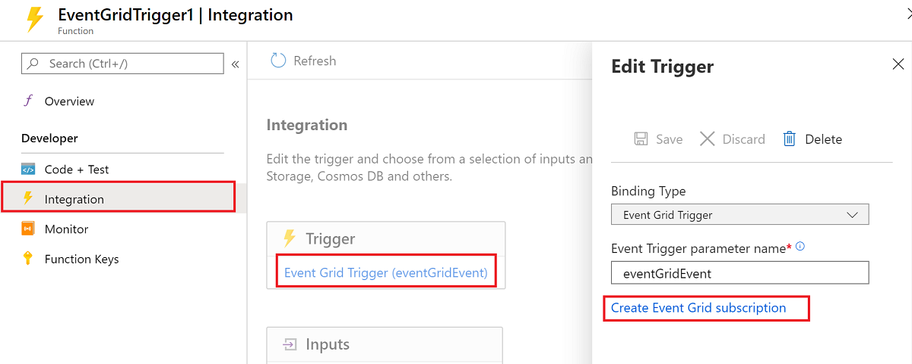
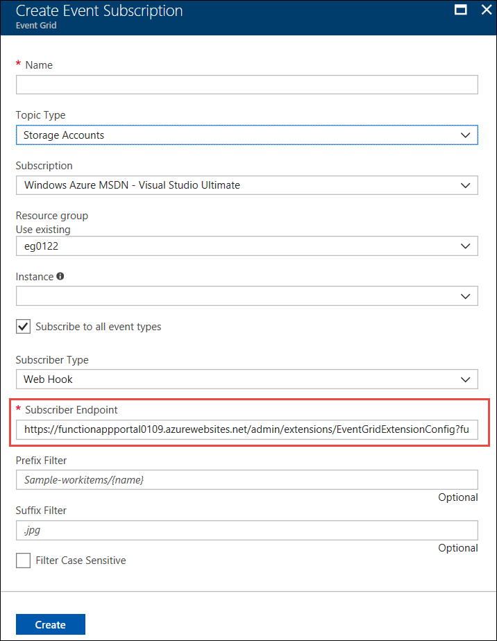

# Event Grid trigger for Azure Functions

This article explains how to handle [Event Grid](../event-grid/overview.md) events in Azure Functions. For details on how to handle Event Grid messages in an HTTP end point, read [Receive events to an HTTP endpoint](../event-grid/receive-events.md).

Event Grid is an Azure service that sends HTTP requests to notify you about events that happen in *publishers*. A publisher is the service or resource that originates the event. For example, an Azure blob storage account is a publisher, and [a blob upload or deletion is an event](../storage/blobs/storage-blob-event-overview.md). Some [Azure services have built-in support for publishing events to Event Grid](../event-grid/overview.md#event-sources).

Event *handlers* receive and process events. Azure Functions is one of several [Azure services that have built-in support for handling Event Grid events](../event-grid/overview.md#event-handlers). In this article, you learn how to use an Event Grid trigger to invoke a function when an event is received from Event Grid.

If you prefer, you can use an HTTP trigger to handle Event Grid Events; see [Receive events to an HTTP endpoint](../event-grid/receive-events.md). Currently, you can't use an Event Grid trigger for an Azure Functions app when the event is delivered in the [CloudEvents schema](../event-grid/cloudevents-schema.md#azure-functions). Instead, use an HTTP trigger.

[!INCLUDE [intro](../../includes/functions-bindings-intro.md)]

## Packages - Functions 2.x and higher

The Event Grid trigger is provided in the [Microsoft.Azure.WebJobs.Extensions.EventGrid](https://www.nuget.org/packages/Microsoft.Azure.WebJobs.Extensions.EventGrid) NuGet package, version 2.x. Source code for the package is in the [azure-functions-eventgrid-extension](https://github.com/Azure/azure-functions-eventgrid-extension/tree/v2.x) GitHub repository.

[!INCLUDE [functions-package-v2](../../includes/functions-package-v2.md)]

## Packages - Functions 1.x

The Event Grid trigger is provided in the [Microsoft.Azure.WebJobs.Extensions.EventGrid](https://www.nuget.org/packages/Microsoft.Azure.WebJobs.Extensions.EventGrid) NuGet package, version 1.x. Source code for the package is in the [azure-functions-eventgrid-extension](https://github.com/Azure/azure-functions-eventgrid-extension/tree/master) GitHub repository.

[!INCLUDE [functions-package](../../includes/functions-package.md)]

## Example

# [C#](#tab/csharp)

For an HTTP trigger example, see [Receive events to an HTTP endpoint](../event-grid/receive-events.md).

### C# (2.x and higher)

The following example shows a [C# function](functions-dotnet-class-library.md) that binds to `EventGridEvent`:

```cs
using Microsoft.Azure.EventGrid.Models;
using Microsoft.Azure.WebJobs;
using Microsoft.Azure.WebJobs.Extensions.EventGrid;
using Microsoft.Azure.WebJobs.Host;
using Microsoft.Extensions.Logging;

namespace Company.Function
{
    public static class EventGridTriggerCSharp
    {
        [FunctionName("EventGridTest")]
        public static void EventGridTest([EventGridTrigger]EventGridEvent eventGridEvent, ILogger log)
        {
            log.LogInformation(eventGridEvent.Data.ToString());
        }
    }
}
```

For more information, see Packages, [Attributes](#attributes), [Configuration](#configuration), and [Usage](#usage).

### Version 1.x

The following example shows a Functions 1.x [C# function](functions-dotnet-class-library.md) that binds to `JObject`:

```cs
using Microsoft.Azure.WebJobs;
using Microsoft.Azure.WebJobs.Extensions.EventGrid;
using Microsoft.Azure.WebJobs.Host;
using Newtonsoft.Json;
using Newtonsoft.Json.Linq;
using Microsoft.Extensions.Logging;

namespace Company.Function
{
    public static class EventGridTriggerCSharp
    {
        [FunctionName("EventGridTriggerCSharp")]
        public static void Run([EventGridTrigger]JObject eventGridEvent, ILogger log)
        {
            log.LogInformation(eventGridEvent.ToString(Formatting.Indented));
        }
    }
}
```

# [C# Script](#tab/csharp-script)

The following example shows a trigger binding in a *function.json* file and a [C# script function](functions-reference-csharp.md) that uses the binding.

Here's the binding data in the *function.json* file:

```json
{
  "bindings": [
    {
      "type": "eventGridTrigger",
      "name": "eventGridEvent",
      "direction": "in"
    }
  ],
  "disabled": false
}
```

#### C# script (Version 2.x and higher)

Here's an example that binds to `EventGridEvent`:

```csharp
#r "Microsoft.Azure.EventGrid"
using Microsoft.Azure.EventGrid.Models;
using Microsoft.Extensions.Logging;

public static void Run(EventGridEvent eventGridEvent, ILogger log)
{
    log.LogInformation(eventGridEvent.Data.ToString());
}
```

For more information, see Packages, [Attributes](#attributes), [Configuration](#configuration), and [Usage](#usage).

### Version 1.x

Here's Functions 1.x C# script code that binds to `JObject`:

```cs
#r "Newtonsoft.Json"

using Newtonsoft.Json;
using Newtonsoft.Json.Linq;

public static void Run(JObject eventGridEvent, TraceWriter log)
{
    log.Info(eventGridEvent.ToString(Formatting.Indented));
}
```

# [JavaScript](#tab/javascript)

The following example shows a trigger binding in a *function.json* file and a [JavaScript function](functions-reference-node.md) that uses the binding.

Here's the binding data in the *function.json* file:

```json
{
  "bindings": [
    {
      "type": "eventGridTrigger",
      "name": "eventGridEvent",
      "direction": "in"
    }
  ],
  "disabled": false
}
```

Here's the JavaScript code:

```javascript
module.exports = function (context, eventGridEvent) {
    context.log("JavaScript Event Grid function processed a request.");
    context.log("Subject: " + eventGridEvent.subject);
    context.log("Time: " + eventGridEvent.eventTime);
    context.log("Data: " + JSON.stringify(eventGridEvent.data));
    context.done();
};
```

# [Python](#tab/python)

The following example shows a trigger binding in a *function.json* file and a [Python function](functions-reference-python.md) that uses the binding.

Here's the binding data in the *function.json* file:

```json
{
  "bindings": [
    {
      "type": "eventGridTrigger",
      "name": "event",
      "direction": "in"
    }
  ],
  "disabled": false,
  "scriptFile": "__init__.py"
}
```

Here's the Python code:

```python
import json
import logging

import azure.functions as func

def main(event: func.EventGridEvent):

    result = json.dumps({
        'id': event.id,
        'data': event.get_json(),
        'topic': event.topic,
        'subject': event.subject,
        'event_type': event.event_type,
    })

    logging.info('Python EventGrid trigger processed an event: %s', result)
```

# [Java](#tab/java)

This section contains the following examples:

* [Event Grid trigger, String parameter](#event-grid-trigger-string-parameter)
* [Event Grid trigger, POJO parameter](#event-grid-trigger-pojo-parameter)

The following examples show trigger binding in a *function.json* file and [Java functions](functions-reference-java.md) that use the binding and print out an event, first receiving the event as ```String``` and second as a POJO.

```json
{
  "bindings": [
    {
      "type": "eventGridTrigger",
      "name": "eventGridEvent",
      "direction": "in"
    }
  ]
}
```

### Event Grid trigger, String parameter

```java
  @FunctionName("eventGridMonitorString")
  public void logEvent(
    @EventGridTrigger(
      name = "event"
    ) 
    String content, 
    final ExecutionContext context) {
      context.getLogger().info("Event content: " + content);      
  }
```

### Event Grid trigger, POJO parameter

This example uses the following POJO, representing the top-level properties of an Event Grid event:

```java
import java.util.Date;
import java.util.Map;

public class EventSchema {

  public String topic;
  public String subject;
  public String eventType;
  public Date eventTime;
  public String id;
  public String dataVersion;
  public String metadataVersion;
  public Map<String, Object> data;

}
```

Upon arrival, the event's JSON payload is de-serialized into the ```EventSchema``` POJO for use by the function. This allows the function to access the event's properties in an object-oriented way.

```java
  @FunctionName("eventGridMonitor")
  public void logEvent(
    @EventGridTrigger(
      name = "event"
    ) 
    EventSchema event, 
    final ExecutionContext context) {
      context.getLogger().info("Event content: ");
      context.getLogger().info("Subject: " + event.subject);
      context.getLogger().info("Time: " + event.eventTime); // automatically converted to Date by the runtime
      context.getLogger().info("Id: " + event.id);
      context.getLogger().info("Data: " + event.data);
  }
```

In the [Java functions runtime library](/java/api/overview/azure/functions/runtime), use the `EventGridTrigger` annotation on parameters whose value would come from EventGrid. Parameters with these annotations cause the function to run when an event arrives.  This annotation can be used with native Java types, POJOs, or nullable values using `Optional<T>`.

---

## Attributes

# [C#](#tab/csharp)

In [C# class libraries](functions-dotnet-class-library.md), use the [EventGridTrigger](https://github.com/Azure/azure-functions-eventgrid-extension/blob/master/src/EventGridExtension/TriggerBinding/EventGridTriggerAttribute.cs) attribute.

Here's an `EventGridTrigger` attribute in a method signature:

```csharp
[FunctionName("EventGridTest")]
public static void EventGridTest([EventGridTrigger] JObject eventGridEvent, ILogger log)
{
    ...
}
```

For a complete example, see C# example.

# [C# Script](#tab/csharp-script)

Attributes are not supported by C# Script.

# [JavaScript](#tab/javascript)

Attributes are not supported by JavaScript.

# [Python](#tab/python)

Attributes are not supported by Python.

# [Java](#tab/java)

The [EventGridTrigger](https://github.com/Azure/azure-functions-java-library/blob/master/src/main/java/com/microsoft/azure/functions/annotation/EventGridTrigger.java) annotation allows you to declaratively configure an Event Grid binding by providing configuration values. See the [example](#example) and [configuration](#configuration) sections for more detail.

---

## Configuration

The following table explains the binding configuration properties that you set in the *function.json* file. There are no constructor parameters or properties to set in the `EventGridTrigger` attribute.

|function.json property |Description|
|---------|---------|
| **type** | Required - must be set to `eventGridTrigger`. |
| **direction** | Required - must be set to `in`. |
| **name** | Required - the variable name used in function code for the parameter that receives the event data. |

## Usage

# [C#](#tab/csharp)

In Azure Functions 1.x, you can use the following parameter types for the Event Grid trigger:

* `JObject`
* `string`

In Azure Functions 2.x and higher, you also have the option to use the following parameter type for the Event Grid trigger:

* `Microsoft.Azure.EventGrid.Models.EventGridEvent`- Defines properties for the fields common to all event types.

> [!NOTE]
> In Functions v1 if you try to bind to `Microsoft.Azure.WebJobs.Extensions.EventGrid.EventGridEvent`, the compiler will display a "deprecated" message and advise you to use `Microsoft.Azure.EventGrid.Models.EventGridEvent` instead. To use the newer type, reference the [Microsoft.Azure.EventGrid](https://www.nuget.org/packages/Microsoft.Azure.EventGrid) NuGet package and fully qualify the `EventGridEvent` type name by prefixing it with `Microsoft.Azure.EventGrid.Models`.

# [C# Script](#tab/csharp-script)

In Azure Functions 1.x, you can use the following parameter types for the Event Grid trigger:

* `JObject`
* `string`

In Azure Functions 2.x and higher, you also have the option to use the following parameter type for the Event Grid trigger:

* `Microsoft.Azure.EventGrid.Models.EventGridEvent`- Defines properties for the fields common to all event types.

> [!NOTE]
> In Functions v1 if you try to bind to `Microsoft.Azure.WebJobs.Extensions.EventGrid.EventGridEvent`, the compiler will display a "deprecated" message and advise you to use `Microsoft.Azure.EventGrid.Models.EventGridEvent` instead. To use the newer type, reference the [Microsoft.Azure.EventGrid](https://www.nuget.org/packages/Microsoft.Azure.EventGrid) NuGet package and fully qualify the `EventGridEvent` type name by prefixing it with `Microsoft.Azure.EventGrid.Models`. For information about how to reference NuGet packages in a C# script function, see [Using NuGet packages](functions-reference-csharp.md#using-nuget-packages)

# [JavaScript](#tab/javascript)

The Event Grid instance is available via the parameter configured in the *function.json* file's `name` property.

# [Python](#tab/python)

The Event Grid instance is available via the parameter configured in the *function.json* file's `name` property, typed as `func.EventGridEvent`.

# [Java](#tab/java)

The Event Grid event instance is available via the parameter associated to the `EventGridTrigger` attribute, typed as an `EventSchema`. See the [example](#example) for more detail.

---

## Event schema

Data for an Event Grid event is received as a JSON object in the body of an HTTP request. The JSON looks similar to the following example:

```json
[{
  "topic": "/subscriptions/{subscriptionid}/resourceGroups/eg0122/providers/Microsoft.Storage/storageAccounts/egblobstore",
  "subject": "/blobServices/default/containers/{containername}/blobs/blobname.jpg",
  "eventType": "Microsoft.Storage.BlobCreated",
  "eventTime": "2018-01-23T17:02:19.6069787Z",
  "id": "{guid}",
  "data": {
    "api": "PutBlockList",
    "clientRequestId": "{guid}",
    "requestId": "{guid}",
    "eTag": "0x8D562831044DDD0",
    "contentType": "application/octet-stream",
    "contentLength": 2248,
    "blobType": "BlockBlob",
    "url": "https://egblobstore.blob.core.windows.net/{containername}/blobname.jpg",
    "sequencer": "000000000000272D000000000003D60F",
    "storageDiagnostics": {
      "batchId": "{guid}"
    }
  },
  "dataVersion": "",
  "metadataVersion": "1"
}]
```

The example shown is an array of one element. Event Grid always sends an array and may send more than one event in the array. The runtime invokes your function once for each array element.

The top-level properties in the event JSON data are the same among all event types, while the contents of the `data` property are specific to each event type. The example shown is for a blob storage event.

For explanations of the common and event-specific properties, see [Event properties](../event-grid/event-schema.md#event-properties) in the Event Grid documentation.

The `EventGridEvent` type defines only the top-level properties; the `Data` property is a `JObject`.

## Create a subscription

To start receiving Event Grid HTTP requests, create an Event Grid subscription that specifies the endpoint URL that invokes the function.

### Azure portal

For functions that you develop in the Azure portal with the Event Grid trigger, select **Add Event Grid subscription**.



When you select this link, the portal opens the **Create Event Subscription** page with the endpoint URL prefilled.



For more information about how to create subscriptions by using the Azure portal, see [Create custom event - Azure portal](../event-grid/custom-event-quickstart-portal.md) in the Event Grid documentation.

### Azure CLI

To create a subscription by using [the Azure CLI](https://docs.microsoft.com/cli/azure/get-started-with-azure-cli?view=azure-cli-latest), use the [az eventgrid event-subscription create](https://docs.microsoft.com/cli/azure/eventgrid/event-subscription?view=azure-cli-latest#az-eventgrid-event-subscription-create) command.

The command requires the endpoint URL that invokes the function. The following example shows the version-specific URL pattern:

#### Version 2.x (and higher) runtime

    https://{functionappname}.azurewebsites.net/runtime/webhooks/eventgrid?functionName={functionname}&code={systemkey}

#### Version 1.x runtime

    https://{functionappname}.azurewebsites.net/admin/extensions/EventGridExtensionConfig?functionName={functionname}&code={systemkey}

The system key is an authorization key that has to be included in the endpoint URL for an Event Grid trigger. The following section explains how to get the system key.

Here's an example that subscribes to a blob storage account (with a placeholder for the system key):

#### Version 2.x (and higher) runtime

```azurecli
az eventgrid resource event-subscription create -g myResourceGroup \
--provider-namespace Microsoft.Storage --resource-type storageAccounts \
--resource-name myblobstorage12345 --name myFuncSub  \
--included-event-types Microsoft.Storage.BlobCreated \
--subject-begins-with /blobServices/default/containers/images/blobs/ \
--endpoint https://mystoragetriggeredfunction.azurewebsites.net/runtime/webhooks/eventgrid?functionName=imageresizefunc&code=<key>
```

#### Version 1.x runtime

```azurecli
az eventgrid resource event-subscription create -g myResourceGroup \
--provider-namespace Microsoft.Storage --resource-type storageAccounts \
--resource-name myblobstorage12345 --name myFuncSub  \
--included-event-types Microsoft.Storage.BlobCreated \
--subject-begins-with /blobServices/default/containers/images/blobs/ \
--endpoint https://mystoragetriggeredfunction.azurewebsites.net/admin/extensions/EventGridExtensionConfig?functionName=imageresizefunc&code=<key>
```

For more information about how to create a subscription, see [the blob storage quickstart](../storage/blobs/storage-blob-event-quickstart.md#subscribe-to-your-storage-account) or the other Event Grid quickstarts.

### Get the system key

You can get the system key by using the following API (HTTP GET):

#### Version 2.x (and higher) runtime

```
http://{functionappname}.azurewebsites.net/admin/host/systemkeys/eventgrid_extension?code={masterkey}
```

#### Version 1.x runtime

```
http://{functionappname}.azurewebsites.net/admin/host/systemkeys/eventgridextensionconfig_extension?code={masterkey}
```

This is an admin API, so it requires your function app [master key](functions-bindings-http-webhook.md#authorization-keys). Don't confuse the system key (for invoking an Event Grid trigger function) with the master key (for performing administrative tasks on the function app). When you subscribe to an Event Grid topic, be sure to use the system key.

Here's an example of the response that provides the system key:

```
{
  "name": "eventgridextensionconfig_extension",
  "value": "{the system key for the function}",
  "links": [
    {
      "rel": "self",
      "href": "{the URL for the function, without the system key}"
    }
  ]
}
```

You can get the master key for your function app from the **Function app settings** tab in the portal.

> [!IMPORTANT]
> The master key provides administrator access to your function app. Don't share this key with third parties or distribute it in native client applications.

For more information, see [Authorization keys](functions-bindings-http-webhook.md#authorization-keys) in the HTTP trigger reference article.

Alternatively, you can send an HTTP PUT to specify the key value yourself.

## Local testing with viewer web app

To test an Event Grid trigger locally, you have to get Event Grid HTTP requests delivered from their origin in the cloud to your local machine. One way to do that is by capturing requests online and manually resending them on your local machine:

1. [Create a viewer web app](#create-a-viewer-web-app) that captures event messages.
1. [Create an Event Grid subscription](#create-an-event-grid-subscription) that sends events to the viewer app.
1. [Generate a request](#generate-a-request) and copy the request body from the viewer app.
1. [Manually post the request](#manually-post-the-request) to the localhost URL of your Event Grid trigger function.

When you're done testing, you can use the same subscription for production by updating the endpoint. Use the [az eventgrid event-subscription update](https://docs.microsoft.com/cli/azure/eventgrid/event-subscription?view=azure-cli-latest#az-eventgrid-event-subscription-update) Azure CLI command.

### Create a viewer web app

To simplify capturing event messages, you can deploy a [pre-built web app](https://github.com/Azure-Samples/azure-event-grid-viewer) that displays the event messages. The deployed solution includes an App Service plan, an App Service web app, and source code from GitHub.

Select **Deploy to Azure** to deploy the solution to your subscription. In the Azure portal, provide values for the parameters.

<a href="https://portal.azure.com/#create/Microsoft.Template/uri/https%3A%2F%2Fraw.githubusercontent.com%2FAzure-Samples%2Fazure-event-grid-viewer%2Fmaster%2Fazuredeploy.json" target="_blank"></a>

The deployment may take a few minutes to complete. After the deployment has succeeded, view your web app to make sure it's running. In a web browser, navigate to:
`https://<your-site-name>.azurewebsites.net`

You see the site but no events have been posted to it yet.


### Create an Event Grid subscription

Create an Event Grid subscription of the type you want to test, and give it the URL from your web app as the endpoint for event notification. The endpoint for your web app must include the suffix `/api/updates/`. So, the full URL is `https://<your-site-name>.azurewebsites.net/api/updates`

For information about how to create subscriptions by using the Azure portal, see [Create custom event - Azure portal](../event-grid/custom-event-quickstart-portal.md) in the Event Grid documentation.

### Generate a request

Trigger an event that will generate HTTP traffic to your web app endpoint.  For example, if you created a blob storage subscription, upload or delete a blob. When a request shows up in your web app, copy the request body.

The subscription validation request will be received first; ignore any validation requests, and copy the event request.


### Manually post the request

Run your Event Grid function locally.

Use a tool such as [Postman](https://www.getpostman.com/) or [curl](https://curl.haxx.se/docs/httpscripting.html) to create an HTTP POST request:

* Set a `Content-Type: application/json` header.
* Set an `aeg-event-type: Notification` header.
* Paste the RequestBin data into the request body.
* Post to the URL of your Event Grid trigger function.
  * For 2.x and higher use the following pattern:

    ```
    http://localhost:7071/runtime/webhooks/eventgrid?functionName={FUNCTION_NAME}
    ```

  * For 1.x use:

    ```
    http://localhost:7071/admin/extensions/EventGridExtensionConfig?functionName={FUNCTION_NAME}
    ```

The `functionName` parameter must be the name specified in the `FunctionName` attribute.

The following screenshots show the headers and request body in Postman:


The Event Grid trigger function executes and shows logs similar to the following example:


## Next steps

> [!div class="nextstepaction"]
> [Learn more about Azure functions triggers and bindings](functions-triggers-bindings.md)

> [!div class="nextstepaction"]
> [Learn more about Event Grid](../event-grid/overview.md)
