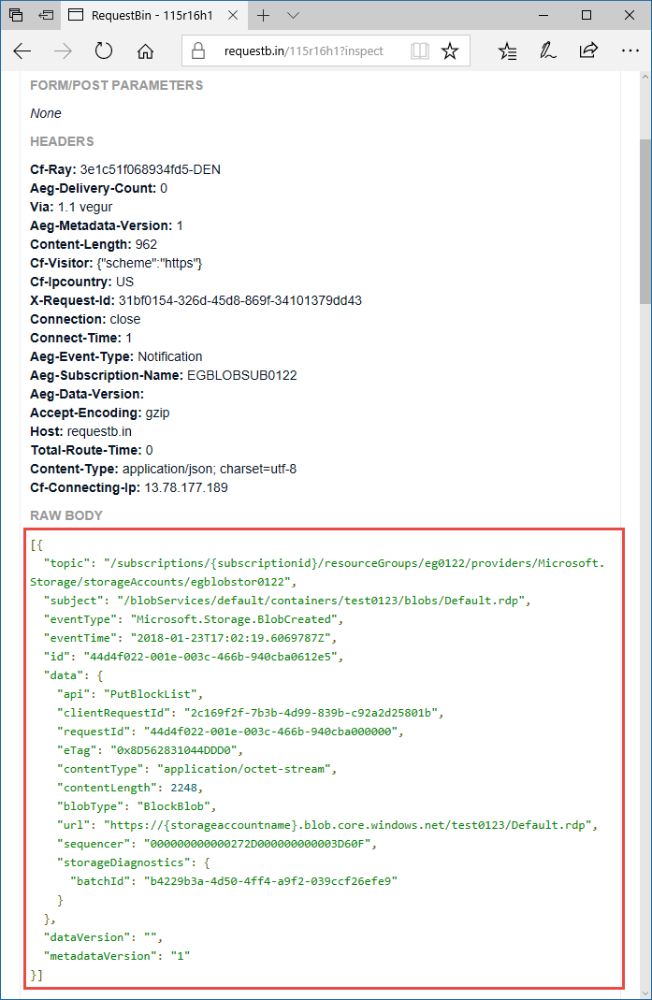

# Event Grid trigger for Azure Functions

This article explains how to work with [Event Grid](../event-grid/overview.md) triggers in Azure Functions.

The Event Grid trigger responds to HTTP requests from an Event Grid subscription. A single HTTP request from Event Grid may contain multiple events; in that case, the function is invoked once for each event.

[!INCLUDE [intro](../../includes/functions-bindings-intro.md)]

## Example

See the language-specific example:

* [C#](#c-example)
* [C# script (.csx)](#c-script-example)
* [JavaScript](#javascript-example)

### Trigger - C# example

The following example shows a [C# function](functions-dotnet-class-library.md) that logs some of the fields common to all events and all of the event-specific data.

```cs
[FunctionName("EventGridTest")]
public static void Run([EventGridTrigger] EventGridEvent myEvent, TraceWriter log)
{
    log.Info("C# Event Grid function processed a request.");
    log.Info($"Subject: {myEvent.Subject}");
    log.Info($"Time: {myEvent.EventTime}");
    log.Info($"Data: {myEvent.Data.ToString()}");
}
```

### Trigger - C# script example

The following example shows a trigger binding in a *function.json* file and a [C# script function](functions-reference-csharp.md) that uses the binding. The function logs some of the fields common to all events and all of the event-specific data.

Here's the binding data in the *function.json* file:

```json
{
  "bindings": [
    {
      "type": "eventGridTrigger",
      "name": "eventGridEvent",
      "direction": "in"
    }
  ],
  "disabled": false
}
```

Here's the C# script code:

```csharp
#r "Newtonsoft.Json"
#r "Microsoft.Azure.WebJobs.Extensions.EventGrid"
using Microsoft.Azure.WebJobs.Extensions.EventGrid;

public static void Run(EventGridEvent eventGridEvent, TraceWriter log)
{
    log.Info("C# Event Grid function processed a request.");
    log.Info($"Subject: {eventGridEvent.Subject}");
    log.Info($"Time: {eventGridEvent.EventTime}");
    log.Info($"Data: {eventGridEvent.Data.ToString()}");
}
```

### Trigger - JavaScript example

The following example shows a trigger binding in a *function.json* file and a [JavaScript function](functions-reference-node.md) that uses the binding. The function logs some of the fields common to all events and all of the event-specific data.

Here's the binding data in the *function.json* file:

```json
{
  "bindings": [
    {
      "type": "eventGridTrigger",
      "name": "eventGridEvent",
      "direction": "in"
    }
  ],
  "disabled": false
}
```

Here's the JavaScript code:

```javascript
module.exports = function (context, eventGridEvent) {
    context.log("JavaScript Event Grid function processed a request.");
    context.log("Subject: " + eventGridEvent.subject);
    context.log("Time: " + eventGridEvent.eventTime);
    context.log("Data: " + JSON.stringify(eventGridEvent.data));
    context.done();
};
```
     
## Attributes

In [C# class libraries](functions-dotnet-class-library.md), use the [EventGridTrigger](https://github.com/Azure/azure-functions-eventgrid-extension/blob/master/src/EventGridExtension/EventGridTriggerAttribute.cs) attribute, defined in NuGet package [Microsoft.Azure.WebJobs.Extensions.EventGrid](https://www.nuget.org/packages/Microsoft.Azure.WebJobs.Extensions.EventGrid).

Here's an `EventGridTrigger` attribute in a method signature:

```csharp
[FunctionName("EventGridTest")]
public static void Run([EventGridTrigger] EventGridEvent myEvent, TraceWriter log)
{
    ...
}
 ```

For a complete example, see [C# example](#c-example).

## Configuration

The following table explains the binding configuration properties that you set in the *function.json* file. There are no constructor parameters or properties to set in the `EventGridTrigger` attribute.

|function.json property |Description|
|---------|---------|----------------------|
| **type** | Required - must be set to `eventGridTrigger`. |
| **direction** | Required - must be set to `in`. |
| **name** | Required - the variable name used in function code for the parameter that receives the event data. |

## Usage

For C# and F# functions, declare the type of your trigger input to be `EventGridEvent` or a custom type. For a custom type, the Functions runtime tries to parse the event JSON to set the object properties.

For JavaScript functions, the parameter named by the *function.json* `name` property has a reference to the event object.

## Event schema

Data for an Event Grid event is received as a JSON object in the body of an HTTP request. The JSON looks similar to the following example:

```json
[{
  "topic": "/subscriptions/{subscriptionid}/resourceGroups/eg0122/providers/Microsoft.Storage/storageAccounts/egblobstore",
  "subject": "/blobServices/default/containers/{containername}/blobs/blobname.jpg",
  "eventType": "Microsoft.Storage.BlobCreated",
  "eventTime": "2018-01-23T17:02:19.6069787Z",
  "id": "{guid}",
  "data": {
    "api": "PutBlockList",
    "clientRequestId": "{guid}",
    "requestId": "{guid}",
    "eTag": "0x8D562831044DDD0",
    "contentType": "application/octet-stream",
    "contentLength": 2248,
    "blobType": "BlockBlob",
    "url": "https://egblobstore.blob.core.windows.net/{containername}/blobname.jpg",
    "sequencer": "000000000000272D000000000003D60F",
    "storageDiagnostics": {
      "batchId": "{guid}"
    }
  },
  "dataVersion": "",
  "metadataVersion": "1"
}]
```

The example shown is an array of one element. Event Grid always sends an array and may send more than one event in the array. The runtime invokes your function once for each array element.

The top-level properties in the event JSON data are the same among all event types, while the contents of the `data` property are specific to each event type. For explanations of the common and event-specific properties, see [Event properties](../event-grid/event-schema.md#event-properties) in the Event Grid documentation.

The `EventGridEvent` type defines only the top-level properties; the `Data` property is a `JObject`. 

## How to test locally

The Event Grid trigger is basically an HTTP trigger that does some additional processing before invoking a function. But unlike an HTTP trigger, you can't test an Event Grid trigger locally:

* The runtime doesn't provide you with the function invocation URL.
* Event Grid topics in Azure can't send HTTP requests to localhost on your development machine.

You can work around these limitations by making an HTTP trigger do the work of an Event Grid trigger:

* [Create an HTTP trigger function](#create-an-http-trigger-function) that simulates an Event Grid trigger. Include in it your code that handles an Event Grid event. 
* [Create a RequestBin endpoint](#create-a-RequestBin-endpoint).
* [Create an Event Grid subscription](#create-an-event-grid-subscription) that sends events to the RequestBin endpoint.
* [Generate a request](#generate-a-request) and copy the request body from the RequestBin site.
* [Manually post the request](#manually-post-the-request) to the localhost URL of your HTTP trigger function.

When local testing is complete, delete the subscription you created for it.

### Create an HTTP trigger function

The Event Grid trigger acts on an Event Grid HTTP request in the following ways:

* **Sends a validation response to a subscription validation request.** When you create an Event Grid subscription, it sends a validation request to the subscribed endpoint. Event Grid sends events to that endpoint only after it receives a response to the validation request. The response must echo back a validation code contained in the request body.
* **Invokes the function once per element of the event array contained in the request body.**

The following C# code for an HTTP trigger simulates Event Grid trigger behavior:

```csharp
[FunctionName("HttpTrigger")]
public static async Task<HttpResponseMessage> Run(
    [HttpTrigger(AuthorizationLevel.Anonymous, "post")]HttpRequestMessage req,
    TraceWriter log)
{
    log.Info("C# HTTP trigger function processed a request.");

    var messages = await req.Content.ReadAsAsync<JArray>();
    if (string.Equals((string)messages[0]["eventType"], 
        "Microsoft.EventGrid.SubscriptionValidationEvent", 
        System.StringComparison.OrdinalIgnoreCase))
    {
        log.Info("Validate request received");
        return req.CreateResponse<object>(new
        {
            validationResponse = messages[0]["data"]["validationCode"]
        });
    }

    foreach (JObject message in messages)
    {
        EventGridEvent eventGridEvent = message.ToObject<EventGridEvent>();
        log.Info($"Subject: {eventGridEvent.Subject}");
        log.Info($"Time: {eventGridEvent.EventTime}");
        log.Info($"Event data: {eventGridEvent.Data.ToString()}");
    }

    return req.CreateResponse(HttpStatusCode.OK);
}

```

The following JavaScript code for an HTTP trigger simulates Event Grid trigger behavior:

```javascript
module.exports = function (context, req) {
    context.log('JavaScript HTTP trigger function processed a request.');

    var messages = req.body;
    if (messages[0].eventType == "Microsoft.EventGrid.SubscriptionValidationEvent") {
        context.log('Validate request received');
        context.res = { status: 200, body: messages[0].data.validationCode }
    }
    else {
        for (var i = 0; i < messages.length; i++) {
            var message = messages[i];
            context.log('Subject: ' + message.subject);
            context.log('Time: ' + message.eventTime);
            context.log('Data: ' + JSON.stringify(message.data));
        }
    }
    context.done();
};
```

Inside the loop through the `messages` array is where you can put the event-handling code that you want to test. Or, if the function that you want to test has no input or output bindings in addition to the Event Grid trigger, you can call its `Run` method.

### Create a RequestBin endpoint

RequestBin is a site that accepts HTTP requests and shows you the request body. The http://requestb.in URL is whitelisted by Azure Event Grid. That means that Event Grid sends events to the RequestBin URL without requiring a correct response to subscription validation requests. 

Create an endpoint.


Copy the endpoint URL.


### Create an Event Grid subscription

Create an Event Grid subscription of the type you want to test, and give it your RequestBin endpoint. For information about how to create a subscription, see [the blob storage quickstart](../storage/blobs/storage-blob-event-quickstart.md#subscribe-to-your-blob-storage-account) or one of the other Event Grid quickstarts.

### Generate request

Trigger an event that will generate HTTP traffic to your RequestBin endpoint.  For example, if you created a blob storage subscription, upload or delete a blob. When a request shows up in your RequestBin page, copy the request body.

The subscription validation request will be received first; ignore any validation requests, and copy the event request.



### Manually post the requests

Run your HTTP function locally, and the runtime gives you the URL to use for invoking the function. 

Use a tool such as [Postman](https://www.getpostman.com/) or [curl](https://curl.haxx.se/docs/httpscripting.html) to create an HTTP POST request:

* Set a `Content-Type: application/json` header.
* Paste into the request body the data from RequestBin. 
* Post to the URL of your HTTP function. 

The following screenshot shows the localhost URL and request body in Postman:


Now the event handling code in the HTTP function processes the same data that it gets when it runs in Azure.

## Next steps

> [!div class="nextstepaction"]
> [Learn more about Azure functions triggers and bindings](functions-triggers-bindings.md)
